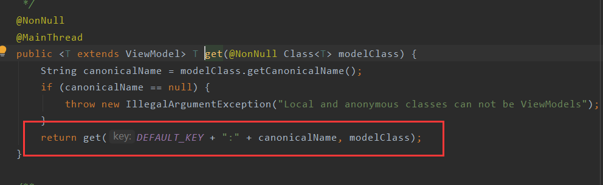
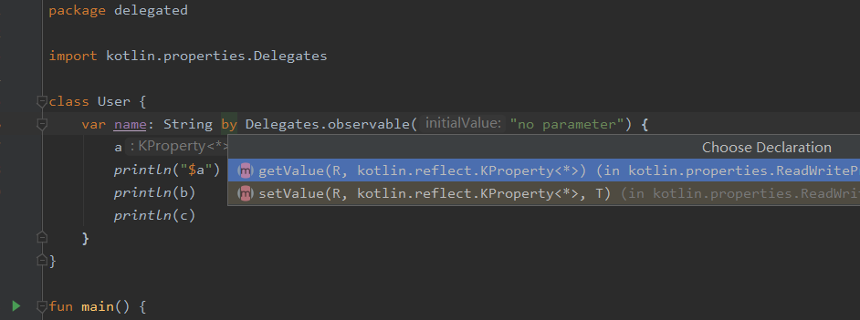

# ToDo App的架构原理以及Kotlin的一些使用方法

## 1. 架构部分

按照我的理解，该App的代码架构可分为以下几个部分

+ 数据持久层：用来操作数据（增删改查）

+ 业务层：与数据层以及用户操作进行交互

+ 依赖提供层：该层的工作目前已经被Dagger或Hilt替代，但是为了降低学习成本，本app仍然采用了传统的**工厂模式**以及**服务定位器模式（Service Locator）**

  [--> Service Locator 模式](https://www.cnblogs.com/gaochundong/archive/2013/04/12/service_locator_pattern.html)


## 2. Kotlin部分

若无kotlin基础，请用一周时间学习kotlin然后再看接下来的内容

**关键学习**

+ kotlin中的关键字和操作符

  [关键字与操作符](https://www.kotlincn.net/docs/reference/keyword-reference.html)

+ 协程的使用

  [Kotlin协程](https://kaixue.io/tag/kotlin-coroutines/)

### 2.1从ViewModel的初始化谈起


在ToDo app里面，几乎每个viewmodel都是通过这一句话创建出来的。这句话看似很短，其实内部隐藏了很多的内容。

首先我们应该知道的是，ViewModel并不能通过直接XXViewModel()（就是在Java中的new XXViewModel()）这样的方式获得一个实例。

接下来，viewModels方法，这里使用了lambda语法 的哪些性质？getViewModelFactory()方法中我们如何通过工厂模式获得的ViewModel?

其次，by关键字，委托属性，这时候你就得打开浏览器，搜索一下kotlin的by是干啥用的？委托模式？懒加载？在这里你觉得他是干啥用的？

#### 2.1.1 传递末尾的 lambda 表达式

[Kotlin学习（8）高阶函数：lambda作为参数和返回值](https://www.jianshu.com/p/bbecc721de61)

在 Kotlin 中有一个约定：如果函数的最后一个参数是函数，那么作为相应参数传入的 lambda 表达式可以放在圆括号之外：

```
val product = items.fold(1) { acc, e -> acc * e }
```

这种语法也称为*拖尾 lambda 表达式*。

如果该 lambda 表达式是调用时唯一的参数，那么圆括号可以完全省略：

```
run { println("...") }
```

这时候我们再看上图中用红框框标出的那句代码

```kotlin
 private val viewModel by viewModels<TaskDetailViewModel> { getViewModelFactory() }
```

Soga！最后的这个`{ getViewModelFactory() }`其实是一个作为参数的lambda表达式，它里面包含着一个可以返回`ViewModelFactory`的方法`getViewModelFactory()`。

我们点进去这个方法，就会很清晰地看到它作为一个Fragment的拓展方法，都干了些什么。

```kotlin
fun Fragment.getViewModelFactory(): ViewModelFactory {
    val repository = (requireContext().applicationContext as TodoApplication).taskRepository
    return ViewModelFactory(repository, this)
}
```

ViewModelFactory就是我们自己写的一个类，继承了`AbstractSaveStateViewModelFactory`，这个类是啥就别管了，知道是个Factory就行，并且它重写了一个create方法，能通过类名来创造不同的ViewModel。


#### 2.1.2 获得一个ViewModel

[如何初始化ViewModel-->Jetpack ViewModel initialization](https://www.rockandnull.com/jetpack-viewmodel-initialization/)

[Android开发 ViewModel_2_了解多种自定义实例方式 （Factory 与 key）](https://www.cnblogs.com/guanxinjing/p/12198971.html)

如果你还对ViewModel不熟悉的话，建议去Android Developer官网上看看ViewModel的含义

用一句话来概括的话，可以说ViewModel能够和它对应的Activity或者Fragment同生死，共重建。当然这些东西还是有点早，我们先来看一个实际的，就是上图的`viewModels`方法到底干了什么，为什么我非得用这个方法来获得ViewModel？

先不要对`by`关键字感到疑惑，我们先看看`viewModels`这个方法。按住ctrl，点进去，


我们发现这个方法是Android官方为Fragment添加的一个拓展方法（当然只有kotlin工程你才能这么干）。这个方法需要两个无参函数，但是他们都有其对应的默认值，ownerProducer的直接就是`{this}`，这个是一个lambda表达式，而不是一个普通的变量。`{this}`指的就是一个返回`this`的无参函数，这个`this`指的就是本Fragment，同理`factoryProducer`也是如此，但是在上一步，我们已经给`factoryProducer`赋值了，还记得吗？那个lambda表达式`{getViewModelFactory() }`。看到最后，我们发现，`viewModels`这个函数返回的是`createViewModelLazy`这个函数的返回值，继续点进去。


然后你就会看到，最终返回的是一个Lazy类，此时你的脑子里一定蹦出一个词——**懒加载**！这里我们先按下不表，继续往下看。

这时候我们点击进去`ViewModelLazy`类


哦吼，我们看到`get()`方法里，如果viewModel是空的话，我们就会返回`ViewModelProvider(store, factory).get(viewModelClass.java)`，`also`这个关键字你可以理解为“我在得到这个值的同时会利用这个值去干另一件事"。

我们费劲千辛万苦来到这里，其实就是为了看到`ViewModelProvider(store, factory).get(viewModelClass.java)`这个方法。

到这里我们需要停一下，整理整理思路。

我们费那么大劲来到这里目的何在？

为了探究为啥要使用`viewModels`方法来获得ViewModel而不是直接实例化一个，我们马上就能知道了。


能解释一下函数里面几个参数的含义吗？

一切的源头还是在最初的`viewModels`这个方法中。


如果你不理解`reified`关键字的话，推荐一篇文章[-->推荐使用 Kotlin 关键字 Reified](https://juejin.im/post/6844903833596854279)

在这个方法中，我们获得了`ownerProducer`这个参数，这个值我们采用的是默认值，也是一个lambda表达式`{ this }`，这个表达式最后会返回`this`也就是我们调用这个方法的Fragment。这个值一路往下传递，这个lambda表达式最后就成了`storeProducer`；

同理，`factoryProducer`就是我们之前传入的`{ getViewModelFactory() }`，


好，如果你到这里还坚持着的话，恭喜你，我们即将迎来解放。这时候我们点进`ViewModelProvider`的构造方法


平平无奇，只是赋值而已。

那么我们继续找它的`get`方法，即`ViewModelProvider#get`



哦吼，套娃！

继续点！


哦我的上帝啊！这么多代码怎么看！

年轻人，只需要看两行即可，我给你指一条明路☞⭐：


这两个方法才是最常用的。`(mFactory).create(modelClass)`，这个`mFactory`就是你自己重写的一个Factory，就是你一开始通过`getViewModelFactory()`方法传入的！

`mViewModelStore`就是你的Fragment或者你的Activity！每个Fragment或者Activity都能存好几个ViewModel，这些ViewModel都是通过键值对的形式存起来的。你通过put方法的参数也就明白了。


到这里你发现了吗？我们一路走过来，是因为我们只有调用`viewModels`方法或者直接调用ViewModelProvider.get，我们才能把对应的ViewModel存入到Fragment或者Activity中，这样ViewModel才会展现它那些神奇的效果。


##### 2.1.2.1 总结


我们看看这么短短的一句话，内部逻辑就是，通过`viewModels`方法，我们返回一个`Lazy`类，by关键字会调用返回的`Lazy`类的`get`方法，然后就会通过`getViewModelFactory`方法返回的`Factory`创建一个与你期待的类型一致的`ViewModel`，并且把这个`ViewModel`存到对应的Fragment或者Activity中。

这个就是我们不能使用直接初始化的方式而是使用固定格式的原因。

#### 2.1.3 by关键字

[What does 'by' keyword do in Kotlin?](https://stackoverflow.com/questions/38250022/what-does-by-keyword-do-in-kotlin)

[Delegated Properties](https://kotlinlang.org/docs/reference/delegated-properties.html)

本质上by关键字对标的是Java中的**委托模式**这种设计模式，建议先看看Java的委托模式




### 2.2 协程

建议先看看HenCoder的视频和文章

[Kotlin协程](https://kaixue.io/tag/kotlin-coroutines/)

```kotlin
override fun onViewCreated(view: View, savedInstanceState: Bundle?) {
    super.onViewCreated(view, savedInstanceState)
    GlobalScope.launch(Dispatchers.Main) {

        val res = startCoroutines()

        viewDataBinding.txtCoroutines.text = res
    }
    Toast.makeText(this.context, "我证明，协程已经跳过上面的代码了，先运行我！", Toast.LENGTH_LONG).show()
}

private suspend fun startCoroutines(): String = withContext(Dispatchers.IO) {

    println("进入协程")

    Thread.sleep(5000)

    "han1254"
}
```


### 2.3 Result机制


