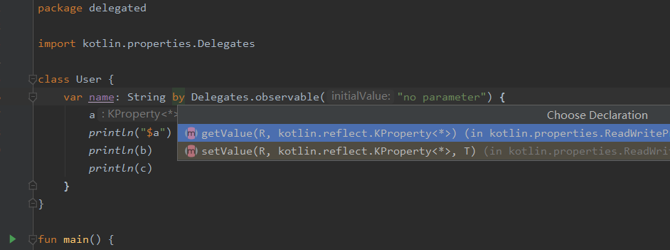
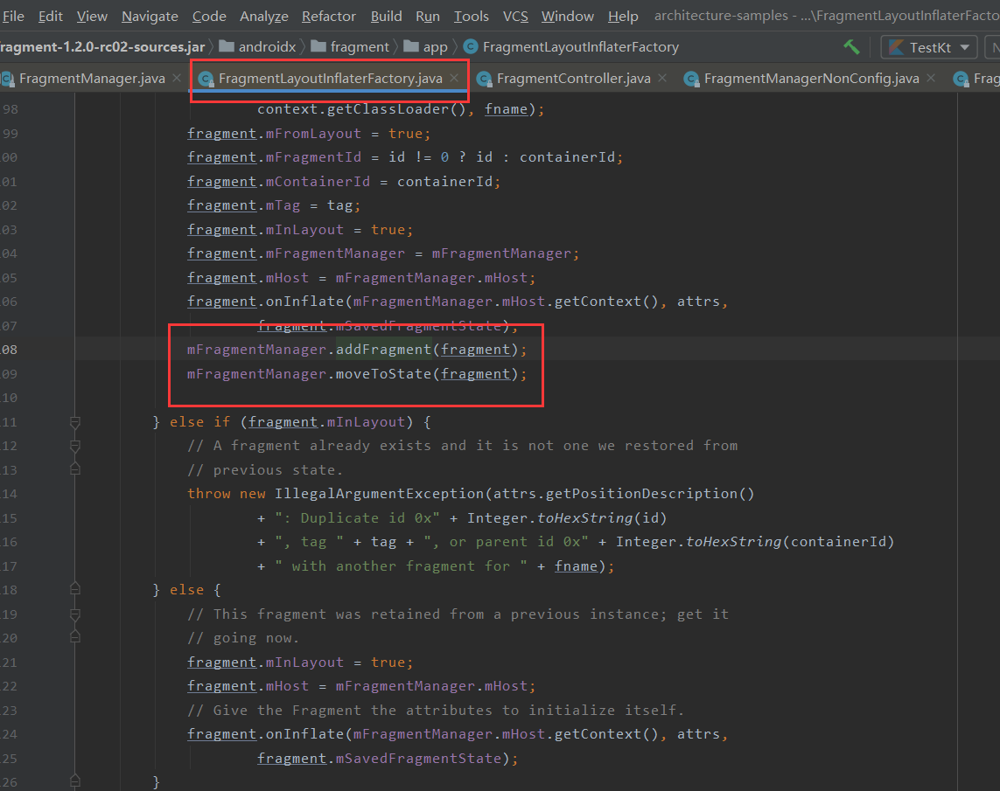
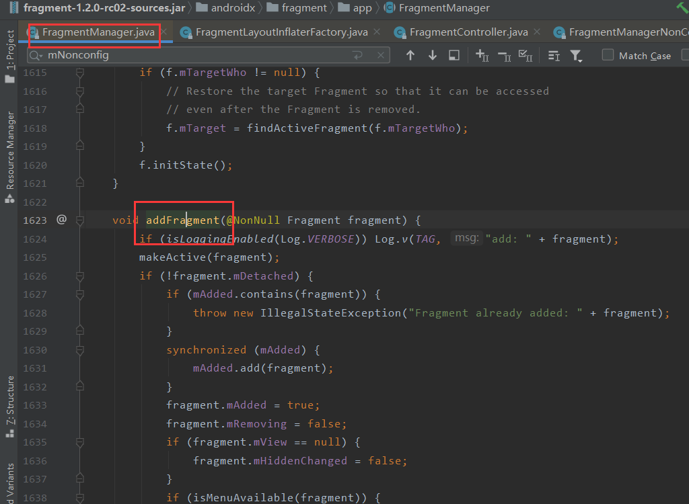
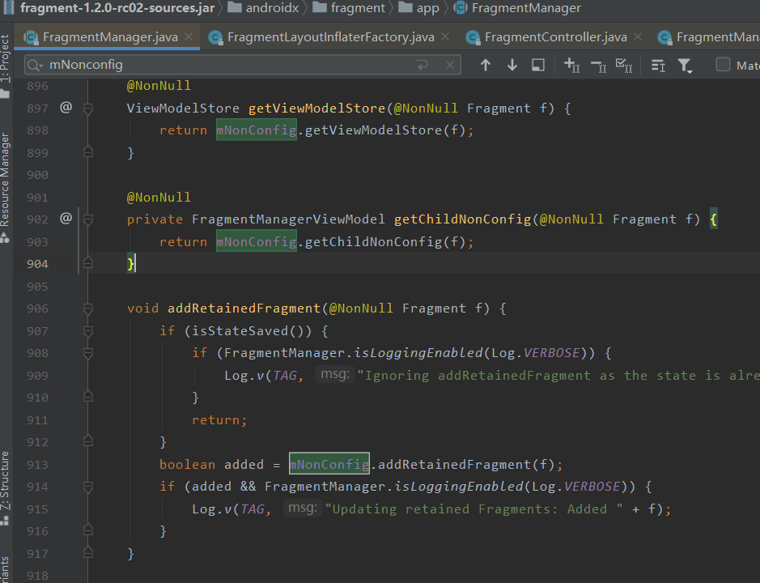
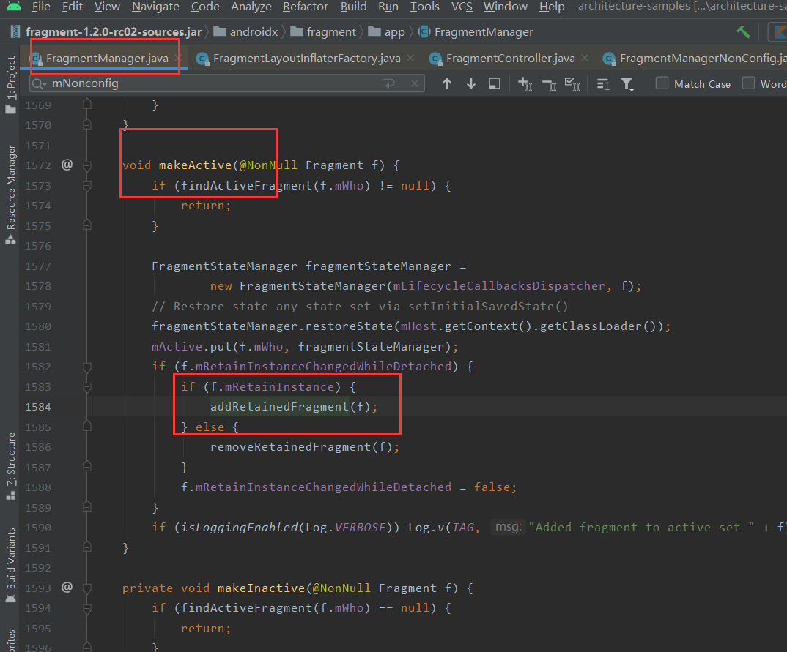

# ToDo App的架构原理以及Kotlin的一些使用方法

## 1. 架构部分

按照我的理解，该App的代码架构可分为以下几个部分

+ 数据持久层：用来操作数据（增删改查）

+ 业务层：与数据层以及用户操作进行交互

+ 依赖提供层：该层的工作目前已经被Dagger或Hilt替代，但是为了降低学习成本，本app仍然采用了传统的**工厂模式**以及**服务定位器模式（Service Locator）**

  [--> Service Locator 模式](https://www.cnblogs.com/gaochundong/archive/2013/04/12/service_locator_pattern.html)


## 2. Kotlin部分

若无kotlin基础，请用一周时间学习kotlin然后再看接下来的内容

**关键学习**

+ kotlin中的关键字和操作符

  [关键字与操作符](https://www.kotlincn.net/docs/reference/keyword-reference.html)

+ 协程的使用

  [Kotlin协程](https://kaixue.io/tag/kotlin-coroutines/)

### 2.1从ViewModel的初始化谈起


在ToDo app里面，几乎每个viewmodel都是通过这一句话创建出来的。这句话看似很短，其实内部隐藏了很多的内容。

首先我们应该知道的是，viewmodel并不能通过直接XXViewModel()（就是在Java中的new XXViewModel()）这样的方式获得一个实例。

接下来，viewModels方法，这里使用了lambda语法 的哪些性质？getViewModelFactory()方法中我们如何通过工厂模式获得的ViewModel?

其次，by关键字，委托属性，这时候你就得打开浏览器，搜索一下kotlin的by是干啥用的？委托模式？懒加载？在这里你觉得他是干啥用的？

#### 2.1.1 获得一个ViewModel

[如何初始化ViewModel-->Jetpack ViewModel initialization](https://www.rockandnull.com/jetpack-viewmodel-initialization/)

[Android开发 ViewModel_2_了解多种自定义实例方式 （Factory 与 key）](https://www.cnblogs.com/guanxinjing/p/12198971.html)

如果你还对ViewModel不熟悉的话，建议去Android Developer官网上看看ViewModel的含义

用一句话来概括的话，可以说ViewModel能够和它对应的Activity或者Fragment同生死，共重建

#### 2.1.2 by关键字

[What does 'by' keyword do in Kotlin?](https://stackoverflow.com/questions/38250022/what-does-by-keyword-do-in-kotlin)

[Delegated Properties](https://kotlinlang.org/docs/reference/delegated-properties.html)

本质上by关键字对标的是Java中的**委托模式**这种设计模式，建议先看看Java的委托模式



#### 2.1.3 传递末尾的 lambda 表达式

[Kotlin学习（8）高阶函数：lambda作为参数和返回值](https://www.jianshu.com/p/bbecc721de61)

[kotlin学习：val与var区别，by lazy与lateinit区别](https://blog.csdn.net/sinat_31057219/article/details/82784715)

在 Kotlin 中有一个约定：如果函数的最后一个参数是函数，那么作为相应参数传入的 lambda 表达式可以放在圆括号之外：

```
val product = items.fold(1) { acc, e -> acc * e }
```

这种语法也称为*拖尾 lambda 表达式*。

如果该 lambda 表达式是调用时唯一的参数，那么圆括号可以完全省略：

```
run { println("...") }
```

#### 2.1.3 viewmodel到底为啥能够与Fragment和Activity同生共死？

首先，每个Activity和Fragment都有其对应的一个ViewModelStore

```kotlin
public class ViewModelStore {

    private final HashMap<String, ViewModel> mMap = new HashMap<>();

   ...
}
```

如上图所示，ViewModelStore的内容没你想象的那么复杂，就是用来存一个Fragment或者Activity中的所有ViewModel的类。

```kotlin
//Fragment
@NonNull
@Override
public ViewModelStore getViewModelStore() {
    if (mFragmentManager == null) {
        throw new IllegalStateException("Can't access ViewModels from detached fragment");
    }
    return mFragmentManager.getViewModelStore(this);
}
```

```kotlin
//FragmentManager
@NonNull
ViewModelStore getViewModelStore(@NonNull Fragment f) {
    return mNonConfig.getViewModelStore(f);
}
```

```kotlin
//FragmentManagerViewModel

private final HashMap<String, ViewModelStore> mViewModelStores = new HashMap<>();

@NonNull
ViewModelStore getViewModelStore(@NonNull Fragment f) {
    ViewModelStore viewModelStore = mViewModelStores.get(f.mWho);
    if (viewModelStore == null) {
        viewModelStore = new ViewModelStore();
        mViewModelStores.put(f.mWho, viewModelStore);
    }
    return viewModelStore;
}
```

FragmentManagerViewmodel里面有一个mViewModelStores，这是一个HashMap，每次Fragment或者Activity需要自己的ViewModelStore的时候，就会去这里面取，如果没有就自动创建一个并且存起来










```kotlin
//FragmentManager
private void dispatchStateChange(int nextState) {
    try {
        mExecutingActions = true;
        moveToState(nextState, false);
    } finally {
        mExecutingActions = false;
    }
    execPendingActions(true);
}
```

```kotlin
//FragmentManager
void moveToState(int newState, boolean always) {
    ...

    // Must add them in the proper order. mActive fragments may be out of order
    final int numAdded = mAdded.size();
    for (int i = 0; i < numAdded; i++) {
        Fragment f = mAdded.get(i);
        moveFragmentToExpectedState(f);
    }

    // Now iterate through all active fragments. These will include those that are removed
    // and detached.
    for (FragmentStateManager fragmentStateManager : mActive.values()) {
        if (fragmentStateManager != null) {
            Fragment f = fragmentStateManager.getFragment();
            if (!f.mIsNewlyAdded) {
                //👇只看这个方法就行
                moveFragmentToExpectedState(f);
            }
        }
    }
    ...
}
```

```kotlin
//FragmentManager
void moveFragmentToExpectedState(@NonNull Fragment f) {
   ...
    //👇继续走起
    moveToState(f);
   ...
}

//FragmentManager
void moveToState(@NonNull Fragment f) {
    //👇来了来了
    moveToState(f, mCurState);
}

```

```kotlin
//FragmentManager
void moveToState(@NonNull Fragment f, int newState) {
    FragmentStateManager fragmentStateManager = mActive.get(f.mWho);
    if (fragmentStateManager == null) {
        // Ideally, we only call moveToState() on active Fragments. However,
        // in restoreSaveState() we can call moveToState() on retained Fragments
        // just to clean them up without them ever being added to mActive.
        // For these cases, a brand new FragmentStateManager is enough.
        fragmentStateManager = new FragmentStateManager(mLifecycleCallbacksDispatcher, f);
    }
    newState = Math.min(newState, fragmentStateManager.computeMaxState());
    if (f.mState <= newState) {
       ...//不用看
    } else if (f.mState > newState) {
        switch (f.mState) {
            case Fragment.RESUMED:
               ...
            case Fragment.STARTED:
               ...
            case Fragment.ACTIVITY_CREATED:
               ...
            // fall through
            case Fragment.CREATED:
            if (newState < Fragment.CREATED) {
                if (mDestroyed) {
                    	...
                    }
                }
                if (mExitAnimationCancellationSignals.get(f) != null) {
                   ...
                } else {
                    //👇这里，这个mNonConfig是FragmentManagerViewModel
                    //woc终于跟ViewModel扯上关系了😂，难死我了！！！！！
                    fragmentStateManager.destroy(mHost, mNonConfig);
                }
            }
            // fall through
            case Fragment.ATTACHED:
            ...
        }
    }

}
```

```kotlin
//FragmentStateManager
void destroy(@NonNull FragmentHostCallback<?> host,
        @NonNull FragmentManagerViewModel nonConfig) {
  
    if (shouldDestroy) {
        boolean shouldClear;
        if (host instanceof ViewModelStoreOwner) {
           ...
        } else if (host.getContext() instanceof Activity) {
           ...
        } else {
            ...
        }
        if (beingRemoved || shouldClear) {
            //🏄‍看这里看这里
            nonConfig.clearNonConfigState(mFragment);
        }
       ...
    } else {
       ...
    }
}
```

```kotlin
//FragmentManagerViewModel
void clearNonConfigState(@NonNull Fragment f) {
    if (FragmentManager.isLoggingEnabled(Log.DEBUG)) {
        Log.d(TAG, "Clearing non-config state for " + f);
    }
    //👇 Clear and remove the Fragment's child non config state
    FragmentManagerViewModel childNonConfig = mChildNonConfigs.get(f.mWho);
    if (childNonConfig != null) {
        childNonConfig.onCleared();
        mChildNonConfigs.remove(f.mWho);
    }
    //👇 Clear and remove the Fragment's ViewModelStore
    ViewModelStore viewModelStore = mViewModelStores.get(f.mWho);
    if (viewModelStore != null) {
        viewModelStore.clear();
        mViewModelStores.remove(f.mWho);
    }
}
```

### 2.2 协程

建议先看看HenCoder的视频和文章

[Kotlin协程](https://kaixue.io/tag/kotlin-coroutines/)

```kotlin
override fun onViewCreated(view: View, savedInstanceState: Bundle?) {
    super.onViewCreated(view, savedInstanceState)
    GlobalScope.launch(Dispatchers.Main) {

        val res = startCoroutines()

        viewDataBinding.txtCoroutines.text = res
    }
    Toast.makeText(this.context, "我证明，协程已经跳过上面的代码了，先运行我！", Toast.LENGTH_LONG).show()
}

private suspend fun startCoroutines(): String = withContext(Dispatchers.IO) {

    println("进入协程")

    Thread.sleep(5000)

    "han1254"
}
```

### 2.3 Result机制


