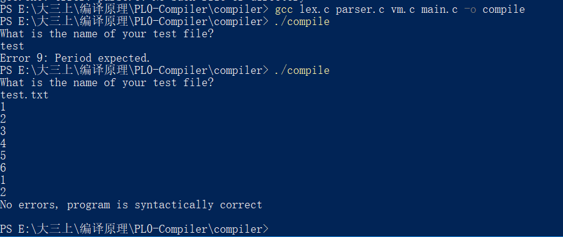

# C与指针笔记

## 1. Quick Start 

### 1.1 数组越界问题

> The excess values would be stored in the memory locations that follow the array, thus destroying whatever data was formerly in those locations, which migtht be other variables or the function's return address.

### 1.2 scanf的返回值


## 2. Basic Concepts



## 6.指针

the type of a value cannot be determined simply by examing its bits.

 ## 8. 数组

### 数组作为函数参数

一维:

```c
void func1(int *vec);
void func1(int vec[]);
```

多维：

```c
void func2(int (*mat)[10]);
void func2(int mat[][10]);
```

这里的关键在于编译器必须知道第2个及以后各维的长度才能对各下标进行求值，因此在原型中必须声明这些维度的长度，第1维的长度并不需要。