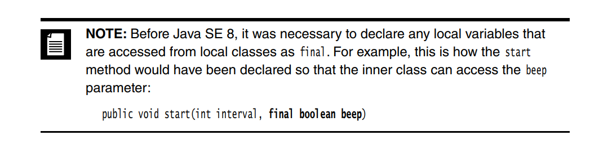
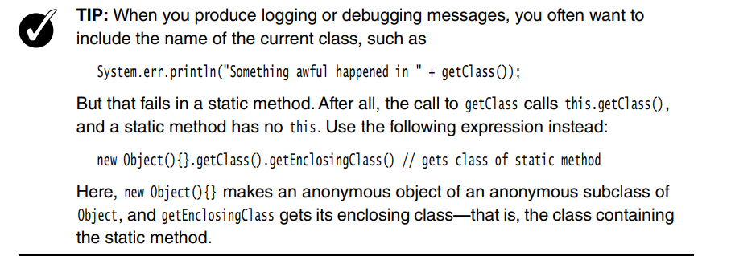
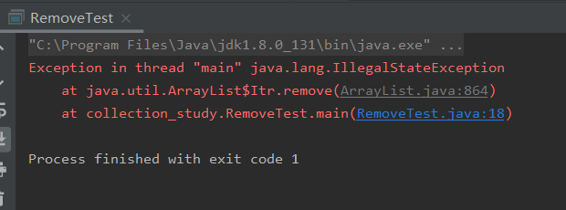

## 变量

[Why is 0.1+0.2 not equal to 0.3 in most programming languages?](https://www.quora.com/Why-is-0-1+0-2-not-equal-to-0-3-in-most-programming-languages)

It's called "precision", and it’s due to the fact that computers do not compute in Decimal, but in Binary.

In Math, 0.1 is a Rational number, which means that it is the result of a ratio between two numbers, 1 / 10. We Humans have no issue with that since Math typically is made in base 10 (or Decimal, because it uses 10 different numbers, from 0 to 9, to compose all possible entities). So we can easily calculate numbers like 0.1 or 0.2, because both are, simply put, 1/10 and 2/10.

An Irrational number, on the other hand, is the result of a fraction that cannot be represented with a finite series of digits after the period. For example we cannot exactly measure 1 / 3 in base 10 because its result goes on forever (0.333333333....).

Computers do not use a base 10 system, they use a base 2 system (also called Binary code). Using only 1 and 0, a computer builds up a series of bits to represent all possible numbers, up to some maximum value allowed by its memory.

For example 0 in Binary is "0" and 1 is "1". But 2, is already "10" because in Binary we do not have a "2", so we need to scale up, just like in Decimal we do not have anything after "9", so we have to scale up to 10. Anyway, going further, 3 in Binary is "11", 4 is "100", 5 is "101", and so on.

Now, Rational numbers in most programming languages are called Floating numbers - due to various factors, they are an approximation of their equivalent in Decimal.

For example "0.1" in Binary becomes "0.0001100110011001100110011001100110011001100110011001101", and "0.2" becomes "0.001100110011001100110011001100110011001100110011001101".

Crazy, right?

Even if we write numbers in Decimal when we give instructions to a computer, what the machine actually does is to convert everything in Binary, calculate this mess at the speed of light, and then return the result converted back in Decimal. It takes a fraction of a millisecond (and the result is not even correct).

Since for a computer all calculations involving Rational numbers like "0.1" and "0.2" are an approximation of the original number in Decimal, they will not sum up to "0.3" but to a number that's extremely closed to it.

In Javascript and Python the final result of 0.1 + 0.2 equals to 0.30000000000000004.

In C is 0.300000011920928955... (C is the language most likely used to make sure airplanes do not crash on a mountain and that nuclear power plants do not explode).

There is no need to panic, yet. The level of precision is more than sufficient for most applications, so we won't have to worry about this very often.

Only when bad things happen.


## String

```
String str11 = "ab";
String str12 = "b";
String str13 = "a" + str12;
System.out.println(str11 == str13);    //12,false
```

对于 12 来说当字符串常量与 String 类型变量连接时得到的新字符串不再保存在常量池中，而是在堆中新建一个 String 对象来存放，很明显常量池中要求的存放的是常量，有 String 类型变量当然不能存在常量池中了。

[Java 字符串常量池、字符串比较/拼接问题、String类的不可变性](https://www.cnblogs.com/johnshang/p/13285639.html)


[为什么StringBuilder是线程不安全的？StringBuffer是线程安全的？](https://blog.csdn.net/lucylala007/article/details/108031164?utm_medium=distribute.pc_relevant_bbs_down.none-task-blog-baidujs-1.nonecase&depth_1-utm_source=distribute.pc_relevant_bbs_down.none-task-blog-baidujs-1.nonecase)

## 变长参数

[Java中可变长参数的使用及注意事项](https://www.cnblogs.com/lanxuezaipiao/p/3190673.html)


## 继承

[JAVA: 子类“覆盖”父类的成员变量](https://www.polarxiong.com/archives/JAVA-%E5%AD%90%E7%B1%BB-%E8%A6%86%E7%9B%96-%E7%88%B6%E7%B1%BB%E7%9A%84%E6%88%90%E5%91%98%E5%8F%98%E9%87%8F.html)

> 实际上，即使子类声明了与父类完全一样的成员变量，也不会覆盖掉父类的成员变量。而是在子类实例化时，会同时定义两个成员变量，子类也可以同时访问到这两个成员变量，但父类不能访问到子类的成员变量（父类不知道子类的存在）。而具体在方法中使用成员变量时，究竟使用的是父类还是子类的成员变量，则由方法所在的类决定；即，方法在父类中定义和执行，则使用父类的成员变量，方法在子类中定义（包括覆盖父类方法）和执行，则使用子类的成员变量。

```java
public class StaticTest {

    public static void main(String[] args) {
        new Man();
    }
}

class Tool {

    public Tool() {
        System.out.println("I am a tool:constructor");
    }
}

class Person {

    Tool tool = new Tool();
    static {
        System.out.println("I am a person:static");
    }

    {
        System.out.println("I am a person:normal");
    }

    public Person() {
        System.out.println("I am a person:constructor");
    }
}

class Man extends Person {
    Tool tool = new Tool();
    static {
        System.out.println("I am a man:static");
    }

    {
        System.out.println("I am a man:normal");
    }

    public Man() {
        System.out.println("I am a man:constructor");
    }
}

```

```
I am a person:static
I am a man:static
I am a tool:constructor
I am a person:normal
I am a person:constructor
I am a tool:constructor
I am a man:normal
I am a man:constructor
```


## This与Super

对于 this 的应用场景主要分下面几类：

- 构造方法：通过 this 调用同类中另一个满足指定参数类型的构造方法的用发是 this(参数列表); 这个仅仅在类的构造方法中，别的地方不能这么用，同时要注意 this(参数列表); 语句只能用在子类构造方法体中的第一行。
- 变量：函数参数或者函数中的局部变量和成员变量同名的情况下成员变量被屏蔽，此时要访问成员变量则需要用 this.成员变量名; 的方式来引用成员变量，在没有同名的情况下可以直接用成员变量的名字而不用 this。
- **函数：在函数中需要引用该函所属类的当前对象时候可以直接用 this，特别注意，this 不能用在 static 方法中，因为 static 方法是类级别的，this 是对象级别的。**


## Hash

[equals和HashCode深入理解以及Hash算法原理](https://blog.csdn.net/qq_21688757/article/details/53067814)

**问：请补全下面代码空缺（即实现其 hashCode 方法）？**

```java
public class UserBean {
    public String name;
    public int age;
    public String pwd;

    @Override
    public boolean equals(Object o) {
        if (o == this) {
            return true;
        }
        if (!(o instanceof UserBean)) {
            return false;
        }
        UserBean user = (UserBean) o;
        return user.name.equals(name) && user.age == age && user.pwd.equals(pwd);
    }

    @Override
    public int hashCode() {          
        //请在此处正确的实现该方法    
    }  
}
```


**答：**此题就是在考察如何在重写 equals() 方法时正确的重写 hashCode() 方法。其实重写 hashcode() 方法有如下几个原则可以遵循：

- 如果重写了 equals() 方法，且 equals() 方法判断相等则 hashCode() 方法也要保证必须相等。
- 重写 hashCode() 方法算法也不能太过简单，否则哈希冲突过多。
- 重写 hashCode() 方法算法也不能太过复杂，否则计算复杂度过高而影响性能。

《Effective Java》书中给出的一种算法，基于 17 和 31 散列码思想的实现，如下：

```java
public int hashCode() {
        int result = 17;
        result = 31 * result + name.hashCode();
        result = 31 * result + age;
        result = 31 * result + pwd.hashCode();
        return result;
}
```


当然，这道题如果不限制 equals 方法的实现则完全可以用 JDK7 开始提供的 java.util.Objects 来重写 equals 和 hashCode 方法，代码如下：

```java
public boolean equals(Object o) {
        if (o == this) return true;
        if (!(o instanceof UserBean)) {
            return false;
        }
        User user = (User) o;
        return age == user.age && Objects.equals(name, user.name) && Objects.equals(pwd, user.pwd);
    }

    public int hashCode() {
        return Objects.hash(name, age, pwd);
    }
```

## instanceof 

[Java instanceof 关键字是如何实现的？](https://www.zhihu.com/question/21574535)


## clone 

> String不是基本数据类型，但是在深复制的时候并没有进行单独的复制，也就是说违反了深复制，仅仅复制了引用，而String没有实现cloneable接口，也就是说只能复制引用。
> 那么在修改克隆之后的对象之后，会不会将原来的值也改变了？
> 答案肯定是不会改变，因为String是在内存中不可以被改变的对象，就比如说在for大量循环中不推荐使用+的方式来拼凑字符串一样，每次使用+都会新分配一块内存，不在原来上修改，原来的没有指向它的引用，会被回收。所以克隆相当于1个String内存空间有两个引用，当修改其中的一个值的时候，会新分配一块内存用来保存新的值，这个引用指向新的内存空间，原来的String因为还存在指向他的引用，所以不会被回收，这样，虽然是复制的引用，但是修改值的时候，并没有改变被复制对象的值。
> 所以在很多情况下，我们可以把String在clone的时候和基本类型做相同的处理，只是在equal时注意一些就行了。
>
> ——[java克隆中String的特殊性](https://www.geek-share.com/detail/2526984321.html)


### 使用序列化方法对序列进行深拷贝

```java
public class CloneTest {

    static class Test implements Serializable {//一定要记得实现Serializable接口
        public int a;
        public int b;

        Test(int a, int b) {
            this.a = a;
            this.b = b;
        }
    }

    public static void main(String[] args) throws IOException, ClassNotFoundException {
        List<Test> list = new ArrayList<>();
        list.add(new Test(1, 2));
        list.add(new Test(2, 3));
        list.add(new Test(3, 4));
        System.out.println(deepCopy(list));
    }

    public static <T> T deepCopy(T src) throws IOException, ClassNotFoundException {
        T objRes = null;
        ByteArrayOutputStream boStream = new ByteArrayOutputStream();
        ObjectOutputStream ooStream = new ObjectOutputStream(boStream);
        ooStream.writeObject(src);
        ooStream.close();

        ByteArrayInputStream biStream = new ByteArrayInputStream(boStream.toByteArray());
        ObjectInputStream oiStream = new ObjectInputStream(biStream);
        objRes = (T)oiStream.readObject();
        oiStream.close();
        return objRes;
    }
}

```


## Error 、Exception

[看完这篇Exception 和 Error，和面试官扯皮就没问题了](https://www.cnblogs.com/cxuanBlog/p/12659578.html)


## 反射

### 1. Constructor、Method、Field

### 2. 设置访问权限

方法一：调用Field、Method或者Constructor对象的setAccessible方法

方法二：（将所有的field设置为可访问）AssessibleObject.setAccessible(fields, true);

### 3. 几种方法

Class

`getComponentType()`获得数组的单个元素的类型，返回Class

`isPrimitive`类型是否为基本类型

### 4. 使用反射编写泛型数组代码

```java

```


### 5. invoke调用静态方法

```java
double dx = (to - from) / (n - 1);
for(double x = from; x <= to; x += dx) {
    double y = (Double)f.invoke(null, x);
    
}
```

## 内部类

[《为什么非静态内部类中不能有static属性的变量，却可以有static final属性的变量？》](https://blog.csdn.net/WuchangI/article/details/79182850)

### 一个类使用别的类的内部类

```java
public class Outer {
    private int a = 0;
    public int b = 5;

    public static void main(String[] args) {
        Outer outer = new Outer();
        outer.startTest();
    }

    public void startTest() {
        Inner inner = new Inner();
        inner.printStr();
    }

    public class Inner {
        public void printStr() {
            System.out.println(a);
            System.out.println(b);
        }
    }
}
```


```java
public class Other {

    private Outer.Inner inner;

    public static void main(String[] args) {
        Other other = new Other();
    }

    public Other() {
        Outer outer = new Outer();
        inner = outer.new Inner();

        inner.printStr();
    }
}
```


### 编译器对内部类干了什么

```
Enter class name (e.g. java.util.Date): 
inner_class.Outer$Inner
public class inner_class.Outer$Inner
{

  public  inner_class.Outer$Inner(inner_class.Outer)

  public void printStr()

  final inner_class.Outer this$0;

}

```

内部类是一种编译器现象，与虚拟机无关。编译器会把内部类翻译成$分隔外部类名与内部类名的常规文件，而虚拟机对此一无所知。

```
\PGEE\JavaStudy\pro\out\production\pro" reflect_study.ReflectionTest
Enter class name (e.g. java.util.Date): 
inner_class.Outer
public class inner_class.Outer
{

  public  inner_class.Outer()

  public static void main([Ljava.lang.String;)
  static int access$000(inner_class.Outer)
  public void startTest()

  private int a;
  public int b;

}

```

编译器添加access$000方法，

只有域为私有时编译器才会添加access方法，

```java
public class Outer {
    private int a = 0;
    public int b = 5;
    private String t = "hello";

    public static void main(String[] args) {
        Outer outer = new Outer();
        outer.startTest();
    }

    public void startTest() {
        Inner inner = new Inner();
        inner.printStr();
    }

    public class Inner {
        public void printStr() {
            System.out.println(a);
            System.out.println(b);
            System.out.println(t);
        }
    }
}


```

```
Enter class name (e.g. java.util.Date): 
inner_class.Outer
public class inner_class.Outer
{

  public  inner_class.Outer()

  public static void main([Ljava.lang.String;)
  static java.lang.String access$100(inner_class.Outer)
  static int access$000(inner_class.Outer)
  public void startTest()

  private int a;
  public int b;
  private java.lang.String t;

}
```

❓虚拟机中不存在私有类

### 局部内部类

```java
public class Outer {
    private int a = 0;
    public int b = 5;
    private String t = "hello";

    public static void main(String[] args) {
        Outer outer = new Outer();
        outer.startTest();
        outer.localInnerTest(true);
    }

    public void startTest() {
        Inner inner = new Inner();
        inner.printStr();
    }

    public class Inner {
        public void printStr() {
            System.out.println(a);
            System.out.println(b);
            System.out.println(t);
        }
    }

    public void localInnerTest(final boolean booleanValue) {
        class LocalInner {
            private int localA = 1;
            private String localS = "lalalal";

            public void printValue() {
                System.out.println(a);
                System.out.println(localA);
                System.out.println(localS);
                if (booleanValue) {
                    System.out.println("isTrue");
                } else {
                    System.out.println("isFalse");
                }
            }
        }
        LocalInner localInner = new LocalInner();
        localInner.printValue();
    }
}

```


```
Enter class name (e.g. java.util.Date): 
inner_class.Outer$1LocalInner
class inner_class.Outer$1LocalInner
{

  inner_class.Outer$1LocalInner(inner_class.Outer, boolean)

  public void printValue()

  private int localA;
  private java.lang.String localS;
  final boolean val$booleanValue;
  final inner_class.Outer this$0;

}

```

booleanValue这个变量就算是不设置为final，在编译时也会变成final

> Local classes have another advantage over other inner classes. Not only can they
> access the fields of their outer classes; they can even access local variables! However, those local variables must be effectively final. That means, they may never
> change once they have been assigned.  

```
Enter class name (e.g. java.util.Date): 
inner_class.Outer$1LocalInner
class inner_class.Outer$1LocalInner
{

  inner_class.Outer$1LocalInner(inner_class.Outer, boolean)

  public void printValue()

  private int localA;
  private java.lang.String localS;
  final boolean val$booleanValue;
  final inner_class.Outer this$0;

}
```

❓❓❓❓❓❓局部内部类的参数到底需不需要final？我不final也是可以的





## 泛型

### 数组转List

https://blog.csdn.net/x541211190/article/details/79597236


> https://blog.csdn.net/qq493820798/article/details/100894596
>
> List<Integer> list1 = Arrays.stream(array).boxed().collect(Collectors.toList());

## Collection家族

### remove与next

```java
public class RemoveTest {

    public static void main(String[] args) {
        Collection<String> c = new ArrayList<>();
        c.add("a");
        c.add("b");
        c.add("c");
        c.add("d");
        Iterator<String> it = c.iterator();
        it.next();
        it.remove();
        it.forEachRemaining(s -> {
            System.out.println(s);
        });
    }

}
```

必须先调用next再调用remove，此时迭代器指向你想要删除的结点与下一个结点之间。

```java
public class RemoveTest {

    public static void main(String[] args) {
        Collection<String> c = new ArrayList<>();
        c.add("a");
        c.add("b");
        c.add("c");
        c.add("d");
        Iterator<String> it = c.iterator();
//        it.next();
        it.remove();
        it.forEachRemaining(s -> {
            System.out.println(s);
        });
    }

}

```



### LinkedList的要点

#### get(index)

如果index >= size() / 2，对于这个链表的遍历会从后往前开始。


## 

