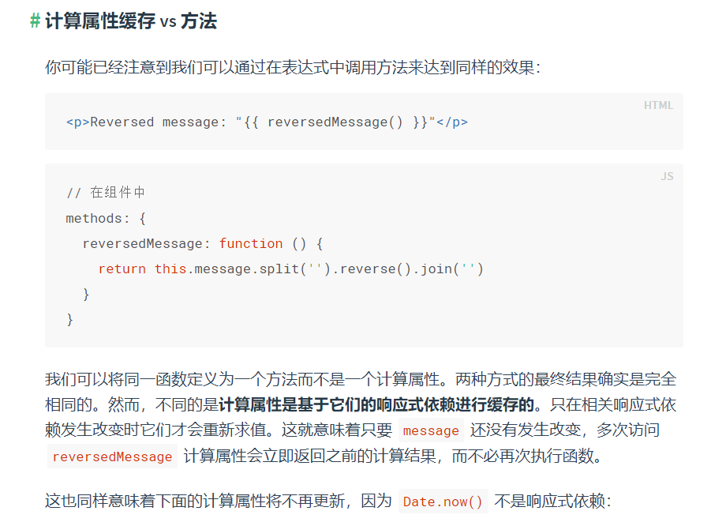

# 计算属性

## 1 缓存

```html
<!DOCTYPE html>
<html lang="en">
<head>
    <meta charset="UTF-8">
    <meta name="viewport" content="width=device-width, initial-scale=1.0">
    <title>Document</title>
    <script type="text/javascript" charset="utf-8" src="../vue.js"></script>
</head>
<body>
    <div id="example">
        <p>Original message: {{message}}</p>
        <p>Computed reverse message: {{reverseMessage}}</p>
    </div>
    <script type="text/javascript">
        var vm = new Vue({
            el: '#example',
            data: {
                message: 'Hello'
            },
            computed: {
                reverseMessage: function() {
                    return this.message.split('').reverse().join('')
                }
            }
        })
    </script>
</body>
</html>
```

