# **Datastructure**


## ch2 LinearList


### 2.1 基础

#### 抽象数据类型定义ADT

ADT List {


​	数据对象: D = {$a_i|a_i\in ElemSet, i = 1, 2, ..., n, n \ge 0$}

​	数据关系: R1 = {$<a_{i - 1}, a_i>| a_{i-1}, a\in D, i = 2,...,n$}​

​	基本操作:

​		InitList(&L)

}


### 2.1 线性表

#### 2.1.1 定义结构体

```c
typedef struct {
    int* elem;
    int length;
    int list_size;
} SqList;
```

#### 题目

【2011统考真题】

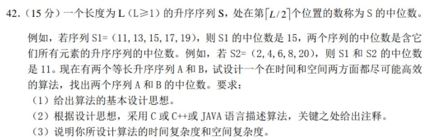

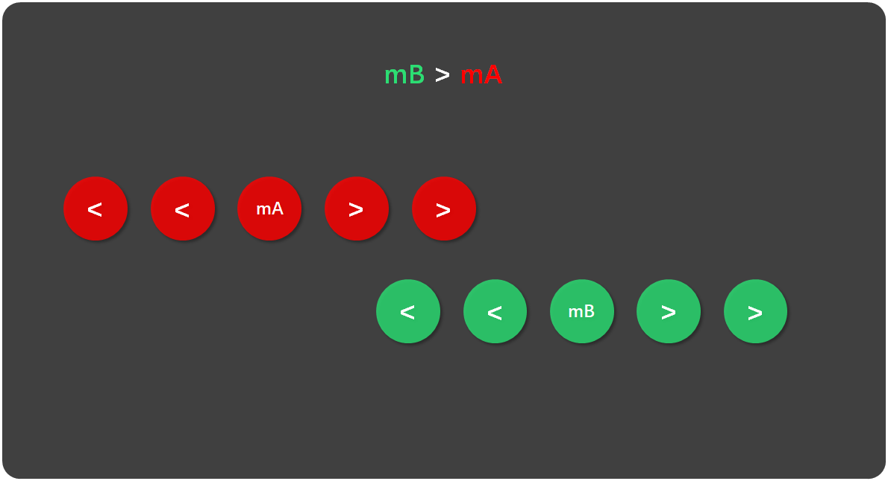

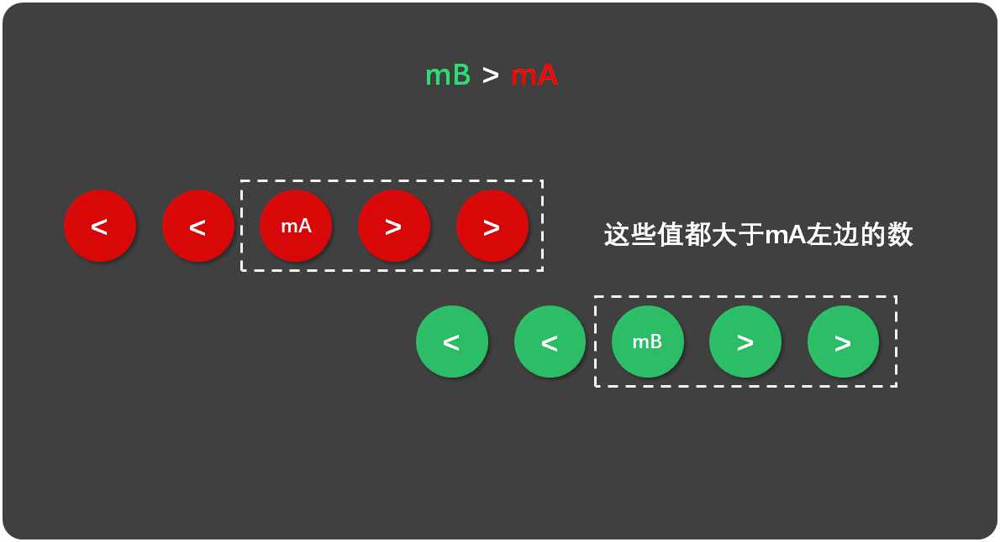

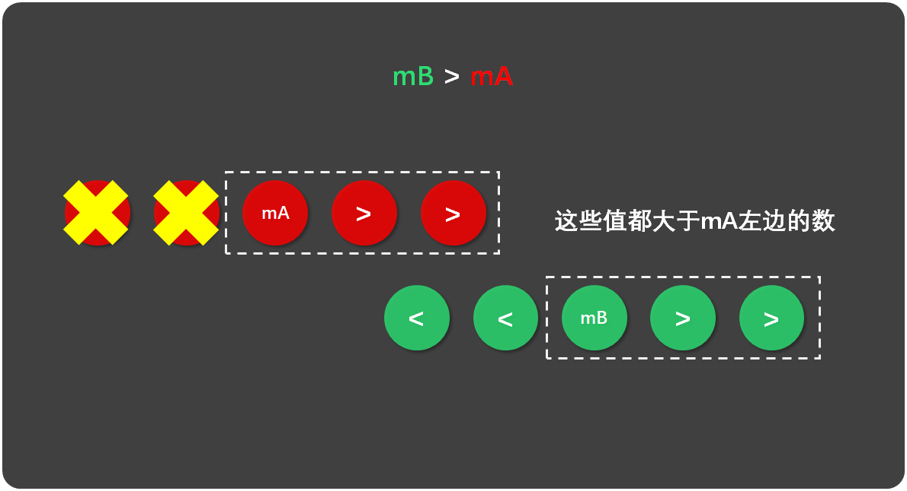

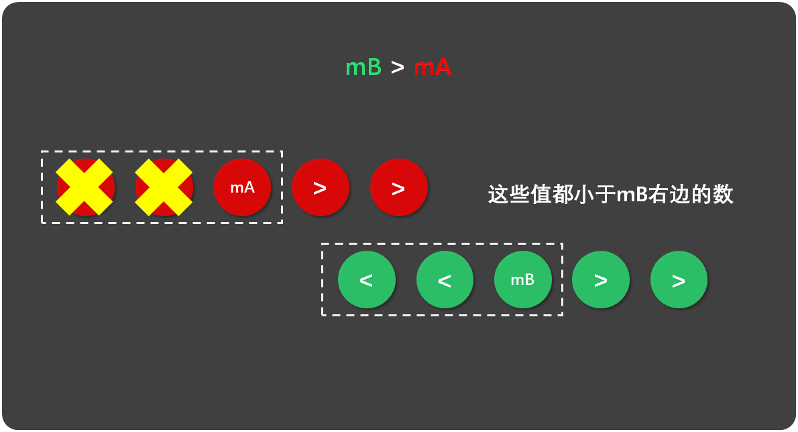

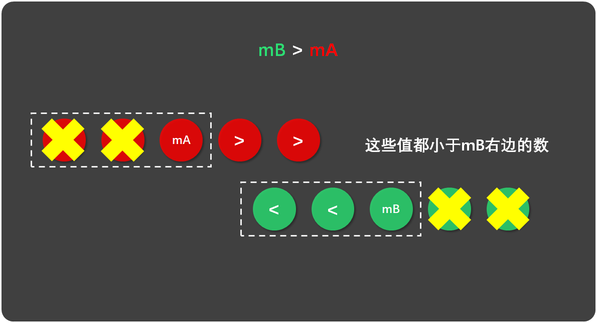

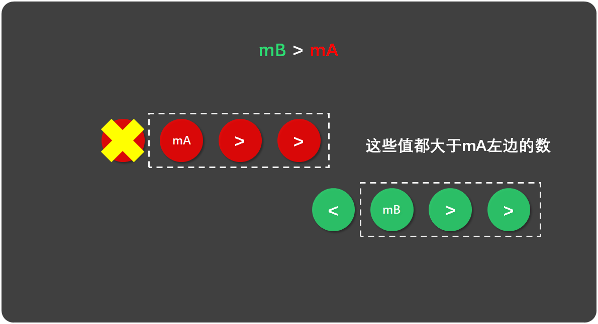

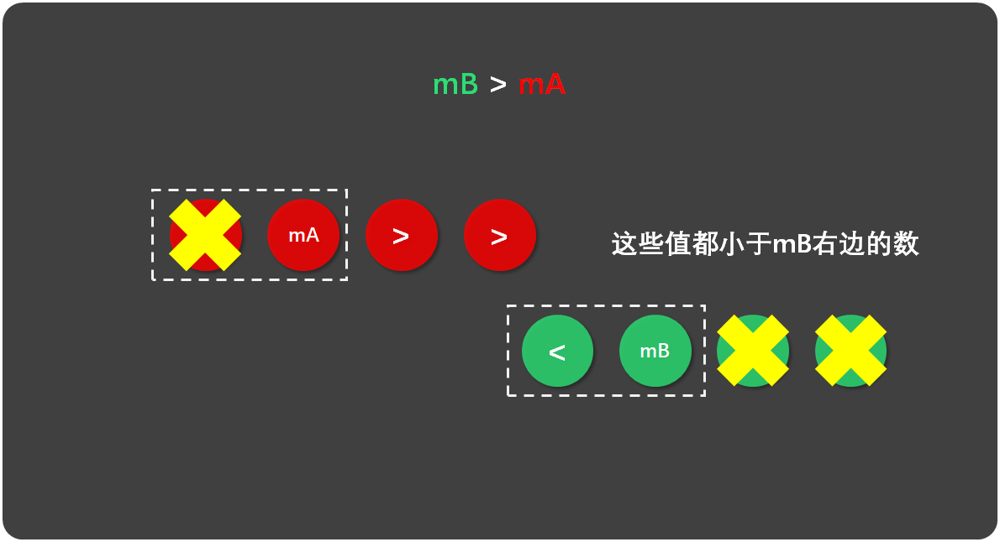


#### 算法清单


### 2.2 链表

#### 2.2.1 定义

```c
typedef struct LNode {
    int data;
    struct LNode* next;
} LNode, *LinkList;
```


**一个问题：[typedef struct vs struct definitions ](https://stackoverflow.com/questions/1675351/typedef-struct-vs-struct-definitions)**

> The common idiom is using both:

```c
typedef struct S { 
    int x; 
} S;
```

> They are different definitions. To make the discussion clearer I will split the sentence:
>
> 他们是不同的定义。为了清楚地认清里面的区别，我把上面的定义分开来写：

```c
struct S { 
    int x; 
};

typedef struct S S;
```

> In the first line you are defining the identifier `S` within the struct name space (not in the C++ sense). You can use it and define variables or function arguments of the newly defined type by defining the type of the argument as `struct S`:
>
> 第一行你在结构体命名空间中定义了一个标识符S，你可以使用`struct S`这种方式定义变量或者函数参数。

```c
void f( struct S argument ); // struct is required here
```

> The second line adds a type alias `S` in the global name space and thus allows you to just write:
>
> `typedef`则定义了一个新的类型`S`，而`S`指的是`struct S`，因此你可以向下面这样定义变量或者参数：

```c
void f( S argument ); // struct keyword no longer needed
```

> Note that since both identifier name spaces are different, defining `S` both in the structs and global spaces is not an error, as it is not redefining the same identifier, but rather creating a different identifier in a different place.
>
> To make the difference clearer:

```c
typedef struct S { 
    int x; 
} T;

void S() { } // correct

//void T() {} // error: symbol T already defined as an alias to 'struct S'
```

> You can define a function with the same name of the struct as the identifiers are kept in different spaces, but you cannot define a function with the same name as a `typedef` as those identifiers collide.
>
> In C++, it is slightly different as the rules to locate a symbol have changed subtly. C++ still keeps the two different identifier spaces, but unlike in C, when you only define the symbol within the class identifier space, you are not required to provide the struct/class keyword:

```c
 // C++
struct S { 
    int x; 
}; // S defined as a class

void f( S a ); // correct: struct is optional
```

> What changes are the search rules, not where the identifiers are defined. The compiler will search the global identifier table and after `S` has not been found it will search for `S` within the class identifiers.
>
> The code presented before behaves in the same way:

```c
typedef struct S { 
    int x; 
} T;

void S() {} // correct [*]

//void T() {} // error: symbol T already defined as an alias to 'struct S'
```

> After the definition of the `S` function in the second line, the struct `S` cannot be resolved automatically by the compiler, and to create an object or define an argument of that type you must fall back to including the `struct` keyword:

```c
// previous code here...
int main() {
    S(); 
    struct S s;
}
```

**关于typedef定义指针类型：[typedef struct和指针](https://blog.csdn.net/u013814701/article/details/52996544)**


例如:

```c
typedef struct LNode {
    int data;
    struct LNode *next;
} ListNode, *LinkList;
```

那么在以后的使用中，我如果想使用`LNode`来定义一个变量，我必须使用`struct LNode value`

如果用`ListNode`来定义，那么只需要`ListNode value`，如果使用`LinkList`来定义一个变量，效果跟`ListNode* value`是一样的。

#### 2.2.2 各种算法

```c
/**
 * al-2.8
 *
 * @param L
 * @param i
 * @param e
 * @return
 */
int GetElem_L(LinkList L, int i, int* e)
{
    LinkList p = L->next;
    int j = 0;
    while(p != NULL && j < i)
    {
        j++;
        p = p->next;
    }
    if(p == NULL) return ERROR;
    *e = p->data;
    return OK;
}

/**
 * al-2.9
 * @param L
 * @param i
 * @param e
 * @return
 */
int ListInsert_L(LinkList L, int i, int e)
{
    LinkList p = L;
    int j = 0;
    while(p != NULL && j < i)
    {
        p = p->next;
        j++;
    }
    if (p == NULL) return ERROR;
    LinkList node = (LinkList)malloc(sizeof(ListNode));
    node->data = e;
    node->next = p->next;
    p->next = node;
    return OK;
}

/**
 * al-2.10
 * @param L
 * @param i
 * @param e
 * @return
 */
int ListDelete_L(LinkList L, int i, int* e)
{
    LinkList p = L;
    int j = 0;
    while(p != NULL && j < i)
    {
        p = p->next;
        j++;
    }
    if(p == NULL) return ERROR;
    *e = p->next->data;
    p->next = p->next->next;
    return OK;
}

void CreateList_L_HeadInsert(LinkList* L, int n)
{
    //create a head node
    *L = (LinkList)malloc(sizeof(ListNode));
    (*L)->next = NULL;
    for (int i = 0; i < n; ++i)
    {
        LinkList node = (LinkList)malloc(sizeof(ListNode));
        node->data = i + 1;
        node->next = (*L)->next;
        (*L)->next = node;
    }
}
/**
 * al-2.11-2
 * @param L
 * @param n
 */
void CreateList_L_TailInsert(LinkList* L, int n)
{
    *L = (LinkList)malloc(sizeof(ListNode));
    (*L)->next = NULL;
    LinkList p = *L;
    for (int i = 0; i < n; ++i)
    {
        LinkList node = (LinkList)malloc(sizeof(ListNode));
        node->data = i + 1;
        node->next = p->next;
        p->next = node;
        p = p->next;
    }
}
/**
 * al-2.12
 * @param La
 * @param Lb
 * @param Lc
 */
void MergeList_L(LinkList La, LinkList Lb, LinkList* Lc)
{
    LinkList pa = La->next;
    LinkList pb = Lb->next;

    *Lc = La;
    LinkList pc = *Lc;
    while(pa != NULL && pb != NULL)
    {
        if(pa->data <= pb->data) {
            pc->next = pa;
            pa = pa->next;
        } else {
            pc->next = pb;
            pb = pb->next;
        }
        pc = pc->next;
    }
    if(pa != NULL) pc->next = pa;
    else pc->next = pb;
}
```


#### 2.2.x 问题总结

##### **值传递**的问题

```c
void CreateList_L_HeadInsert(LinkList L, int n)
{
    //create a head node
    L = (LinkList)malloc(sizeof(ListNode));
    L->next = NULL;
    for (int i = 0; i < n; ++i)
    {
        LinkList node = (LinkList)malloc(sizeof(ListNode));
        node->data = i + 1;//书上是让输入的，我嫌麻烦，先这样直接赋值了
        node->next = L->next;
        L->next = node;
    }
}
```

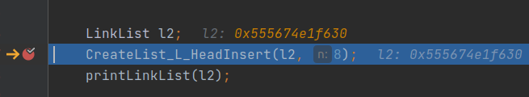

当我们调用这个函数的时候，传入的指针为`l2(LinkList l2 <=> ListNode* l2)`，`l2`存储的地址为`0x555674e1f630`

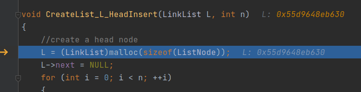

当我们跳入函数`CreateList_L_HeadInsert`的时候，传入的`L`的值依旧是`0x555674e1f630`；但是当我们执行了`malloc`函数后，函数作用域内的`L`的值已经发生了变化，可以说**L已经不是我们传入的那个指针了**。

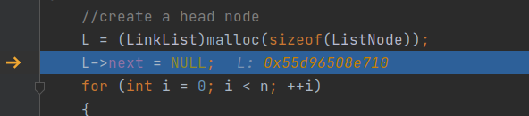

那么我们接下来的所有操作，都是针对指针地址为`0x55d96508e710`，大小为`sizeof(ListNode)`的这个数据段进行的操作了，所以自然不会反映到main里面的`l2`

所以我们的解决方案是**二重指针**

```c
void CreateList_L_HeadInsert(LinkList* L, int n)
{
    //create a head node
    *L = (LinkList)malloc(sizeof(ListNode));//👈重点在这里
    (*L)->next = NULL;
    for (int i = 0; i < n; ++i)
    {
        LinkList node = (LinkList)malloc(sizeof(ListNode));
        node->data = i + 1;//书上是让输入的，我嫌麻烦，先这样直接赋值了
        node->next = (*L)->next;
        (*L)->next = node;
    }
}
```

（昨天太懒了，没有写完， 所以今补上的时候地址都变了，不过问题不大）

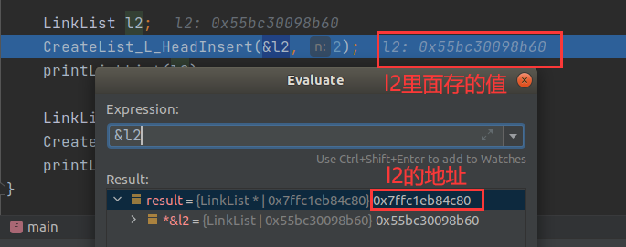

`*L = (LinkList)malloc(sizeof(ListNode));//👈重点在这里`

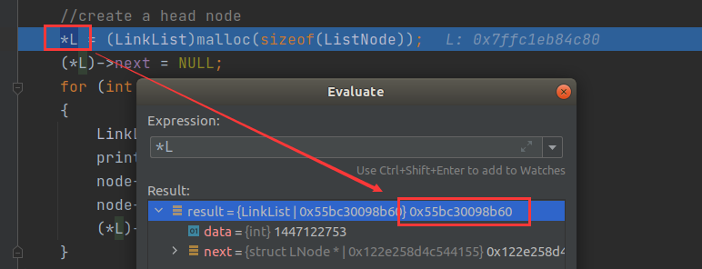

经过了malloc分配后，指针`L`指向的位置内的数据被重新赋值，由原来的`0x55bc3008b60`变成了下面的`0x55bc302d2710`

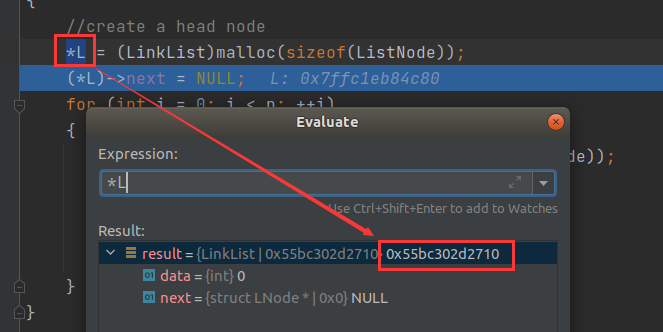

当函数执行完跳回main函数的时候，我们看到`l2`的值真的跟着改变了。

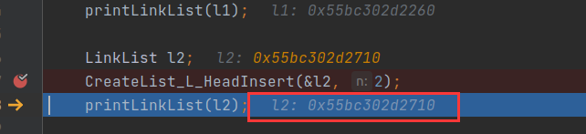

我们可以用图片更形象地反映一下这个过程

刚开始的时候

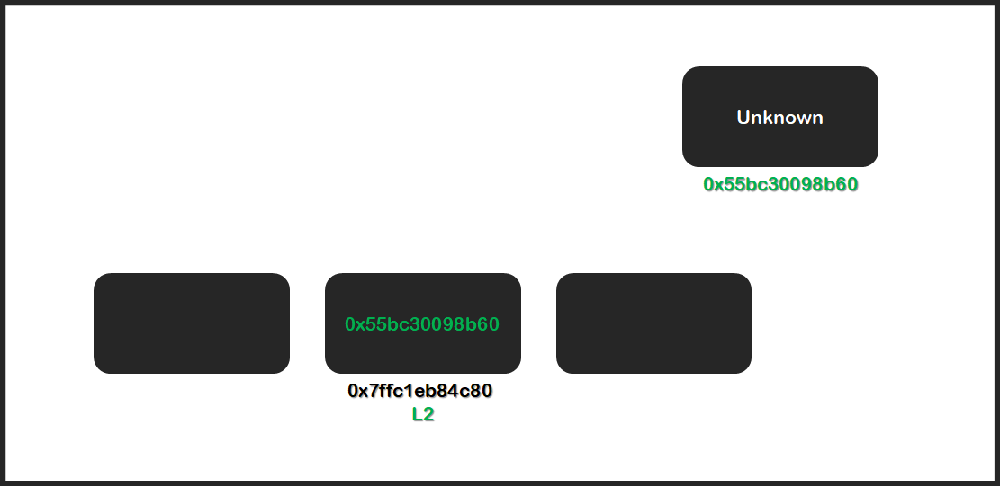

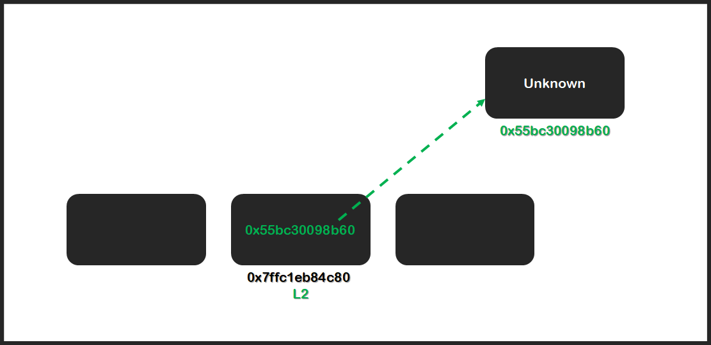


当我们调用`CreateList_L_HeadInsert(LinkList* L, int n)`时，传入的是`l2`的地址`0x7ffc1eb84c80`

`*L = (LinkList)malloc(sizeof(ListNode));`中，`*L`可以认为是通过L这个地址，找到**L这个地址对应的位置**

而赋值操作，则是将`(LinkList)malloc(sizeof(ListNode))`分配的内存空间的**起始地址这个值**放到了这个位置

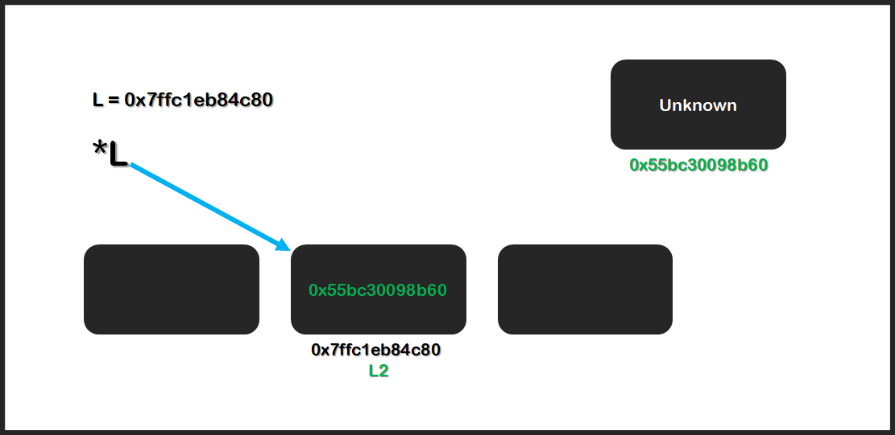

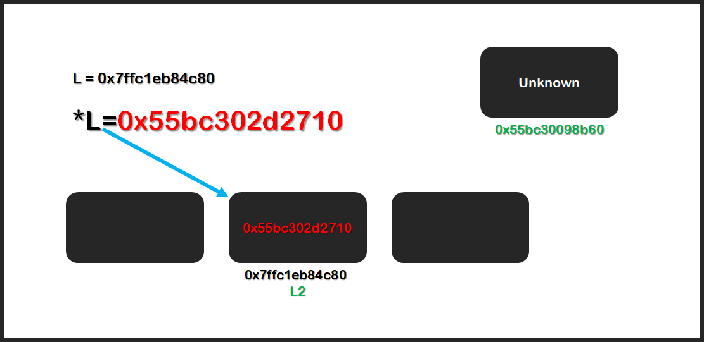

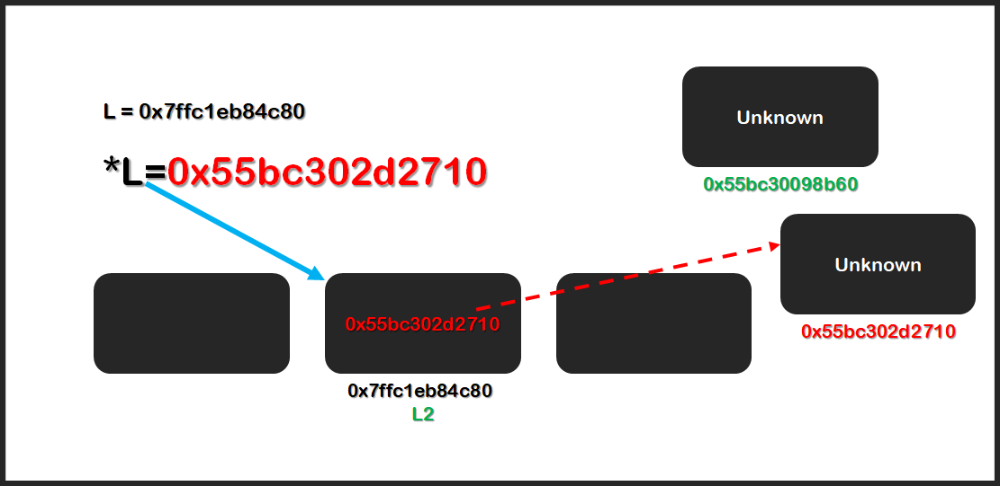

##### sizeof问题

```c
int getLen(int a[])
{
    return sizeof(a) / sizeof(int);
}

int main() {
//    test_se2_del_min();
    int a[] = {1, 3, 6, 9, 10, 1, 3, 1, 5, 9};
    printf("len = %d\n",getLen(a));
    printf("len = %d\n", sizeof(a) / sizeof(int));
}
```

结果为：

```
/home/han1254/Documents/Datastructure/CSKAOYAN/cmake-build-debug/CSKAOYAN
len = 2
len = 10

Process finished with exit code 0
```

> c语言中，定义数组后可以用sizeof命令获得数组的长度（可容纳元素个数）。
> 例如：
>
> ```c
> int data[4];
> int length;
> length=sizeof(data)/sizeof(data[0]); //数组占内存总空间，除以单个元素占内存空间大小
> printf("length of data[4]=%d", length ); //输出length of data[4]=4
> ```
>
> 但是，通过传递数组名参数到子函数中，以获得数组长度是不可行的。
> 例如：
>
> ```c
> int getLength(int[] a)
> { 
>     int length;length=sizeof(a)/sizeof(a[0]); //这样是错误的，得到的结果永远是1
> 	return length;
> }
> ```
>
> 因为，a是函数参数，到了本函数中，a只是一个指针（地址，系统在本函数运行时，是不知道a所表示的地址有多大的数据存储空间，这里只是告诉函数：一个数据存储空间首地址），所以，sizoef(a)的结果是指针变量a占内存的大小，一般在32位机上是4个字节。a[0]是int类型，sizeof(a[0])也是4个字节，所以，结果永远是1。3、因此，获得数组长度，只能在数组定义所在的代码区中，采用以上方法，才可以达到效果。
>
> ————————————————
> 版权声明：本文为CSDN博主「YanWenCheng_」的原创文章，遵循CC 4.0 BY-SA版权协议，转载请附上原文出处链接及本声明。
> 原文链接：https://blog.csdn.net/YanWenCheng_/article/details/95358597


## ch3 Stack and Queue


### Stack

#### 栈的顺序存储结构

```c
//SqStack.h
#ifndef SQSTACK_H
#define SQSTACK_H
#define MaxSize 50
typedef struct {
        int* data;
        int top;
} SqStack;

#endif
```

```c
//SqStackImpl.h
#ifndef SQSTACK_IMPL_H
#define SQSTACK_IMPL_H
#include "SqStack.h"
#include "stdlib.h"
void PrintStack(SqStack S)
{
	for(int i = 0; i <= S.top; i++)
	{
		printf("%d\n", S.data[i]);
	}
}
void InitStack(SqStack* S)
{
	S->data = (int*)malloc(MaxSize * sizeof(int));
	S->top = -1;
}

int StackEmpty(SqStack S)
{
	if(S.top == -1) return 0;
	return 1;
}

int Push(SqStack* S, int x)
{
	if(S->top == MaxSize - 1)
		return 0;
	S->data[++S->top] = x;
	return 1;
}

int Pop(SqStack* S, int* e)
{
	if(S->top == -1) return 0;
	*e = S->data[S->top--];
	return 1;
}

int GetTOp(SqStack S, int* e)
{
	if(S.top == -1) return 0;
	*e = S.data[S.top];
	return 1;
}
#endif
```

```c
//StackMain.c
#include <stdio.h>
#include "SqStackImpl.h"

int main()
{
	SqStack s;
	InitStack(&s);
	Push(&s, 1);
	Push(&s, 2);
	Push(&s, 3);
	PrintStack(s);
}
```

#### 栈的链式存储结构


### Queue


### 相关问题

#### 入栈顺序已知，出栈序列能有多少种？

[5. 卡特兰数（Catalan）公式、证明、代码、典例.](https://blog.csdn.net/Sherry_Yue/article/details/88364746)

Catalan公式的通项公式

**$$C_n = \frac{1}{(n + 1)}C_{2n}^n = \frac{(2n)!}{(n + 1)n!(2n - n)!} = \frac{(2n)!}{(n + 1)!n!}$$**


#### 结构体的初始化问题


#### 把递归用栈表示


## ch4 String

### KMP算法思考

KMP算法，用一句话形容就是：**主串与模式串逐一对比，发现不匹配，则移动模式串指针，用最长前缀的后一位与主串指针对齐。**

首先我们要明确一下前缀和后缀的问题。


前缀指串除了最后一个字符之外，字符串所有头部子串；后缀指的是除了第一个字符外，字符串的所有尾部子串。

比如ababcd，前缀为{a, ab, aba, abab, ababc}，后缀为{d, cd, bcd, abcd, babcd}


如上图是一个模式串，序列一和序列二是在位置i之前的字符串中，**相等的且最长**的前后缀。

你可以类比上面的ababcd，序列<font color = red>ab</font><font color = green>ab</font>就相当于在位置i之前的序列，而<font color = red>ab</font>和<font color = green>ab</font>则是相同的前后缀。

我们找前后缀的目的就像下面这样：

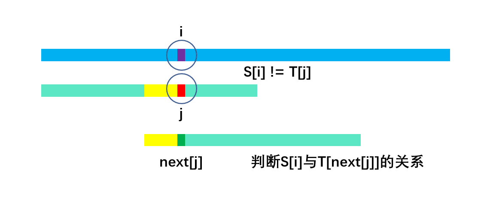

比如我有一个串S，和一个模式串T，我从S的pos位置以及T的1位置开始（数据结构中对于串，大都从1开始，0位置存储串的长度）比较，如果出现

S[i] != T[j]，我不想直接像暴力解法那样，**把主串指针跳回到起始位置的下一位，同时把模式串的指针跳回位置1**；我在想，虽然他们在S[i]和T[j]处产生了不匹配，但是他们前面可是匹配的。

暴力解法的代码是这样的

```c
int Index_Slow(const SString S, const SString T, int pos) {
    int i = pos;
    int j = 1;
    while (i <= S[0] && j <= T[0]) {
        if (S[i] == T[j]) {
            i++;
            j++;
        } else {
            i = i - j + 2;
            j = 1;
        }
    }
    if (j > T[0]) return i - T[0];//此时i也到了匹配的最后一位的后一位，所以直接i-T[0]，不用加一
    return 0;
}
```

我们看到，在else里面，如果出现不匹配的情况，主串指针指向原来的起始点的下一位，而模式串指针则指向了第一位。

而KMP算法则是认为我不需要回溯主串指针，

## Tree
```
/home/han1254/Documents/PGEE/clion_datastructure/cmake-build-debug/tree_main
input root
-
Now it's 2th level, you have to enter 2 nodes(enter '#' as a symbol of null)
+/
end the input?(y or n)
n
Now it's 3th level, you have to enter 4 nodes(enter '#' as a symbol of null)
a*ef
end the input?(y or n)
n
Now it's 4th level, you have to enter 8 nodes(enter '#' as a symbol of null)
##b-####
end the input?(y or n)
n
Now it's 5th level, you have to enter 16 nodes(enter '#' as a symbol of null)
######cd########
end the input?(y or n)
y
a + b * c - d - e / f 
- + a * b - c d / e f 
a b c d - * + e f / - 
```

### 数据转换，子结构体
[C语言结构体的“继承”](https://www.cnblogs.com/qiumingcheng/p/11229086.html)