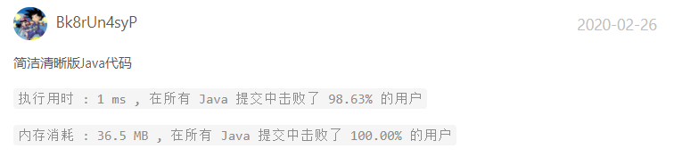

# 剑指offer百家争鸣篇

## 3.数组中重复的数字

找出数组中重复的数字。


在一个长度为 n 的数组 nums 里的所有数字都在 0～n-1 的范围内。数组中某些数字是重复的，但不知道有几个数字重复了，也不知道每个数字重复了几次。请找出数组中任意一个重复的数字。

示例 1：

> 输入：
> [2, 3, 1, 0, 2, 5, 3]
> 输出：2 或 3 


限制：

> 2 <= n <= 100000


### 3-1

```java
//by myself
class Solution {
    public int findRepeatNumber(int[] nums) {
        Map<Integer, Integer> map = new HashMap<Integer, Integer>();
        for(int i : nums) {
            if(map.containsKey(i))
                return i;
            map.put(i, 1);
        }
        return -1;
    }
}
```


## 4.二维数组中的查找

在一个 n * m 的二维数组中，每一行都按照从左到右递增的顺序排序，每一列都按照从上到下递增的顺序排序。请完成一个高效的函数，输入这样的一个二维数组和一个整数，判断数组中是否含有该整数。

示例:

> 现有矩阵 matrix 如下：
>
> [
>   [1,   4,  7, 11, 15],
>   [2,   5,  8, 12, 19],
>   [3,   6,  9, 16, 22],
>   [10, 13, 14, 17, 24],
>   [18, 21, 23, 26, 30]
> ]
> 给定 target = 5，返回 true。
>
> 给定 target = 20，返回 false。

 

限制：

> 0 <= n <= 1000


### 4-1

```java
//by myself
class Solution {
   public boolean findNumberIn2DArray(int[][] matrix, int target) {

    int rows = matrix.length;
    if(rows == 0) 
        return false;
    int cols = matrix[0].length;
    if(cols == 0)
        return false;
     for(int i = 0; i < rows; i++) {
         if(target == matrix[i][0] || target == matrix[i][cols - 1])
            return true;
        if(!((target > matrix[i][0]) && (target < matrix[i][cols - 1])))
            continue;
         for(int j = 0; j < cols; j++) {
             if(matrix[i][j] == target) {
                 return true;
             }
         }
     }
     return false;
   }

}
```


### 4-2

```java
class Solution {
    public boolean findNumberIn2DArray(int[][] matrix, int target) {
        int i = matrix.length - 1, j = 0;
        while(i >= 0 && j < matrix[0].length)
        {
            if(matrix[i][j] > target) i--;
            else if(matrix[i][j] < target) j++;
            else return true;
        }
        return false;
    }
}

作者：jyd
链接：https://leetcode-cn.com/problems/er-wei-shu-zu-zhong-de-cha-zhao-lcof/solution/mian-shi-ti-04-er-wei-shu-zu-zhong-de-cha-zhao-zuo/
来源：力扣（LeetCode）
著作权归作者所有。商业转载请联系作者获得授权，非商业转载请注明出处。
```


---

## 5.替换空格

请实现一个函数，把字符串 s 中的每个空格替换成"%20"。

 

示例 1：

> 输入：s = "We are happy."
> 输出："We%20are%20happy."


限制：

> 0 <= s 的长度 <= 10000

### 5-1

```java
//by myself
class Solution {
    public String replaceSpace(String s) {

        StringBuilder builder = new StringBuilder();
       
        for(int i = 0; i < s.length(); i++) {
            if(s.charAt(i) == ' ') {
                builder.append("%20");
            } else {
                builder.append(s.charAt(i));
            }
        }
        return builder.toString();
	}
}
```


### 5-2

```java
class Solution {
    public String replaceSpace(String s) {
        StringBuilder res = new StringBuilder();
        for(Character c : s.toCharArray())
        {
            if(c == ' ') res.append("%20");
            else res.append(c);
        }
        return res.toString();
    }
}

作者：jyd
链接：https://leetcode-cn.com/problems/ti-huan-kong-ge-lcof/solution/mian-shi-ti-05-ti-huan-kong-ge-ji-jian-qing-xi-tu-/
来源：力扣（LeetCode）
著作权归作者所有。商业转载请联系作者获得授权，非商业转载请注明出处。
```


## 6.从头到尾打印链表

输入一个链表的头节点，从尾到头反过来返回每个节点的值（用数组返回）。

 

示例 1：

> 输入：head = [1,3,2]
> 输出：[2,3,1]


限制：

> 0 <= 链表长度 <= 10000


### 6-1

```java
//by myself
class Solution {
    public int[] reversePrint(ListNode head) {
        List resList = new ArrayList<Integer>();
        while(head != null) {
            resList.add(head.val);
            head = head.next;
        }
        int[] res = new int[resList.size()];
        for(int i = 0; i < resList.size(); i++) {
            res[resList.size() - 1 - i] = (int)resList.get(i);
        }
        return res;
    }
}
```


### 6-2

```java
/**
 * Definition for singly-linked list.
 * public class ListNode {
 *     int val;
 *     ListNode next;
 *     ListNode(int x) { val = x; }
 * }
 */
class Solution {
    public int[] reversePrint(ListNode head) {
        Stack<ListNode> stack = new Stack<ListNode>();
        ListNode temp = head;
        while (temp != null) {
            stack.push(temp);
            temp = temp.next;
        }
        int size = stack.size();
        int[] print = new int[size];
        for (int i = 0; i < size; i++) {
            print[i] = stack.pop().val;
        }
        return print;
    }
}

作者：LeetCode-Solution
链接：https://leetcode-cn.com/problems/cong-wei-dao-tou-da-yin-lian-biao-lcof/solution/mian-shi-ti-06-cong-wei-dao-tou-da-yin-lian-biao-b/
来源：力扣（LeetCode）
著作权归作者所有。商业转载请联系作者获得授权，非商业转载请注明出处。
```


### 6-3

```java
class Solution {
    ArrayList<Integer> tmp = new ArrayList<Integer>();
    public int[] reversePrint(ListNode head) {
        recur(head);
        int[] res = new int[tmp.size()];
        for(int i = 0; i < res.length; i++)
            res[i] = tmp.get(i);
        return res;
    }
    void recur(ListNode head) {
        if(head == null) return;
        recur(head.next);
        tmp.add(head.val);
    }
}

作者：jyd
链接：https://leetcode-cn.com/problems/cong-wei-dao-tou-da-yin-lian-biao-lcof/solution/mian-shi-ti-06-cong-wei-dao-tou-da-yin-lian-biao-d/
来源：力扣（LeetCode）
著作权归作者所有。商业转载请联系作者获得授权，非商业转载请注明出处。
```


## 7.重建二叉树

输入某二叉树的前序遍历和中序遍历的结果，请重建该二叉树。假设输入的前序遍历和中序遍历的结果中都不含重复的数字。

 

例如，给出

```
前序遍历 preorder = [3,9,20,15,7]
中序遍历 inorder = [9,3,15,20,7]
```

返回如下的二叉树：

```
    3
   / \
  9  20
    /  \
   15   7
```

 

**限制：**

```
0 <= 节点个数 <= 5000
```


### 7-1

```java
//by myself
class Solution {

    private HashMap<Integer, Integer> map = new HashMap<>();
    public TreeNode buildTree(int[] preorder, int[] inorder) {
       for(int i = 0; i < preorder.length; i++) {
           map.put(inorder[i], i);
       }
       return helper(preorder, 0, 0, inorder.length - 1);
    }

    public TreeNode helper(int[] preorder, int preRoot, int left, int right) {
        if(left > right) {
            return null;
        }
        int inRoot = map.get(preorder[preRoot]);
        TreeNode node = new TreeNode(preorder[preRoot]);
        node.left = helper(preorder, preRoot + 1, left, inRoot - 1);
        node.right = helper(preorder, preRoot + 1 + (inRoot - left), inRoot + 1, right);
        return node;
    }

}
```


### 7-2

注意：本文方法只适用于 “无重复节点值” 的二叉树。

```java
class Solution {
    int[] preorder;
    HashMap<Integer, Integer> dic = new HashMap<>();
    public TreeNode buildTree(int[] preorder, int[] inorder) {
        this.preorder = preorder;
        for(int i = 0; i < inorder.length; i++)
            dic.put(inorder[i], i);
        return recur(0, 0, inorder.length - 1);
    }
    TreeNode recur(int root, int left, int right) {
        if(left > right) return null;                          // 递归终止
        TreeNode node = new TreeNode(preorder[root]);          // 建立根节点
        int i = dic.get(preorder[root]);                       // 划分根节点、左子树、右子树
        node.left = recur(root + 1, left, i - 1);              // 开启左子树递归
        node.right = recur(root + i - left + 1, i + 1, right); // 开启右子树递归
        return node;                                           // 回溯返回根节点
    }
}

作者：jyd
链接：https://leetcode-cn.com/problems/zhong-jian-er-cha-shu-lcof/solution/mian-shi-ti-07-zhong-jian-er-cha-shu-di-gui-fa-qin/
来源：力扣（LeetCode）
著作权归作者所有。商业转载请联系作者获得授权，非商业转载请注明出处。
```

## 9.用两个栈实现队列

用两个栈实现一个队列。队列的声明如下，请实现它的两个函数 appendTail 和 deleteHead ，分别完成在队列尾部插入整数和在队列头部删除整数的功能。(若队列中没有元素，deleteHead 操作返回 -1 )

示例 1：

> 输入：
> ["CQueue","appendTail","deleteHead","deleteHead"]
> [[],[3],[],[]]
> 输出：[null,null,3,-1]


示例 2：

> 输入：
> ["CQueue","deleteHead","appendTail","appendTail","deleteHead","deleteHead"]
> [[],[],[5],[2],[],[]]
> 输出：[null,-1,null,null,5,2]

提示：

> 1 <= values <= 10000
> 最多会对 appendTail、deleteHead 进行 10000 次调用

### 9-1

```java
// by myself
class CQueue {
    private Stack<Integer> stackIn;
    private Stack<Integer> stackOut;
    public CQueue() {
        stackIn = new Stack<>();
        stackOut = new Stack<>();
    }
    public void appendTail(int tail) {
        stackIn.add(tail);
    }

    public int deleteHead() {
        if(stackOut.isEmpty()) {
            if(stackIn.isEmpty()) {
                return -1;
            }
            while(!stackIn.isEmpty()) {
                stackOut.add(stackIn.pop());
            }
        }
        return stackOut.pop();
    }
}

```


## 10-I.斐波那契数列

写一个函数，输入 n ，求斐波那契（Fibonacci）数列的第 n 项（即 F(N)）。斐波那契数列的定义如下：

F(0) = 0,   F(1) = 1
F(N) = F(N - 1) + F(N - 2), 其中 N > 1.
斐波那契数列由 0 和 1 开始，之后的斐波那契数就是由之前的两数相加而得出。

答案需要取模 1e9+7（1000000007），如计算初始结果为：1000000008，请返回 1。

 

示例 1：

> 输入：n = 2
> 输出：1


示例 2：

> 输入：n = 5
> 输出：5


提示：

0 <= n <= 100

### 10-I-1

```java
class Solution {
   public int fib(int n) {
       if(n == 0) {
           return 0;
       } else if(n == 1) {
           return 1;
       }
       int[] res = new int[n + 1];
       res[0] = 0;
       res[1] = 1;
    
       for(int i = 2; i <= n; i++) {
           res[i] = (res[i - 1] + res[i - 2]) % 1000000007;
       }

       return (res[n] % 1000000007);
	}
}
```


### 10-I-2

```java
class Solution {
    public int fib(int n) {
        int a = 0, b = 1, sum;
        for(int i = 0; i < n; i++){
            sum = (a + b) % 1000000007;
            a = b;
            b = sum;
        }
        return a;
    }
}

作者：jyd
链接：https://leetcode-cn.com/problems/fei-bo-na-qi-shu-lie-lcof/solution/mian-shi-ti-10-i-fei-bo-na-qi-shu-lie-dong-tai-gui/
来源：力扣（LeetCode）
著作权归作者所有。商业转载请联系作者获得授权，非商业转载请注明出处。
```


## 10-II.青蛙跳台阶

一只青蛙一次可以跳上1级台阶，也可以跳上2级台阶。求该青蛙跳上一个 n 级的台阶总共有多少种跳法。

答案需要取模 1e9+7（1000000007），如计算初始结果为：1000000008，请返回 1。

示例 1：

> 输入：n = 2
> 输出：2

示例 2：

> 输入：n = 7
> 输出：21

示例 3：

> 输入：n = 0
> 输出：1

提示：

0 <= n <= 100
注意：本题与主站 70 题相同：https://leetcode-cn.com/problems/climbing-stairs/

 ### 10-II-1

```java
//by myself
class Solution {
    public int numWays(int n) {
		if(n == 0) {
            return 1;
        } else if(n == 1) {
            return 1;
        }
       
        int[] rs = new int[n + 1];
        rs[0] = 1;
        rs[1] = 1;
        for(int i = 2; i <= n; i++) {
            rs[i] = (rs[i - 1] + rs[i - 2]) % 1000000007;
        }

        return rs[n] % 1000000007;
	}
}
```


## 11.旋转数组的最小数字

把一个数组最开始的若干个元素搬到数组的末尾，我们称之为数组的旋转。输入一个递增排序的数组的一个旋转，输出旋转数组的最小元素。例如，数组 [3,4,5,1,2] 为 [1,2,3,4,5] 的一个旋转，该数组的最小值为1。  

示例 1：

> 输入：[3,4,5,1,2]
> 输出：1

示例 2：

> 输入：[2,2,2,0,1]
> 输出：0

注意：本题与主站 154 题相同：https://leetcode-cn.com/problems/find-minimum-in-rotated-sorted-array-ii/

### 11-1

```java
class Solution {
    public int minArray(int[] numbers) {
        int i = 0, j = numbers.length - 1;
        while(i < j) {
            int mid = (i + j) / 2;
            if(numbers[mid] > numbers[j]) {
                i = mid + 1;
            } else if(numbers[mid] < numbers[j]) {
                j = mid;
            } else {
                j--;
            }
        }
        return numbers[i];
    }
}
```

### 11-2

```java
public class Solution {

    // [3, 4, 5, 1, 2]
    // [1, 2, 3, 4, 5]
    // 不能使用左边数与中间数比较，这种做法不能有效地减治

    // [1, 2, 3, 4, 5]
    // [3, 4, 5, 1, 2]
    // [2, 3, 4, 5 ,1]

    public int minArray(int[] numbers) {
        int len = numbers.length;
        if (len == 0) {
            return 0;
        }
        int left = 0;
        int right = len - 1;
        while (left < right) {
            int mid = (left + right) >>> 1;
            if (numbers[mid] > numbers[right]) {
                // [3, 4, 5, 1, 2]，mid 以及 mid 的左边一定不是最小数字
                // 下一轮搜索区间是 [mid + 1, right]
                left = mid + 1;
            } else if (numbers[mid] == numbers[right]) {
                // 只能把 right 排除掉，下一轮搜索区间是 [left, right - 1]
                right = right - 1;
            } else {
                // 此时 numbers[mid] < numbers[right]
                // mid 的右边一定不是最小数字，mid 有可能是，下一轮搜索区间是 [left, mid]
                right = mid;
            }
        }

        // 最小数字一定在数组中，因此不用后处理
        return numbers[left];
    }
}

作者：liweiwei1419
链接：https://leetcode-cn.com/problems/xuan-zhuan-shu-zu-de-zui-xiao-shu-zi-lcof/solution/er-fen-jian-zhi-si-xiang-fen-zhi-si-xiang-by-liwei/
来源：力扣（LeetCode）
著作权归作者所有。商业转载请联系作者获得授权，非商业转载请注明出处。
```


## 12.矩阵中的路径

请设计一个函数，用来判断在一个矩阵中是否存在一条包含某字符串所有字符的路径。路径可以从矩阵中的任意一格开始，每一步可以在矩阵中向左、右、上、下移动一格。如果一条路径经过了矩阵的某一格，那么该路径不能再次进入该格子。例如，在下面的3×4的矩阵中包含一条字符串“bfce”的路径（路径中的字母用加粗标出）。

[["a","b","c","e"],
["s","f","c","s"],
["a","d","e","e"]]

但矩阵中不包含字符串“abfb”的路径，因为字符串的第一个字符b占据了矩阵中的第一行第二个格子之后，路径不能再次进入这个格子。

 

示例 1：

> 输入：board = [["A","B","C","E"],["S","F","C","S"],["A","D","E","E"]], word = "ABCCED"
> 输出：true

示例 2：

> 输入：board = [["a","b"],["c","d"]], word = "abcd"
> 输出：false


提示：

1 <= board.length <= 200
1 <= board[i].length <= 200
注意：本题与主站 79 题相同：https://leetcode-cn.com/problems/word-search/

来源：力扣（LeetCode）
链接：https://leetcode-cn.com/problems/ju-zhen-zhong-de-lu-jing-lcof
著作权归领扣网络所有。商业转载请联系官方授权，非商业转载请注明出处。


### 12-1

```java
class Solution {

    private boolean[][] flags;

    public boolean exist(char[][] board, String word) {
        flags = new boolean[board.length][board[0].length];
        for(int i = 0; i < board.length; i++) {
            for(int j = 0; j < board[0].length; j++) {
                if(isExist(board, word, 0, i, j)) {
                    return true;
                }
            }
        }
        return false;
    }

    public boolean isExist(char[][] board, String word, int index, int row, int col) {
        if(index >= word.length() || row >= board.length || col >= board[0].length || row < 0 || col < 0) {
            return false;
        }
        if(flags[row][col]) {
            return false;
        }
        if(word.charAt(index) == board[row][col]) {
            if(index == (word.length() - 1)) {
                return true;
            }
            flags[row][col] = true;
            boolean res = isExist(board, word, index + 1, row + 1, col) ||
            isExist(board, word, index + 1, row - 1, col) ||
            isExist(board, word, index + 1, row, col + 1) ||
            isExist(board, word, index + 1, row, col - 1);
            flags[row][col] = false;
            return res;
        }
        return false;
    }
}
```

### 12-2

```java
class Solution {
    public boolean exist(char[][] board, String word) {
        char[] words = word.toCharArray();
        for(int i = 0; i < board.length; i++) {
            for(int j = 0; j < board[0].length; j++) {
                if(dfs(board, words, i, j, 0)) return true;
            }
        }
        return false;
    }
    boolean dfs(char[][] board, char[] word, int i, int j, int k) {
        if(i >= board.length || i < 0 || j >= board[0].length || j < 0 || board[i][j] != word[k]) return false;
        if(k == word.length - 1) return true;
        board[i][j] = '\0';
        boolean res = dfs(board, word, i + 1, j, k + 1) || dfs(board, word, i - 1, j, k + 1) || 
                      dfs(board, word, i, j + 1, k + 1) || dfs(board, word, i , j - 1, k + 1);
        board[i][j] = word[k];
        return res;
    }
}

作者：jyd
链接：https://leetcode-cn.com/problems/ju-zhen-zhong-de-lu-jing-lcof/solution/mian-shi-ti-12-ju-zhen-zhong-de-lu-jing-shen-du-yo/
来源：力扣（LeetCode）
著作权归作者所有。商业转载请联系作者获得授权，非商业转载请注明出处。
```


## 13.机器人的运动范围

地上有一个m行n列的方格，从坐标 [0,0] 到坐标 [m-1,n-1] 。一个机器人从坐标 [0, 0] 的格子开始移动，它每次可以向左、右、上、下移动一格（不能移动到方格外），也不能进入行坐标和列坐标的数位之和大于k的格子。例如，当k为18时，机器人能够进入方格 [35, 37] ，因为3+5+3+7=18。但它不能进入方格 [35, 38]，因为3+5+3+8=19。请问该机器人能够到达多少个格子？

 

示例 1：

> 输入：m = 2, n = 3, k = 1
> 输出：3

示例 2：

> 输入：m = 3, n = 1, k = 0
> 输出：1

提示：

1 <= n,m <= 100
0 <= k <= 20


### 13-1

```java
class Solution {
   
    int res = 0;
    boolean[][] flag;
    public int movingCount(int m, int n, int k) {
        flag = new boolean[m][n];
        helper(m, n, 0, 0, k);
        return res;
    }

    public void helper(int m, int n, int row, int col, int k) {
        if(row >= m || col >= n || row < 0 || col < 0 || isGreater(row, col, k)) {
            return;
        }
        if(flag[row][col]) {
            return;
        }

        flag[row][col] = true;
        res++;
        helper(m, n, row + 1, col, k);
        helper(m, n, row - 1, col, k);
        helper(m, n, row, col + 1, k);
        helper(m, n, row, col - 1, k);
    }

    public boolean isGreater(int row, int col, int k) {
        int count = 0;
        while(row > 0) {
            count += row % 10;
            row = row / 10;
        }
        while(col > 0) {
            count += col % 10;
            col = col / 10;
        }
        return count > k;
    }

}
```


### 13-2



[点击进入用户主页](https://leetcode-cn.com/u/Bk8rUn4syP/)

```java
class Solution {
    public int movingCount(int m, int n, int k) {
        boolean[][] visited = new boolean[m][n];
        return dfs(0, 0, m, n, k, visited);
    }

    private int dfs(int i, int j, int m, int n, int k, boolean visited[][]) {
        if (i < 0 || i >= m || j < 0 || j >= n || (i/10 + i%10 + j/10 + j%10) > k || visited[i][j]) {
            return 0;
        }
        visited[i][j] = true;
        return dfs(i + 1, j, m, n, k, visited) + dfs(i - 1, j, m, n, k, visited) + 
               dfs(i, j + 1, m, n, k, visited) + dfs(i, j - 1, m, n, k, visited) + 1;
    }
}
```

### 13-3

```java
class Solution {
    public int movingCount(int m, int n, int k) {
        boolean[][] visited = new boolean[m][n];
        // 机器人从[0,0]坐标开始移动
        return dfs(m, n ,k , visited, 0, 0);
    }

    public int dfs(int m, int n, int k, boolean[][] visited, int x, int y){
        // 递归终止条件
        if((get(x) + get(y) > k) || x < 0 || x >= m || y < 0 || y >= n || visited[x][y]){
            return 0;
        }
        // 将该格子标记为已经访问过
        visited[x][y] = true;
        // 继续搜索四个方向
        return 1 + dfs(m, n , k, visited, x, y+1) 
                 + dfs(m, n , k, visited, x, y-1) 
                 + dfs(m, n , k, visited, x+1, y) 
                 + dfs(m, n , k, visited, x, y-1);
        // 回溯的返回过程
    }

    // 计算一个数的各个位数之和
    private int get(int x) {
        int res = 0;
        while (x != 0) {
            res += x % 10;
            x /= 10;
        }
        return res;
    }
}

作者：PaperTigers
链接：https://leetcode-cn.com/problems/ji-qi-ren-de-yun-dong-fan-wei-lcof/solution/jian-zhi-offerer-shua-javadfs-bfs-tu-jie-py05/
来源：力扣（LeetCode）
著作权归作者所有。商业转载请联系作者获得授权，非商业转载请注明出处。
```


### 13-4

```java
//深度优先
class Solution {
    int m, n, k;
    boolean[][] visited;
    public int movingCount(int m, int n, int k) {
        this.m = m; this.n = n; this.k = k;
        this.visited = new boolean[m][n];
        return dfs(0, 0, 0, 0);
    }
    public int dfs(int i, int j, int si, int sj) {
        if(i >= m || j >= n || k < si + sj || visited[i][j]) return 0;
        visited[i][j] = true;
        return 1 + dfs(i + 1, j, (i + 1) % 10 != 0 ? si + 1 : si - 8, sj) + dfs(i, j + 1, si, (j + 1) % 10 != 0 ? sj + 1 : sj - 8);
    }
}

//广度优先

class Solution {
    public int movingCount(int m, int n, int k) {
        boolean[][] visited = new boolean[m][n];
        int res = 0;
        Queue<int[]> queue= new LinkedList<int[]>();
        queue.add(new int[] { 0, 0, 0, 0 });
        while(queue.size() > 0) {
            int[] x = queue.poll();
            int i = x[0], j = x[1], si = x[2], sj = x[3];
            if(i >= m || j >= n || k < si + sj || visited[i][j]) continue;
            visited[i][j] = true;
            res ++;
            queue.add(new int[] { i + 1, j, (i + 1) % 10 != 0 ? si + 1 : si - 8, sj });
            queue.add(new int[] { i, j + 1, si, (j + 1) % 10 != 0 ? sj + 1 : sj - 8 });
        }
        return res;
    }
}


作者：jyd
链接：https://leetcode-cn.com/problems/ji-qi-ren-de-yun-dong-fan-wei-lcof/solution/mian-shi-ti-13-ji-qi-ren-de-yun-dong-fan-wei-dfs-b/
来源：力扣（LeetCode）
著作权归作者所有。商业转载请联系作者获得授权，非商业转载请注明出处。
```


## 14-I.剪绳子

给你一根长度为 n 的绳子，请把绳子剪成整数长度的 m 段（m、n都是整数，n>1并且m>1），每段绳子的长度记为 k[0],k[1]...k[m-1] 。请问 k[0]*k[1]*...*k[m-1] 可能的最大乘积是多少？例如，当绳子的长度是8时，我们把它剪成长度分别为2、3、3的三段，此时得到的最大乘积是18。

示例 1：

> 输入: 2
> 输出: 1
> 解释: 2 = 1 + 1, 1 × 1 = 1

示例 2:

> 输入: 10
> 输出: 36
> 解释: 10 = 3 + 3 + 4, 3 × 3 × 4 = 36

提示：

2 <= n <= 58

来源：力扣（LeetCode）
链接：https://leetcode-cn.com/problems/jian-sheng-zi-lcof
著作权归领扣网络所有。商业转载请联系官方授权，非商业转载请注明出处。

### 14-I-1

```java
class Solution {
    public int cuttingRope(int n) {
        int[] dp = new int[n + 1];
        for(int i = 2; i <= n; i++) {
            for(int j = 1; j < i; j++) {
                dp[i] = Math.max(dp[i], Math.max((j * dp[i - j]), (j * (i - j))));
            }
        }
        return dp[n];
    }
}
```

## 14-II.剪绳子II

给你一根长度为 n 的绳子，请把绳子剪成整数长度的 m 段（m、n都是整数，n>1并且m>1），每段绳子的长度记为 k[0],k[1]...k[m - 1] 。请问 k[0]*k[1]*...*k[m - 1] 可能的最大乘积是多少？例如，当绳子的长度是8时，我们把它剪成长度分别为2、3、3的三段，此时得到的最大乘积是18。

答案需要取模 1e9+7（1000000007），如计算初始结果为：1000000008，请返回 1。

 

示例 1：

> 输入: 2
> 输出: 1
> 解释: 2 = 1 + 1, 1 × 1 = 1

示例 2:

> 输入: 10
> 输出: 36
> 解释: 10 = 3 + 3 + 4, 3 × 3 × 4 = 36


提示：

2 <= n <= 1000
注意：本题与主站 343 题相同：https://leetcode-cn.com/problems/integer-break/

来源：力扣（LeetCode）
链接：https://leetcode-cn.com/problems/jian-sheng-zi-ii-lcof
著作权归领扣网络所有。商业转载请联系官方授权，非商业转载请注明出处。


### 14-II-1

```java
class Solution {
   public int cuttingRope(int n) {
        int[] dp = new int[n + 1];
        for(int i = 2; i <= n; i++) {
            for(int j = 1; j < i; j++) {
                dp[i] = Math.max(dp[i] % 1000000007, Math.max((j * dp[i - j]) % 1000000007, (j * (i - j)) % 1000000007)) % 1000000007;
            }
        }
        return dp[n] % 1000000007;
    }

}
```


## 15.二进制中1的个数

请实现一个函数，输入一个整数（以二进制串形式），输出该数二进制表示中 1 的个数。例如，把 9 表示成二进制是 1001，有 2 位是 1。因此，如果输入 9，则该函数输出 2。

 

示例 1：

> 输入：00000000000000000000000000001011
> 输出：3
> 解释：输入的二进制串 00000000000000000000000000001011 中，共有三位为 '1'。

示例 2：

> 输入：00000000000000000000000010000000
> 输出：1
> 解释：输入的二进制串 00000000000000000000000010000000 中，共有一位为 '1'。

示例 3：

> 输入：11111111111111111111111111111101
> 输出：31
> 解释：输入的二进制串 11111111111111111111111111111101 中，共有 31 位为 '1'。


提示：

输入必须是长度为 32 的 二进制串 。

来源：力扣（LeetCode）
链接：https://leetcode-cn.com/problems/er-jin-zhi-zhong-1de-ge-shu-lcof
著作权归领扣网络所有。商业转载请联系官方授权，非商业转载请注明出处。

### 15-1

```java
public class Solution {
    // you need to treat n as an unsigned value
    public int hammingWeight(int n) {
        int res = 0;
        while(n != 0) {
            res += n & 1;
            n = n >>> 1;
        }
        return res;
    }

}
```


## 16.数值的整数次方

实现函数double Power(double base, int exponent)，求base的exponent次方。不得使用库函数，同时不需要考虑大数问题。

 

示例 1:

> 输入: 2.00000, 10
> 输出: 1024.00000

示例 2:

> 输入: 2.10000, 3
> 输出: 9.26100

示例 3:

> 输入: 2.00000, -2
> 输出: 0.25000
> 解释: 2-2 = 1/22 = 1/4 = 0.25


说明:

-100.0 < x < 100.0
n 是 32 位有符号整数，其数值范围是 [−231, 231 − 1] 。
注意：本题与主站 50 题相同：https://leetcode-cn.com/problems/powx-n/

来源：力扣（LeetCode）
链接：https://leetcode-cn.com/problems/shu-zhi-de-zheng-shu-ci-fang-lcof
著作权归领扣网络所有。商业转载请联系官方授权，非商业转载请注明出处。

### 16-1

```java
class Solution {
    public double myPow(double x, int n) {
        boolean isPosi = (n < 0);
        if(n == 0) {
            return 1;
        }
        if(isPosi) {
            n = -n;
        }
        double res = 1;
        while(n > 0) {
            res *= x;
            n--;
        }
        if(isPosi) {
            res = 1.0/res;
        }
        return res;
	}
}
```


## 17.打印从1到最大的n位数

输入数字 n，按顺序打印出从 1 到最大的 n 位十进制数。比如输入 3，则打印出 1、2、3 一直到最大的 3 位数 999。

示例 1:

> 输入: n = 1
> 输出: [1,2,3,4,5,6,7,8,9]


说明：

用返回一个整数列表来代替打印
n 为正整数

来源：力扣（LeetCode）
链接：https://leetcode-cn.com/problems/da-yin-cong-1dao-zui-da-de-nwei-shu-lcof
著作权归领扣网络所有。商业转载请联系官方授权，非商业转载请注明出处。

### 17-1

```java
class Solution {
    public int[] printNumbers(int n) {
        int target = (int)(Math.pow(10, n) - 1);
        int[] res = new int[target];
        for(int i = 0; i < target; i++) {
            res[i] = i + 1;
        }
        return res;
    }
}
```


## 18.删除链表的结点

给定单向链表的头指针和一个要删除的节点的值，定义一个函数删除该节点。

返回删除后的链表的头节点。

注意：此题对比原题有改动

示例 1:

输入: head = [4,5,1,9], val = 5
输出: [4,1,9]
解释: 给定你链表中值为 5 的第二个节点，那么在调用了你的函数之后，该链表应变为 4 -> 1 -> 9.
示例 2:

输入: head = [4,5,1,9], val = 1
输出: [4,5,9]
解释: 给定你链表中值为 1 的第三个节点，那么在调用了你的函数之后，该链表应变为 4 -> 5 -> 9.


说明：

题目保证链表中节点的值互不相同
若使用 C 或 C++ 语言，你不需要 free 或 delete 被删除的节点

来源：力扣（LeetCode）
链接：https://leetcode-cn.com/problems/shan-chu-lian-biao-de-jie-dian-lcof
著作权归领扣网络所有。商业转载请联系官方授权，非商业转载请注明出处。


### 18-1

```java
class Solution {
   public ListNode deleteNode(ListNode head, int val) {
       if(head.val == val) {
           return head.next;
       }
       ListNode node = head;
       while(node != null && node.val != val) {
           if(node.next.val == val) {
               node.next = node.next.next;
               break;
           }
           node = node.next;
       }
       return head;
    }
}
```


## 👉19.正则表达式匹配(<font color = red>困难</font>)

请实现一个函数用来匹配包含'. '和'*'的正则表达式。模式中的字符'.'表示任意一个字符，而'*'表示它前面的字符可以出现任意次（含0次）。在本题中，匹配是指字符串的所有字符匹配整个模式。例如，字符串"aaa"与模式"a.a"和"ab*ac*a"匹配，但与"aa.a"和"ab*a"均不匹配。

示例 1:

输入:
s = "aa"
p = "a"
输出: false
解释: "a" 无法匹配 "aa" 整个字符串。
示例 2:

输入:
s = "aa"
p = "a*"
输出: true
解释: 因为 '*' 代表可以匹配零个或多个前面的那一个元素, 在这里前面的元素就是 'a'。因此，字符串 "aa" 可被视为 'a' 重复了一次。
示例 3:

输入:
s = "ab"
p = ".*"
输出: true
解释: ".*" 表示可匹配零个或多个（'*'）任意字符（'.'）。
示例 4:

输入:
s = "aab"
p = "c*a*b"
输出: true
解释: 因为 '*' 表示零个或多个，这里 'c' 为 0 个, 'a' 被重复一次。因此可以匹配字符串 "aab"。
示例 5:

输入:
s = "mississippi"
p = "mis*is*p*."
输出: false
s 可能为空，且只包含从 a-z 的小写字母。
p 可能为空，且只包含从 a-z 的小写字母以及字符 . 和 *，无连续的 '*'。
注意：本题与主站 10 题相同：https://leetcode-cn.com/problems/regular-expression-matching/

来源：力扣（LeetCode）
链接：https://leetcode-cn.com/problems/zheng-ze-biao-da-shi-pi-pei-lcof
著作权归领扣网络所有。商业转载请联系官方授权，非商业转载请注明出处。

### 19-1

```java
class Solution {

    public static boolean isMatch(String s, String p) {
		return matchCore(s, p, 0, 0);
	}

	public static boolean matchCore(String s, String p, int patternPtr, int strPtr) {
		if ((strPtr == s.length()) && (patternPtr == p.length())) {
			return true;
		}

		if ((strPtr < s.length()) ^ (patternPtr < p.length())) {
			return false;
		}

		if (patternPtr < p.length() - 1 && p.charAt(patternPtr + 1) == '*') {
			if (p.charAt(patternPtr) == s.charAt(strPtr) || p.charAt(patternPtr) == '.') {
				return matchCore(s, p, patternPtr, strPtr + 1) ||
						matchCore(s, p, patternPtr + 2, strPtr + 1) ||
						matchCore(s, p, patternPtr + 2, strPtr);
			} else {
				return matchCore(s, p, patternPtr + 2, strPtr);
			}
		}

		if (p.charAt(patternPtr) == s.charAt(strPtr) || p.charAt(patternPtr) == '.') {
			return matchCore(s, p, patternPtr + 1, strPtr + 1);
		}
		return false;
	}
}
```


## 👉20.表示数值的字符串

请实现一个函数用来判断字符串是否表示数值（包括整数和小数）。例如，字符串"+100"、"5e2"、"-123"、"3.1416"、"-1E-16"、"0123"都表示数值，但"12e"、"1a3.14"、"1.2.3"、"+-5"及"12e+5.4"都不是。

 

来源：力扣（LeetCode）
链接：https://leetcode-cn.com/problems/biao-shi-shu-zhi-de-zi-fu-chuan-lcof
著作权归领扣网络所有。商业转载请联系官方授权，非商业转载请注明出处。


### 20-1

```java
class Solution {
    public boolean isNumber(String s) {
        if(s == null || s.length() == 0) return false; // s为空对象或 s长度为0(空字符串)时, 不能表示数值
        boolean isNum = false, isDot = false, ise_or_E = false; // 标记是否遇到数位、小数点、‘e’或'E'
        char[] str = s.trim().toCharArray();  // 删除字符串头尾的空格，转为字符数组，方便遍历判断每个字符
        for(int i=0; i<str.length; i++) {
            if(str[i] >= '0' && str[i] <= '9') isNum = true; // 判断当前字符是否为 0~9 的数位
            else if(str[i] == '.') { // 遇到小数点
                if(isDot || ise_or_E) return false; // 小数点之前可以没有整数，但是不能重复出现小数点、或出现‘e’、'E'
                isDot = true; // 标记已经遇到小数点
            }
            else if(str[i] == 'e' || str[i] == 'E') { // 遇到‘e’或'E'
                if(!isNum || ise_or_E) return false; // ‘e’或'E'前面必须有整数，且前面不能重复出现‘e’或'E'
                ise_or_E = true; // 标记已经遇到‘e’或'E'
                isNum = false; // 重置isNum，因为‘e’或'E'之后也必须接上整数，防止出现 123e或者123e+的非法情况
            }
            else if(str[i] == '-' ||str[i] == '+') { 
                if(i!=0 && str[i-1] != 'e' && str[i-1] != 'E') return false; // 正负号只可能出现在第一个位置，或者出现在‘e’或'E'的后面一个位置
            }
            else return false; // 其它情况均为不合法字符
        }
        return isNum;
    }
}
```

---


## 21.调整数组顺序使奇数位于偶数前面

输入一个整数数组，实现一个函数来调整该数组中数字的顺序，使得所有奇数位于数组的前半部分，所有偶数位于数组的后半部分。

 

**示例：**

```
输入：nums = [1,2,3,4]
输出：[1,3,2,4] 
注：[3,1,2,4] 也是正确的答案之一。
```

 

**提示：**

1. `1 <= nums.length <= 50000`
2. `1 <= nums[i] <= 10000`


### 21-1

```java
class Solution {
  
    public int[] exchange(int[] nums) {
        int i = 0, j = nums.length - 1;
        while(i < j) {
            while(nums[i] % 2 == 1 && i < j) {
                i++;
            }
            while(nums[j] % 2 == 0 && i < j) {
                j--;
            }
            if(i < j) {
                int temp = nums[i];
                nums[i] = nums[j];
                nums[j] = temp;
            }
        }
        return nums;
	}
}
```

## 22.链表中倒数第k个节点

输入一个链表，输出该链表中倒数第k个节点。为了符合大多数人的习惯，本题从1开始计数，即链表的尾节点是倒数第1个节点。例如，一个链表有6个节点，从头节点开始，它们的值依次是1、2、3、4、5、6。这个链表的倒数第3个节点是值为4的节点。

**示例：**

```
给定一个链表: 1->2->3->4->5, 和 k = 2.

返回链表 4->5.
```

```java
class Solution {
    public ListNode getKthFromEnd(ListNode head, int k) {
        ListNode fNode = head;
        for(int i = 0; i < k - 1; i++) {
            fNode = fNode.next;
        }
        ListNode sNode = head;
        while(fNode.next != null) {
            fNode = fNode.next;
            sNode = sNode.next;
        }
        return sNode;
    }
}
```


## [24. 反转链表](https://leetcode-cn.com/problems/fan-zhuan-lian-biao-lcof/)

定义一个函数，输入一个链表的头节点，反转该链表并输出反转后链表的头节点。

**示例:**

```
输入: 1->2->3->4->5->NULL
输出: 5->4->3->2->1->NULL
```

 

**限制：**

```
0 <= 节点个数 <= 5000
```

 ```java
class Solution {
    public ListNode reverseList(ListNode node) {
        if(node == null) {
            return null;
        }
        ListNode node1 = node;
        ListNode node2 = node.next;
        node1.next = null;
        while(node2 != null) {
            ListNode tempNode = node2.next;
            node2.next = node1;
            node1 = node2;
            node2 = tempNode;
        }
        return node1;
    }
}
 ```


## [25. 合并两个排序的链表](https://leetcode-cn.com/problems/he-bing-liang-ge-pai-xu-de-lian-biao-lcof/)

输入两个递增排序的链表，合并这两个链表并使新链表中的节点仍然是递增排序的。

**示例1：**

```
输入：1->2->4, 1->3->4
输出：1->1->2->3->4->4
```

**限制：**

```
0 <= 链表长度 <= 1000
```

注意：本题与主站 21 题相同：https://leetcode-cn.com/problems/merge-two-sorted-lists/


```java
class Solution {
   public ListNode mergeTwoLists(ListNode l1, ListNode l2) {
		ListNode dum = new ListNode(0);
        ListNode node = dum;
        while(l1 != null && l2 != null) {
            if(l1.val <= l2.val) {
                node.next = l1;
                l1 = l1.next;
                node = node.next;
            } else {
                node.next = l2;
                l2 = l2.next;
                node = node.next;
            }
        }
        node.next = l1 == null ? l2 : l1;
        return dum.next;
    }
}
```


## [26. 树的子结构](https://leetcode-cn.com/problems/shu-de-zi-jie-gou-lcof/)

输入两棵二叉树A和B，判断B是不是A的子结构。(约定空树不是任意一个树的子结构)

B是A的子结构， 即 A中有出现和B相同的结构和节点值。

例如:
给定的树 A:

```
    3  
   / \  
  4   5 
 / \ 
1   2
```


给定的树 B：

```
   4  
  / 
 1
```


返回 true，因为 B 与 A 的一个子树拥有相同的结构和节点值。

**示例 1：**

```
输入：A = [1,2,3], B = [3,1]
输出：false
```

**示例 2：**

```
输入：A = [3,4,5,1,2], B = [4,1]
输出：true
```

**限制：**

```
0 <= 节点个数 <= 10000
```


```java
class Solution {
    private List<TreeNode> list;
    public boolean isSubStructure(TreeNode A, TreeNode B) {
        list = new ArrayList<>();
        if(B == null) {
            return false;
        }
       findRoots(A, B);
       for(TreeNode node : list) {
           if(isSub(node, B)) {
               return true;
           }
       }
       return false;
    }

    public boolean isSub(TreeNode root, TreeNode sub) {
        if(sub == null) {
            return true;
        }
        if(root == null || root.val != sub.val) {
            return false;
        }
        return isSub(root.left, sub.left) && isSub(root.right, sub.right);
    }

    public void findRoots(TreeNode A, TreeNode B) {
        if(A == null) {
            return;
        }
        if(A.val == B.val) {
            list.add(A);
        }
        findRoots(A.left, B);
        findRoots(A.right, B);
    }

}
```


## [27. 二叉树的镜像](https://leetcode-cn.com/problems/er-cha-shu-de-jing-xiang-lcof/)

请完成一个函数，输入一个二叉树，该函数输出它的镜像。

例如输入：

```
     4  
   /   \ 
  2     7 
 / \   / \
1   3 6   9
```


镜像输出：

```
      4  
    /   \ 
   7     2 
  / \   / \
 9   6 3   1
```

 

**示例 1：**

```
输入：root = [4,2,7,1,3,6,9]
输出：[4,7,2,9,6,3,1]
```

 

**限制：**

```
0 <= 节点个数 <= 1000
```

```java
class Solution {
    public TreeNode mirrorTree(TreeNode root) {
        if(root == null) {
            return null;
        }
        TreeNode temp = root.left;
        root.left = root.right;
        root.right = temp;
        mirrorTree(root.left);
        mirrorTree(root.right);
        return root;
    }
}
```

## [28. 对称的二叉树](https://leetcode-cn.com/problems/dui-cheng-de-er-cha-shu-lcof/)

请实现一个函数，用来判断一棵二叉树是不是对称的。如果一棵二叉树和它的镜像一样，那么它是对称的。

例如，二叉树 [1,2,2,3,4,4,3] 是对称的。

```
     1  
   /   \ 
  2     2 
 / \   / \
3   4 4   3
```


但是下面这个 [1,2,2,null,3,null,3] 则不是镜像对称的:

```
   1  
  / \ 
 2   2  
  \   \  
   3   3
```

 

**示例 1：**

```
输入：root = [1,2,2,3,4,4,3]
输出：true
```

**示例 2：**

```
输入：root = [1,2,2,null,3,null,3]
输出：false
```

 

**限制：**

```
0 <= 节点个数 <= 1000
```

```java
class Solution {
    public boolean isSymmetric(TreeNode root) {
        if(root == null) {
            return true;
        }
        return isSame(root.left, root.right);
    }

    public boolean isSame(TreeNode node1, TreeNode node2) {
        if((node1 == null && node2 != null) || (node1 != null && node2 == null)) {
            return false;
        }
        if(node1 == null && node2 == null) {
            return true;
        }
        if(node1.val != node2.val) {
            return false;
        }
        return isSame(node1.left, node2.right) && isSame(node1.right, node2.left);
    }
    
}
```

## [29. 顺时针打印矩阵](https://leetcode-cn.com/problems/shun-shi-zhen-da-yin-ju-zhen-lcof/)

输入一个矩阵，按照从外向里以顺时针的顺序依次打印出每一个数字。

**示例 1：**

```
输入：matrix = [[1,2,3],[4,5,6],[7,8,9]]
输出：[1,2,3,6,9,8,7,4,5]
```

**示例 2：**

```
输入：matrix = [[1,2,3,4],[5,6,7,8],[9,10,11,12]]
输出：[1,2,3,4,8,12,11,10,9,5,6,7]
```

 

**限制：**

- `0 <= matrix.length <= 100`
- `0 <= matrix[i].length <= 100`

```java
class Solution {

    public int[] spiralOrder(int[][] matrix) {
        if(matrix.length == 0) {
            return new int[0];
        }
        int top = 0, bottom = matrix.length - 1, left = 0, right = matrix[0].length - 1;
        int[] res = new int[matrix.length * matrix[0].length];
        int x = 0;
        while(true) {
            for(int i = left; i <= right; i++) {
                res[x++] = matrix[top][i];
            }
            if(++top > bottom) {
                break;
            }
            for(int i = top; i <= bottom; i++) {
                res[x++] = matrix[i][right];
            }
            if(--right < left) {
                break;
            }
            for(int i = right; i >= left; i--) {
                res[x++] = matrix[bottom][i];
            }
            if(--bottom < top) {
                break;
            }
            for(int i = bottom; i >= top; i--) {
                res[x++] = matrix[i][left];
            }
            if(++left > right) {
                break;
            }
        }
        return res;
    }
}
```


## [30. 包含min函数的栈](https://leetcode-cn.com/problems/bao-han-minhan-shu-de-zhan-lcof/)

定义栈的数据结构，请在该类型中实现一个能够得到栈的最小元素的 min 函数在该栈中，调用 min、push 及 pop 的时间复杂度都是 O(1)。

 

**示例:**

```
MinStack minStack = new MinStack();
minStack.push(-2);
minStack.push(0);
minStack.push(-3);
minStack.min();   --> 返回 -3.
minStack.pop();
minStack.top();      --> 返回 0.
minStack.min();   --> 返回 -2.
```

 

**提示：**

1. 各函数的调用总次数不超过 20000 次

```java
class MinStack {

     Stack<Integer> stackA;
     Stack<Integer> stackB;

     public MinStack() {
         stackA = new Stack<>();
         stackB = new Stack<>();
     }

     public void push(int n) {
         stackA.push(n);
         if(stackB.isEmpty() || stackB.peek() >= n) {
             stackB.push(n);
         }
     }

     public int pop() {
         int temp = stackA.pop();
         if(temp == stackB.peek()) {
             temp = stackB.pop();
         } 
         return temp;
     }

     public int top() {
         return stackA.peek();
     }

     public int min() {
         return stackB.peek();
     }
      
}
```


## [31. 栈的压入、弹出序列](https://leetcode-cn.com/problems/zhan-de-ya-ru-dan-chu-xu-lie-lcof/)

难度中等116收藏分享切换为英文接收动态反馈

输入两个整数序列，第一个序列表示栈的压入顺序，请判断第二个序列是否为该栈的弹出顺序。假设压入栈的所有数字均不相等。例如，序列 {1,2,3,4,5} 是某栈的压栈序列，序列 {4,5,3,2,1} 是该压栈序列对应的一个弹出序列，但 {4,3,5,1,2} 就不可能是该压栈序列的弹出序列。

 

**示例 1：**

```
输入：pushed = [1,2,3,4,5], popped = [4,5,3,2,1]
输出：true
解释：我们可以按以下顺序执行：
push(1), push(2), push(3), push(4), pop() -> 4,
push(5), pop() -> 5, pop() -> 3, pop() -> 2, pop() -> 1
```

**示例 2：**

```
输入：pushed = [1,2,3,4,5], popped = [4,3,5,1,2]
输出：false
解释：1 不能在 2 之前弹出。
```

 

**提示：**

1. `0 <= pushed.length == popped.length <= 1000`
2. `0 <= pushed[i], popped[i] < 1000`
3. `pushed` 是 `popped` 的排列。

```java
class Solution {
    
   public boolean validateStackSequences(int[] pushed, int[] popped) {
       int pushIndex = 0, popIndex = 0;
       Stack<Integer> pushStack = new Stack<>();
       for(int n : pushed) {
           pushStack.push(n);
           while(!pushStack.isEmpty() && (pushStack.peek() == popped[popIndex])) {
               pushStack.pop();
               popIndex++;
           }
       }
       return pushStack.isEmpty();
    }
}
```


## [32 - I. 从上到下打印二叉树](https://leetcode-cn.com/problems/cong-shang-dao-xia-da-yin-er-cha-shu-lcof/)

难度中等58收藏分享切换为英文接收动态反馈

从上到下打印出二叉树的每个节点，同一层的节点按照从左到右的顺序打印。

 

例如:
给定二叉树: `[3,9,20,null,null,15,7]`,

```
    3
   / \
  9  20
    /  \
   15   7
```

返回：

```
[3,9,20,15,7]
```

 

**提示：**

1. `节点总数 <= 1000`


```java
class Solution {
  
    public int[] levelOrder(TreeNode root) {
        if(root == null) {
            return new int[0];
        }
        List<Integer> resList = new ArrayList<>();
	 	Queue<TreeNode> que = new LinkedList<>();
        que.add(root);
        while(!que.isEmpty()) {
            TreeNode tempNode = que.remove();
            resList.add(tempNode.val);
            if(tempNode.left != null) {
                que.add(tempNode.left);
            }

            if(tempNode.right != null) {
                que.add(tempNode.right);
            }

        }
        int[] res = new int[resList.size()];
        for(int i = 0; i < resList.size(); i++) {
            res[i] = resList.get(i);
        }
        return res;
    }
}
```


## [32 - II. 从上到下打印二叉树 II](https://leetcode-cn.com/problems/cong-shang-dao-xia-da-yin-er-cha-shu-ii-lcof/)

从上到下按层打印二叉树，同一层的节点按从左到右的顺序打印，每一层打印到一行。

 

例如:
给定二叉树: `[3,9,20,null,null,15,7]`,

```
    3
   / \
  9  20
    /  \
   15   7
```

返回其层次遍历结果：

```
[
  [3],
  [9,20],
  [15,7]
]
```

 

**提示：**

1. `节点总数 <= 1000`

```java
class Solution {
    public List<List<Integer>> levelOrder(TreeNode root) {
        if(root == null) {
            return new ArrayList<>();
        }
        List<List<Integer>> resList = new ArrayList<>();
        Queue<TreeNode> queue = new LinkedList<>();
        queue.add(root);
        while(!queue.isEmpty()) {
            List<Integer> tempList = new ArrayList<>();
            for(int i = queue.size(); i > 0; i--) {
                TreeNode tempNode = queue.remove();
                tempList.add(tempNode.val);
                if(tempNode.left != null) {
                    queue.add(tempNode.left);
                }
                if(tempNode.right != null) {
                    queue.add(tempNode.right);
                }
            }
            resList.add(tempList);
        }
        return resList;
    }
}
```

## [32 - III. 从上到下打印二叉树 III](https://leetcode-cn.com/problems/cong-shang-dao-xia-da-yin-er-cha-shu-iii-lcof/)

难度中等67收藏分享切换为英文接收动态反馈

请实现一个函数按照之字形顺序打印二叉树，即第一行按照从左到右的顺序打印，第二层按照从右到左的顺序打印，第三行再按照从左到右的顺序打印，其他行以此类推。

 

例如:
给定二叉树: `[3,9,20,null,null,15,7]`,

```
    3
   / \
  9  20
    /  \
   15   7
```

返回其层次遍历结果：

```
[
  [3],
  [20,9],
  [15,7]
]
```

 

**提示：**

1. `节点总数 <= 1000`


```java
class Solution {
    
	public List<List<Integer>> levelOrder(TreeNode root) {

        List<List<Integer>> resList = new ArrayList<>();
        if(root == null) {
            return resList;
        }
        Queue<TreeNode> que = new LinkedList<>();
        que.add(root);
        while(!que.isEmpty()) {
           LinkedList<Integer> tempList = new LinkedList<>();
           for(int i = que.size(); i > 0; i--) {
               TreeNode tempNode = que.remove();
               if(resList.size() % 2 == 0) {
                   tempList.addLast(tempNode.val);
               } else {
                   tempList.addFirst(tempNode.val);
               }
               if(tempNode.left != null) {
                   que.add(tempNode.left);
               }
               if(tempNode.right != null) {
                   que.add(tempNode.right);
               }
           }
           resList.add(tempList);
        }
        return resList;
    }
}
```


## [ 33. 二叉搜索树的后序遍历序列](https://leetcode-cn.com/problems/er-cha-sou-suo-shu-de-hou-xu-bian-li-xu-lie-lcof/)

难度中等177收藏分享切换为英文接收动态反馈

输入一个整数数组，判断该数组是不是某二叉搜索树的后序遍历结果。如果是则返回 `true`，否则返回 `false`。假设输入的数组的任意两个数字都互不相同。

 

参考以下这颗二叉搜索树：

```
     5
    / \
   2   6
  / \
 1   3
```

**示例 1：**

```
输入: [1,6,3,2,5]
输出: false
```

**示例 2：**

```
输入: [1,3,2,6,5]
输出: true
```

 

**提示：**

1. `数组长度 <= 1000`

```java
class Solution {
  public boolean verifyPostorder(int[] postorder) {
      if(postorder.length == 0) {
          return true;
      }
        return helper(0, postorder.length - 1, postorder);
    }

   public boolean helper(int start, int end, int[] postorder) {
        if(start == end) {
            return true;
        }
        int leftIndex = -1;
        int rightIndex = -1;
        for (int i = start; i < end; i++) {
            if (postorder[i] > postorder[end]) {
                break;
            }
            leftIndex = i;
        }

        if (leftIndex == -1) {
            rightIndex = start;
        } else if (leftIndex < end - 1) {
            rightIndex = leftIndex + 1;
        }

        if (rightIndex != -1) {
            for (int i = rightIndex; i < end; i++) {
                if (postorder[i] < postorder[end]) {
                    return false;
                }
            }
        }


        return (leftIndex == -1 || helper(start, leftIndex, postorder)) && (rightIndex == -1 || helper(rightIndex, end - 1, postorder));
    }
}
```


## [34. 二叉树中和为某一值的路径](https://leetcode-cn.com/problems/er-cha-shu-zhong-he-wei-mou-yi-zhi-de-lu-jing-lcof/)

难度中等122收藏分享切换为英文接收动态反馈

输入一棵二叉树和一个整数，打印出二叉树中节点值的和为输入整数的所有路径。从树的根节点开始往下一直到叶节点所经过的节点形成一条路径。

 

**示例:**
给定如下二叉树，以及目标和 `sum = 22`，

```
              5
             / \
            4   8
           /   / \
          11  13  4
         /  \    / \
        7    2  5   1
```

返回:

```
[
   [5,4,11,2],
   [5,8,4,5]
]
```

 

**提示：**

1. `节点总数 <= 10000`

```java
class Solution {

    private List<List<Integer>> resList = new ArrayList<>();
    public List<List<Integer>> pathSum(TreeNode root, int sum) {
       helper(new ArrayList<>(), root, sum);
       return resList;
    }

    public void helper(List<Integer> tempList, TreeNode node, int target) {
        if(node == null) {
            return;
        }
        tempList.add(node.val);
        if(node.left == null && node.right == null && target == node.val) {
            List<Integer> list = new ArrayList<>(tempList);
            resList.add(list);
        }
        helper(tempList, node.left, target - node.val);
        helper(tempList, node.right, target - node.val);
        tempList.remove(tempList.size() - 1);

    }


}
```

## [35. 复杂链表的复制](https://leetcode-cn.com/problems/fu-za-lian-biao-de-fu-zhi-lcof/)

难度中等137收藏分享切换为英文接收动态反馈

请实现 `copyRandomList` 函数，复制一个复杂链表。在复杂链表中，每个节点除了有一个 `next` 指针指向下一个节点，还有一个 `random` 指针指向链表中的任意节点或者 `null`。

 

**示例 1：**


```
输入：head = [[7,null],[13,0],[11,4],[10,2],[1,0]]
输出：[[7,null],[13,0],[11,4],[10,2],[1,0]]
```

**示例 2：**


```
输入：head = [[1,1],[2,1]]
输出：[[1,1],[2,1]]
```

**示例 3：**

****

```
输入：head = [[3,null],[3,0],[3,null]]
输出：[[3,null],[3,0],[3,null]]
```

**示例 4：**

```
输入：head = []
输出：[]
解释：给定的链表为空（空指针），因此返回 null。
```

 

**提示：**

- `-10000 <= Node.val <= 10000`
- `Node.random` 为空（null）或指向链表中的节点。
- 节点数目不超过 1000 。

 ```java
class Solution {
    public Node copyRandomList(Node head) {
        if(head == null) {
            return null;
        }
        HashMap<Node, Node> map = new HashMap<>();
        Node node = head;
        Node copyNode = new Node(head.val);
        map.put(node, copyNode);
        Node tempCopyNode = copyNode;
        while(node.next != null) {
            tempCopyNode.next = new Node(node.next.val);
            map.put(node.next, tempCopyNode.next);
            tempCopyNode = tempCopyNode.next;
            node = node.next;
        }
        node = head;
        tempCopyNode = copyNode;
        while(node != null) {
            tempCopyNode.random = map.get(node.random);
            node = node.next;
            tempCopyNode = tempCopyNode.next;
        }
        return copyNode;
    }
}
 ```

## [36. 二叉搜索树与双向链表](https://leetcode-cn.com/problems/er-cha-sou-suo-shu-yu-shuang-xiang-lian-biao-lcof/)

难度中等164收藏分享切换为英文接收动态反馈

输入一棵二叉搜索树，将该二叉搜索树转换成一个排序的循环双向链表。要求不能创建任何新的节点，只能调整树中节点指针的指向。

 

为了让您更好地理解问题，以下面的二叉搜索树为例：

 


 

我们希望将这个二叉搜索树转化为双向循环链表。链表中的每个节点都有一个前驱和后继指针。对于双向循环链表，第一个节点的前驱是最后一个节点，最后一个节点的后继是第一个节点。

下图展示了上面的二叉搜索树转化成的链表。“head” 表示指向链表中有最小元素的节点。

 


 

特别地，我们希望可以就地完成转换操作。当转化完成以后，树中节点的左指针需要指向前驱，树中节点的右指针需要指向后继。还需要返回链表中的第一个节点的指针。

 

```java
class Solution {
    public Node treeToDoublyList(Node root) {
        if(root == null) {
            return null;
        }
        Node[] res = getNodes(root);
        res[0].left = res[1];
        res[1].right = res[0];
        return res[0];
    }

    public Node[] getNodes(Node node) {
       Node[] res = new Node[2];
       if(node == null) {
           res[0] = null;
           res[1] = null;
           return res;
       }
       Node[] leftRes = getNodes(node.left);
       Node[] rightRes = getNodes(node.right);
       if(leftRes[1] != null) {
           leftRes[1].right = node;
           node.left = leftRes[1];
       }
       if(rightRes[0] != null) {
           rightRes[0].left = node;
           node.right = rightRes[0];
       }
       res[0] = leftRes[0] == null ? node : leftRes[0];
       res[1] = rightRes[1] == null ? node : rightRes[1];
       return res;
    }

}
```

## [37. 序列化二叉树](https://leetcode-cn.com/problems/xu-lie-hua-er-cha-shu-lcof/)

难度困难103收藏分享切换为英文接收动态反馈

请实现两个函数，分别用来序列化和反序列化二叉树。

**示例:** 

```
你可以将以下二叉树：

    1
   / \
  2   3
     / \
    4   5

序列化为 "[1,2,3,null,null,4,5]"
```

注意：本题与主站 297 题相同：https://leetcode-cn.com/problems/serialize-and-deserialize-binary-tree/

```java
public class Codec {

   // Encodes a tree to a single string.
    public String serialize(TreeNode root) {
        if(root == null) {
            return "[]";
        }
        Queue<TreeNode> queue = new LinkedList<>();
        List<TreeNode> resList = new ArrayList<>();
        queue.add(root);
        resList.add(root);
        while(!queue.isEmpty()) {
            TreeNode tempNode = queue.remove();
            resList.add(tempNode.left);
            resList.add(tempNode.right);
            if(tempNode.left != null) {
                queue.add(tempNode.left);
            }
            if(tempNode.right != null) {
                queue.add(tempNode.right);
            }
        }
        StringBuilder sb = new StringBuilder();
        sb.append("[");
        int realSize = getRealSize(resList);
        for(int i = 0; i <= realSize; i++) {
            TreeNode tempNode = resList.get(i);
            if(tempNode == null) {
                sb.append("null");
            } else {
                sb.append(tempNode.val);
            }
            if(i < realSize) {
                sb.append(",");
            }
        }
        sb.append("]");
        return sb.toString();
    }

    public int getRealSize(List<TreeNode> list) {
        int t = 0;
//        for (int i = 0; ;i++) {
//            t += Math.pow(2, i);
//            int temp = t + (int) Math.pow(2, i + 1);
//            if (temp > size) {
//                return t;
//            }
//        }
        int index = list.size() - 1;
        TreeNode node = list.get(index);
        while(node == null) {
            index --;
            node = list.get(index);
        }
        return index;
    }

    // Decodes your encoded data to tree.
    public TreeNode deserialize(String data) {
        if(data.equals("[]")) {
            return null;
        }
        if(data.length() == 0) {
            return null;
        }
        int level = 0;
        int index = 1;
        Queue<TreeNode> queue = new LinkedList<>();
        String realData = data.substring(1, (data.length() - 1));
        String[] realDatas = realData.split(",");
        TreeNode root = new TreeNode(Integer.parseInt(realDatas[0]));
        queue.add(root);
        while(index < realDatas.length && !queue.isEmpty()) {
                TreeNode tempNode = queue.remove();
                TreeNode leftNode;
                TreeNode rightNode;
                if(realDatas[index].equals("null")) {
                    leftNode = null;
                } else {
                    leftNode = new TreeNode(Integer.parseInt(realDatas[index]));
                    queue.add(leftNode);
                }
                index++;
                tempNode.left = leftNode;
                if (index >= realDatas.length) {
                    break;
                }
                if(realDatas[index].equals("null")) {
                    rightNode = null;
                } else {
                    rightNode = new TreeNode(Integer.parseInt(realDatas[index]));
                    queue.add(rightNode);
                }
                index++;

                tempNode.right = rightNode;
        }
        return root;
    }

}
```

## [38. 字符串的排列](https://leetcode-cn.com/problems/zi-fu-chuan-de-pai-lie-lcof/)

难度中等165收藏分享切换为英文接收动态反馈

输入一个字符串，打印出该字符串中字符的所有排列。

你可以以任意顺序返回这个字符串数组，但里面不能有重复元素。

 

**示例:**

```
输入：s = "abc"
输出：["abc","acb","bac","bca","cab","cba"]
```

 

**限制：**

```
1 <= s 的长度 <= 8
```

```java
class Solution {

    char[] array;
    List<String> resList = new ArrayList<>();
    public String[] permutation(String s) {
        array = s.toCharArray();
        helper(0);
        return resList.toArray(new String[resList.size()]);
    }

    public void helper(int index) {
        if(index == array.length - 1) {
            resList.add(String.valueOf(array));
            return;
        }
        HashSet<Character> set = new HashSet<>();
        for(int i = index; i < array.length; i++) {
            if(set.contains(array[i])) {
                continue;
            }
            set.add(array[i]);
            swap(index, i);
            helper(index + 1);
            swap(index, i);
        }
    }

    public void swap(int a, int b) {
        char temp = array[a];
        array[a] = array[b];
        array[b] = temp;
    }
    
}
```

## [39. 数组中出现次数超过一半的数字](https://leetcode-cn.com/problems/shu-zu-zhong-chu-xian-ci-shu-chao-guo-yi-ban-de-shu-zi-lcof/)

难度简单106收藏分享切换为英文接收动态反馈

数组中有一个数字出现的次数超过数组长度的一半，请找出这个数字。

 

你可以假设数组是非空的，并且给定的数组总是存在多数元素。

 

**示例 1:**

```
输入: [1, 2, 3, 2, 2, 2, 5, 4, 2]
输出: 2
```

 

**限制：**

```
1 <= 数组长度 <= 50000
```

 ```java
class Solution {
    public int majorityElement(int[] nums) {
        int vote = 0;
        int tempMost = nums[0];
        for(int i = 0; i < nums.length; i++) {
            if(nums[i] == tempMost) {
                vote++;
            } else {
                vote--;
                if(vote == 0) {
                    tempMost = nums[i];
                    vote = 1;
                }
            }

        }
        return tempMost;
    }
}
 ```


## [👉40. 最小的k个数](https://leetcode-cn.com/problems/zui-xiao-de-kge-shu-lcof/)

难度简单182收藏分享切换为英文接收动态反馈

输入整数数组 `arr` ，找出其中最小的 `k` 个数。例如，输入4、5、1、6、2、7、3、8这8个数字，则最小的4个数字是1、2、3、4。

 

**示例 1：**

```
输入：arr = [3,2,1], k = 2
输出：[1,2] 或者 [2,1]
```

**示例 2：**

```
输入：arr = [0,1,2,1], k = 1
输出：[0]
```

 

**限制：**

- `0 <= k <= arr.length <= 10000`
- `0 <= arr[i] <= 10000`

### 40-1.快排：

```Java
class Solution {
    public int[] getLeastNumbers(int[] arr, int k) {
        if (k == 0 || arr.length == 0) {
            return new int[0];
        }
        // 最后一个参数表示我们要找的是下标为k-1的数
        return quickSearch(arr, 0, arr.length - 1, k - 1);
    }

    private int[] quickSearch(int[] nums, int lo, int hi, int k) {
        // 每快排切分1次，找到排序后下标为j的元素，如果j恰好等于k就返回j以及j左边所有的数；
        int j = partition(nums, lo, hi);
        if (j == k) {
            return Arrays.copyOf(nums, j + 1);
        }
        // 否则根据下标j与k的大小关系来决定继续切分左段还是右段。
        return j > k? quickSearch(nums, lo, j - 1, k): quickSearch(nums, j + 1, hi, k);
    }

    // 快排切分，返回下标j，使得比nums[j]小的数都在j的左边，比nums[j]大的数都在j的右边。
    private int partition(int[] nums, int lo, int hi) {
        int v = nums[lo];
        int i = lo, j = hi + 1;
        while (true) {
            while (++i <= hi && nums[i] < v);
            while (--j >= lo && nums[j] > v);
            if (i >= j) {
                break;
            }
            int t = nums[j];
            nums[j] = nums[i];
            nums[i] = t;
        }
        nums[lo] = nums[j];
        nums[j] = v;
        return j;
    }
}
```

### 40-2.大根堆

```Java
// 保持堆的大小为K，然后遍历数组中的数字，遍历的时候做如下判断：
// 1. 若目前堆的大小小于K，将当前数字放入堆中。
// 2. 否则判断当前数字与大根堆堆顶元素的大小关系，如果当前数字比大根堆堆顶还大，这个数就直接跳过；
//    反之如果当前数字比大根堆堆顶小，先poll掉堆顶，再将该数字放入堆中。
class Solution {
    public int[] getLeastNumbers(int[] arr, int k) {
        if (k == 0 || arr.length == 0) {
            return new int[0];
        }
        // 默认是小根堆，实现大根堆需要重写一下比较器。
        Queue<Integer> pq = new PriorityQueue<>((v1, v2) -> v2 - v1);
        for (int num: arr) {
            if (pq.size() < k) {
                pq.offer(num);
            } else if (num < pq.peek()) {
                pq.poll();
                pq.offer(num);
            }
        }
        
        // 返回堆中的元素
        int[] res = new int[pq.size()];
        int idx = 0;
        for(int num: pq) {
            res[idx++] = num;
        }
        return res;
    }
}
```

### 40-3.二叉搜索树

```Java
class Solution {
    public int[] getLeastNumbers(int[] arr, int k) {
        if (k == 0 || arr.length == 0) {
            return new int[0];
        }
        // TreeMap的key是数字, value是该数字的个数。
        // cnt表示当前map总共存了多少个数字。
        TreeMap<Integer, Integer> map = new TreeMap<>();
        int cnt = 0;
        for (int num: arr) {
            // 1. 遍历数组，若当前map中的数字个数小于k，则map中当前数字对应个数+1
            if (cnt < k) {
                map.put(num, map.getOrDefault(num, 0) + 1);
                cnt++;
                continue;
            } 
            // 2. 否则，取出map中最大的Key（即最大的数字), 判断当前数字与map中最大数字的大小关系：
            //    若当前数字比map中最大的数字还大，就直接忽略；
            //    若当前数字比map中最大的数字小，则将当前数字加入map中，并将map中的最大数字的个数-1。
            Map.Entry<Integer, Integer> entry = map.lastEntry();
            if (entry.getKey() > num) {
                map.put(num, map.getOrDefault(num, 0) + 1);
                if (entry.getValue() == 1) {
                    map.pollLastEntry();
                } else {
                    map.put(entry.getKey(), entry.getValue() - 1);
                }
            }
            
        }

        // 最后返回map中的元素
        int[] res = new int[k];
        int idx = 0;
        for (Map.Entry<Integer, Integer> entry: map.entrySet()) {
            int freq = entry.getValue();
            while (freq-- > 0) {
                res[idx++] = entry.getKey();
            }
        }
        return res;
    }
}
```

### 40-4.计数排序

```Java
class Solution {
    public int[] getLeastNumbers(int[] arr, int k) {
        if (k == 0 || arr.length == 0) {
            return new int[0];
        }
        // 统计每个数字出现的次数
        int[] counter = new int[10001];
        for (int num: arr) {
            counter[num]++;
        }
        // 根据counter数组从头找出k个数作为返回结果
        int[] res = new int[k];
        int idx = 0;
        for (int num = 0; num < counter.length; num++) {
            while (counter[num]-- > 0 && idx < k) {
                res[idx++] = num;
            }
            if (idx == k) {
                break;
            }
        }
        return res;
    }
}
```

## [❓41. 数据流中的中位数](https://leetcode-cn.com/problems/shu-ju-liu-zhong-de-zhong-wei-shu-lcof/)

难度困难92收藏分享切换为英文接收动态反馈

如何得到一个数据流中的中位数？如果从数据流中读出奇数个数值，那么中位数就是所有数值排序之后位于中间的数值。如果从数据流中读出偶数个数值，那么中位数就是所有数值排序之后中间两个数的平均值。

例如，

[2,3,4] 的中位数是 3

[2,3] 的中位数是 (2 + 3) / 2 = 2.5

设计一个支持以下两种操作的数据结构：

- void addNum(int num) - 从数据流中添加一个整数到数据结构中。
- double findMedian() - 返回目前所有元素的中位数。

**示例 1：**

```
输入：
["MedianFinder","addNum","addNum","findMedian","addNum","findMedian"]
[[],[1],[2],[],[3],[]]
输出：[null,null,null,1.50000,null,2.00000]
```

**示例 2：**

```
输入：
["MedianFinder","addNum","findMedian","addNum","findMedian"]
[[],[2],[],[3],[]]
输出：[null,null,2.00000,null,2.50000]
```

 

**限制：**

- 最多会对 `addNum、findMedian` 进行 `50000` 次调用。

```java
class MedianFinder {
    private Queue<Integer> A,B;
    /** initialize your data structure here. */
    public MedianFinder() {
        A = new PriorityQueue<>();
        B = new PriorityQueue<>((x,y) -> (y - x));
    }
    
    public void addNum(int num) {
        if(A.size() != B.size()) {
            A.add(num);
            B.add(A.poll());
        } else {
            B.add(num);
            A.add(B.poll());
        }
    }
    
    public double findMedian() {
        return (A.size() == B.size()) ? (A.peek() + B.peek()) / 2.0 : A.peek();
    }
}
```

## [42. 连续子数组的最大和](https://leetcode-cn.com/problems/lian-xu-zi-shu-zu-de-zui-da-he-lcof/)

难度简单193收藏分享切换为英文接收动态反馈

输入一个整型数组，数组中的一个或连续多个整数组成一个子数组。求所有子数组的和的最大值。

要求时间复杂度为O(n)。

 

**示例1:**

```
输入: nums = [-2,1,-3,4,-1,2,1,-5,4]
输出: 6
解释: 连续子数组 [4,-1,2,1] 的和最大，为 6。
```

 

**提示：**

- `1 <= arr.length <= 10^5`
- `-100 <= arr[i] <= 100`

```java
class Solution {
    public int maxSubArray(int[] nums) {
        int res = nums[0];
        for(int i = 1; i < nums.length; i++) {
            nums[i] += Math.max(nums[i - 1], 0);
            res = Math.max(res, nums[i]);
        }
        return res;
    }
}
```

## [43. 1～n 整数中 1 出现的次数(困难)](https://leetcode-cn.com/problems/1nzheng-shu-zhong-1chu-xian-de-ci-shu-lcof/)

难度困难123收藏分享切换为英文接收动态反馈

输入一个整数 `n` ，求1～n这n个整数的十进制表示中1出现的次数。

例如，输入12，1～12这些整数中包含1 的数字有1、10、11和12，1一共出现了5次。

 

**示例 1：**

```
输入：n = 12
输出：5
```

**示例 2：**

```
输入：n = 13
输出：6
```

 

**限制：**

- `1 <= n < 2^31`

### jyd

```java
class Solution {
    public int countDigitOne(int n) {
        int digit = 1, res = 0;
        int high = n / 10, cur = n % 10, low = 0;
        while(high != 0 || cur != 0) {
            if(cur == 0) res += high * digit;
            else if(cur == 1) res += high * digit + low + 1;
            else res += (high + 1) * digit;
            low += cur * digit;
            cur = high % 10;
            high /= 10;
            digit *= 10;
        }
        return res;
    }
}

作者：jyd
链接：https://leetcode-cn.com/problems/1nzheng-shu-zhong-1chu-xian-de-ci-shu-lcof/solution/mian-shi-ti-43-1n-zheng-shu-zhong-1-chu-xian-de-2/
来源：力扣（LeetCode）
著作权归作者所有。商业转载请联系作者获得授权，非商业转载请注明出处。
```

## [44. 数字序列中某一位的数字](https://leetcode-cn.com/problems/shu-zi-xu-lie-zhong-mou-yi-wei-de-shu-zi-lcof/)

难度中等82收藏分享切换为英文接收动态反馈

数字以0123456789101112131415…的格式序列化到一个字符序列中。在这个序列中，第5位（从下标0开始计数）是5，第13位是1，第19位是4，等等。

请写一个函数，求任意第n位对应的数字。

 

**示例 1：**

```
输入：n = 3
输出：3
```

**示例 2：**

```
输入：n = 11
输出：0
```

 

**限制：**

- `0 <= n < 2^31`

注意：本题与主站 400 题相同：https://leetcode-cn.com/problems/nth-digit/


```java
class Solution {
    public int findNthDigit(int n) {
       long start = 1;
       int numberSize = 1;
       long numbersCount = 9;
       while(n > numbersCount) {
           n -= numbersCount;
           start *= 10;
           numberSize++;
           numbersCount = (start * 10 - 1 - start + 1) * numberSize;
       }
       long number = start + (n - 1) / numberSize;
       return Long.toString(number).charAt((n - 1) % numberSize) - '0';
    }


}
```

### 44-1


```java
class Solution {
    public int findNthDigit(int n) {
        if(n == 0) {
            return 0;
        }
        int digit = 1;
        long start = 1;
        long count = 9;
        while(n > count) {
            n -= count;
            digit++;
            start *= 10;
            count = digit * start * 9;
        }
        int res = n / digit;
        int rem = n % digit;
        if(rem == 0) {
            return (int)((start + res - 1) % 10);
        } else {
            long num = start + res;
            return Long.toString(num).charAt(rem - 1) - '0';
        }
        
    }
}
```

### 44-2


```java
class Solution {
    public static int findNthDigit(int n) {
        long sum = 0;
        long start = 1;
        int i = 1;
        while (sum + i * 9 * start < n) {
            sum = sum + i * 9 * start;
            start *= 10;
            i++;
        }
        int a = (int) ((n - sum) / i);
        int b = (int) ((n - sum) % i);
        long num = start + a;
        if (b == 0) {
            return (int) ((num-1) % 10);
        }
        for (int j = 0; j < i - b; j++) {
            num /= 10;
        }
        return (int) (num % 10);
    }
}
```


## [45. 把数组排成最小的数](https://leetcode-cn.com/problems/ba-shu-zu-pai-cheng-zui-xiao-de-shu-lcof/)

难度中等145收藏分享切换为英文接收动态反馈

输入一个非负整数数组，把数组里所有数字拼接起来排成一个数，打印能拼接出的所有数字中最小的一个。

 

**示例 1:**

```
输入: [10,2]
输出: "102"
```

**示例 2:**

```
输入: [3,30,34,5,9]
输出: "3033459"
```

 

**提示:**

- `0 < nums.length <= 100`

**说明:**

- 输出结果可能非常大，所以你需要返回一个字符串而不是整数
- 拼接起来的数字可能会有前导 0，最后结果不需要去掉前导 0

```java
class Solution {
    public String minNumber(int[] nums) {
        String[] strNums = new String[nums.length];
        for(int i = 0; i < nums.length; i++) {
            strNums[i] = String.valueOf(nums[i]);
        }
        quickSort(strNums, 0, nums.length - 1);
        StringBuilder sb = new StringBuilder();
        for(String s : strNums) {
            sb.append(s);
        }
        return sb.toString();
    }
    public void quickSort(String[] strNums, int start, int end) {
       if(start >= end) {
           return;
       }
       int i = start;
       int j = end;
       while(i < j) {
           while((strNums[j] + strNums[start]).compareTo(strNums[start] + strNums[j]) >= 0 && i < j) j--;
           while((strNums[i] + strNums[start]).compareTo(strNums[start] + strNums[i]) <= 0 && i < j) i++;
           String temp = strNums[i];
           strNums[i] = strNums[j];
           strNums[j] = temp;
       }
       String temp = strNums[start];
       strNums[start] = strNums[i];
       strNums[i] = temp;
       quickSort(strNums, start, i - 1);
       quickSort(strNums, i + 1, end);
    }
}
```

### jyd-1

```java
class Solution {
    public String minNumber(int[] nums) {
        String[] strs = new String[nums.length];
        for(int i = 0; i < nums.length; i++) 
            strs[i] = String.valueOf(nums[i]);
        Arrays.sort(strs, (x, y) -> (x + y).compareTo(y + x));
        StringBuilder res = new StringBuilder();
        for(String s : strs)
            res.append(s);
        return res.toString();
    }
}

作者：jyd
链接：https://leetcode-cn.com/problems/ba-shu-zu-pai-cheng-zui-xiao-de-shu-lcof/solution/mian-shi-ti-45-ba-shu-zu-pai-cheng-zui-xiao-de-s-4/
来源：力扣（LeetCode）
著作权归作者所有。商业转载请联系作者获得授权，非商业转载请注明出处。
```

### jyd-2

```java
class Solution {
    public String minNumber(int[] nums) {
        String[] strs = new String[nums.length];
        for(int i = 0; i < nums.length; i++)
            strs[i] = String.valueOf(nums[i]);
        fastSort(strs, 0, strs.length - 1);
        StringBuilder res = new StringBuilder();
        for(String s : strs)
            res.append(s);
        return res.toString();
    }
    void fastSort(String[] strs, int l, int r) {
        if(l >= r) return;
        int i = l, j = r;
        String tmp = strs[i];
        while(i < j) {
            while((strs[j] + strs[l]).compareTo(strs[l] + strs[j]) >= 0 && i < j) j--;
            while((strs[i] + strs[l]).compareTo(strs[l] + strs[i]) <= 0 && i < j) i++;
            tmp = strs[i];
            strs[i] = strs[j];
            strs[j] = tmp;
        }
        strs[i] = strs[l];
        strs[l] = tmp;
        fastSort(strs, l, i - 1);
        fastSort(strs, i + 1, r);
    }
}

作者：jyd
链接：https://leetcode-cn.com/problems/ba-shu-zu-pai-cheng-zui-xiao-de-shu-lcof/solution/mian-shi-ti-45-ba-shu-zu-pai-cheng-zui-xiao-de-s-4/
来源：力扣（LeetCode）
著作权归作者所有。商业转载请联系作者获得授权，非商业转载请注明出处。
```


## [46. 把数字翻译成字符串](https://leetcode-cn.com/problems/ba-shu-zi-fan-yi-cheng-zi-fu-chuan-lcof/)

难度中等173收藏分享切换为英文接收动态反馈

给定一个数字，我们按照如下规则把它翻译为字符串：0 翻译成 “a” ，1 翻译成 “b”，……，11 翻译成 “l”，……，25 翻译成 “z”。一个数字可能有多个翻译。请编程实现一个函数，用来计算一个数字有多少种不同的翻译方法。

 

**示例 1:**

```
输入: 12258
输出: 5
解释: 12258有5种不同的翻译，分别是"bccfi", "bwfi", "bczi", "mcfi"和"mzi"
```

 

**提示：**

- `0 <= num < 231`

```java
class Solution {
    public int translateNum(int num) {
        if(num < 10) {
            return 1;
        }
        if(num <= 25) {
            return 2;
        }
        int a = translateNum(num / 10);
        int b = 0;
        if(num % 100 <= 25 && (num % 100 != num % 10)) {//比如506必须分成50 和 6
            b = translateNum(num / 100);
        }
        return a + b;
    }
}
```

### [偶数](https://leetcode-cn.com/u/evennumber/)


```java
class Solution {
    public int translateNum(int num) {
        if (num<=9) {return 1;}
        //获取输入数字的余数，然后递归的计算翻译方法
        int ba = num%100;
        //如果小于等于9或者大于等于26的时候，余数不能按照2位数字组合，比如56，只能拆分为5和6；反例25，可以拆分为2和5，也可以作为25一个整体进行翻译。
        if (ba<=9||ba>=26) {return translateNum(num/10);}
        // ba=[10, 25]时，既可以当做一个字母，也可以当做两个字母
        else  {return translateNum(num/10)+translateNum(num/100);}
    }
}
```

### [朱一旦](https://leetcode-cn.com/u/pigoneegg/)


```java
class Solution {
    public int translateNum(int num) {
       String str = String.valueOf(num);
		int[] dp = new int[str.length() + 1];
		dp[0] = dp[1] = 1;
		for (int i = 2; i <= str.length(); i++) {
			String tmpStr = str.substring(i - 2, i);
			if (tmpStr.compareTo("10") >= 0 && tmpStr.compareTo("25") <= 0) {
				dp[i] = dp[i - 1] + dp[i - 2];
			} else {
				dp[i] = dp[i - 1];
			}
		}
		return dp[dp.length - 1];
    }
}
```

### jyd-1

```java
class Solution {
    public int translateNum(int num) {
        String s = String.valueOf(num);
        int a = 1, b = 1;
        for(int i = 2; i <= s.length(); i++) {
            String tmp = s.substring(i - 2, i);
            int c = tmp.compareTo("10") >= 0 && tmp.compareTo("25") <= 0 ? a + b : a;
            b = a;
            a = c;
        }
        return a;
    }
}

class Solution {
    public int translateNum(int num) {
        String s = String.valueOf(num);
        int a = 1, b = 1;
        for(int i = s.length() - 2; i > -1; i--) {
            String tmp = s.substring(i, i + 2);
            int c = tmp.compareTo("10") >= 0 && tmp.compareTo("25") <= 0 ? a + b : a;
            b = a;
            a = c;
        }
        return a;
    }
}


作者：jyd
链接：https://leetcode-cn.com/problems/ba-shu-zi-fan-yi-cheng-zi-fu-chuan-lcof/solution/mian-shi-ti-46-ba-shu-zi-fan-yi-cheng-zi-fu-chua-6/
来源：力扣（LeetCode）
著作权归作者所有。商业转载请联系作者获得授权，非商业转载请注明出处。
```

### jyd-2

```java
class Solution {
    public int translateNum(int num) {
        int a = 1, b = 1, x, y = num % 10;
        while(num != 0) {
            num /= 10;
            x = num % 10;
            int tmp = 10 * x + y;
            int c = (tmp >= 10 && tmp <= 25) ? a + b : a;
            b = a;
            a = c;
            y = x;
        }
        return a;
    }
}

作者：jyd
链接：https://leetcode-cn.com/problems/ba-shu-zi-fan-yi-cheng-zi-fu-chuan-lcof/solution/mian-shi-ti-46-ba-shu-zi-fan-yi-cheng-zi-fu-chua-6/
来源：力扣（LeetCode）
著作权归作者所有。商业转载请联系作者获得授权，非商业转载请注明出处。
```

## [47. 礼物的最大价值](https://leetcode-cn.com/problems/li-wu-de-zui-da-jie-zhi-lcof/)

难度中等98收藏分享切换为英文接收动态反馈

在一个 m*n 的棋盘的每一格都放有一个礼物，每个礼物都有一定的价值（价值大于 0）。你可以从棋盘的左上角开始拿格子里的礼物，并每次向右或者向下移动一格、直到到达棋盘的右下角。给定一个棋盘及其上面的礼物的价值，请计算你最多能拿到多少价值的礼物？

 

**示例 1:**

```
输入: 
[
  [1,3,1],
  [1,5,1],
  [4,2,1]
]
输出: 12
解释: 路径 1→3→5→2→1 可以拿到最多价值的礼物
```

 

提示：

- `0 < grid.length <= 200`
- `0 < grid[0].length <= 200`

```java
class Solution {
    
    public int maxValue(int[][] grid) {
        for(int i = 0; i < grid.length; i++) {
            for(int j = 0; j < grid[0].length; j++) {
                grid[i][j] += Math.max(i - 1 >= 0 ? grid[i - 1][j] : 0, j - 1 >= 0 ? grid[i][j - 1] : 0);
            }
        }
        int row = grid.length - 1;
        int col = grid[0].length - 1;
        return grid[row][col];
    }
}
```


## [48. 最长不含重复字符的子字符串](https://leetcode-cn.com/problems/zui-chang-bu-han-zhong-fu-zi-fu-de-zi-zi-fu-chuan-lcof/)

难度中等139收藏分享切换为英文接收动态反馈

请从字符串中找出一个最长的不包含重复字符的子字符串，计算该最长子字符串的长度。

 

**示例 1:**

```
输入: "abcabcbb"
输出: 3 
解释: 因为无重复字符的最长子串是 "abc"，所以其长度为 3。
```

**示例 2:**

```
输入: "bbbbb"
输出: 1
解释: 因为无重复字符的最长子串是 "b"，所以其长度为 1。
```

**示例 3:**

```
输入: "pwwkew"
输出: 3
解释: 因为无重复字符的最长子串是 "wke"，所以其长度为 3。
     请注意，你的答案必须是 子串 的长度，"pwke" 是一个子序列，不是子串。
```

```java
class Solution {
    public int lengthOfLongestSubstring(String s) {
        HashMap<Character, Integer> map = new HashMap<>();
        int left = 0;
        int maxLength = 0;
        for(int i = 0; i < s.length(); i++) {
            if(map.containsKey(s.charAt(i))) {
                left = Math.max(left, map.get(s.charAt(i)) + 1);
            }
            if(i - left + 1 > maxLength) {
                maxLength = i - left + 1;
            }
            map.put(s.charAt(i), i);
        }
        return maxLength;
    }
}
```

## [49. 丑数](https://leetcode-cn.com/problems/chou-shu-lcof/)

难度中等106收藏分享切换为英文接收动态反馈

我们把只包含质因子 2、3 和 5 的数称作丑数（Ugly Number）。求按从小到大的顺序的第 n 个丑数。

 

**示例:**

```
输入: n = 10
输出: 12
解释: 1, 2, 3, 4, 5, 6, 8, 9, 10, 12 是前 10 个丑数。
```

**说明:** 

1. `1` 是丑数。
2. `n` **不超过**1690。

注意：本题与主站 264 题相同：https://leetcode-cn.com/problems/ugly-number-ii/

```java
class Solution {
    public int nthUglyNumber(int n) {
        int[] res = new int[n];
        int ptr2 = 0, ptr3 = 0, ptr5 = 0;
        res[0] = 1;
        for(int i = 1; i < n; i++) {
            int a = res[ptr2] * 2;
            int b = res[ptr3] * 3;
            int c = res[ptr5] * 5;
            int temp = Math.min(Math.min(a, b), c);
            res[i] = temp;
            if(a == temp) ptr2++;
            if(b == temp) ptr3++;
            if(c == temp) ptr5++;
        }
        return res[n - 1];
    }
}
```

## [50. 第一个只出现一次的字符](https://leetcode-cn.com/problems/di-yi-ge-zhi-chu-xian-yi-ci-de-zi-fu-lcof/)

难度简单69收藏分享切换为英文接收动态反馈

在字符串 s 中找出第一个只出现一次的字符。如果没有，返回一个单空格。 s 只包含小写字母。

**示例:**

```
s = "abaccdeff"
返回 "b"

s = "" 
返回 " "
```

 

**限制：**

```
0 <= s 的长度 <= 50000
```

```java
class Solution {
    public char firstUniqChar(String s) {
        HashMap<Character, Boolean> map = new HashMap<>();
        for(int i = 0; i < s.length(); i++) {
            char c = s.charAt(i);
            if(map.containsKey(c)) {
                map.put(c, true);
            } else {
                map.put(c, false);
            }
        }
        for(char c : s.toCharArray()) {
            if(!map.get(c)) {
                return c;
            }
        }
        return ' ';
    }
}
```


### jyd

```java
class Solution {
    public char firstUniqChar(String s) {
        Map<Character, Boolean> dic = new LinkedHashMap<>();
        char[] sc = s.toCharArray();
        for(char c : sc)
            dic.put(c, !dic.containsKey(c));
        for(Map.Entry<Character, Boolean> d : dic.entrySet()){
           if(d.getValue()) return d.getKey();
        }
        return ' ';
    }
}

作者：jyd
链接：https://leetcode-cn.com/problems/di-yi-ge-zhi-chu-xian-yi-ci-de-zi-fu-lcof/solution/mian-shi-ti-50-di-yi-ge-zhi-chu-xian-yi-ci-de-zi-3/
来源：力扣（LeetCode）
著作权归作者所有。商业转载请联系作者获得授权，非商业转载请注明出处。
```


## [51. 数组中的逆序对(困难)](https://leetcode-cn.com/problems/shu-zu-zhong-de-ni-xu-dui-lcof/)

难度困难301收藏分享切换为英文接收动态反馈

在数组中的两个数字，如果前面一个数字大于后面的数字，则这两个数字组成一个逆序对。输入一个数组，求出这个数组中的逆序对的总数。

 

**示例 1:**

```
输入: [7,5,6,4]
输出: 5
```

 

**限制：**

```
0 <= 数组长度 <= 50000
```

通过次数54,313

提交次数116,222

### liweiwei-暴力解法

```java
public class Solution {

    public int reversePairs(int[] nums) {
        int cnt = 0;
        int len = nums.length;
        for (int i = 0; i < len - 1; i++) {
            for (int j = i + 1; j < len; j++) {
                if (nums[i] > nums[j]) {
                    cnt++;
                }
            }
        }
        return cnt;
    }
}

作者：liweiwei1419
链接：https://leetcode-cn.com/problems/shu-zu-zhong-de-ni-xu-dui-lcof/solution/bao-li-jie-fa-fen-zhi-si-xiang-shu-zhuang-shu-zu-b/
来源：力扣（LeetCode）
著作权归作者所有。商业转载请联系作者获得授权，非商业转载请注明出处。
```

### liweiwei-分治思想

```java
public class Solution {

    public int reversePairs(int[] nums) {
        int len = nums.length;

        if (len < 2) {
            return 0;
        }

        int[] copy = new int[len];
        for (int i = 0; i < len; i++) {
            copy[i] = nums[i];
        }

        int[] temp = new int[len];
        return reversePairs(copy, 0, len - 1, temp);
    }

    /**
     * nums[left..right] 计算逆序对个数并且排序
     *
     * @param nums
     * @param left
     * @param right
     * @param temp
     * @return
     */
    private int reversePairs(int[] nums, int left, int right, int[] temp) {
        if (left == right) {
            return 0;
        }

        int mid = left + (right - left) / 2;
        int leftPairs = reversePairs(nums, left, mid, temp);
        int rightPairs = reversePairs(nums, mid + 1, right, temp);

        // 如果整个数组已经有序，则无需合并，注意这里使用小于等于
        if (nums[mid] <= nums[mid + 1]) {
            return leftPairs + rightPairs;
        }

        int crossPairs = mergeAndCount(nums, left, mid, right, temp);
        return leftPairs + rightPairs + crossPairs;
    }

    /**
     * nums[left..mid] 有序，nums[mid + 1..right] 有序
     *
     * @param nums
     * @param left
     * @param mid
     * @param right
     * @param temp
     * @return
     */
    private int mergeAndCount(int[] nums, int left, int mid, int right, int[] temp) {
        for (int i = left; i <= right; i++) {
            temp[i] = nums[i];
        }

        int i = left;
        int j = mid + 1;

        int count = 0;
        for (int k = left; k <= right; k++) {
            // 有下标访问，得先判断是否越界
            if (i == mid + 1) {
                nums[k] = temp[j];
                j++;
            } else if (j == right + 1) {
                nums[k] = temp[i];
                i++;
            } else if (temp[i] <= temp[j]) {
                // 注意：这里是 <= ，写成 < 就不对，请思考原因
                nums[k] = temp[i];
                i++;
            } else {
                nums[k] = temp[j];
                j++;
                
                // 在 j 指向的元素归并回去的时候，计算逆序对的个数，只多了这一行代码
                count += (mid - i + 1);
            }
        }
        return count;
    }
}

作者：liweiwei1419
链接：https://leetcode-cn.com/problems/shu-zu-zhong-de-ni-xu-dui-lcof/solution/bao-li-jie-fa-fen-zhi-si-xiang-shu-zhuang-shu-zu-b/
来源：力扣（LeetCode）
著作权归作者所有。商业转载请联系作者获得授权，非商业转载请注明出处。
    
public class Solution {

    public int reversePairs(int[] nums) {
        int len = nums.length;

        if (len < 2) {
            return 0;
        }

        int[] copy = new int[len];
        for (int i = 0; i < len; i++) {
            copy[i] = nums[i];
        }

        int[] temp = new int[len];
        return reversePairs(copy, 0, len - 1, temp);
    }

    /**
     * nums[left..right] 计算逆序对个数并且排序
     *
     * @param nums
     * @param left
     * @param right
     * @param temp
     * @return
     */
    private int reversePairs(int[] nums, int left, int right, int[] temp) {
        if (left == right) {
            return 0;
        }

        int mid = left + (right - left) / 2;
        int leftPairs = reversePairs(nums, left, mid, temp);
        int rightPairs = reversePairs(nums, mid + 1, right, temp);

        if (nums[mid] <= nums[mid + 1]) {
            return leftPairs + rightPairs;
        }

        int crossPairs = mergeAndCount(nums, left, mid, right, temp);
        return leftPairs + rightPairs + crossPairs;
    }

    /**
     * nums[left..mid] 有序，nums[mid + 1..right] 有序
     *
     * @param nums
     * @param left
     * @param mid
     * @param right
     * @param temp
     * @return
     */
    private int mergeAndCount(int[] nums, int left, int mid, int right, int[] temp) {
        for (int i = left; i <= right; i++) {
            temp[i] = nums[i];
        }

        int i = left;
        int j = mid + 1;

        int count = 0;
        for (int k = left; k <= right; k++) {

            if (i == mid + 1) {
                nums[k] = temp[j];
                j++;
            } else if (j == right + 1) {
                nums[k] = temp[i];
                i++;

                count += (right - mid);
            } else if (temp[i] <= temp[j]) {
                nums[k] = temp[i];
                i++;

                count += (j - mid - 1);
            } else {
                nums[k] = temp[j];
                j++;
            }
        }
        return count;
    }
}

作者：liweiwei1419
链接：https://leetcode-cn.com/problems/shu-zu-zhong-de-ni-xu-dui-lcof/solution/bao-li-jie-fa-fen-zhi-si-xiang-shu-zhuang-shu-zu-b/
来源：力扣（LeetCode）
著作权归作者所有。商业转载请联系作者获得授权，非商业转载请注明出处。
```

### liweiwei-树状数组

```java
import java.util.HashMap;
import java.util.Map;
import java.util.Set;
import java.util.TreeSet;

public class Solution {

    public int reversePairs(int[] nums) {
        int len = nums.length;

        if (len < 2) {
            return 0;
        }

        // 离散化：使得数字更紧凑，节约树状数组的空间
        // 1、使用二分搜索树是为了去掉重复元素
        Set<Integer> treeSet = new TreeSet<>();
        for (int i = 0; i < len; i++) {
            treeSet.add(nums[i]);
        }

        // 2、把排名存在哈希表里方便查询
        Map<Integer, Integer> rankMap = new HashMap<>();
        int rankIndex = 1;
        for (Integer num : treeSet) {
            rankMap.put(num, rankIndex);
            rankIndex++;
        }

        int count = 0;
        // 在树状数组内部完成前缀和的计算
        // 规则是：从后向前，先给对应的排名 + 1，再查询前缀和
        FenwickTree fenwickTree = new FenwickTree(rankMap.size());

        for (int i = len - 1; i >= 0; i--) {
            int rank = rankMap.get(nums[i]);
            fenwickTree.update(rank, 1);
            count += fenwickTree.query(rank - 1);
        }
        return count;
    }

    private class FenwickTree {
        private int[] tree;
        private int len;

        public FenwickTree(int n) {
            this.len = n;
            tree = new int[n + 1];
        }

        /**
         * 单点更新：将 index 这个位置 + delta
         *
         * @param i
         * @param delta
         */
        public void update(int i, int delta) {
            // 从下到上，最多到 size，可以等于 size
            while (i <= this.len) {
                tree[i] += delta;
                i += lowbit(i);
            }
        }


        // 区间查询：查询小于等于 tree[index] 的元素个数
        // 查询的语义是「前缀和」
        public int query(int i) {
            // 从右到左查询
            int sum = 0;
            while (i > 0) {
                sum += tree[i];
                i -= lowbit(i);
            }
            return sum;
        }

        public int lowbit(int x) {
            return x & (-x);
        }
    }
}

作者：liweiwei1419
链接：https://leetcode-cn.com/problems/shu-zu-zhong-de-ni-xu-dui-lcof/solution/bao-li-jie-fa-fen-zhi-si-xiang-shu-zhuang-shu-zu-b/
来源：力扣（LeetCode）
著作权归作者所有。商业转载请联系作者获得授权，非商业转载请注明出处。
```

## [52. 两个链表的第一个公共节点](https://leetcode-cn.com/problems/liang-ge-lian-biao-de-di-yi-ge-gong-gong-jie-dian-lcof/)

难度简单153收藏分享切换为英文接收动态反馈

输入两个链表，找出它们的第一个公共节点。

如下面的两个链表**：**

[](https://assets.leetcode-cn.com/aliyun-lc-upload/uploads/2018/12/14/160_statement.png)

在节点 c1 开始相交。

 

**示例 1：**

[](https://assets.leetcode.com/uploads/2018/12/13/160_example_1.png)

```
输入：intersectVal = 8, listA = [4,1,8,4,5], listB = [5,0,1,8,4,5], skipA = 2, skipB = 3
输出：Reference of the node with value = 8
输入解释：相交节点的值为 8 （注意，如果两个列表相交则不能为 0）。从各自的表头开始算起，链表 A 为 [4,1,8,4,5]，链表 B 为 [5,0,1,8,4,5]。在 A 中，相交节点前有 2 个节点；在 B 中，相交节点前有 3 个节点。
```

 

**示例 2：**

[](https://assets.leetcode.com/uploads/2018/12/13/160_example_2.png)

```
输入：intersectVal = 2, listA = [0,9,1,2,4], listB = [3,2,4], skipA = 3, skipB = 1
输出：Reference of the node with value = 2
输入解释：相交节点的值为 2 （注意，如果两个列表相交则不能为 0）。从各自的表头开始算起，链表 A 为 [0,9,1,2,4]，链表 B 为 [3,2,4]。在 A 中，相交节点前有 3 个节点；在 B 中，相交节点前有 1 个节点。
```

 

**示例 3：**

[](https://assets.leetcode.com/uploads/2018/12/13/160_example_3.png)

```
输入：intersectVal = 0, listA = [2,6,4], listB = [1,5], skipA = 3, skipB = 2
输出：null
输入解释：从各自的表头开始算起，链表 A 为 [2,6,4]，链表 B 为 [1,5]。由于这两个链表不相交，所以 intersectVal 必须为 0，而 skipA 和 skipB 可以是任意值。
解释：这两个链表不相交，因此返回 null。
```

 

**注意：**

- 如果两个链表没有交点，返回 `null`.
- 在返回结果后，两个链表仍须保持原有的结构。
- 可假定整个链表结构中没有循环。
- 程序尽量满足 O(*n*) 时间复杂度，且仅用 O(*1*) 内存。
- 本题与主站 160 题相同：https://leetcode-cn.com/problems/intersection-of-two-linked-lists/


```java
public class Solution {
    public ListNode getIntersectionNode(ListNode headA, ListNode headB) {
        ListNode tempA = headA;
        int lenA = 0;
        while(tempA != null) {
            lenA++;
            tempA = tempA.next;
        }
        ListNode tempB = headB;
        int lenB = 0;
        while(tempB != null) {
            lenB++;
            tempB = tempB.next;
        }
        tempA = headA;
        tempB = headB;
        int t = Math.abs(lenA - lenB);
        if(t > 0) {
            if(lenA > lenB) {
                while(t > 0) {
                    tempA = tempA.next;
                    t--;
                }
            } else {
                while(t > 0) {
                    tempB = tempB.next;
                    t--;
                }
            }
        }
        while(tempA != null && tempB != null) {
            if(tempA == tempB) {
                return tempA;
            }
            tempA = tempA.next;
            tempB = tempB.next;
        }
        return null;
    }
}
```

### 腐烂的橘子

```c++
class Solution {
public:
    ListNode *getIntersectionNode(ListNode *headA, ListNode *headB) {
        ListNode *node1 = headA;
        ListNode *node2 = headB;
        
        while (node1 != node2) {
            node1 = node1 != NULL ? node1->next : headB;
            node2 = node2 != NULL ? node2->next : headA;
        }
        return node1;
    }
};

作者：z1m
链接：https://leetcode-cn.com/problems/liang-ge-lian-biao-de-di-yi-ge-gong-gong-jie-dian-lcof/solution/shuang-zhi-zhen-fa-lang-man-xiang-yu-by-ml-zimingm/
来源：力扣（LeetCode）
著作权归作者所有。商业转载请联系作者获得授权，非商业转载请注明出处。
```

## [53 - I. 在排序数组中查找数字 I](https://leetcode-cn.com/problems/zai-pai-xu-shu-zu-zhong-cha-zhao-shu-zi-lcof/)

难度简单88收藏分享切换为英文接收动态反馈

统计一个数字在排序数组中出现的次数。

 

**示例 1:**

```
输入: nums = [5,7,7,8,8,10], target = 8
输出: 2
```

**示例 2:**

```
输入: nums = [5,7,7,8,8,10], target = 6
输出: 0
```

 

**限制：**

```
0 <= 数组长度 <= 50000
```

 

```java
class Solution {
   public int search(int[] arr, int target) {
       return getBoundPos(arr, target) - getBoundPos(arr, target - 1);
    }

    public int getBoundPos(int[] arr, int target) {
        int i = 0, j = arr.length - 1;
        int m;
        while(i <= j) {
            m = (i + j) / 2;
            if(arr[m] <= target) {
                i = m + 1;
            } else {
                j = m - 1;
            }
        }
        return i;
    }
}
```


## [53 - II. 0～n-1中缺失的数字](https://leetcode-cn.com/problems/que-shi-de-shu-zi-lcof/)

难度简单96收藏分享切换为英文接收动态反馈

一个长度为n-1的递增排序数组中的所有数字都是唯一的，并且每个数字都在范围0～n-1之内。在范围0～n-1内的n个数字中有且只有一个数字不在该数组中，请找出这个数字。

 

**示例 1:**

```
输入: [0,1,3]
输出: 2
```

**示例 2:**

```
输入: [0,1,2,3,4,5,6,7,9]
输出: 8
```

 

**限制：**

```
1 <= 数组长度 <= 10000
```

```java
class Solution {
    public int missingNumber(int[] nums) {
        int i = 0, j = nums.length - 1;
        int m;
        while(i <= j) {
            m = (i + j) / 2;
            if(nums[m] > m) {
                j = m - 1;
            } else {
                i = m + 1;
            }
        }
        return i;
    }
}
```


## [54. 二叉搜索树的第k大节点](https://leetcode-cn.com/problems/er-cha-sou-suo-shu-de-di-kda-jie-dian-lcof/)

难度简单108收藏分享切换为英文接收动态反馈

给定一棵二叉搜索树，请找出其中第k大的节点。

 

**示例 1:**

```
输入: root = [3,1,4,null,2], k = 1
   3
  / \
 1   4
  \
   2
输出: 4
```

**示例 2:**

```
输入: root = [5,3,6,2,4,null,null,1], k = 3
       5
      / \
     3   6
    / \
   2   4
  /
 1
输出: 4
```

 

**限制：**

1 ≤ k ≤ 二叉搜索树元素个数

```java
class Solution {
    int result = -1;
    int kth = 0;
    public int kthLargest(TreeNode root, int k) {
        kth = k;
        kthTravel(root);
        return result;
    }

    public void kthTravel(TreeNode node) {
        if(kth == 0) {
            return;
        }
        if(node.right != null) {
            kthTravel(node.right);
        }
        kth = kth - 1;
        if(kth == 0) {
            result = node.val;
        }

        if(node.left != null) {
            kthTravel(node.left);
        }

    }

}
```

## [55 - I. 二叉树的深度](https://leetcode-cn.com/problems/er-cha-shu-de-shen-du-lcof/)

难度简单85收藏分享切换为英文接收动态反馈

输入一棵二叉树的根节点，求该树的深度。从根节点到叶节点依次经过的节点（含根、叶节点）形成树的一条路径，最长路径的长度为树的深度。

例如：

给定二叉树 `[3,9,20,null,null,15,7]`，

```
    3
   / \
  9  20
    /  \
   15   7
```

返回它的最大深度 3 。

 

**提示：**

1. `节点总数 <= 10000`

注意：本题与主站 104 题相同：https://leetcode-cn.com/problems/maximum-depth-of-binary-tree/

```java
class Solution {
    public int maxDepth(TreeNode root) {
        if(root == null) {
            return 0;
        }
        return Math.max(maxDepth(root.left), maxDepth(root.right)) + 1;
    }
}
```


## [55 - II. 平衡二叉树](https://leetcode-cn.com/problems/ping-heng-er-cha-shu-lcof/)

难度简单106收藏分享切换为英文接收动态反馈

输入一棵二叉树的根节点，判断该树是不是平衡二叉树。如果某二叉树中任意节点的左右子树的深度相差不超过1，那么它就是一棵平衡二叉树。

 

**示例 1:**

给定二叉树 `[3,9,20,null,null,15,7]`

```
    3
   / \
  9  20
    /  \
   15   7
```

返回 `true` 。

**示例 2:**

给定二叉树 `[1,2,2,3,3,null,null,4,4]`

```
       1
      / \
     2   2
    / \
   3   3
  / \
 4   4
```

返回 `false` 。

 

**限制：**

- `1 <= 树的结点个数 <= 10000`

注意：本题与主站 110 题相同：https://leetcode-cn.com/problems/balanced-binary-tree/


```java
class Solution {
    
    public boolean isBalanced(TreeNode root) {
        if(root == null) {
            return true;
        }
        return isBalanced(root.left) && isBalanced(root.right) 
            && (Math.abs(getLevel(root.left) - getLevel(root.right)) <= 1);
    }

    public int getLevel(TreeNode root) {
        if(root == null) {
            return 0;
        }
        return Math.max(getLevel(root.left), getLevel(root.right)) + 1;
    }

}
```

## [56 - I. 数组中数字出现的次数](https://leetcode-cn.com/problems/shu-zu-zhong-shu-zi-chu-xian-de-ci-shu-lcof/)

难度中等290收藏分享切换为英文接收动态反馈

一个整型数组 `nums` 里除两个数字之外，其他数字都出现了两次。请写程序找出这两个只出现一次的数字。要求时间复杂度是O(n)，空间复杂度是O(1)。

 

**示例 1：**

```
输入：nums = [4,1,4,6]
输出：[1,6] 或 [6,1]
```

**示例 2：**

```
输入：nums = [1,2,10,4,1,4,3,3]
输出：[2,10] 或 [10,2]
```

 

**限制：**

- `2 <= nums.length <= 10000`

 

```java
class Solution {
   public int[] singleNumbers(int[] nums) {
        HashSet<Integer> set = new HashSet<>();
        List<Integer> resList = new ArrayList<>();
        for(int n : nums) {
            if(set.contains(n)) {
                set.remove(n);
            } else {
                set.add(n);
            }
        }
        Integer[] temp = set.toArray(new Integer[]{});
        int[] res = new int[temp.length];
        for(int i = 0; i < temp.length; i++) {
            res[i] = temp[i].intValue();
        }
        return res;
    }
}
```

### 56-I-1 官方题解：分组异或

```java
class Solution {
    public int[] singleNumbers(int[] nums) {
        int ret = 0;
        for (int n : nums) {
            ret ^= n;
        }
        int div = 1;
        while ((div & ret) == 0) {
            div <<= 1;
        }
        int a = 0, b = 0;
        for (int n : nums) {
            if ((div & n) != 0) {
                a ^= n;
            } else {
                b ^= n;
            }
        }
        return new int[]{a, b};
    }
}

作者：LeetCode-Solution
链接：https://leetcode-cn.com/problems/shu-zu-zhong-shu-zi-chu-xian-de-ci-shu-lcof/solution/shu-zu-zhong-shu-zi-chu-xian-de-ci-shu-by-leetcode/
来源：力扣（LeetCode）
著作权归作者所有。商业转载请联系作者获得授权，非商业转载请注明出处。
```

### 56-I-2 二分

```java
class Solution {
    public int[] singleNumbers(int[] nums) {
        int sum = 0, min = Integer.MAX_VALUE, max = Integer.MIN_VALUE, zeroCount = 0;
        for (int num: nums) {
            if (num == 0) {
                zeroCount += 1;
            }
            min = Math.min(min, num);
            max = Math.max(max, num);
            sum ^= num;
        }
        // 需要特判一下某个数是0的情况。
        if (zeroCount == 1) {
            return new int[]{sum, 0};
        }
        int lo = min, hi = max;
        while (lo <= hi) {
            // 根据 lo 的正负性来判断二分位置怎么写，防止越界。
            int mid = (lo < 0 && hi > 0)? (lo + hi) >> 1: lo + (hi - lo) / 2;
            int loSum = 0, hiSum = 0;
            for (int num: nums) {
                if (num <= mid) {
                    loSum ^= num;
                } else {
                    hiSum ^= num;
                }
            }
            if (loSum != 0 && hiSum != 0) {
                // 两个都不为0，说明 p 和 q 分别落到2个数组里了。
                return new int[] {loSum, hiSum};
            }
            if (loSum == 0) {
                // 说明 p 和 q 都比 mid 大，所以比 mid 小的数的异或和变为0了。
                lo = mid + 1;
            } else {
                // 说明 p 和 q 都不超过 mid
                hi = mid - 1;
            }
        }
        // 其实如果输入是符合要求的，程序不会执行到这里，为了防止compile error加一下
        return null;
    }
}

作者：sweetiee
链接：https://leetcode-cn.com/problems/shu-zu-zhong-shu-zi-chu-xian-de-ci-shu-lcof/solution/shi-yao-zhe-ti-huan-ke-yi-yong-er-fen-cha-zhao-bi-/
来源：力扣（LeetCode）
著作权归作者所有。商业转载请联系作者获得授权，非商业转载请注明出处。
```

## [❓56 - II. 数组中数字出现的次数 II](https://leetcode-cn.com/problems/shu-zu-zhong-shu-zi-chu-xian-de-ci-shu-ii-lcof/)

难度中等118收藏分享切换为英文接收动态反馈

在一个数组 `nums` 中除一个数字只出现一次之外，其他数字都出现了三次。请找出那个只出现一次的数字。

**示例 1：**

```
输入：nums = [3,4,3,3]
输出：4
```

**示例 2：**

```
输入：nums = [9,1,7,9,7,9,7]
输出：1
```

 

**限制：**

- `1 <= nums.length <= 10000`
- `1 <= nums[i] < 2^31`

### 56-II-1.自动机

```java
class Solution {
    public int singleNumber(int[] nums) {
        int ones = 0, twos = 0;
        for(int num : nums){
            ones = ones ^ num & ~twos;
            twos = twos ^ num & ~ones;
        }
        return ones;
    }
}

作者：jyd
链接：https://leetcode-cn.com/problems/shu-zu-zhong-shu-zi-chu-xian-de-ci-shu-ii-lcof/solution/mian-shi-ti-56-ii-shu-zu-zhong-shu-zi-chu-xian-d-4/
来源：力扣（LeetCode）
著作权归作者所有。商业转载请联系作者获得授权，非商业转载请注明出处。
```

### 56-II-2. 遍历统计

```java
class Solution {
    public int singleNumber(int[] nums) {
        int[] counts = new int[32];
        for(int num : nums) {
            for(int j = 0; j < 32; j++) {
                counts[j] += num & 1;
                num >>>= 1;
            }
        }
        int res = 0, m = 3;
        for(int i = 0; i < 32; i++) {
            res <<= 1;
            res |= counts[31 - i] % m;
        }
        return res;
    }
}

作者：jyd
链接：https://leetcode-cn.com/problems/shu-zu-zhong-shu-zi-chu-xian-de-ci-shu-ii-lcof/solution/mian-shi-ti-56-ii-shu-zu-zhong-shu-zi-chu-xian-d-4/
来源：力扣（LeetCode）
著作权归作者所有。商业转载请联系作者获得授权，非商业转载请注明出处。
```

## [57. 和为s的两个数字](https://leetcode-cn.com/problems/he-wei-sde-liang-ge-shu-zi-lcof/)

难度简单69收藏分享切换为英文接收动态反馈

输入一个递增排序的数组和一个数字s，在数组中查找两个数，使得它们的和正好是s。如果有多对数字的和等于s，则输出任意一对即可。

 

**示例 1：**

```
输入：nums = [2,7,11,15], target = 9
输出：[2,7] 或者 [7,2]
```

**示例 2：**

```
输入：nums = [10,26,30,31,47,60], target = 40
输出：[10,30] 或者 [30,10]
```

 

**限制：**

- `1 <= nums.length <= 10^5`
- `1 <= nums[i] <= 10^6`


```java
class Solution {
    public int[] twoSum(int[] nums, int target) {
        int start = 0, end = nums.length - 1;
        int total;
        while(start < end) {
            total = nums[start] + nums[end];
            if(total > target) {
                end = end - 1;
            } else if(total < target) {
                start = start + 1;
            } else {
                return new int[]{nums[start], nums[end]};
            }
        }
        return null;
    }
}
```


## 57-II.和为s的连续正数序列

输入一个正整数 target ，输出所有和为 target 的连续正整数序列（至少含有两个数）。

序列内的数字由小到大排列，不同序列按照首个数字从小到大排列。 

示例 1：

> 输入：target = 9
> 输出：[[2,3,4],[4,5]]

示例 2：

> 输入：target = 15
> 输出：[[1,2,3,4,5],[4,5,6],[7,8]]


限制：

> 1 <= target <= 10^5

### 57-II-1

[什么是滑动窗口，以及如何用滑动窗口解这道题（C++/Java/Python）](https://leetcode-cn.com/problems/he-wei-sde-lian-xu-zheng-shu-xu-lie-lcof/solution/shi-yao-shi-hua-dong-chuang-kou-yi-ji-ru-he-yong-h/)

```java
public int[][] findContinuousSequence(int target) {
    int i = 1; // 滑动窗口的左边界
    int j = 1; // 滑动窗口的右边界
    int sum = 0; // 滑动窗口中数字的和
    List<int[]> res = new ArrayList<>();

    while (i <= target / 2) {
        if (sum < target) {
            // 右边界向右移动
            sum += j;
            j++;
        } else if (sum > target) {
            // 左边界向右移动
            sum -= i;
            i++;
        } else {
            // 记录结果
            int[] arr = new int[j-i];
            for (int k = i; k < j; k++) {
                arr[k-i] = k;
            }
            res.add(arr);
            // 左边界向右移动
            sum -= i;
            i++;
        }
    }

    return res.toArray(new int[res.size()][]);
}

作者：nettee
链接：https://leetcode-cn.com/problems/he-wei-sde-lian-xu-zheng-shu-xu-lie-lcof/solution/shi-yao-shi-hua-dong-chuang-kou-yi-ji-ru-he-yong-h/
来源：力扣（LeetCode）
著作权归作者所有。商业转载请联系作者获得授权，非商业转载请注明出处。
```

### 57-II-2


## [58 - I. 翻转单词顺序](https://leetcode-cn.com/problems/fan-zhuan-dan-ci-shun-xu-lcof/)

难度简单61收藏分享切换为英文接收动态反馈

输入一个英文句子，翻转句子中单词的顺序，但单词内字符的顺序不变。为简单起见，标点符号和普通字母一样处理。例如输入字符串"I am a student. "，则输出"student. a am I"。

 

**示例 1：**

```
输入: "the sky is blue"
输出: "blue is sky the"
```

**示例 2：**

```
输入: "  hello world!  "
输出: "world! hello"
解释: 输入字符串可以在前面或者后面包含多余的空格，但是反转后的字符不能包括。
```

**示例 3：**

```
输入: "a good   example"
输出: "example good a"
解释: 如果两个单词间有多余的空格，将反转后单词间的空格减少到只含一个。
```

 

**说明：**

- 无空格字符构成一个单词。
- 输入字符串可以在前面或者后面包含多余的空格，但是反转后的字符不能包括。
- 如果两个单词间有多余的空格，将反转后单词间的空格减少到只含一个。

```java
class Solution {
    public String reverseWords(String s) {
       String[] res = s.split("\\s+");
        StringBuilder sb = new StringBuilder();
        for(int i = res.length - 1; i >= 0; i--) {
            if (!res[i].equals("")) {
                sb.append(res[i]);
            }
            
            if(i > 0) {
                sb.append(" ");
            }
        }
        return sb.toString().trim();
    }
}
```

## [58 - II. 左旋转字符串](https://leetcode-cn.com/problems/zuo-xuan-zhuan-zi-fu-chuan-lcof/)

难度简单77收藏分享切换为英文接收动态反馈

字符串的左旋转操作是把字符串前面的若干个字符转移到字符串的尾部。请定义一个函数实现字符串左旋转操作的功能。比如，输入字符串"abcdefg"和数字2，该函数将返回左旋转两位得到的结果"cdefgab"。

 

**示例 1：**

```
输入: s = "abcdefg", k = 2
输出: "cdefgab"
```

**示例 2：**

```
输入: s = "lrloseumgh", k = 6
输出: "umghlrlose"
```

 

**限制：**

- `1 <= k < s.length <= 10000`

```java
class Solution {
    public String reverseLeftWords(String s, int n) {

        StringBuilder sb = new StringBuilder();
        for(int i = n;;i++) {
            int realPos = i % s.length();
            sb.append(s.charAt(realPos));
            if(realPos == n - 1) {
                break;
            } 
        }
        return sb.toString();
    }
}
```


## [59 - I. 滑动窗口的最大值](https://leetcode-cn.com/problems/hua-dong-chuang-kou-de-zui-da-zhi-lcof/)

难度简单171收藏分享切换为英文接收动态反馈

给定一个数组 `nums` 和滑动窗口的大小 `k`，请找出所有滑动窗口里的最大值。

**示例:**

```
输入: nums = [1,3,-1,-3,5,3,6,7], 和 k = 3
输出: [3,3,5,5,6,7] 
解释: 

  滑动窗口的位置                最大值
---------------               -----
[1  3  -1] -3  5  3  6  7       3
 1 [3  -1  -3] 5  3  6  7       3
 1  3 [-1  -3  5] 3  6  7       5
 1  3  -1 [-3  5  3] 6  7       5
 1  3  -1  -3 [5  3  6] 7       6
 1  3  -1  -3  5 [3  6  7]      7
```

 

**提示：**

你可以假设 *k* 总是有效的，在输入数组不为空的情况下，1 ≤ k ≤ 输入数组的大小。

```java
class Solution {
    public int[] maxSlidingWindow(int[] nums, int k) {
        if(nums.length == 0 || k == 0) return new int[0];
        Deque<Integer> deque = new LinkedList<>();
        int[] res = new int[nums.length - k + 1];
        for(int j = 0, i = 1 - k; j < nums.length; i++, j++) {
            if(i > 0 && deque.peekFirst() == nums[i - 1])
                deque.removeFirst(); // 删除 deque 中对应的 nums[i-1]
            while(!deque.isEmpty() && deque.peekLast() < nums[j])
                deque.removeLast(); // 保持 deque 递减
            deque.addLast(nums[j]);
            if(i >= 0)
                res[i] = deque.peekFirst();  // 记录窗口最大值
        }
        return res;
    }
}

作者：jyd
链接：https://leetcode-cn.com/problems/hua-dong-chuang-kou-de-zui-da-zhi-lcof/solution/mian-shi-ti-59-i-hua-dong-chuang-kou-de-zui-da-1-6/
来源：力扣（LeetCode）
著作权归作者所有。商业转载请联系作者获得授权，非商业转载请注明出处。
```

## [59 - II. 队列的最大值](https://leetcode-cn.com/problems/dui-lie-de-zui-da-zhi-lcof/)

难度中等185收藏分享切换为英文接收动态反馈

请定义一个队列并实现函数 `max_value` 得到队列里的最大值，要求函数`max_value`、`push_back` 和 `pop_front` 的**均摊**时间复杂度都是O(1)。

若队列为空，`pop_front` 和 `max_value` 需要返回 -1

**示例 1：**

```
输入: 
["MaxQueue","push_back","push_back","max_value","pop_front","max_value"]
[[],[1],[2],[],[],[]]
输出: [null,null,null,2,1,2]
```

**示例 2：**

```
输入: 
["MaxQueue","pop_front","max_value"]
[[],[],[]]
输出: [null,-1,-1]
```

 

**限制：**

- `1 <= push_back,pop_front,max_value的总操作数 <= 10000`
- `1 <= value <= 10^5`


```java
class MaxQueue {
    Queue<Integer> queue;
    Deque<Integer> deque;
    public MaxQueue() {
        queue = new LinkedList<>();
        deque = new LinkedList<>();
    }
    public int max_value() {
        return deque.isEmpty() ? -1 : deque.peekFirst();
    }
    public void push_back(int value) {
        queue.offer(value);
        while(!deque.isEmpty() && deque.peekLast() < value)
            deque.pollLast();
        deque.offerLast(value);
    }
    public int pop_front() {
        if(queue.isEmpty()) return -1;
        if(queue.peek().equals(deque.peekFirst()))
            deque.pollFirst();
        return queue.poll();
    }
}

作者：jyd
链接：https://leetcode-cn.com/problems/dui-lie-de-zui-da-zhi-lcof/solution/jian-zhi-offer-59-ii-dui-lie-de-zui-da-z-0pap/
来源：力扣（LeetCode）
著作权归作者所有。商业转载请联系作者获得授权，非商业转载请注明出处。
```


## [60. n个骰子的点数](https://leetcode-cn.com/problems/nge-tou-zi-de-dian-shu-lcof/)

难度中等155收藏分享切换为英文接收动态反馈

把n个骰子扔在地上，所有骰子朝上一面的点数之和为s。输入n，打印出s的所有可能的值出现的概率。

 

你需要用一个浮点数数组返回答案，其中第 i 个元素代表这 n 个骰子所能掷出的点数集合中第 i 小的那个的概率。

 

**示例 1:**

```
输入: 1
输出: [0.16667,0.16667,0.16667,0.16667,0.16667,0.16667]
```

**示例 2:**

```
输入: 2
输出: [0.02778,0.05556,0.08333,0.11111,0.13889,0.16667,0.13889,0.11111,0.08333,0.05556,0.02778]
```

 

**限制：**

```
1 <= n <= 11
```

```java
class Solution {
    
    public double[] dicesProbability(int n) {
        double[] pre_pro = new double[]{1/6d, 1/6d, 1/6d, 1/6d, 1/6d, 1/6d};
        for (int i = 2; i <= n; i++) {
            double[] res_pro = new double[i * 6 - i + 1];
            for (int j = 0; j < res_pro.length; j++) {
                for (int k = 0; k < 6; k++) {
                    int t = j - k;
                    //这两个条件我前面已经说了
                    if (t < 0) {
                        break;
                    }
                    if (t >= pre_pro.length) {
                        continue;
                    }
                    //pre[t]/6 其实就是pre[t] * (1/6)
                    res_pro[j] += pre_pro[t]/6;
                }
            }

            pre_pro = res_pro;
        }
        return pre_pro;
    }

}
```


### 弱鱼

```java
    public double[] twoSum(int n) {
        double pre[]={1/6d,1/6d,1/6d,1/6d,1/6d,1/6d};
        for(int i=2;i<=n;i++){
            double tmp[]=new double[5*i+1];
            for(int j=0;j<pre.length;j++)
                for(int x=0;x<6;x++)
                    tmp[j+x]+=pre[j]/6;
            pre=tmp;
        }
        return pre;
    }

作者：zhi-xiong
链接：https://leetcode-cn.com/problems/nge-tou-zi-de-dian-shu-lcof/solution/java-dong-tai-gui-hua-by-zhi-xiong/
来源：力扣（LeetCode）
著作权归作者所有。商业转载请联系作者获得授权，非商业转载请注明出处。
```


## 61.扑克牌中的顺子

从扑克牌中随机抽5张牌，判断是不是一个顺子，即这5张牌是不是连续的。2～10为数字本身，A为1，J为11，Q为12，K为13，而大、小王为 0 ，可以看成任意数字。A 不能视为 14。

 

示例 1:

> 输入: [1,2,3,4,5]
> 输出: True


示例 2:

> 输入: [0,0,1,2,5]
> 输出: True


```java
class Solution {
    public boolean isStraight(int[] nums) {
        Arrays.sort(nums);
        int sum = 0;
        int zeroNum = 0;
        for(int i = 0; i < nums.length - 1; i++) {
            if(nums[i] == 0) {
                zeroNum++;
                continue;
            }
            int distance = nums[i + 1] - nums[i];
            if(distance == 0) {
                return false;
            }
            sum += distance  - 1;
        }
        return zeroNum >= sum;
    }
}
```


## 62.圆圈中最后剩下的数字

0,1,···,n-1这n个数字排成一个圆圈，从数字0开始，每次从这个圆圈里删除第m个数字（删除后从下一个数字开始计数）。求出这个圆圈里剩下的最后一个数字。

例如，0、1、2、3、4这5个数字组成一个圆圈，从数字0开始每次删除第3个数字，则删除的前4个数字依次是2、0、4、1，因此最后剩下的数字是3。

示例 1：

> 输入: n = 5, m = 3
> 输出: 3


示例 2：

> 输入: n = 10, m = 17
> 输出: 2


限制：

> 1 <= n <= 10^5
> 1 <= m <= 10^6


```java
class Solution {
    public int lastRemaining(int n, int m) {
        return f(n, m);
    }

    public int f(int n, int m) {
       if(n == 1) {
           return 0;
       }
       return (m + f(n - 1, m)) % n;
    }
}
```

## 63.股票的最大利润

假设把某股票的价格按照时间先后顺序存储在数组中，请问买卖该股票一次可能获得的最大利润是多少？

示例 1:

> 输入: [7,1,5,3,6,4]
> 输出: 5
> 解释: 在第 2 天（股票价格 = 1）的时候买入，在第 5 天（股票价格 = 6）的时候卖出，最大利润 = 6-1 = 5 。
>      注意利润不能是 7-1 = 6, 因为卖出价格需要大于买入价格。


示例 2:

> 输入: [7,6,4,3,1]
> 输出: 0
> 解释: 在这种情况下, 没有交易完成, 所以最大利润为 0。


限制：

> 0 <= 数组长度 <= 10^5

 

```java
class Solution {
    public int maxProfit(int[] prices) {
        int min = Integer.MAX_VALUE;
        int max = 0;
        for(int i = 0; i < prices.length; i++) {
            min = Math.min(min, prices[i]);
            max = Math.max(max, prices[i] - min);
        }
        return max;
    }
}
```

## 64.求1+2+...+n

求 `1+2+...+n` ，要求不能使用乘除法、for、while、if、else、switch、case等关键字及条件判断语句（A?B:C）。


```java
class Solution {
    int res = 0;
    public int sumNums(int n) {
       boolean x = (n >= 1 && sumNums(n - 1) > 0);
       res += n;
       return res;
    }
}
```


## 65.不用加减乘除做加法

写一个函数，求两个整数之和，要求在函数体内不得使用 “+”、“-”、“*”、“/” 四则运算符号。

 

**示例:**

```
输入: a = 1, b = 1
输出: 2
```

 

**提示：**

- `a`, `b` 均可能是负数或 0
- 结果不会溢出 32 位整数

```java
class Solution {
    public int add(int a, int b) {
        while(b != 0) {
            int c = (a & b) << 1;
            a ^= b;
            b = c;
        }
        return a;
    }
}
```

## 66. 构建乘积数组

给定一个数组 A[0,1,…,n-1]，请构建一个数组 B[0,1,…,n-1]，其中 B[i] 的值是数组 A 中除了下标 i 以外的元素的积, 即 B[i]=A[0]×A[1]×…×A[i-1]×A[i+1]×…×A[n-1]。不能使用除法。

示例:

> 输入: [1,2,3,4,5]
> 输出: [120,60,40,30,24]


提示：

所有元素乘积之和不会溢出 32 位整数
a.length <= 100000


```java
//by myself
class Solution {
    public int[] constructArr(int[] a) {
        int[] res = new int[a.length];
        int c = 1;
        boolean hasZero = false;
        int zeroCount = 0;
        for(int i = 0; i < a.length; i++) {
            if(a[i] == 0) {
                zeroCount++;
                hasZero = true;
            } else {
                c *= a[i];
            }  
        }

        for(int i = 0; i < a.length; i++) {
            if(zeroCount > 1) {
                res[i] = 0;
            } else if(zeroCount == 1) {
                if(a[i] == 0) {
                    res[i] = c;
                } else {
                    res[i] = 0;
                }
            } else {
                res[i] = c / a[i];
            }
        }
        return res;
    }
}
```

## [67. 把字符串转换成整数](https://leetcode-cn.com/problems/ba-zi-fu-chuan-zhuan-huan-cheng-zheng-shu-lcof/)

难度中等51收藏分享切换为英文接收动态反馈

写一个函数 StrToInt，实现把字符串转换成整数这个功能。不能使用 atoi 或者其他类似的库函数。

 

首先，该函数会根据需要丢弃无用的开头空格字符，直到寻找到第一个非空格的字符为止。

当我们寻找到的第一个非空字符为正或者负号时，则将该符号与之后面尽可能多的连续数字组合起来，作为该整数的正负号；假如第一个非空字符是数字，则直接将其与之后连续的数字字符组合起来，形成整数。

该字符串除了有效的整数部分之后也可能会存在多余的字符，这些字符可以被忽略，它们对于函数不应该造成影响。

注意：假如该字符串中的第一个非空格字符不是一个有效整数字符、字符串为空或字符串仅包含空白字符时，则你的函数不需要进行转换。

在任何情况下，若函数不能进行有效的转换时，请返回 0。

**说明：**

假设我们的环境只能存储 32 位大小的有符号整数，那么其数值范围为 [−231, 231 − 1]。如果数值超过这个范围，请返回  INT_MAX (231 − 1) 或 INT_MIN (−231) 。

**示例 1:**

```
输入: "42"
输出: 42
```

**示例 2:**

```
输入: "   -42"
输出: -42
解释: 第一个非空白字符为 '-', 它是一个负号。
     我们尽可能将负号与后面所有连续出现的数字组合起来，最后得到 -42 。
```

**示例 3:**

```
输入: "4193 with words"
输出: 4193
解释: 转换截止于数字 '3' ，因为它的下一个字符不为数字。
```

**示例 4:**

```
输入: "words and 987"
输出: 0
解释: 第一个非空字符是 'w', 但它不是数字或正、负号。
     因此无法执行有效的转换。
```

**示例 5:**

```
输入: "-91283472332"
输出: -2147483648
解释: 数字 "-91283472332" 超过 32 位有符号整数范围。 
     因此返回 INT_MIN (−231) 。
```

 

注意：本题与主站 8 题相同：https://leetcode-cn.com/problems/string-to-integer-atoi/

### [Krahets](https://leetcode-cn.com/u/jyd/)

```java
class Solution {
    public int strToInt(String str) {
        char[] c = str.trim().toCharArray();
        if(c.length == 0) return 0;
        int res = 0, bndry = Integer.MAX_VALUE / 10;
        int i = 1, sign = 1;
        if(c[0] == '-') sign = -1;
        else if(c[0] != '+') i = 0;
        for(int j = i; j < c.length; j++) {
            if(c[j] < '0' || c[j] > '9') break;
            if(res > bndry || res == bndry && c[j] > '7') return sign == 1 ? Integer.MAX_VALUE : Integer.MIN_VALUE;
            res = res * 10 + (c[j] - '0');
        }
        return sign * res;
    }
}

作者：jyd
链接：https://leetcode-cn.com/problems/ba-zi-fu-chuan-zhuan-huan-cheng-zheng-shu-lcof/solution/mian-shi-ti-67-ba-zi-fu-chuan-zhuan-huan-cheng-z-4/
来源：力扣（LeetCode）
著作权归作者所有。商业转载请联系作者获得授权，非商业转载请注明出处。
```


```java
class Solution {
    public int strToInt(String str) {
        int res = 0, bndry = Integer.MAX_VALUE / 10;
        int i = 0, sign = 1, length = str.length();
        if(length == 0) return 0;
        while(str.charAt(i) == ' ')
            if(++i == length) return 0;
        if(str.charAt(i) == '-') sign = -1;
        if(str.charAt(i) == '-' || str.charAt(i) == '+') i++;
        for(int j = i; j < length; j++) {
            if(str.charAt(j) < '0' || str.charAt(j) > '9') break;
            if(res > bndry || res == bndry && str.charAt(j) > '7')
                return sign == 1 ? Integer.MAX_VALUE : Integer.MIN_VALUE;
            res = res * 10 + (str.charAt(j) - '0');
        }
        return sign * res;
    }
}

作者：jyd
链接：https://leetcode-cn.com/problems/ba-zi-fu-chuan-zhuan-huan-cheng-zheng-shu-lcof/solution/mian-shi-ti-67-ba-zi-fu-chuan-zhuan-huan-cheng-z-4/
来源：力扣（LeetCode）
著作权归作者所有。商业转载请联系作者获得授权，非商业转载请注明出处。
```

```c++
class Solution {
public:
    int strToInt(string str) {
        if (str.empty()) {
            return 0;
        }

        int i = 0, len = str.length();
        int firstChar = 1, upperBound = INT_MAX / 10; // 正负号默认为 '+'
        int res = 0;

        while (str[i] == ' ') {
            // 省去所有空格
            if (++i >= len) {
                return 0;
            }
        }

        if (str[i] == '-') {
            // 判断正负号
            firstChar = -1;
        }

        if (str[i] == '-' || str[i] == '+') {
            i++;
        }

        for (; i < len; ++i) {
            if (str[i] < '0' || str[i] > '9') {
                break;
            }

            if (res > upperBound || (res == upperBound && str[i] > '7')) {
                // 判断下一次计算是否会越界
                return firstChar == 1 ? INT_MAX : INT_MIN;
            }

            res = res * 10 + (str[i] - '0');
        }

        return firstChar * res;
    }
};

作者：superkakayong
链接：https://leetcode-cn.com/problems/ba-zi-fu-chuan-zhuan-huan-cheng-zheng-shu-lcof/solution/zi-jie-ti-ku-jian-67-zhong-deng-ba-zi-fu-anpq/
来源：力扣（LeetCode）
著作权归作者所有。商业转载请联系作者获得授权，非商业转载请注明出处。
```

### [FloretPigL3](https://leetcode-cn.com/u/floretpig/)

```javascript
/**
 * @param {string} str
 * @return {number}
 */
var strToInt = function(str) {
    /* 
        解法一 步步为营
        1、过滤前方空格
        2、确定正负号
        3、计算值部分
        4、得到值 且判断是否越界
    */
    if (!str.length) return 0

    let i = 0, sign = 1, total = 0, num // i 当前索引 sign 正负号 total 数字部分
    const l = str.length, min = - (2 ** 31) , max = (2 ** 31) - 1

    // 1、剩余前方空格
    while (str.charAt(i) === ' ' && i < l) i++

    // 2、确定正负号
    if (str.charAt(i) === '+' || str.charAt(i) === '-') sign = str.charAt(i++) === '+' ? 1 : -1

    // 3、计算数字部分 
    while (i < l) {
        // 遇到字符不在[0-9] 则推出循环
        if (str.charCodeAt(i) < 48 || str.charCodeAt(i) > 57) break

        // 更新total 巧用 - '0' 隐式转换 [0-9]字符
        total = 10 * total + (str.charAt(i++) - '0')
    }

    num = sign * total

    return num <= min ? min : num >= max ? max : num

    /* 解法二 巧用正则匹配 */
    const num = str.trim().match(/^[+-]?\d+/)
    if (!num) return 0

    const min = - (2 ** 31), max = (2 ** 31) - 1
    return num <= min ? min : num >= max ? max : num
};

作者：floretpig
链接：https://leetcode-cn.com/problems/ba-zi-fu-chuan-zhuan-huan-cheng-zheng-shu-lcof/solution/you-ya-shi-xian-zi-fu-zhuan-shu-zi-by-floretpig/
来源：力扣（LeetCode）
著作权归作者所有。商业转载请联系作者获得授权，非商业转载请注明出处。
```

### 腐烂的橘子

```c++
class Solution {
public:
    int strToInt(string str) {
        if (str.empty()) return 0;
        int i = 0, sign = 1;
        while (i + 1 < str.size() && isspace(str[i])) ++i; 
        long res = 0;
        if (str[i] == '-' || str[i] == '+') 
            sign = 44 - str[i++];  // +:43,-:45;str[i++]:str[i],i++
        while (i < str.size()) {
            if (isdigit(str[i])) res = 10 * res + str[i++] - '0';
            else return res * sign;
            if (res > INT_MAX) return sign == -1 ? INT_MIN : INT_MAX;
        }
        return res * sign;
    }
};

作者：z1m
链接：https://leetcode-cn.com/problems/ba-zi-fu-chuan-zhuan-huan-cheng-zheng-shu-lcof/solution/die-dai-zheng-ze-biao-da-shi-by-z1m/
来源：力扣（LeetCode）
著作权归作者所有。商业转载请联系作者获得授权，非商业转载请注明出处。
```


```python
class Solution:
    def strToInt(self, str: str) -> int:
        INT_MAX = 2147483647
        INT_MIN = -2147483648
        s= str.strip()
        res = re.compile(r'^[\+\-]?\d+')
        num = res.findall(s)
        nums = int(*num)
        return max(min(nums, INT_MAX), INT_MIN)

作者：z1m
链接：https://leetcode-cn.com/problems/ba-zi-fu-chuan-zhuan-huan-cheng-zheng-shu-lcof/solution/die-dai-zheng-ze-biao-da-shi-by-z1m/
来源：力扣（LeetCode）
著作权归作者所有。商业转载请联系作者获得授权，非商业转载请注明出处。
```


## 68-I.二叉搜索树的最近公共祖先

给定一个二叉搜索树, 找到该树中两个指定节点的最近公共祖先。

[百度百科](https://baike.baidu.com/item/最近公共祖先/8918834?fr=aladdin)中最近公共祖先的定义为：“对于有根树 T 的两个结点 p、q，最近公共祖先表示为一个结点 x，满足 x 是 p、q 的祖先且 x 的深度尽可能大（**一个节点也可以是它自己的祖先**）。”

例如，给定如下二叉搜索树: root = [6,2,8,0,4,7,9,null,null,3,5]


 

**示例 1:**

```
输入: root = [6,2,8,0,4,7,9,null,null,3,5], p = 2, q = 8
输出: 6 
解释: 节点 2 和节点 8 的最近公共祖先是 6。
```

**示例 2:**

```
输入: root = [6,2,8,0,4,7,9,null,null,3,5], p = 2, q = 4
输出: 2
解释: 节点 2 和节点 4 的最近公共祖先是 2, 因为根据定义最近公共祖先节点可以为节点本身。
```


```java
//by myself
class Solution {
    public TreeNode lowestCommonAncestor(TreeNode root, TreeNode p, TreeNode q) {
        while(root != null) {
            if((p.val >= root.val && q.val <= root.val) 
            || (p.val <= root.val && q.val >= root.val)) {
                return root;
            } else if(p.val > root.val && q.val > root.val) {
                root = root.right;
            } else {
                root = root.left;
            }
        }
        return null;
    }
}
```


## 68-II.二叉树的最近公共祖先

### 68-II-1


[作者主页](https://leetcode-cn.com/u/wdq9527188/)

```java
class Solution {
    /**
     * 二叉树的最近公共祖先
     * 思路：
     * 三种情况：
     * 1、p q 一个在左子树 一个在右子树 那么当前节点即是最近公共祖先
     * 2、p q 都在左子树 
     * 3、p q 都在右子树
     * @param root
     * @param p
     * @param q
     * @return
     */
    public TreeNode lowestCommonAncestor(TreeNode root, TreeNode p, TreeNode q) {
        if (root == null) {
            return null;
        }
        if (root == p || root == q) {
            return root;
        }
        TreeNode left = lowestCommonAncestor(root.left, p, q);
        TreeNode right = lowestCommonAncestor(root.right, p, q);
        if (left != null && right != null) {
            // p q 一个在左，一个在右
            return root;
        }
        if (left != null) {
            // p q 都在左子树
            return left;
        }
        if (right != null) {
            // p q 都在右子树
            return right;
        }
        return null;
    }
}
```


### 68-II-2


```java
 public TreeNode lowestCommonAncestor(TreeNode root, TreeNode p, TreeNode q) {
        //根节点到p节点的路径
        List<TreeNode> path1 = new ArrayList<>();
        //根节点到q节点的路径
        List<TreeNode> path2 = new ArrayList<>();
        getPath(root,p,path1);
        getPath(root,q,path2);

        TreeNode result=null;
        int n = Math.min(path1.size(),path2.size());
        //保留最后一个相等的节点即为公共节点
        for(int i=0;i<n;i++){
            if(path1.get(i)==path2.get(i))
                result = path1.get(i);
        }
        return result;
    }
    //前序遍历搜索节点p或q
    void getPath(TreeNode root,TreeNode node,List<TreeNode> path){
        if(root==null)
            return ;
        path.add(root);
        if(root == node)
            return ;
        if(path.get(path.size()-1)!=node){
            getPath(root.left,node,path);
        }
        if(path.get(path.size()-1)!=node){
            getPath(root.right,node,path);
        }
        if(path.get(path.size()-1)!=node){
            path.remove(path.size()-1);
        }
    }
```

