# 零、目录

[toc]


# 一、数据结构篇


## 1.1 链表

### 1.1.1 关于链表的合并和排序

#### [21. 合并两个有序链表](https://leetcode-cn.com/problems/merge-two-sorted-lists/)

难度简单1509收藏分享切换为英文接收动态反馈

将两个升序链表合并为一个新的 **升序** 链表并返回。新链表是通过拼接给定的两个链表的所有节点组成的。 

 

**示例 1：**


```
输入：l1 = [1,2,4], l2 = [1,3,4]
输出：[1,1,2,3,4,4]
```

**示例 2：**

```
输入：l1 = [], l2 = []
输出：[]
```

**示例 3：**

```
输入：l1 = [], l2 = [0]
输出：[0]
```

 

**提示：**

- 两个链表的节点数目范围是 `[0, 50]`
- `-100 <= Node.val <= 100`
- `l1` 和 `l2` 均按 **非递减顺序** 排列


```java
class Solution {
    public ListNode mergeTwoLists(ListNode l1, ListNode l2) {
        ListNode dum = new ListNode(0);
        ListNode node = dum;
        while(l1 != null && l2 != null) {
            if(l1.val <= l2.val) {
                node.next = l1;
                l1 = l1.next;
            } else {
                node.next = l2;
                l2 = l2.next;
            }
            node = node.next;
        }
        if(l1 != null) {
            node.next = l1;
        } else {
            node.next = l2;
        }
        return dum.next;
    }
}
```


#### [23. 合并K个升序链表](https://leetcode-cn.com/problems/merge-k-sorted-lists/)

难度困难1115收藏分享切换为英文接收动态反馈

给你一个链表数组，每个链表都已经按升序排列。

请你将所有链表合并到一个升序链表中，返回合并后的链表。

 

**示例 1：**

```
输入：lists = [[1,4,5],[1,3,4],[2,6]]
输出：[1,1,2,3,4,4,5,6]
解释：链表数组如下：
[
  1->4->5,
  1->3->4,
  2->6
]
将它们合并到一个有序链表中得到。
1->1->2->3->4->4->5->6
```

**示例 2：**

```
输入：lists = []
输出：[]
```

**示例 3：**

```
输入：lists = [[]]
输出：[]
```

 

**提示：**

- `k == lists.length`
- `0 <= k <= 10^4`
- `0 <= lists[i].length <= 500`
- `-10^4 <= lists[i][j] <= 10^4`
- `lists[i]` 按 **升序** 排列
- `lists[i].length` 的总和不超过 `10^4`


```java
/**
 * Definition for singly-linked list.
 * public class ListNode {
 *     int val;
 *     ListNode next;
 *     ListNode() {}
 *     ListNode(int val) { this.val = val; }
 *     ListNode(int val, ListNode next) { this.val = val; this.next = next; }
 * }
 */
//动态规划
class Solution {
    public ListNode mergeKLists(ListNode[] lists) {
        return merge(0, lists.length - 1, lists);
    }
    public ListNode merge(int left, int right, ListNode[] lists) {
        if (left == right) {
            return lists[left];
        }
        if(left > right) {
            return null;
        }
        int mid = (left + right) >> 1;
        return mergeTwoLists(merge(left, mid, lists), merge(mid + 1, right, lists));
    }
    
    public ListNode mergeTwoLists(ListNode a, ListNode b) {
        ListNode dum = new ListNode(0);
        ListNode node = dum;
        while(a != null && b != null) {
            if(a.val <= b.val) {
                node.next = a;
                a = a.next;
            } else {
                node.next = b;
                b = b.next;
            }
            node = node.next;
        }
        node.next = (a == null ? b : a);
        return dum.next;
    }
}
```


```java
//优先队列
/**
 * Definition for singly-linked list.
 * public class ListNode {
 *     int val;
 *     ListNode next;
 *     ListNode() {}
 *     ListNode(int val) { this.val = val; }
 *     ListNode(int val, ListNode next) { this.val = val; this.next = next; }
 * }
 */
class Solution {
    public ListNode mergeKLists(ListNode[] lists) {
        if(lists.length == 0) {
            return null;
        }
        PriorityQueue<ListNode> queue = new PriorityQueue<>((x,y) -> x.val - y.val);
        for(ListNode node : lists) {
            if(node != null) {
                queue.offer(node);
            }
        }
        ListNode dum = new ListNode(0);
        ListNode node = dum;
        while(!queue.isEmpty()) {
            node.next = queue.poll();
            node = node.next;
            if(node.next != null) {
                queue.offer(node.next);
            }
        }
        return dum.next;
    }

}
```


#### [148. 排序链表](https://leetcode-cn.com/problems/sort-list/)

难度中等977

给你链表的头结点 `head` ，请将其按 **升序** 排列并返回 **排序后的链表** 。

**进阶：**

- 你可以在 `O(n log n)` 时间复杂度和常数级空间复杂度下，对链表进行排序吗？

 

**示例 1：**


```
输入：head = [4,2,1,3]
输出：[1,2,3,4]
```

**示例 2：**


```
输入：head = [-1,5,3,4,0]
输出：[-1,0,3,4,5]
```

**示例 3：**

```
输入：head = []
输出：[]
```

 

**提示：**

- 链表中节点的数目在范围 `[0, 5 * 104]` 内
- `-105 <= Node.val <= 105`

```java
class Solution {
    public ListNode sortList(ListNode head) {
        if(head == null || head.next == null) {
            return head;
        }
       ListNode fast = head.next;
       ListNode slow = head;
       while(fast != null && fast.next != null) {
           fast = fast.next.next;
           slow = slow.next;
       }
       ListNode left = head;
       ListNode right = slow.next;
       slow.next = null;
       return merge(sortList(left), sortList(right));
    }

    public ListNode merge(ListNode left, ListNode right) {
        ListNode dum = new ListNode(-1);
        ListNode node = dum;
        while(left != null && right != null) {
            if(left.val <= right.val) {
                node.next = left;
                left = left.next;
            } else {
                node.next = right;
                right = right.next;
            }
            node = node.next;
        }
        node.next = left != null ? left : right;
        return dum.next;
    }

   
}
```


### 1.1.2 复杂链表

#### [❓删除有序链表中重复的元素](https://www.nowcoder.com/practice/71cef9f8b5564579bf7ed93fbe0b2024?tpId=194&tqId=36305&rp=1&ru=%2Factivity%2Foj&qru=%2Fta%2Fjob-code-high-client%2Fquestion-ranking&tab=answerKey)

给出一个升序排序的链表，删除链表中的所有重复出现的元素，只保留原链表中只出现一次的元素。
例如：
给出的链表为1→ 2→ 3→ 3→ 4→ 4→51→2→3→3→4→4→5, 返回1→ 2→51→2→5.
给出的链表为1→1→ 1→ 2 →31→1→1→2→3, 返回2→32→3.

示例1

输入

```
{1,2,2}
```

返回值

```
{1}
```

#### [剑指 Offer 24. 反转链表](https://leetcode-cn.com/problems/fan-zhuan-lian-biao-lcof/)

难度简单172

定义一个函数，输入一个链表的头节点，反转该链表并输出反转后链表的头节点。

 

**示例:**

```
输入: 1->2->3->4->5->NULL
输出: 5->4->3->2->1->NULL
```

 

**限制：**

```
0 <= 节点个数 <= 5000
```

 

**注意**：本题与主站 206 题相同：https://leetcode-cn.com/problems/reverse-linked-list/


```java
/**
 * Definition for singly-linked list.
 * public class ListNode {
 *     int val;
 *     ListNode next;
 *     ListNode(int x) { val = x; }
 * }
 */
class Solution {
    public ListNode reverseList(ListNode node) {
        if(node == null) {
            return null;
        }
        ListNode node1 = node;
        ListNode node2 = node.next;
        node1.next = null;
        while(node2 != null) {
            ListNode tempNode = node2.next;
            node2.next = node1;
            node1 = node2;
            node2 = tempNode;
        }
        return node1;
    }
}
```


```java
public class Solution {
    ListNode resNode = null;
    public ListNode ReverseList(ListNode head) {
        if(head == null) {
            return null;
        }
        reverse(head);
        head.next = null;
        return resNode;
    }
    
    public ListNode reverse(ListNode node) {
        if(node.next == null) {
            resNode = node;
            return node;
        }
        reverse(node.next).next = node;
        return node;
    }
}
```


#### [25. K 个一组翻转链表](https://leetcode-cn.com/problems/reverse-nodes-in-k-group/)

难度困难915

给你一个链表，每 *k* 个节点一组进行翻转，请你返回翻转后的链表。

*k* 是一个正整数，它的值小于或等于链表的长度。

如果节点总数不是 *k* 的整数倍，那么请将最后剩余的节点保持原有顺序。

 

**示例：**

给你这个链表：`1->2->3->4->5`

当 *k* = 2 时，应当返回: `2->1->4->3->5`

当 *k* = 3 时，应当返回: `3->2->1->4->5`

 

**说明：**

- 你的算法只能使用常数的额外空间。
- **你不能只是单纯的改变节点内部的值**，而是需要实际进行节点交换。

```java
class Solution {


   public ListNode reverseKGroup (ListNode head, int k) {
        // write code here
        if (k == 1) {
            return head;
        }
        ListNode slow = head;
        ListNode fast = head;
        ListNode lastTail = null;
        ListNode resHead = null;
        boolean isFirst = true;
        while(fast != null) {

            for(int i = 0; i < k - 1; i++) {
                fast = fast.next;
                if(fast == null) {
                    return resHead;
                }
            }

            if (isFirst) {
                resHead = fast;
                isFirst = false;
            }

            ListNode nextHead = fast.next;
            reverse(slow, fast);
            slow.next = nextHead;
            if(lastTail != null) {
                lastTail.next = fast;
            }
            lastTail = slow;
            slow = slow.next;
            fast = slow;
        }

        return resHead;

    }

    public ListNode reverse(ListNode node, ListNode tail) {
        if(node == tail) {
            return node;
        }

        reverse(node.next, tail).next = node;
        return node;
    }
}
```

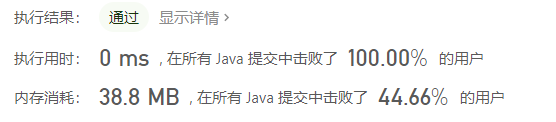

#### [142. 环形链表 II](https://leetcode-cn.com/problems/linked-list-cycle-ii/)

难度中等841

给定一个链表，返回链表开始入环的第一个节点。 如果链表无环，则返回 `null`。

为了表示给定链表中的环，我们使用整数 `pos` 来表示链表尾连接到链表中的位置（索引从 0 开始）。 如果 `pos` 是 `-1`，则在该链表中没有环。**注意，`pos` 仅仅是用于标识环的情况，并不会作为参数传递到函数中。**

**说明：**不允许修改给定的链表。

**进阶：**

- 你是否可以使用 `O(1)` 空间解决此题？

 

**示例 1：**


```
输入：head = [3,2,0,-4], pos = 1
输出：返回索引为 1 的链表节点
解释：链表中有一个环，其尾部连接到第二个节点。
```

**示例 2：**


```
输入：head = [1,2], pos = 0
输出：返回索引为 0 的链表节点
解释：链表中有一个环，其尾部连接到第一个节点。
```

**示例 3：**


```
输入：head = [1], pos = -1
输出：返回 null
解释：链表中没有环。
```

 

**提示：**

- 链表中节点的数目范围在范围 `[0, 104]` 内
- `-105 <= Node.val <= 105`
- `pos` 的值为 `-1` 或者链表中的一个有效索引


```
执行用时：
6 ms
, 在所有 Java 提交中击败了
6.50%
的用户
内存消耗：
39.7 MB
, 在所有 Java 提交中击败了
5.05%
的用户
```


```java
public class Solution {
    public ListNode detectCycle(ListNode head) {
        if(head == null || head.next == null) {
            return null;
        }
        Map<ListNode, Boolean>  map = new HashMap<>();
        while(head != null) {
            if(map.containsKey(head)) {
                map.put(head, true);
                return head;
            }
            map.put(head, false);
            head = head.next;
        }
        return null;
    }
}
```

```java
// 正经做法
public class Solution {
    public ListNode detectCycle(ListNode head) {
        ListNode fast = head, slow = head;
        while(fast != null) {
            slow = slow.next;
            if(fast.next != null) {
                fast = fast.next.next;
            } else {
                return null;
            }
            if(slow == fast) {
                ListNode ptr = head;
                while(ptr != slow) {
                    ptr = ptr.next;
                    slow = slow.next;
                }
                return slow;
            }
        }
        return null;
    }
}


```

#### [328. 奇偶链表](https://leetcode-cn.com/problems/odd-even-linked-list/)

难度中等379

给定一个单链表，把所有的奇数节点和偶数节点分别排在一起。请注意，这里的奇数节点和偶数节点指的是节点编号的奇偶性，而不是节点的值的奇偶性。

请尝试使用原地算法完成。你的算法的空间复杂度应为 O(1)，时间复杂度应为 O(nodes)，nodes 为节点总数。

**示例 1:**

```
输入: 1->2->3->4->5->NULL
输出: 1->3->5->2->4->NULL
```

**示例 2:**

```
输入: 2->1->3->5->6->4->7->NULL 
输出: 2->3->6->7->1->5->4->NULL
```

**说明:**

- 应当保持奇数节点和偶数节点的相对顺序。
- 链表的第一个节点视为奇数节点，第二个节点视为偶数节点，以此类推。

```java
class Solution {
    public ListNode oddEvenList(ListNode head) {
        if(head == null) {
            return null;
        }
        ListNode oddHead = head;
        ListNode evenHead = head.next;
        ListNode oddPtr = oddHead;
        ListNode evenPtr = evenHead;
        while(oddPtr.next != null && evenPtr.next != null) {
            oddPtr.next = evenPtr.next;
            oddPtr = oddPtr.next;
            evenPtr.next = oddPtr.next;
            evenPtr = evenPtr.next;
        }
        oddPtr.next = evenHead;
        return oddHead;
    }
}
```


#### [234. 回文链表](https://leetcode-cn.com/problems/palindrome-linked-list/)

难度简单864

请判断一个链表是否为回文链表。

**示例 1:**

```
输入: 1->2
输出: false
```

**示例 2:**

```
输入: 1->2->2->1
输出: true
```

```java
class Solution {
   public boolean isPalindrome(ListNode head) {
        // write code here
        if(head == null) {
            return true;
        }
        Stack<Integer> stack = new Stack<>();
        ListNode fast = head;
        ListNode slow = head;
        stack.push(head.val);
        while(fast.next != null && fast.next.next != null) {
            fast = fast.next.next;
            slow = slow.next;
            stack.push(slow.val);
        }

        slow = slow.next;
        if(fast.next == null) {
            stack.pop();
        }
        while(slow != null) {
            if(stack.peek() != slow.val) {
                return false;
            }
            stack.pop();
            slow = slow.next;
        }

        return true;
    }

}
```


## 1.2 树

### 1.2.1 二叉搜索树/中序遍历

#### [98. 验证二叉搜索树](https://leetcode-cn.com/problems/validate-binary-search-tree/)

难度中等909

给定一个二叉树，判断其是否是一个有效的二叉搜索树。

假设一个二叉搜索树具有如下特征：

- 节点的左子树只包含**小于**当前节点的数。
- 节点的右子树只包含**大于**当前节点的数。
- 所有左子树和右子树自身必须也是二叉搜索树。

**示例 1:**

```
输入:
    2
   / \
  1   3
输出: true
```

**示例 2:**

```
输入:
    5
   / \
  1   4
     / \
    3   6
输出: false
解释: 输入为: [5,1,4,null,null,3,6]。
     根节点的值为 5 ，但是其右子节点值为 4 。
```

通过次数217,148

提交次数650,038


```java
class Solution {
    private long pre = Long.MIN_VALUE;
    public boolean isValidBST(TreeNode root) {
        if(root == null) {
            return true;
        }
        if(!isValidBST(root.left)) {
            return false;
        }
        if(pre >= root.val) {
            return false;
        }
        pre = root.val;
        return isValidBST(root.right);
    }
}
```


#### [538. 把二叉搜索树转换为累加树](https://leetcode-cn.com/problems/convert-bst-to-greater-tree/)

难度中等466

给出二叉 **搜索** 树的根节点，该树的节点值各不相同，请你将其转换为累加树（Greater Sum Tree），使每个节点 `node` 的新值等于原树中大于或等于 `node.val` 的值之和。

提醒一下，二叉搜索树满足下列约束条件：

- 节点的左子树仅包含键 **小于** 节点键的节点。
- 节点的右子树仅包含键 **大于** 节点键的节点。
- 左右子树也必须是二叉搜索树。

**注意：**本题和 1038: https://leetcode-cn.com/problems/binary-search-tree-to-greater-sum-tree/ 相同

 

**示例 1：**

****

```
输入：[4,1,6,0,2,5,7,null,null,null,3,null,null,null,8]
输出：[30,36,21,36,35,26,15,null,null,null,33,null,null,null,8]
```

**示例 2：**

```
输入：root = [0,null,1]
输出：[1,null,1]
```

**示例 3：**

```
输入：root = [1,0,2]
输出：[3,3,2]
```

**示例 4：**

```
输入：root = [3,2,4,1]
输出：[7,9,4,10]
```

 

**提示：**

- 树中的节点数介于 `0` 和 `104` 之间。
- 每个节点的值介于 `-104` 和 `104` 之间。
- 树中的所有值 **互不相同** 。
- 给定的树为二叉搜索树。


```java
public class _538_BinarySearchTreeToSumTree {

    public static void main(String[] args) {
        _538_BinarySearchTreeToSumTree binarySearchTreeToSumTree = new _538_BinarySearchTreeToSumTree();
        TreeNode node = binarySearchTreeToSumTree.convertBST(Interview_37.Codec.deserialize("[4,1,6,0,2,5,7,null,null,null,3,null,null,null,8]"));

    }
    public TreeNode convertBST(TreeNode root) {
        travel(root, 0);
        return root;
    }
    public int travel(TreeNode node, int preNum) {
        if(node == null) {
            return 0;
        }
        int travelRightVal = travel(node.right, preNum);
        int realVal = node.val;
        node.val = realVal + travelRightVal + preNum;
        int travelLeftVal = travel(node.left, node.val);
        return realVal + travelRightVal + travelLeftVal;
    }
}
```


你需要的一些工具类

```java
/**
 * 面试题37. 序列化二叉树
 * 请实现两个函数，分别用来序列化和反序列化二叉树。
 *
 * 示例:
 *
 * 你可以将以下二叉树：
 *
 *     1
 *    / \
 *   2   3
 *      / \
 *     4   5
 *
 * 序列化为 "[1,2,3,null,null,4,5]"
 */
public class Interview_37 {

    /**
     * Definition for a binary data_structure.tree node.
     * public class TreeNode {
     *     int val;
     *     TreeNode left;
     *     TreeNode right;
     *     TreeNode(int x) { val = x; }
     * }
     */
    public static class Codec {


        public static void main(String[] args) {
            TreeNode deserialize = deserialize("[5,2,3,null,null,2,4,3,1]");
            System.out.println(deserialize);
            System.out.println(serialize(deserialize));
        }

        static Queue<TreeNode> queue = new LinkedList<>();
        // Encodes a data_structure.tree to a single string.
        public static String serialize(TreeNode root) {
            if(root == null) {
                return "[]";
            }
            List<String> result = new ArrayList<>();
            queue.add(root);
            TreeNode tempPoll;
            while(!queue.isEmpty()) {
                 tempPoll = queue.poll();
                if (tempPoll == null) {
                    result.add("null");
                } else {
                    result.add(String.valueOf(tempPoll.val));
                    queue.add(tempPoll.left);
                    queue.add(tempPoll.right);
                }
            }
            int index = 0;
            for (int i = result.size() - 1; i >= 0; i--) {
                if (!result.get(i).equals("null")) {
                    index = i;
                    break;
                }
            }
            return Arrays.toString(result.subList(0, index + 1).toArray());
        }

        // Decodes your encoded data to data_structure.tree.
        public static TreeNode deserialize(String data) {
            data = data.replace(" ", "");
            if (data.equals("[]")) {
                return null;
            }
            String[] split = data.substring(1, data.length() - 1).split(",");
            TreeNode root = new TreeNode(Integer.parseInt(split[0]));
            queue.add(root);
            int index = 1;
            while (!queue.isEmpty() && index < split.length) {
                TreeNode poll = queue.poll();
                String leftVal = "null";
                String rightVal = "null";
                leftVal = split[index++];
                if (index >= split.length) {
                    rightVal = "null";
                } else {
                    rightVal = split[index++];
                }

                TreeNode left = leftVal.equals("null") ? null : new TreeNode(Integer.parseInt(leftVal));
                TreeNode right = rightVal.equals("null") ? null : new TreeNode(Integer.parseInt(rightVal));
                if (poll != null) {
                    poll.left = left;
                    poll.right = right;
                }
                queue.add(left);
                queue.add(right);
            }
            queue.clear();
            return root;
        }
    }


}

```

```java
public class TreeNode {
    public int val;
    public TreeNode left;
    public TreeNode right;
    private TreeNode curr;
    public TreeNode(int val) {
        this.val = val;
    }

}

```


### 1.2.2 二叉树/先序遍历

#### [114. 二叉树展开为链表](https://leetcode-cn.com/problems/flatten-binary-tree-to-linked-list/)

难度中等707

给你二叉树的根结点 `root` ，请你将它展开为一个单链表：

- 展开后的单链表应该同样使用 `TreeNode` ，其中 `right` 子指针指向链表中下一个结点，而左子指针始终为 `null` 。
- 展开后的单链表应该与二叉树 [**先序遍历**](https://baike.baidu.com/item/先序遍历/6442839?fr=aladdin) 顺序相同。

 

**示例 1：**


```
输入：root = [1,2,5,3,4,null,6]
输出：[1,null,2,null,3,null,4,null,5,null,6]
```

**示例 2：**

```
输入：root = []
输出：[]
```

**示例 3：**

```
输入：root = [0]
输出：[0]
```

 

**提示：**

- 树中结点数在范围 `[0, 2000]` 内
- `-100 <= Node.val <= 100`

 

**进阶：**你可以使用原地算法（`O(1)` 额外空间）展开这棵树吗？


```java
//time: 100% 0ms
class Solution {
    private TreeNode preNode = null;
    public void flatten(TreeNode root) {
        if(root == null) {
            return;
        }
        TreeNode left = root.left;
        TreeNode right = root.right;
        if(preNode != null) {
            preNode.right = root;
        }
        preNode = root;
        root.left = null;
        if(left != null) {
            flatten(left);
        }
        if(right != null) {
            flatten(right);
        }
    }
}
```


### 1.2.3 路径

#### [543. 二叉树的直径](https://leetcode-cn.com/problems/diameter-of-binary-tree/)

难度简单621收藏分享切换为英文接收动态反馈

给定一棵二叉树，你需要计算它的直径长度。一棵二叉树的直径长度是任意两个结点路径长度中的最大值。这条路径可能穿过也可能不穿过根结点。

 

**示例 :**
给定二叉树

```
          1
         / \
        2   3
       / \     
      4   5    
```

返回 **3**, 它的长度是路径 [4,2,1,3] 或者 [5,2,1,3]。

 

**注意：**两结点之间的路径长度是以它们之间边的数目表示。


```java
class Solution {
    private int maxLength = 0;
    public int diameterOfBinaryTree(TreeNode root) {
        if(root == null) {
            return 0;
        }
        deepth(root);
        return maxLength - 1;
    }

    public int deepth(TreeNode root) {
        if(root == null) {
            return 0;
        }
        int leftDeepth = deepth(root.left);
        int rightDeepth = deepth(root.right);
        if(leftDeepth + rightDeepth + 1 > maxLength) {
            maxLength = leftDeepth + rightDeepth + 1;
        }
        return Math.max(leftDeepth, rightDeepth) + 1;
    }
}
```


#### [437. 路径总和 III](https://leetcode-cn.com/problems/path-sum-iii/)

难度中等734

给定一个二叉树，它的每个结点都存放着一个整数值。

找出路径和等于给定数值的路径总数。

路径不需要从根节点开始，也不需要在叶子节点结束，但是路径方向必须是向下的（只能从父节点到子节点）。

二叉树不超过1000个节点，且节点数值范围是 [-1000000,1000000] 的整数。

**示例：**

```
root = [10,5,-3,3,2,null,11,3,-2,null,1], sum = 8

      10
     /  \
    5   -3
   / \    \
  3   2   11
 / \   \
3  -2   1

返回 3。和等于 8 的路径有:

1.  5 -> 3
2.  5 -> 2 -> 1
3.  -3 -> 11
```

```java
class Solution {
    private int res = 0;
    private int globalSum;
    public int pathSum(TreeNode root, int sum) {
        if(root == null) {
            return 0;
        }
        globalSum = sum;
        helper(root, sum);
        pathSum(root.left, sum);
        pathSum(root.right, sum);
        return res;
    }
    public void helper(TreeNode node, int sum) {
        if(node == null) {
            return;
        }
        int tempSum = sum - node.val;
        if(tempSum == 0) {
            res++;
        }
        helper(node.left, tempSum);
        helper(node.right, tempSum);
        
    }
}
```

### 1.2.4 层次遍历

#### [101. 对称二叉树](https://leetcode-cn.com/problems/symmetric-tree/)

难度简单1248

给定一个二叉树，检查它是否是镜像对称的。

 

例如，二叉树 `[1,2,2,3,4,4,3]` 是对称的。

```
    1
   / \
  2   2
 / \ / \
3  4 4  3
```

 

但是下面这个 `[1,2,2,null,3,null,3]` 则不是镜像对称的:

```
    1
   / \
  2   2
   \   \
   3    3
```

 

**进阶：**

你可以运用递归和迭代两种方法解决这个问题吗？

通过次数269,508

提交次数502,319

```java
//迭代版
public boolean isSymmetric (TreeNode root) {
        if(root == null) {
            return true;
        }
        Queue<TreeNode> queue = new LinkedList<>();
        Stack<String> stack = new Stack<>();
        queue.add(root);
        while(!queue.isEmpty()) {
            int size = queue.size();
            for(int i = size - 1; i >= 0; i--) {
                TreeNode tempNode = queue.poll();
                if(size > 1 && i <= (size / 2) - 1) {
                    if(!String.valueOf(stack.pop()).equals(tempNode == null ? "null" : String.valueOf(tempNode.val))) {
                        return false;
                    }
                } else if(size > 1 && i > (size / 2) - 1) {

                    stack.push(tempNode == null ? "null" : String.valueOf(tempNode.val));
                }
                if (tempNode != null) {
                    queue.add(tempNode.left);
                    queue.add(tempNode.right);
                }
            }

        }
        return true;
    }
```


```java
//递归版
public class Solution {
    /**
     *
     * @param root TreeNode类
     * @return bool布尔型
     */
    public boolean isSymmetric (TreeNode root) {
        // write code here
        if(root == null) {
            return true;
        }
        return isSame(root.left, root.right);
    }
     
    public boolean isSame(TreeNode node1, TreeNode node2) {
        if((node1 == null && node2 != null) || (node1 != null && node2 == null)) {
            return false;
        }
        if (node1 == null && node2 == null) {
            return true;
        }
        return node1.val == node2.val && isSame(node1.left, node2.right) && isSame(node1.right, node2.left);
    }
}
```


#### [199. 二叉树的右视图](https://leetcode-cn.com/problems/binary-tree-right-side-view/)

难度中等410

给定一棵二叉树，想象自己站在它的右侧，按照从顶部到底部的顺序，返回从右侧所能看到的节点值。

**示例:**

```
输入: [1,2,3,null,5,null,4]
输出: [1, 3, 4]
解释:

   1            <---
 /   \
2     3         <---
 \     \
  5     4       <---
```


```java
class Solution {
    public List<Integer> rightSideView(TreeNode root) {
        
        Queue<TreeNode> queue = new LinkedList<>();
        List<Integer> resList = new ArrayList<>();
        if(root == null) {
            return resList;
        }
        queue.add(root);
        while(!queue.isEmpty()) {
            for(int i = queue.size() - 1; i >= 0; i--) {
                
                TreeNode node = queue.poll();
                if(i == 0) {
                    resList.add(node.val);
                }
                if(node.left != null) {
                    queue.add(node.left);
                }
                if(node.right != null) {
                    queue.add(node.right);
                }
            }
        }
        return resList;
    }
}
```


#### [32 - I. 从上到下打印二叉树](https://leetcode-cn.com/problems/cong-shang-dao-xia-da-yin-er-cha-shu-lcof/)

难度中等58收藏分享切换为英文接收动态反馈

从上到下打印出二叉树的每个节点，同一层的节点按照从左到右的顺序打印。

 

例如:
给定二叉树: `[3,9,20,null,null,15,7]`,

```
    3
   / \
  9  20
    /  \
   15   7
```

返回：

```
[3,9,20,15,7]
```

 

**提示：**

1. `节点总数 <= 1000`


```java
class Solution {
  
    public int[] levelOrder(TreeNode root) {
        if(root == null) {
            return new int[0];
        }
        List<Integer> resList = new ArrayList<>();
	 	Queue<TreeNode> que = new LinkedList<>();
        que.add(root);
        while(!que.isEmpty()) {
            TreeNode tempNode = que.remove();
            resList.add(tempNode.val);
            if(tempNode.left != null) {
                que.add(tempNode.left);
            }

            if(tempNode.right != null) {
                que.add(tempNode.right);
            }

        }
        int[] res = new int[resList.size()];
        for(int i = 0; i < resList.size(); i++) {
            res[i] = resList.get(i);
        }
        return res;
    }
}
```


#### [32 - II. 从上到下打印二叉树 II](https://leetcode-cn.com/problems/cong-shang-dao-xia-da-yin-er-cha-shu-ii-lcof/)

从上到下按层打印二叉树，同一层的节点按从左到右的顺序打印，每一层打印到一行。

 

例如:
给定二叉树: `[3,9,20,null,null,15,7]`,

```
    3
   / \
  9  20
    /  \
   15   7
```

返回其层次遍历结果：

```
[
  [3],
  [9,20],
  [15,7]
]
```

 

**提示：**

1. `节点总数 <= 1000`

```java
class Solution {
    public List<List<Integer>> levelOrder(TreeNode root) {
        if(root == null) {
            return new ArrayList<>();
        }
        List<List<Integer>> resList = new ArrayList<>();
        Queue<TreeNode> queue = new LinkedList<>();
        queue.add(root);
        while(!queue.isEmpty()) {
            List<Integer> tempList = new ArrayList<>();
            for(int i = queue.size(); i > 0; i--) {
                TreeNode tempNode = queue.remove();
                tempList.add(tempNode.val);
                if(tempNode.left != null) {
                    queue.add(tempNode.left);
                }
                if(tempNode.right != null) {
                    queue.add(tempNode.right);
                }
            }
            resList.add(tempList);
        }
        return resList;
    }
}
```

#### [32 - III. 从上到下打印二叉树 III](https://leetcode-cn.com/problems/cong-shang-dao-xia-da-yin-er-cha-shu-iii-lcof/)

难度中等67收藏分享切换为英文接收动态反馈

请实现一个函数按照之字形顺序打印二叉树，即第一行按照从左到右的顺序打印，第二层按照从右到左的顺序打印，第三行再按照从左到右的顺序打印，其他行以此类推。

 

例如:
给定二叉树: `[3,9,20,null,null,15,7]`,

```
    3
   / \
  9  20
    /  \
   15   7
```

返回其层次遍历结果：

```
[
  [3],
  [20,9],
  [15,7]
]
```

 

**提示：**

1. `节点总数 <= 1000`


```java
class Solution {
    
	public List<List<Integer>> levelOrder(TreeNode root) {

        List<List<Integer>> resList = new ArrayList<>();
        if(root == null) {
            return resList;
        }
        Queue<TreeNode> que = new LinkedList<>();
        que.add(root);
        while(!que.isEmpty()) {
           LinkedList<Integer> tempList = new LinkedList<>();
           for(int i = que.size(); i > 0; i--) {
               TreeNode tempNode = que.remove();
               if(resList.size() % 2 == 0) {
                   tempList.addLast(tempNode.val);
               } else {
                   tempList.addFirst(tempNode.val);
               }
               if(tempNode.left != null) {
                   que.add(tempNode.left);
               }
               if(tempNode.right != null) {
                   que.add(tempNode.right);
               }
           }
           resList.add(tempList);
        }
        return resList;
    }
}
```


## 1.3 字符串

### 1.3.1 括号问题

### [👉（未解决）32. 最长有效括号](https://leetcode-cn.com/problems/longest-valid-parentheses/)

难度困难1145收藏分享切换为英文接收动态反馈

给你一个只包含 `'('` 和 `')'` 的字符串，找出最长有效（格式正确且连续）括号子串的长度。

 

**示例 1：**

```
输入：s = "(()"
输出：2
解释：最长有效括号子串是 "()"
```

**示例 2：**

```
输入：s = ")()())"
输出：4
解释：最长有效括号子串是 "()()"
```

**示例 3：**

```
输入：s = ""
输出：0
```

 

**提示：**

- `0 <= s.length <= 3 * 104`
- `s[i]` 为 `'('` 或 `')'`

### [394. 字符串解码](https://leetcode-cn.com/problems/decode-string/)

难度中等654

给定一个经过编码的字符串，返回它解码后的字符串。

编码规则为: `k[encoded_string]`，表示其中方括号内部的 *encoded_string* 正好重复 *k* 次。注意 *k* 保证为正整数。

你可以认为输入字符串总是有效的；输入字符串中没有额外的空格，且输入的方括号总是符合格式要求的。

此外，你可以认为原始数据不包含数字，所有的数字只表示重复的次数 *k* ，例如不会出现像 `3a` 或 `2[4]` 的输入。

 

**示例 1：**

```
输入：s = "3[a]2[bc]"
输出："aaabcbc"
```

**示例 2：**

```
输入：s = "3[a2[c]]"
输出："accaccacc"
```

**示例 3：**

```
输入：s = "2[abc]3[cd]ef"
输出："abcabccdcdcdef"
```

**示例 4：**

```
输入：s = "abc3[cd]xyz"
输出："abccdcdcdxyz"
```


```java
class Solution {
    private Stack<Integer> stack = new Stack<>();
    private Map<Integer, Integer> map = new HashMap<>();
    public String decodeString(String s) {
        for(int i = 0; i < s.length(); i++) {
            char c = s.charAt(i);
            if(c == '[') {
                stack.push(i);
            } else if(c == ']') {
                map.put(stack.pop(), i);
            }
        }
        int pro = Character.isDigit(s.charAt(0)) ? s.charAt(0) - '0' : 1;
        return helper(0, s.length() - 1, 1, s);
    }
    private String helper(int start, int end, int pro, String s) {
        StringBuilder sb = new StringBuilder();
        for(int i = start; i <= end; i++) {
            char c = s.charAt(i);
            int temp = c - '0';
            if(Character.isDigit(c)) {
                i++;
                while(Character.isDigit(s.charAt(i))) {
                    c = s.charAt(i++);
                    temp = temp * 10 + (c - '0');
                }
                i--;
                sb.append(helper(i + 2, map.get(i + 1) - 1, temp, s));
                i = map.get(i + 1);
            } else if(c != '[' && c != ']') {
                sb.append(c);
            }
        }
        String temp = sb.toString();
        for(int i = 0; i < pro - 1; i++) {
            sb.append(temp);
        }
        return sb.toString();
    }
}
```

### [牛客——最长公共子串](https://www.nowcoder.com/practice/f33f5adc55f444baa0e0ca87ad8a6aac?tpId=194&tqId=36307&rp=1&ru=%2Fta%2Fjob-code-high-client&qru=%2Fta%2Fjob-code-high-client%2Fquestion-ranking&tab=answerKey)

题目描述

给定两个字符串str1和str2,输出两个字符串的最长公共子串

题目保证str1和str2的最长公共子串存在且唯一。

示例1

输入

```
"1AB2345CD","12345EF"
```

返回值

```
"2345"
```

```java
public String LCS (String str1, String str2) {
        String res = "";

        for(int i = 0; i < str1.length(); i++) {
            for(int j = 0; j < str2.length(); j++) {
                if (str1.charAt(i) == str2.charAt(j)) {
                    StringBuilder sb = new StringBuilder();
                    int indexI = i;
                    int indexJ = j;
                    while (indexI < str1.length() && indexJ < str2.length()
                            && str1.charAt(indexI) == str2.charAt(indexJ)) {
                        sb.append(str1.charAt(indexI));
                        indexI++;
                        indexJ++;
                    }
                    if (sb.length() > res.length()) {
                        res = sb.toString();
                    }
                }
            }
        }
        return res;
    }
}
```


```java
public class Solution {
    /**
     * longest common substring
     * @param str1 string字符串 the string
     * @param str2 string字符串 the string
     * @return string字符串
     */
    public String LCS (String str1, String str2) {
        String res = "";

        int left = 0, right = 0;
        while(right < str2.length()) {
            String subStr = str2.substring(left, right + 1);
            if(str1.contains(subStr)) {
                if(subStr.length() > res.length()) {
                    res = subStr;
                }
                right++;
            } else {
                left++;
            }
        }
        return res;
    }
}
```


## 1.4 数组

### 1.4.1 最大xxx子数组

#### [152. 乘积最大子数组(贪心算法)](https://leetcode-cn.com/problems/maximum-product-subarray/)

难度中等928

给你一个整数数组 `nums` ，请你找出数组中乘积最大的连续子数组（该子数组中至少包含一个数字），并返回该子数组所对应的乘积。

 

**示例 1:**

```
输入: [2,3,-2,4]
输出: 6
解释: 子数组 [2,3] 有最大乘积 6。
```

**示例 2:**

```
输入: [-2,0,-1]
输出: 0
解释: 结果不能为 2, 因为 [-2,-1] 不是子数组。
```

```java
public int maxProduct(int[] nums) {
        int[] maxes = new int[nums.length];
        int[] mins = new int[nums.length];
        int max = nums[0];
        maxes[0] = nums[0];
        mins[0] = nums[0];
        for(int i = 1; i < nums.length; i++) {
            int temp = nums[i];
            int maxPro = maxes[i - 1] * temp;
            int minPro = mins[i - 1] * temp;
            maxes[i] = Math.max(temp, Math.max(maxPro, minPro));
            if(maxes[i] > max) {
                max = maxes[i];
            }
            mins[i] = Math.min(temp, Math.min(maxPro, minPro));
        }
        return max;
    }
```


#### [300. 最长递增子序列](https://leetcode-cn.com/problems/longest-increasing-subsequence/)

难度中等1311

给你一个整数数组 `nums` ，找到其中最长严格递增子序列的长度。

子序列是由数组派生而来的序列，删除（或不删除）数组中的元素而不改变其余元素的顺序。例如，`[3,6,2,7]` 是数组 `[0,3,1,6,2,2,7]` 的子序列。

**示例 1：**

```
输入：nums = [10,9,2,5,3,7,101,18]
输出：4
解释：最长递增子序列是 [2,3,7,101]，因此长度为 4 。
```

**示例 2：**

```
输入：nums = [0,1,0,3,2,3]
输出：4
```

**示例 3：**

```
输入：nums = [7,7,7,7,7,7,7]
输出：1
```

 

**提示：**

- `1 <= nums.length <= 2500`
- `-104 <= nums[i] <= 104`

### 1.4.2 二维数组

#### [54. 螺旋矩阵](https://leetcode-cn.com/problems/spiral-matrix/)

难度中等603

给你一个 `m` 行 `n` 列的矩阵 `matrix` ，请按照 **顺时针螺旋顺序** ，返回矩阵中的所有元素。

 

**示例 1：**


```
输入：matrix = [[1,2,3],[4,5,6],[7,8,9]]
输出：[1,2,3,6,9,8,7,4,5]
```

**示例 2：**


```
输入：matrix = [[1,2,3,4],[5,6,7,8],[9,10,11,12]]
输出：[1,2,3,4,8,12,11,10,9,5,6,7]
```

 

**提示：**

- `m == matrix.length`
- `n == matrix[i].length`
- `1 <= m, n <= 10`
- `-100 <= matrix[i][j] <= 100`

```java
class Solution {
    public List<Integer> spiralOrder(int[][] matrix) {
        if(matrix.length == 0) {
            return new ArrayList<>();
        }
        boolean[][] flags = new boolean[matrix.length][matrix[0].length];
        ArrayList<Integer> resList = new ArrayList<>();
        int i = 0, j = 0;
        int count = matrix.length * matrix[0].length;
        int row = matrix.length;
        int col = matrix[0].length;
        while(resList.size() < count) {
            resList.add(matrix[i][j]);
            flags[i][j] = true;
            if(((i - 1 < 0) || flags[i - 1][j]) && ((j + 1 < col) && !flags[i][j + 1])) {
                j++;
            } else if((j + 1 >= col || flags[i][j + 1]) && (i + 1 < row && !flags[i + 1][j])) {
                i++;
            } else if((i + 1 >= row || flags[i + 1][j]) && (j - 1 >= 0 && !flags[i][j - 1])) {
                j--;
            } else {
                i--;
            }
        }
        return resList;
    }
}
```


#### [73. 矩阵置零](https://leetcode-cn.com/problems/set-matrix-zeroes/)

难度中等367收藏分享切换为英文接收动态反馈

给定一个 *m* x *n* 的矩阵，如果一个元素为 0，则将其所在行和列的所有元素都设为 0。请使用**[原地](http://baike.baidu.com/item/原地算法)**算法**。**

**示例 1:**

```
输入: 
[
  [1,1,1],
  [1,0,1],
  [1,1,1]
]
输出: 
[
  [1,0,1],
  [0,0,0],
  [1,0,1]
]
```

**示例 2:**

```
输入: 
[
  [0,1,2,0],
  [3,4,5,2],
  [1,3,1,5]
]
输出: 
[
  [0,0,0,0],
  [0,4,5,0],
  [0,3,1,0]
]
```

**进阶:**

- 一个直接的解决方案是使用  O(*m**n*) 的额外空间，但这并不是一个好的解决方案。
- 一个简单的改进方案是使用 O(*m* + *n*) 的额外空间，但这仍然不是最好的解决方案。
- 你能想出一个常数空间的解决方案吗？

```java
class Solution {
    public void setZeroes(int[][] matrix) {
        int row = matrix.length;
        int col = matrix[0].length;
        boolean[] isColFill = new boolean[col];
        boolean[] isRowFill = new boolean[row];

        boolean[][] flags = new boolean[row][col];
        for(int i = 0; i < row; i++) {
            for(int j = 0; j < col; j++) {
                if(matrix[i][j] == 0 && !flags[i][j]) {
                    if(!isColFill[j]) {
                        for(int k = 0; k < row; k++) {
                            if(k == i || matrix[k][j] == 0) {
                                continue;
                            }
                            matrix[k][j] = 0;
                            flags[k][j] = true;
                            isColFill[j] = true;
                        }
                    }
                    if(!isRowFill[i]) {
                        for(int k = 0; k < col; k++) {
                            if(k == j || matrix[i][k] == 0) {
                                continue;
                            }
                            matrix[i][k] = 0;
                            flags[i][k] = true;
                            isRowFill[i] = true;
                        }
                    }
                }
            }
        }
    }
}
```

### 1.4.3 一维数组

#### [56. 合并区间](https://leetcode-cn.com/problems/merge-intervals/)

难度中等825收藏分享切换为英文接收动态反馈

以数组 `intervals` 表示若干个区间的集合，其中单个区间为 `intervals[i] = [starti, endi]` 。请你合并所有重叠的区间，并返回一个不重叠的区间数组，该数组需恰好覆盖输入中的所有区间。

 

**示例 1：**

```
输入：intervals = [[1,3],[2,6],[8,10],[15,18]]
输出：[[1,6],[8,10],[15,18]]
解释：区间 [1,3] 和 [2,6] 重叠, 将它们合并为 [1,6].
```

**示例 2：**

```
输入：intervals = [[1,4],[4,5]]
输出：[[1,5]]
解释：区间 [1,4] 和 [4,5] 可被视为重叠区间。
```

 

**提示：**

- `1 <= intervals.length <= 104`
- `intervals[i].length == 2`
- `0 <= starti <= endi <= 104`

#### [57. 插入区间](https://leetcode-cn.com/problems/insert-interval/)

难度中等378收藏分享切换为英文接收动态反馈

给你一个 **无重叠的** *，*按照区间起始端点排序的区间列表。

在列表中插入一个新的区间，你需要确保列表中的区间仍然有序且不重叠（如果有必要的话，可以合并区间）。

 

**示例 1：**

```
输入：intervals = [[1,3],[6,9]], newInterval = [2,5]
输出：[[1,5],[6,9]]
```

**示例 2：**

```
输入：intervals = [[1,2],[3,5],[6,7],[8,10],[12,16]], newInterval = [4,8]
输出：[[1,2],[3,10],[12,16]]
解释：这是因为新的区间 [4,8] 与 [3,5],[6,7],[8,10] 重叠。
```

**示例 3：**

```
输入：intervals = [], newInterval = [5,7]
输出：[[5,7]]
```

**示例 4：**

```
输入：intervals = [[1,5]], newInterval = [2,3]
输出：[[1,5]]
```

**示例 5：**

```
输入：intervals = [[1,5]], newInterval = [2,7]
输出：[[1,7]]
```

 

**提示：**

- `0 <= intervals.length <= 104`
- `intervals[i].length == 2`
- `0 <= intervals[i][0] <= intervals[i][1] <= 105`
- `intervals` 根据 `intervals[i][0]` 按 **升序** 排列
- `newInterval.length == 2`
- `0 <= newInterval[0] <= newInterval[1] <= 105`

```java
public int[][] insert(int[][] intervals, int[] newInterval) {

        boolean isInsert = false;
        int left = newInterval[0];
        int right = newInterval[1];
        List<int[]> resList = new ArrayList<>();
        for(int[] item : intervals) {
            if(item[0] > right) {
                if(!isInsert) {
                    resList.add(new int[]{left, right});
                    isInsert = true;
                }
                resList.add(item);
            } else if(item[1] < left) {
                resList.add(item);
            } else {
                left = Math.min(left, item[0]);
                right = Math.max(right, item[1]);
            }
            
        }
        if(!isInsert) {
            resList.add(new int[]{left, right});
        }
        int[][] resArray = new int[resList.size()][2];
        int index = 0;
        for(int[] item : resList) {
            resArray[index][0] = item[0];
            resArray[index++][1] = item[1];
        }
        return resArray;
    }
```


#### [324. 摆动排序 II](https://leetcode-cn.com/problems/wiggle-sort-ii/)

难度中等234

给你一个整数数组 `nums`，将它重新排列成 `nums[0] < nums[1] > nums[2] < nums[3]...` 的顺序。

你可以假设所有输入数组都可以得到满足题目要求的结果。

 

**示例 1：**

```
输入：nums = [1,5,1,1,6,4]
输出：[1,6,1,5,1,4]
解释：[1,4,1,5,1,6] 同样是符合题目要求的结果，可以被判题程序接受。
```

**示例 2：**

```
输入：nums = [1,3,2,2,3,1]
输出：[2,3,1,3,1,2]
```

 

**提示：**

- `1 <= nums.length <= 5 * 104`
- `0 <= nums[i] <= 5000`
- 题目数据保证，对于给定的输入 `nums` ，总能产生满足题目要求的结果

 

**进阶：**你能用 O(n) 时间复杂度和 / 或原地 O(1) 额外空间来实现吗？


```java
class Solution {
    public void wiggleSort(int[] nums) {
        
        int[] copyNums = nums.clone();
        Arrays.sort(copyNums);
        int len = nums.length - 1;
        for(int i = 1; i < nums.length; i += 2) {
            nums[i] = copyNums[len--];
        }
        for(int i = 0; i < nums.length; i += 2) {
            nums[i] = copyNums[len--];
        }
    }
}
```


#### [❓300. 最长递增子序列](https://leetcode-cn.com/problems/longest-increasing-subsequence/)

难度中等1338

给你一个整数数组 `nums` ，找到其中最长严格递增子序列的长度。

子序列是由数组派生而来的序列，删除（或不删除）数组中的元素而不改变其余元素的顺序。例如，`[3,6,2,7]` 是数组 `[0,3,1,6,2,2,7]` 的子序列。

**示例 1：**

```
输入：nums = [10,9,2,5,3,7,101,18]
输出：4
解释：最长递增子序列是 [2,3,7,101]，因此长度为 4 。
```

**示例 2：**

```
输入：nums = [0,1,0,3,2,3]
输出：4
```

**示例 3：**

```
输入：nums = [7,7,7,7,7,7,7]
输出：1
```

 

**提示：**

- `1 <= nums.length <= 2500`
- `-104 <= nums[i] <= 104`

 

**进阶：**

- 你可以设计时间复杂度为 `O(n2)` 的解决方案吗？
- 你能将算法的时间复杂度降低到 `O(n log(n))` 吗?

```java
class Solution {
    public int lengthOfLIS(int[] nums) {
        int[] res = new int[nums.length];
        Arrays.fill(res, 1);
        int max = 1;
        for(int i = 1; i < nums.length; i++) {
            for(int j = 0; j < i; j++) {
                if(nums[i] > nums[j]) {
                    res[i] = Math.max(res[i], res[j] + 1);
                }
            }
            if(res[i] > max) {
                max = res[i];
            }
        }
        return max;
    }
}
```


```java
class Solution {
    public int lengthOfLIS(int[] arr) {
        int[] dp = new int[arr.length];
        Arrays.fill(dp, 1);
        int[] tails = new int[arr.length];
        tails[0] = arr[0];
        int len = 1;
        for(int i = 1; i < arr.length; i++) {
            if(arr[i] > tails[len - 1]) {
                tails[len++] = arr[i];
                dp[i] = len;
            } else if(arr[i] < tails[len - 1]){
                int index = findIndex(tails, len, arr[i]);
                tails[index] = arr[i];
                dp[i] = index + 1;
            }
        }
        int[] res = new int[len];
        for(int i = arr.length - 1; i >= 0; i--) {
            if(dp[i] == len) {
                res[--len] = arr[i];
            }
        }
        return res.length;
    }

    public int findIndex(int[] arr, int len, int target) {
        int left = 0;
        int right = len - 1;
        while(left <= right) {
            int mid = (left + right) >> 1;
            if(arr[mid] >= target) {
                if(mid == 0 || arr[mid - 1] < target) {
                    return mid;
                }
                right = mid - 1;
            } else {
                left = mid + 1;
            }
        }
        return -1;
    }

}
```

#### [189. 旋转数组](https://leetcode-cn.com/problems/rotate-array/)

难度中等881

给定一个数组，将数组中的元素向右移动 `k` 个位置，其中 `k` 是非负数。

 

**进阶：**

- 尽可能想出更多的解决方案，至少有三种不同的方法可以解决这个问题。
- 你可以使用空间复杂度为 O(1) 的 **原地** 算法解决这个问题吗？

 

**示例 1:**

```
输入: nums = [1,2,3,4,5,6,7], k = 3
输出: [5,6,7,1,2,3,4]
解释:
向右旋转 1 步: [7,1,2,3,4,5,6]
向右旋转 2 步: [6,7,1,2,3,4,5]
向右旋转 3 步: [5,6,7,1,2,3,4]
```

**示例 2:**

```
输入：nums = [-1,-100,3,99], k = 2
输出：[3,99,-1,-100]
解释: 
向右旋转 1 步: [99,-1,-100,3]
向右旋转 2 步: [3,99,-1,-100]
```

 

**提示：**

- `1 <= nums.length <= 2 * 104`
- `-231 <= nums[i] <= 231 - 1`
- `0 <= k <= 105`


```java
class Solution {
    public void rotate(int[] nums, int k) {
        k %= nums.length;
       swap(0, nums.length - 1, nums);
       swap(0, k - 1, nums);
       swap(k, nums.length - 1, nums);
    }

    public void swap(int start, int end, int[] arr) {
        while(start < end) {
            int temp = arr[start];
            arr[start] = arr[end];
            arr[end] = temp;
            start++;
            end--;
        }
    }
}
```

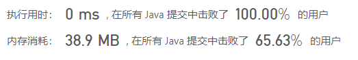


## 1.5 栈

### 1.5.1 最小栈

#### [739. 每日温度](https://leetcode-cn.com/problems/daily-temperatures/)


难度中等632

请根据每日 `气温` 列表，重新生成一个列表。对应位置的输出为：要想观测到更高的气温，至少需要等待的天数。如果气温在这之后都不会升高，请在该位置用 `0` 来代替。

例如，给定一个列表 `temperatures = [73, 74, 75, 71, 69, 72, 76, 73]`，你的输出应该是 `[1, 1, 4, 2, 1, 1, 0, 0]`。

**提示：**`气温` 列表长度的范围是 `[1, 30000]`。每个气温的值的均为华氏度，都是在 `[30, 100]` 范围内的整数。

##### 方法一，暴力法


```java
class Solution {
    public int[] dailyTemperatures(int[] T) {
        int[] res = new int[T.length];
        for(int i = 0; i < T.length; i++) {
            for(int j = i + 1; j < T.length; j++) {
                if(T[j] > T[i]) {
                    res[i] = j - i;
                    break;
                }
            }
        }
        return res;
    }
}
```

##### 方法二，递减栈

**【栈】****【最小栈】**

```java
// time:57.9%
class Solution {
    public int[] dailyTemperatures(int[] T) {
        Stack<int[]> stack = new Stack<>();
        int[] res = new int[T.length];
        stack.add(new int[]{T[0], 0});
        for(int i = 1; i < T.length; i++) {
            int temp = T[i];
            if(temp > (stack.peek())[0]) {
                while(!stack.isEmpty() && temp > (stack.peek())[0]) {
                    int[] top = stack.pop();
                    res[top[1]] = i - top[1];
                }
            }
            stack.add(new int[]{temp, i});
        }
        return res;
    }
}
```


## 1.6 图


### [787. K 站中转内最便宜的航班](https://leetcode-cn.com/problems/cheapest-flights-within-k-stops/)

难度中等233

有 `n` 个城市通过 `m` 个航班连接。每个航班都从城市 `u` 开始，以价格 `w` 抵达 `v`。

现在给定所有的城市和航班，以及出发城市 `src` 和目的地 `dst`，你的任务是找到从 `src` 到 `dst` 最多经过 `k` 站中转的最便宜的价格。 如果没有这样的路线，则输出 `-1`。

 

**示例 1：**

```
输入: 
n = 3, edges = [[0,1,100],[1,2,100],[0,2,500]]
src = 0, dst = 2, k = 1
输出: 200
解释: 
城市航班图如下


从城市 0 到城市 2 在 1 站中转以内的最便宜价格是 200，如图中红色所示。
```

**示例 2：**

```
输入: 
n = 3, edges = [[0,1,100],[1,2,100],[0,2,500]]
src = 0, dst = 2, k = 0
输出: 500
解释: 
城市航班图如下


从城市 0 到城市 2 在 0 站中转以内的最便宜价格是 500，如图中蓝色所示。
```

 

**提示：**

- `n` 范围是 `[1, 100]`，城市标签从 `0` 到 `n`` - 1`
- 航班数量范围是 `[0, n * (n - 1) / 2]`
- 每个航班的格式 `(src, ``dst``, price)`
- 每个航班的价格范围是 `[1, 10000]`
- `k` 范围是 `[0, n - 1]`
- 航班没有重复，且不存在自环

# 二、算法套路篇


## 2.1 动态规划

### 博弈问题

#### [1025. 除数博弈](https://leetcode-cn.com/problems/divisor-game/)

难度简单283

爱丽丝和鲍勃一起玩游戏，他们轮流行动。爱丽丝先手开局。

最初，黑板上有一个数字 `N` 。在每个玩家的回合，玩家需要执行以下操作：

- 选出任一 `x`，满足 `0 < x < N` 且 `N % x == 0` 。
- 用 `N - x` 替换黑板上的数字 `N` 。

如果玩家无法执行这些操作，就会输掉游戏。

只有在爱丽丝在游戏中取得胜利时才返回 `True`，否则返回 `False`。假设两个玩家都以最佳状态参与游戏。

 


**示例 1：**

```
输入：2
输出：true
解释：爱丽丝选择 1，鲍勃无法进行操作。
```

**示例 2：**

```
输入：3
输出：false
解释：爱丽丝选择 1，鲍勃也选择 1，然后爱丽丝无法进行操作。
```

 

**提示：**

1. `1 <= N <= 1000`


```java
class Solution {
    public boolean divisorGame(int N) {
        if(N == 1) {
            return false;
        }
        boolean[] dp = new boolean[N + 1];
        dp[1] = false;
        dp[2] = true;
        for(int i = 3; i <= N; i++) {
            for(int j = 1; j < i; j++) {
                if(i % j == 0 && !(dp[i - j])) {
                    dp[i] = true;
                    continue;
                }
            }
        }
        return dp[N];
    }
}
```


### [221. 最大正方形](https://leetcode-cn.com/problems/maximal-square/)

难度中等681收藏分享切换为英文接收动态反馈

在一个由 `'0'` 和 `'1'` 组成的二维矩阵内，找到只包含 `'1'` 的最大正方形，并返回其面积。

 

**示例 1：**


```
输入：matrix = [["1","0","1","0","0"],["1","0","1","1","1"],["1","1","1","1","1"],["1","0","0","1","0"]]
输出：4
```

**示例 2：**


```
输入：matrix = [["0","1"],["1","0"]]
输出：1
```

**示例 3：**

```
输入：matrix = [["0"]]
输出：0
```

 

**提示：**

- `m == matrix.length`
- `n == matrix[i].length`
- `1 <= m, n <= 300`
- `matrix[i][j]` 为 `'0'` 或 `'1'`

### [62. 不同路径](https://leetcode-cn.com/problems/unique-paths/)

难度中等872

一个机器人位于一个 `m x n` 网格的左上角 （起始点在下图中标记为 “Start” ）。

机器人每次只能向下或者向右移动一步。机器人试图达到网格的右下角（在下图中标记为 “Finish” ）。

问总共有多少条不同的路径？

 

**示例 1：**


```
输入：m = 3, n = 7
输出：28
```

**示例 2：**

```
输入：m = 3, n = 2
输出：3
解释：
从左上角开始，总共有 3 条路径可以到达右下角。
1. 向右 -> 向下 -> 向下
2. 向下 -> 向下 -> 向右
3. 向下 -> 向右 -> 向下
```

**示例 3：**

```
输入：m = 7, n = 3
输出：28
```

**示例 4：**

```
输入：m = 3, n = 3
输出：6
```

 

**提示：**

- `1 <= m, n <= 100`
- 题目数据保证答案小于等于 `2 * 109`


```java
class Solution {
    private int count = 0;
    private boolean[][] flags;
    private int[][] records;
    public int uniquePaths(int m, int n) {
        records = new int[m][n];
        for(int i = 0; i < m; i++) {
            records[i][0] = 1;
        }
        for(int i = 0; i < n; i++) {
            records[0][i] = 1;
        }
        for(int i = 1; i < m; i++) {
            for(int j = 1; j < n; j++) {
                records[i][j] = records[i - 1][j] + records[i][j - 1];
            }
        }
        return records[m - 1][n - 1];
    }
}
```


### [64. 最小路径和](https://leetcode-cn.com/problems/minimum-path-sum/)

难度中等776

给定一个包含非负整数的 `*m* x *n*` 网格 `grid` ，请找出一条从左上角到右下角的路径，使得路径上的数字总和为最小。

**说明：**每次只能向下或者向右移动一步。

 

**示例 1：**


```
输入：grid = [[1,3,1],[1,5,1],[4,2,1]]
输出：7
解释：因为路径 1→3→1→1→1 的总和最小。
```

**示例 2：**

```
输入：grid = [[1,2,3],[4,5,6]]
输出：12
```

 

**提示：**

- `m == grid.length`
- `n == grid[i].length`
- `1 <= m, n <= 200`
- `0 <= grid[i][j] <= 100`


```java
class Solution {
    public int minPathSum(int[][] grid) {
        int m = grid.length;
        int n = grid[0].length;
        for(int i = 1; i < m; i++) {
            grid[i][0] += grid[i - 1][0];
        }
        for(int i = 1; i < n; i++) {
            grid[0][i] += grid[0][i - 1];
        }
        for(int i = 1; i < m; i++) {
            for(int j = 1; j < n; j++) {
                grid[i][j] += Math.min(grid[i - 1][j], grid[i][j - 1]);
            }
        }
        return grid[m - 1][n - 1];
    }
}
```


### [139. 单词拆分](https://leetcode-cn.com/problems/word-break/)

难度中等823

给定一个**非空**字符串 *s* 和一个包含**非空**单词的列表 *wordDict*，判定 *s* 是否可以被空格拆分为一个或多个在字典中出现的单词。

**说明：**

- 拆分时可以重复使用字典中的单词。
- 你可以假设字典中没有重复的单词。

**示例 1：**

```
输入: s = "leetcode", wordDict = ["leet", "code"]
输出: true
解释: 返回 true 因为 "leetcode" 可以被拆分成 "leet code"。
```

**示例 2：**

```
输入: s = "applepenapple", wordDict = ["apple", "pen"]
输出: true
解释: 返回 true 因为 "applepenapple" 可以被拆分成 "apple pen apple"。
     注意你可以重复使用字典中的单词。
```

**示例 3：**

```
输入: s = "catsandog", wordDict = ["cats", "dog", "sand", "and", "cat"]
输出: false
```

```java
public class Solution {
    public boolean wordBreak(String s, List<String> wordDict) {
        Set<String> wordDictSet = new HashSet(wordDict);
        boolean[] dp = new boolean[s.length() + 1];
        dp[0] = true;
        for (int i = 1; i <= s.length(); i++) {
            for (int j = 0; j < i; j++) {
                if (dp[j] && wordDictSet.contains(s.substring(j, i))) {
                    dp[i] = true;
                    break;
                }
            }
        }
        return dp[s.length()];
    }
}

作者：LeetCode-Solution
链接：https://leetcode-cn.com/problems/word-break/solution/dan-ci-chai-fen-by-leetcode-solution/
来源：力扣（LeetCode）
著作权归作者所有。商业转载请联系作者获得授权，非商业转载请注明出处。
```


### [474. 一和零](https://leetcode-cn.com/problems/ones-and-zeroes/)

难度中等325

给你一个二进制字符串数组 `strs` 和两个整数 `m` 和 `n` 。

请你找出并返回 `strs` 的最大子集的大小，该子集中 **最多** 有 `m` 个 `0` 和 `n` 个 `1` 。

如果 `x` 的所有元素也是 `y` 的元素，集合 `x` 是集合 `y` 的 **子集** 。

 

**示例 1：**

```
输入：strs = ["10", "0001", "111001", "1", "0"], m = 5, n = 3
输出：4
解释：最多有 5 个 0 和 3 个 1 的最大子集是 {"10","0001","1","0"} ，因此答案是 4 。
其他满足题意但较小的子集包括 {"0001","1"} 和 {"10","1","0"} 。{"111001"} 不满足题意，因为它含 4 个 1 ，大于 n 的值 3 。
```

**示例 2：**

```
输入：strs = ["10", "0", "1"], m = 1, n = 1
输出：2
解释：最大的子集是 {"0", "1"} ，所以答案是 2 。
```

 

**提示：**

- `1 <= strs.length <= 600`
- `1 <= strs[i].length <= 100`
- `strs[i]` 仅由 `'0'` 和 `'1'` 组成
- `1 <= m, n <= 100`

```java
class Solution {
    public int findMaxForm(String[] strs, int m, int n) {
        int[][] record = new int[strs.length][2];
        for(int i = 0; i < strs.length; i++) {
            for(int j = 0; j < strs[i].length(); j++) {
                char t = strs[i].charAt(j);
                if(t - '0' == 0) {
                    record[i][0]++;
                } else {
                    record[i][1]++;
                }
            }
        }
        int[][] res = new int[m + 1][n + 1];
        for(int i = 0; i < strs.length; i++) {
            for(int j = m; j >= record[i][0]; j--) {
                for(int k = n; k >= record[i][1]; k--) {
                    res[j][k] = Math.max(res[j - record[i][0]][k - record[i][1]] + 1, res[j][k]);
                }
            }
        }
        return res[m][n];
    }
}
```


### [91. 解码方法(其实就是斐波那契数列的翻版)](https://leetcode-cn.com/problems/decode-ways/)

难度中等618收藏分享切换为英文接收动态反馈

一条包含字母 `A-Z` 的消息通过以下映射进行了 **编码** ：

```
'A' -> 1
'B' -> 2
...
'Z' -> 26
```

要 **解码** 已编码的消息，所有数字必须基于上述映射的方法，反向映射回字母（可能有多种方法）。例如，`"111"` 可以将 `"1"` 中的每个 `"1"` 映射为 `"A"` ，从而得到 `"AAA"` ，或者可以将 `"11"` 和 `"1"`（分别为 `"K"` 和 `"A"` ）映射为 `"KA"` 。注意，`"06"` 不能映射为 `"F"` ，因为 `"6"` 和 `"06"` 不同。

给你一个只含数字的 **非空** 字符串 `num` ，请计算并返回 **解码** 方法的 **总数** 。

题目数据保证答案肯定是一个 **32 位** 的整数。

 

**示例 1：**

```
输入：s = "12"
输出：2
解释：它可以解码为 "AB"（1 2）或者 "L"（12）。
```

**示例 2：**

```
输入：s = "226"
输出：3
解释：它可以解码为 "BZ" (2 26), "VF" (22 6), 或者 "BBF" (2 2 6) 。
```

**示例 3：**

```
输入：s = "0"
输出：0
解释：没有字符映射到以 0 开头的数字。含有 0 的有效映射是 'J' -> "10" 和 'T'-> "20" 。由于没有字符，因此没有有效的方法对此进行解码，因为所有数字都需要映射。
```

**示例 4：**

```
输入：s = "06"
输出：0
解释："06" 不能映射到 "F" ，因为字符串开头的 0 无法指向一个有效的字符。 
```

 

**提示：**

- `1 <= s.length <= 100`
- `s` 只包含数字，并且可能包含前导零。

```java
class Solution {
    public int numDecodings(String s) {
        if(s.charAt(0) == '0') {
            return 0;
        }
        if(s.length() == 1) {
            return s.charAt(0) == '0' ? 0 : 1;
        }
        int[] dpRes = new int[s.length()];
        
        dpRes[0] = 1;
        if((s.charAt(0) - '0') * 10 + s.charAt(1) - '0' <= 26) {
            if(s.charAt(1) == '0') {
                dpRes[1] = 1;
            } else {
                dpRes[1] = 2;
            }
        } else {
            if(s.charAt(1) == '0') {
                dpRes[1] = 0;
            } else {
                dpRes[1] = 1;
            }
        }
        if(s.length() == 2) {
            return dpRes[1];
        }
        char preChar = s.charAt(1);
        for(int i = 2; i < s.length(); i++) {
            int res = 0;
            if((preChar - '0') * 10 + (s.charAt(i) - '0') <= 26 && preChar != '0') {
                res += dpRes[i - 2];
            }
            if((s.charAt(i) - '0') != 0) {
                res += dpRes[i - 1];
            }
            dpRes[i] = res;
            preChar = s.charAt(i);
        }
        return dpRes[s.length() - 1];
    }
}
```


### 股票利润

##### [Most consistent ways of dealing with the series of stock problems](https://leetcode.com/problems/best-time-to-buy-and-sell-stock-with-transaction-fee/discuss/108870/Most-consistent-ways-of-dealing-with-the-series-of-stock-problems)

股票问题一共有六道题，链接如下：

121. 买卖股票的最佳时机
122. 买卖股票的最佳时机 II
123. 买卖股票的最佳时机 III
188. 买卖股票的最佳时机 IV
309. 最佳买卖股票时机含冷冻期
714. 买卖股票的最佳时机含手续费

作者：Storm
链接：https://leetcode-cn.com/circle/article/qiAgHn/
来源：力扣（LeetCode）
著作权归作者所有。商业转载请联系作者获得授权，非商业转载请注明出处。

## 2.2 回溯回溯📈📉


### 2.2.1 排列问题

#### [🗡剑指 Offer 38. 字符串的排列](https://leetcode-cn.com/problems/zi-fu-chuan-de-pai-lie-lcof/)

难度中等174收藏分享切换为英文接收动态反馈

输入一个字符串，打印出该字符串中字符的所有排列。

 

你可以以任意顺序返回这个字符串数组，但里面不能有重复元素。

 

**示例:**

```
输入：s = "abc"
输出：["abc","acb","bac","bca","cab","cba"]
```

 

**限制：**

```
1 <= s 的长度 <= 8
```

```java
class Solution {

    char[] array;
    List<String> resList = new ArrayList<>();
    public String[] permutation(String s) {
        array = s.toCharArray();
        helper(0);
        return resList.toArray(new String[resList.size()]);
    }

    public void helper(int index) {
        if(index == array.length - 1) {
            resList.add(String.valueOf(array));
            return;
        }
        HashSet<Character> set = new HashSet<>();//👈每次都在helper里面初始化一个HashSet
        for(int i = index; i < array.length; i++) {
            if(set.contains(array[i])) {
                continue;
            }
            set.add(array[i]);
            swap(index, i);
            helper(index + 1);
            swap(index, i);
        }
    }

    public void swap(int a, int b) {
        char temp = array[a];
        array[a] = array[b];
        array[b] = temp;
    }
    
}
```


```java
//time:33.8%
class Solution {
    
    private List<String> resList = new ArrayList<>();
    private boolean[] flags;
    private StringBuilder sb = new StringBuilder();
    public String[] permutation(String s) {
        flags = new boolean[s.length()];
        backTrack(0, s);
        return resList.toArray(new String[s.length()]);
    }

    private void backTrack(int level, String s) {
        if(level == s.length()) {
            resList.add(sb.toString());
        }
        Set<Character> set = new HashSet<>();
        for(int i = 0; i < s.length(); i++) {
            char t = s.charAt(i);
            if(flags[i] || set.contains(t)) {
                continue;
            }
            set.add(t);
            sb.append(t);
            flags[i] = true;
            backTrack(level + 1, s);
            sb.deleteCharAt(sb.length() - 1);
            flags[i] = false;
        }
    }
    
}
```


#### [🥧46. 全排列](https://leetcode-cn.com/problems/permutations/)

难度中等1105收藏分享切换为英文接收动态反馈

给定一个 **没有重复** 数字的序列，返回其所有可能的全排列。

**示例:**

```
输入: [1,2,3]
输出:
[
  [1,2,3],
  [1,3,2],
  [2,1,3],
  [2,3,1],
  [3,1,2],
  [3,2,1]
]
```

```java
// time:5.98%
class Solution {
    private List<List<Integer>> res = new ArrayList<>();
    public List<List<Integer>> permute(int[] nums) {
        helper(0, nums);
        return res;
    }
    public void helper(int index, int[] nums) {
        if(index == nums.length) {
            res.add(Arrays.stream(nums).boxed().collect(Collectors.toList()));
            return;
        }
        for(int i = index; i < nums.length; i++) {
            swap(index, i, nums);
            helper(index + 1, nums);
            swap(index, i, nums);
        }
    }
    public void swap(int index, int target, int[] arr) {
        if(index == target) {
            return;
        }
        int temp = arr[index];
        arr[index] = arr[target];
        arr[target] = temp;
    }
}
```


```java
//执行用时：
 private List<List<Integer>> res = new ArrayList<>();
    private List<Integer> tempList = new ArrayList<>();
    private boolean[] flags = new boolean[];
    public List<List<Integer>> permute(int[] nums) {
        helper(1, nums);
        return res;
    }

    /**
     * 1 ms
     * , 在所有 Java 提交中击败了
     * 96.96%
     * 的用户
     * 内存消耗：
     * 38.5 MB
     * , 在所有 Java 提交中击败了
     * 83.68%
     * 的用户
     * @param level
     * @param nums
     */
    public void helper(int level, int[] nums) {
       if (level == nums.length + 1) {
           res.add(new ArrayList<>(tempList));
       }
       for (int i = 0; i < nums.length; i++) {
           if (!flags[i]) {
               tempList.add(nums[i]);
               flags[i] = true;
               helper(level + 1, nums);
               tempList.remove(tempList.size() - 1);
               flags[i] = false;
           }
       }
    }
```


##### 变形：

题目描述

输入一个字符串,按字典序打印出该字符串中字符的所有排列。例如输入字符串abc,则按字典序打印出由字符a,b,c所能排列出来的所有字符串abc,acb,bac,bca,cab和cba。

输入描述:

```
输入一个字符串,长度不超过9(可能有字符重复),字符只包括大小写字母。
```

```java
import java.util.*;
public class Solution {
    private boolean[] flags;
    private StringBuilder sb;
    public ArrayList<String> Permutation(String str) {
        char[] chars = str.toCharArray();
        Arrays.sort(chars);
        String newStr = new String(chars);
        ArrayList<String> resList = new ArrayList<>();
        flags = new boolean[newStr.length()];
        sb = new StringBuilder();
        helper(newStr, resList);
        return resList;
    }
    
    public void helper(String str, ArrayList<String> resList) {
        if(sb.length() == str.length()) {
            resList.add(sb.toString());
            return;
        }
        Set<Character> set = new HashSet<>();
        for(int i = 0; i < str.length(); i++) {
           
            if(!flags[i]) {
                if(set.contains(str.charAt(i))) {
                    continue;
                }
                set.add(str.charAt(i));
                sb.append(str.charAt(i));
                flags[i] = true;
                helper(str, resList);
                sb.deleteCharAt(sb.length() - 1);
                flags[i] = false;
            }
        }
    }
    
    
}
```


### 2.2.2 子集问题

#### [78. 子集](https://leetcode-cn.com/problems/subsets/)

难度中等974

给你一个整数数组 `nums` ，数组中的元素 **互不相同** 。返回该数组所有可能的子集（幂集）。

解集 **不能** 包含重复的子集。你可以按 **任意顺序** 返回解集。

 

**示例 1：**

```
输入：nums = [1,2,3]
输出：[[],[1],[2],[1,2],[3],[1,3],[2,3],[1,2,3]]
```

**示例 2：**

```
输入：nums = [0]
输出：[[],[0]]
```

 

**提示：**

- `1 <= nums.length <= 10`
- `-10 <= nums[i] <= 10`
- `nums` 中的所有元素 **互不相同**

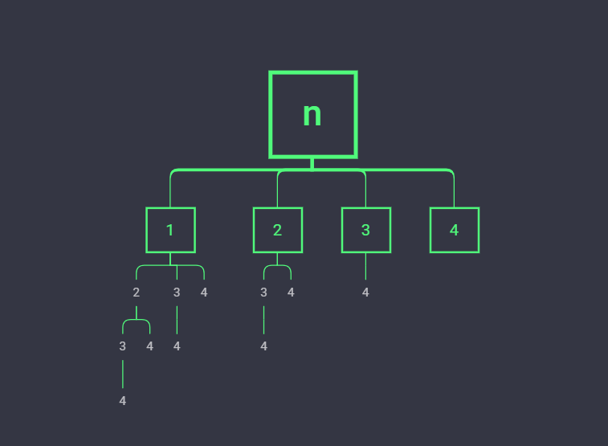


[ccnuacmhduL2](https://leetcode-cn.com/u/ccnuacmhdu/)

（编辑过）2020-09-20

回溯板子

```java
class Solution {
    public List<List<Integer>> subsets(int[] nums) {
        List<List<Integer>> res = new ArrayList<>();
        f(nums, 0, new ArrayList<>(), res);
        return res;
    }
    private void f(int[] nums, int idx, List<Integer> list, List<List<Integer>> res) {
        if(idx <= nums.length) {
            res.add(new ArrayList<>(list));
        }
        for(int i = idx; i < nums.length; i++) {
            list.add(nums[i]);
            f(nums, i + 1, list, res);
            list.remove(list.size()-1);
        }
    }
}
```


```java
public class _78_SubCollections {
    private List<List<Integer>> resList = new ArrayList<>();
    private List<Integer> tempList = new ArrayList<>();
    public List<List<Integer>> subsets(int[] nums) {
        for(int i = 0; i <= nums.length; i++) {
            helper(0, i, nums);
        }
        return resList;
    }
    public void helper(int ptr, int size, int[] arr) {
        if(ptr == size) {
            resList.add(new ArrayList<>(tempList));
            return;
        }
        for(int i = ptr; i < arr.length; i++) {
            tempList.add(arr[i]);
            helper(i + 1, size, arr);
            tempList.remove(tempList.size() - 1);
        }
    }
}
```


```java
class Solution {
    private List<List<Integer>> res = new ArrayList<>();
    private List<Integer> tempList = new ArrayList<>();

    public List<List<Integer>> permute(int[] nums) {
        helper(0, nums);
        return res;
    }

    public void helper(int index, int[] nums) {
        if(index == nums.length) {
            res.add(new ArrayList(tempList));
            return;
        }
        for(int i = index; i < nums.length; i++) {
            tempList.add(nums[i]);
            helper(index + 1, nums);
            tempList.remove(tempList.size() - 1);
        }
    }
}
```

#### [1641. 统计字典序元音字符串的数目](https://leetcode-cn.com/problems/count-sorted-vowel-strings/)

难度中等37

给你一个整数 `n`，请返回长度为 `n` 、仅由元音 (`a`, `e`, `i`, `o`, `u`) 组成且按 **字典序排列** 的字符串数量。

字符串 `s` 按 **字典序排列** 需要满足：对于所有有效的 `i`，`s[i]` 在字母表中的位置总是与 `s[i+1]` 相同或在 `s[i+1]` 之前。

 

**示例 1：**

```
输入：n = 1
输出：5
解释：仅由元音组成的 5 个字典序字符串为 ["a","e","i","o","u"]
```

**示例 2：**

```
输入：n = 2
输出：15
解释：仅由元音组成的 15 个字典序字符串为
["aa","ae","ai","ao","au","ee","ei","eo","eu","ii","io","iu","oo","ou","uu"]
注意，"ea" 不是符合题意的字符串，因为 'e' 在字母表中的位置比 'a' 靠后
```

**示例 3：**

```
输入：n = 33
输出：66045
```

 

**提示：**

- `1 <= n <= 50` 

```java
class Solution {
    private int res = 0;
    public int countVowelStrings(int n) {
        helper(0, n, 1);
        return res;
    }

    public void helper(int ptr, int n, int level) {
        if(level > n) {
            res++;
            return;
        }
        for(int i = ptr; i < 5; i++) {
            helper(i, n, level + 1);
        }
    }
}
```


```java
private static StringBuilder tempSubBuilder = new StringBuilder();
    private static List<String> resSubsList = new ArrayList<>();
    public static List<String> subset(int n) {
        char[] table = new char[]{'a', 'e', 'i', 'o', 'u'};
        helper(0, n, table);
        return resSubsList;
    }

    public static void helper(int ptr, int n, char[] arr) {
        if(tempSubBuilder.length() == n) {
            resSubsList.add(tempSubBuilder.toString());
            return;
        }
        for (int i = ptr; i < arr.length; i++) {
            tempSubBuilder.append(arr[i]);
            helper(i, n, arr);
            tempSubBuilder.deleteCharAt(tempSubBuilder.length() - 1);
        }
    }
```


### 2.2.1/2X 总结


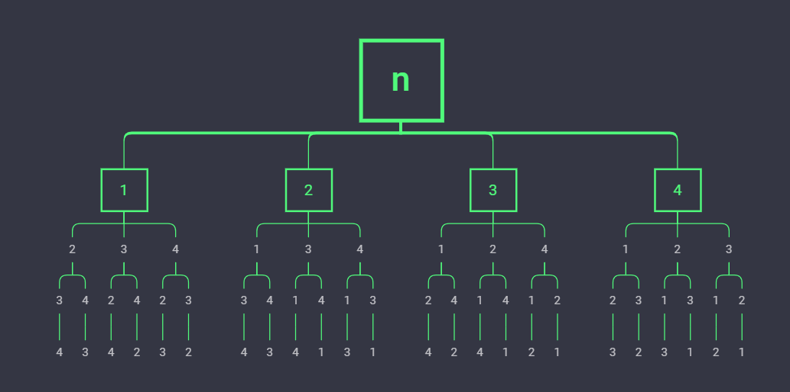


### 2.2.3 图（二维数组）

#### [79. 单词搜索](https://leetcode-cn.com/problems/word-search/)

难度中等765

给定一个二维网格和一个单词，找出该单词是否存在于网格中。

单词必须按照字母顺序，通过相邻的单元格内的字母构成，其中“相邻”单元格是那些水平相邻或垂直相邻的单元格。同一个单元格内的字母不允许被重复使用。

 

**示例:**

```
board =
[
  ['A','B','C','E'],
  ['S','F','C','S'],
  ['A','D','E','E']
]

给定 word = "ABCCED", 返回 true
给定 word = "SEE", 返回 true
给定 word = "ABCB", 返回 false
```

 

**提示：**

- `board` 和 `word` 中只包含大写和小写英文字母。
- `1 <= board.length <= 200`
- `1 <= board[i].length <= 200`
- `1 <= word.length <= 10^3`

```java
public class _79_SearchWord {
    private boolean[][] flags;

    public static void main(String[] args) {
        _79_SearchWord searchWord = new _79_SearchWord();
        System.out.println(searchWord.exist(new char[][]{{'C', 'A', 'A'}, {'A', 'A', 'A'}, {'B', 'C', 'D'}}, "AAB"));
    }


    /**
     * 执行用时：
     * 7 ms
     * , 在所有 Java 提交中击败了
     * 69.75%
     * 的用户
     * 内存消耗：
     * 40.7 MB
     * , 在所有 Java 提交中击败了
     * 17.54%
     * 的用户
     * @param board
     * @param word
     * @return
     */
    public boolean exist(char[][] board, String word) {
        List<int[]> store = new ArrayList<>();
        flags = new boolean[board.length][board[0].length];
        for(int i = 0; i < board.length; i++) {
            for(int j = 0; j < board[0].length; j++) {
                if(board[i][j] == word.charAt(0)) {
                    store.add(new int[]{i, j});
                }
            }
        }
        for(int[] node : store) {
            if(search(node[0], node[1], board, 0,  word)) {
                return true;
            }
        }
        return false;
    }

    private boolean search(int row, int col, char[][] board, int index, String word) {
        if(index == word.length()) {
            return true;
        }

        if(row < 0
                || row >= board.length
                || col < 0
                || col >= board[0].length
                || flags[row][col]
                || board[row][col] != word.charAt(index) ) {
            return false;
        }
        flags[row][col] = true;

        boolean res = search(row + 1, col, board, index + 1, word) || search(row - 1, col, board, index + 1, word)
                || search(row, col + 1,board, index + 1, word) || search(row, col - 1, board, index + 1, word);

        flags[row][col] = false;

        return res;

    }
}

```

### 2.2.4 记忆化回溯

#### [139. 单词拆分](https://leetcode-cn.com/problems/word-break/)

难度中等823

给定一个**非空**字符串 *s* 和一个包含**非空**单词的列表 *wordDict*，判定 *s* 是否可以被空格拆分为一个或多个在字典中出现的单词。

**说明：**

- 拆分时可以重复使用字典中的单词。
- 你可以假设字典中没有重复的单词。

**示例 1：**

```
输入: s = "leetcode", wordDict = ["leet", "code"]
输出: true
解释: 返回 true 因为 "leetcode" 可以被拆分成 "leet code"。
```

**示例 2：**

```
输入: s = "applepenapple", wordDict = ["apple", "pen"]
输出: true
解释: 返回 true 因为 "applepenapple" 可以被拆分成 "apple pen apple"。
     注意你可以重复使用字典中的单词。
```

**示例 3：**

```
输入: s = "catsandog", wordDict = ["cats", "dog", "sand", "and", "cat"]
输出: false
```

```java
class Solution {
    private Set<String> set;
    private boolean[] flags;
    public boolean wordBreak(String s, List<String> wordDict) {
        set = new HashSet<>(wordDict);
        flags = new boolean[s.length()];
        return helper(0, s);
    }
    public boolean helper(int start, String s) {
        if(s.length() == 0) {
            return true;
        }
        if(flags[start]) {
            return false;
        }
        for(int i = 0; i < s.length(); i++) {
            if(set.contains(s.substring(0, i + 1))) {
                if(helper(start + i + 1, s.substring(i + 1))) {
                    return true;
                }
            }
        }
        flags[start] = true;
        return false;
    }
}
```


```java
//哈希优化版本
import java.util.HashSet;
import java.util.List;
import java.util.Set;

class Solution {
    boolean[] mem;
    int[] h, p;
    int P = 31;
    Set<Integer> set = new HashSet<>();
    public int getSubHash(int l, int r){
        return h[r] - h[l - 1] * p[r - l + 1];
    }
    public void stringHash(String s, List<String> wordDict){
        char[] str = s.toCharArray();
        h = new int[str.length + 1];
        p = new int[str.length + 1];
        p[0] = 1;
        for(int i = 1; i <= str.length; i++){
            h[i] = h[i - 1] * P + str[i - 1];
            p[i] = p[i - 1] * P;
        }
        for(String ss : wordDict){
            set.add(ss.hashCode());
        }
    }
    public boolean backtrack(String s, int start) {
        if (start == s.length()) return true;
        if (mem[start]) return false;
        for (int i = start; i < s.length(); i++) {
            if (set.contains(getSubHash(start + 1, i + 1))){
                if (backtrack(s, i + 1)) return true;
            }
        }
        mem[start] = true;
        return false;
    }
    public boolean wordBreak(String s, List<String> wordDict) {
        this.mem = new boolean[s.length()];
        stringHash(s, wordDict);
        return backtrack(s, 0);
    }
}

作者：outvoker-c
链接：https://leetcode-cn.com/problems/word-break/solution/javahui-su-dao-ji-yi-hua-hui-su-zai-dao-dong-tai-g/
来源：力扣（LeetCode）
著作权归作者所有。商业转载请联系作者获得授权，非商业转载请注明出处。
```


## 2.3 贪心😍

### [55. 跳跃游戏](https://leetcode-cn.com/problems/jump-game/)

难度中等1030

给定一个非负整数数组 `nums` ，你最初位于数组的 **第一个下标** 。

数组中的每个元素代表你在该位置可以跳跃的最大长度。

判断你是否能够到达最后一个下标。

 

**示例 1：**

```
输入：nums = [2,3,1,1,4]
输出：true
解释：可以先跳 1 步，从下标 0 到达下标 1, 然后再从下标 1 跳 3 步到达最后一个下标。
```

**示例 2：**

```
输入：nums = [3,2,1,0,4]
输出：false
解释：无论怎样，总会到达下标为 3 的位置。但该下标的最大跳跃长度是 0 ， 所以永远不可能到达最后一个下标。
```

 

**提示：**

- `1 <= nums.length <= 3 * 104`
- `0 <= nums[i] <= 105`

```java
// time:81.3%
class Solution {
    public boolean canJump(int[] nums) {
        if(nums.length == 1) {
            return true;
        }
        int maxPos = nums[0];
        int index = 0;
        for(int i = 0; i < nums.length; i++) {
            if(i == maxPos && nums[i] == 0) {
                return false;
            }
            maxPos = Math.max(maxPos, i + nums[i]);
            if(maxPos >= nums.length - 1) {
                return true;
            }
        }
        return false;
    }
}
```

### [152. 乘积最大子数组](https://leetcode-cn.com/problems/maximum-product-subarray/)

难度中等928

给你一个整数数组 `nums` ，请你找出数组中乘积最大的连续子数组（该子数组中至少包含一个数字），并返回该子数组所对应的乘积。

 

**示例 1:**

```
输入: [2,3,-2,4]
输出: 6
解释: 子数组 [2,3] 有最大乘积 6。
```

**示例 2:**

```
输入: [-2,0,-1]
输出: 0
解释: 结果不能为 2, 因为 [-2,-1] 不是子数组。
```

```java
//关键点在于构建最大最小数组
//最大数组：maxes[i] => 前i个元素内的最大乘积
//最小数组：mins[i] => 前i个元素内的最小乘积
public int maxProduct(int[] nums) {
        int[] maxes = new int[nums.length];
        int[] mins = new int[nums.length];
        int max = nums[0];
        maxes[0] = nums[0];
        mins[0] = nums[0];
        for(int i = 1; i < nums.length; i++) {
            int temp = nums[i];
            int maxPro = maxes[i - 1] * temp;
            int minPro = mins[i - 1] * temp;
            maxes[i] = Math.max(temp, Math.max(maxPro, minPro));
            if(maxes[i] > max) {
                max = maxes[i];
            }
            mins[i] = Math.min(temp, Math.min(maxPro, minPro));
        }
        return max;
    }
```


### [198. 打家劫舍](https://leetcode-cn.com/problems/house-robber/)

难度中等1266

你是一个专业的小偷，计划偷窃沿街的房屋。每间房内都藏有一定的现金，影响你偷窃的唯一制约因素就是相邻的房屋装有相互连通的防盗系统，**如果两间相邻的房屋在同一晚上被小偷闯入，系统会自动报警**。

给定一个代表每个房屋存放金额的非负整数数组，计算你 **不触动警报装置的情况下** ，一夜之内能够偷窃到的最高金额。

 

**示例 1：**

```
输入：[1,2,3,1]
输出：4
解释：偷窃 1 号房屋 (金额 = 1) ，然后偷窃 3 号房屋 (金额 = 3)。
     偷窃到的最高金额 = 1 + 3 = 4 。
```

**示例 2：**

```
输入：[2,7,9,3,1]
输出：12
解释：偷窃 1 号房屋 (金额 = 2), 偷窃 3 号房屋 (金额 = 9)，接着偷窃 5 号房屋 (金额 = 1)。
     偷窃到的最高金额 = 2 + 9 + 1 = 12 。
```

 

**提示：**

- `0 <= nums.length <= 100`
- `0 <= nums[i] <= 400`

```java
// 问题的关键在于构建最大数组
// 注意这里的第0家就是日常生活中的第1家
// maxRes[i] = 抢劫第i家或者不抢劫第i家得到的最大利润
// 即：maxRes[i] = max((抢劫前(i - 2)家获得的最大利润 + 抢劫第i家获得的利润), 选择抢劫第i-1家的时候获得的最大利润)
class Solution {
    public int rob(int[] nums) {
        if(nums.length == 0) {
            return 0;
        }
        if(nums.length == 1) {
            return nums[0];
        }
        int[] maxRes = new int[nums.length];
        int max = Math.max(nums[0], nums[1]);
        maxRes[0] = nums[0];
        maxRes[1] = max;
        for(int i = 2; i < nums.length; i++) {
            maxRes[i] = Math.max(nums[i] + maxRes[i - 2], maxRes[i - 1]);
        }
        return maxRes[nums.length - 1];
    }
}
```


#### [337. 打家劫舍 III](https://leetcode-cn.com/problems/house-robber-iii/)

难度中等718

在上次打劫完一条街道之后和一圈房屋后，小偷又发现了一个新的可行窃的地区。这个地区只有一个入口，我们称之为“根”。 除了“根”之外，每栋房子有且只有一个“父“房子与之相连。一番侦察之后，聪明的小偷意识到“这个地方的所有房屋的排列类似于一棵二叉树”。 如果两个直接相连的房子在同一天晚上被打劫，房屋将自动报警。

计算在不触动警报的情况下，小偷一晚能够盗取的最高金额。

**示例 1:**

```
输入: [3,2,3,null,3,null,1]

     3
    / \
   2   3
    \   \ 
     3   1

输出: 7 
解释: 小偷一晚能够盗取的最高金额 = 3 + 3 + 1 = 7.
```

**示例 2:**

```
输入: [3,4,5,1,3,null,1]

     3
    / \
   4   5
  / \   \ 
 1   3   1

输出: 9
解释: 小偷一晚能够盗取的最高金额 = 4 + 5 = 9.
```

```java
class Solution {
    private Map<TreeNode, Integer> noTravelMap = new HashMap<>();
    private Map<TreeNode, Integer> travelMap = new HashMap<>();
    public int rob(TreeNode root) {
        travel(root);
        return Math.max(noTravelMap.getOrDefault(root, 0), travelMap.getOrDefault(root, 0));
    }

    public void travel(TreeNode node) {
        if(node == null) {
            return;
        }
        travel(node.left);
        travel(node.right);
        travelMap.put(node, node.val + noTravelMap.getOrDefault(node.left, 0) + noTravelMap.getOrDefault(node.right, 0));
        noTravelMap.put(node, Math.max(travelMap.getOrDefault(node.left, 0), noTravelMap.getOrDefault(node.left, 0)) +
        Math.max(travelMap.getOrDefault(node.right, 0), noTravelMap.getOrDefault(node.right, 0)));
    }
}
```


## 2.3 DFA问题


### [🔢8. 字符串转换整数 (atoi)](https://leetcode-cn.com/problems/string-to-integer-atoi/)

难度中等973收藏分享切换为英文接收动态反馈

请你来实现一个 `myAtoi(string s)` 函数，使其能将字符串转换成一个 32 位有符号整数（类似 C/C++ 中的 `atoi` 函数）。

函数 `myAtoi(string s)` 的算法如下：

- 读入字符串并丢弃无用的前导空格
- 检查第一个字符（假设还未到字符末尾）为正还是负号，读取该字符（如果有）。 确定最终结果是负数还是正数。 如果两者都不存在，则假定结果为正。
- 读入下一个字符，直到到达下一个非数字字符或到达输入的结尾。字符串的其余部分将被忽略。
- 将前面步骤读入的这些数字转换为整数（即，"123" -> 123， "0032" -> 32）。如果没有读入数字，则整数为 `0` 。必要时更改符号（从步骤 2 开始）。
- 如果整数数超过 32 位有符号整数范围 `[−231, 231 − 1]` ，需要截断这个整数，使其保持在这个范围内。具体来说，小于 `−231` 的整数应该被固定为 `−231` ，大于 `231 − 1` 的整数应该被固定为 `231 − 1` 。
- 返回整数作为最终结果。

**注意：**

- 本题中的空白字符只包括空格字符 `' '` 。
- 除前导空格或数字后的其余字符串外，**请勿忽略** 任何其他字符。

 

**示例 1：**

```
输入：s = "42"
输出：42
解释：加粗的字符串为已经读入的字符，插入符号是当前读取的字符。
第 1 步："42"（当前没有读入字符，因为没有前导空格）
         ^
第 2 步："42"（当前没有读入字符，因为这里不存在 '-' 或者 '+'）
         ^
第 3 步："42"（读入 "42"）
           ^
解析得到整数 42 。
由于 "42" 在范围 [-231, 231 - 1] 内，最终结果为 42 。
```

**示例 2：**

```
输入：s = "   -42"
输出：-42
解释：
第 1 步："   -42"（读入前导空格，但忽视掉）
            ^
第 2 步："   -42"（读入 '-' 字符，所以结果应该是负数）
             ^
第 3 步："   -42"（读入 "42"）
               ^
解析得到整数 -42 。
由于 "-42" 在范围 [-231, 231 - 1] 内，最终结果为 -42 。
```

**示例 3：**

```
输入：s = "4193 with words"
输出：4193
解释：
第 1 步："4193 with words"（当前没有读入字符，因为没有前导空格）
         ^
第 2 步："4193 with words"（当前没有读入字符，因为这里不存在 '-' 或者 '+'）
         ^
第 3 步："4193 with words"（读入 "4193"；由于下一个字符不是一个数字，所以读入停止）
             ^
解析得到整数 4193 。
由于 "4193" 在范围 [-231, 231 - 1] 内，最终结果为 4193 。
```

**示例 4：**

```
输入：s = "words and 987"
输出：0
解释：
第 1 步："words and 987"（当前没有读入字符，因为没有前导空格）
         ^
第 2 步："words and 987"（当前没有读入字符，因为这里不存在 '-' 或者 '+'）
         ^
第 3 步："words and 987"（由于当前字符 'w' 不是一个数字，所以读入停止）
         ^
解析得到整数 0 ，因为没有读入任何数字。
由于 0 在范围 [-231, 231 - 1] 内，最终结果为 0 。
```

**示例 5：**

```
输入：s = "-91283472332"
输出：-2147483648
解释：
第 1 步："-91283472332"（当前没有读入字符，因为没有前导空格）
         ^
第 2 步："-91283472332"（读入 '-' 字符，所以结果应该是负数）
          ^
第 3 步："-91283472332"（读入 "91283472332"）
                     ^
解析得到整数 -91283472332 。
由于 -91283472332 小于范围 [-2^31, 231 - 1] 的下界，最终结果被截断为 -2^31 = -2147483648 。
```

 

**提示：**

- `0 <= s.length <= 200`
- `s` 由英文字母（大写和小写）、数字（`0-9`）、`' '`、`'+'`、`'-'` 和 `'.'` 组成


```java
public class _8_Atoi {

    public static void main(String[] args) {
        _8_Atoi atoi = new _8_Atoi();
        System.out.println(atoi.myAtoi("      +9908&&&71"));
    }

    enum DfaState {
        START,//开始

        NUMBER,//数字

        SIGN,//正负号

        ODD //异常情况
    }


    /**
     * 执行用时：
     * 4 ms
     * , 在所有 Java 提交中击败了
     * 33.38%
     * 的用户
     * 内存消耗：
     * 38.6 MB
     * , 在所有 Java 提交中击败了
     * 34.37%
     * 的用户
     * @param str
     * @return
     */
    public int myAtoi(String str) {
        MyDFA myDFA = new MyDFA();
        for (int i = 0; i < str.length(); i++) {
            myDFA.getState(str.charAt(i));
        }
        return (int)(myDFA.sign * myDFA.ans);
    }

    class MyDFA {
        private long ans = 0;
        private int sign = 1;
        private HashMap<DfaState, DfaState[]> dfaMap = new HashMap<>();
        private DfaState currentState = DfaState.START;

        public MyDFA() {
            //横坐标排序为：空格、数字、正负号(+ - )、其他符号
            dfaMap.put(DfaState.START, new DfaState[]{
                    DfaState.START,
                    DfaState.NUMBER,
                    DfaState.SIGN,
                    DfaState.ODD
            });
            dfaMap.put(DfaState.NUMBER, new DfaState[]{
                    DfaState.ODD,
                    DfaState.NUMBER,
                    DfaState.ODD,
                    DfaState.ODD
            });

            dfaMap.put(DfaState.SIGN, new DfaState[]{
                    DfaState.ODD,
                    DfaState.NUMBER,
                    DfaState.ODD,
                    DfaState.ODD
            });
            dfaMap.put(DfaState.ODD, new DfaState[]{
                    DfaState.ODD,
                    DfaState.ODD,
                    DfaState.ODD,
                    DfaState.ODD
            });
        }

        public void getState(char c) {
            currentState = dfaMap.get(currentState)[getChType(c)];
            switch (currentState) {
                case NUMBER:
                    ans = ans * 10 + (c - '0');
                    ans = sign == 1 ? Math.min(ans, (long) Integer.MAX_VALUE) : Math.min(ans, -(long)Integer.MIN_VALUE);
                    break;
                case SIGN:
                    sign = c == '+' ? 1 : -1;
                    break;
                default:
                    break;

            }
        }
        public int getChType(char c) {
            if (c == ' ') {
                return 0;
            } else if (Character.isDigit(c)) {
                return 1;
            } else if (c == '+' || c == '-') {
                return 2;
            } else {
                return 3;
            }
        }
    }
}

```


```java
 /**
     * 执行用时：
     * 2 ms
     * , 在所有 Java 提交中击败了
     * 99.46%
     * 的用户
     * 内存消耗：
     * 38.5 MB
     * , 在所有 Java 提交中击败了
     * 45.61%
     * 的用户
     * @param str
     * @return
     */
    public int myAtoi(String str) {

        str = str.trim();
        if(str.length() == 0) {
            return 0;
        }
        char c = str.charAt(0);
        if (!Character.isDigit(c) && c != '-' && c != '+') {
            return 0;
        }
        long ans = 0;
        boolean neg = c == '-';
        int i = Character.isDigit(c) ? 0 : 1;
        for (; i < str.length(); i++) {
            char temp = str.charAt(i);
            if (!Character.isDigit(temp)) {
                break;
            }
            ans = ans * 10 + (temp - '0');
            if (!neg && ans > Integer.MAX_VALUE) {
                ans = Integer.MAX_VALUE;
                break;
            }
            if (neg && ans > (1L + Integer.MAX_VALUE)) {
                ans = 1L + Integer.MAX_VALUE;
                break;
            }
        }
        return (int)(neg ? -ans : ans);
    }
```

### [👀393. UTF-8 编码验证](https://leetcode-cn.com/problems/utf-8-validation/)

难度中等61收藏分享切换为英文接收动态反馈

UTF-8 中的一个字符可能的长度为 **1 到 4 字节**，遵循以下的规则：

1. 对于 1 字节的字符，字节的第一位设为0，后面7位为这个符号的unicode码。
2. 对于 n 字节的字符 (n > 1)，第一个字节的前 n 位都设为1，第 n+1 位设为0，后面字节的前两位一律设为10。剩下的没有提及的二进制位，全部为这个符号的unicode码。

这是 UTF-8 编码的工作方式：

```
   Char. number range  |        UTF-8 octet sequence
      (hexadecimal)    |              (binary)
   --------------------+---------------------------------------------
   0000 0000-0000 007F | 0xxxxxxx
   0000 0080-0000 07FF | 110xxxxx 10xxxxxx
   0000 0800-0000 FFFF | 1110xxxx 10xxxxxx 10xxxxxx
   0001 0000-0010 FFFF | 11110xxx 10xxxxxx 10xxxxxx 10xxxxxx
```

给定一个表示数据的整数数组，返回它是否为有效的 utf-8 编码。

**注意:**
输入是整数数组。只有每个整数的**最低 8 个有效位**用来存储数据。这意味着每个整数只表示 1 字节的数据。

**示例 1:**

```
data = [197, 130, 1], 表示 8 位的序列: 11000101 10000010 00000001.

返回 true 。
这是有效的 utf-8 编码，为一个2字节字符，跟着一个1字节字符。
```

**示例 2:**

```
data = [235, 140, 4], 表示 8 位的序列: 11101011 10001100 00000100.

返回 false 。
前 3 位都是 1 ，第 4 位为 0 表示它是一个3字节字符。
下一个字节是开头为 10 的延续字节，这是正确的。
但第二个延续字节不以 10 开头，所以是不符合规则的。
```

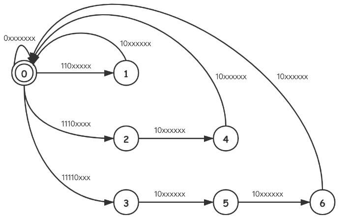

|      | 0xxxxxxx | 110xxxxxx | 1110xxxx | 11110xxx | 10xxxxxx |
| :--: | :------: | :-------: | :------: | :------: | :------: |
|  0   |    0     |     1     |    2     |    3     |    -1    |
|  1   |    -1    |    -1     |    -1    |    -1    |    0     |
|  2   |    -1    |    -1     |    -1    |    -1    |    4     |
|  3   |    -1    |    -1     |    -1    |    -1    |    5     |
|  4   |    -1    |    -1     |    -1    |    -1    |    0     |
|  5   |    -1    |    -1     |    -1    |    -1    |    6     |
|  6   |    -1    |    -1     |    -1    |    -1    |    0     |

```java
class Solution {
     /**
     * 执行用时：
     * 5 ms
     * , 在所有 Java 提交中击败了
     * 22.34%
     * 的用户
     * 内存消耗：
     * 39.2 MB
     * , 在所有 Java 提交中击败了
     * 56.13%
     * 的用户
     * @param data
     * @return
     */
    private Map<Integer, int[]> map = new HashMap<>();
    private int[] mask = new int[]{0b10000000, 0b11100000, 0b11110000, 0b11111000, 0b11000000};
    private int[] inputType = new int[]{0b00000000, 0b11000000, 0b11100000, 0b11110000, 0b10000000};

    public boolean validUtf8(int[] data) {
        map.put(0, new int[]{0, 1, 2, 3, -1});
        map.put(1, new int[]{-1, -1, -1, -1, 0});
        map.put(2, new int[]{-1, -1, -1, -1, 4});
        map.put(3, new int[]{-1, -1, -1, -1, 5});
        map.put(4, new int[]{-1, -1, -1, -1, 0});
        map.put(5, new int[]{-1, -1, -1, -1, 6});
        map.put(6, new int[]{-1, -1, -1, -1, 0});

        int inType;
        int state = 0;

        for(int node : data) {
            inType = getType(node);
            if (inType == -1) {
                return false;
            }
            state = map.get(state)[inType];
            if (state == -1) {
                return false;
            }
        }
        return state == 0;
    }

    public int getType(int data) {
        for (int i = 0; i < mask.length; i++) {
            if ((data & mask[i]) == inputType[i]) {
                return i;
            }
        }
        return -1;
    }
}
```

**[编译原理——确定有穷自动机的化简-分割法](https://blog.csdn.net/qq_42898299/article/details/108909388?spm=1001.2014.3001.5501)**

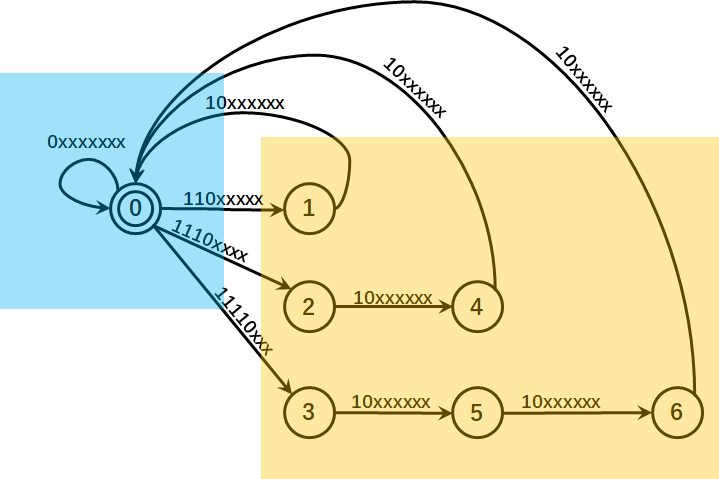

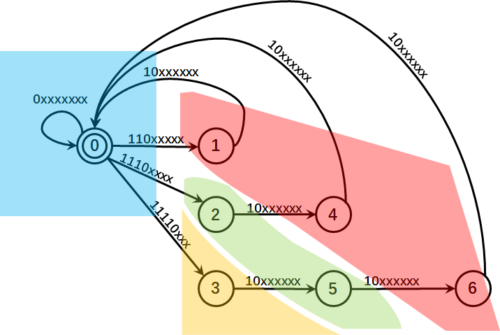

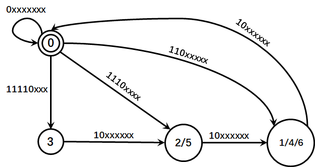


|      | 0xxxxxxx | 110xxxxx | 1110xxxx | 11110xxx | 10xxxxxx |
| ---- | -------- | -------- | -------- | -------- | -------- |
| 0    | 0        | 3        | 2        | 1        | -1       |
| 1    | -1       | -1       | -1       | -1       | 2        |
| 2    | -1       | -1       | -1       | -1       | 3        |
| 3    | -1       | -1       | -1       | -1       | 0        |

```java
class Solution {
    private Map<Integer, int[]> map = new HashMap<>();
    private int[] mask = new int[]{0b10000000, 0b11100000, 0b11110000, 0b11111000, 0b11000000};
    private int[] inputType = new int[]{0b00000000, 0b11000000, 0b11100000, 0b11110000, 0b10000000};


    public boolean validUtf8(int[] data) {
        map.put(0, new int[]{0, 3, 2, 1, -1});
        map.put(1, new int[]{-1, -1, -1, -1, 2});
        map.put(2, new int[]{-1, -1, -1, -1, 3});
        map.put(3, new int[]{-1, -1, -1, -1, 0});

        int state = 0;
        int inType = -1;

        for (int i : data) {
            inType = getType(i);
            if (inType == -1) {
                return false;
            }
            state = map.get(state)[inType];
            if (state == -1) {
                return false;
            }
        }
        return state == 0;
    }
    private int getType(int data) {
        for (int i = 0; i < mask.length; i++) {
            if ((data & mask[i]) == inputType[i]) {
                return i;
            }
        }
        return -1;
    }
}
```

### [😀65. 有效数字](https://leetcode-cn.com/problems/valid-number/)

难度困难168

**有效数字**（按顺序）可以分成以下几个部分：

1. 一个 **小数** 或者 **整数**
2. （可选）一个 `'e'` 或 `'E'` ，后面跟着一个 **整数**

**小数**（按顺序）可以分成以下几个部分：

1. （可选）一个符号字符（`'+'` 或 `'-'`）
2. 下述格式之一：
   1. 至少一位数字，后面跟着一个点 `'.'`
   2. 至少一位数字，后面跟着一个点 `'.'` ，后面再跟着至少一位数字
   3. 一个点 `'.'` ，后面跟着至少一位数字

**整数**（按顺序）可以分成以下几个部分：

1. （可选）一个符号字符（`'+'` 或 `'-'`）
2. 至少一位数字

部分有效数字列举如下：

- `["2", "0089", "-0.1", "+3.14", "4.", "-.9", "2e10", "-90E3", "3e+7", "+6e-1", "53.5e93", "-123.456e789"]`

部分无效数字列举如下：

- `["abc", "1a", "1e", "e3", "99e2.5", "--6", "-+3", "95a54e53"]`

给你一个字符串 `s` ，如果 `s` 是一个 **有效数字** ，请返回 `true` 。

 

**示例 1：**

```
输入：s = "0"
输出：true
```

**示例 2：**

```
输入：s = "e"
输出：false
```

**示例 3：**

```
输入：s = "."
输出：false
```

**示例 4：**

```
输入：s = ".1"
输出：true
```

 

**提示：**

- `1 <= s.length <= 20`
- `s` 仅含英文字母（大写和小写），数字（`0-9`），加号 `'+'` ，减号 `'-'` ，或者点 `'.'` 。

[表驱动法](https://leetcode-cn.com/problems/valid-number/solution/biao-qu-dong-fa-by-user8973/)

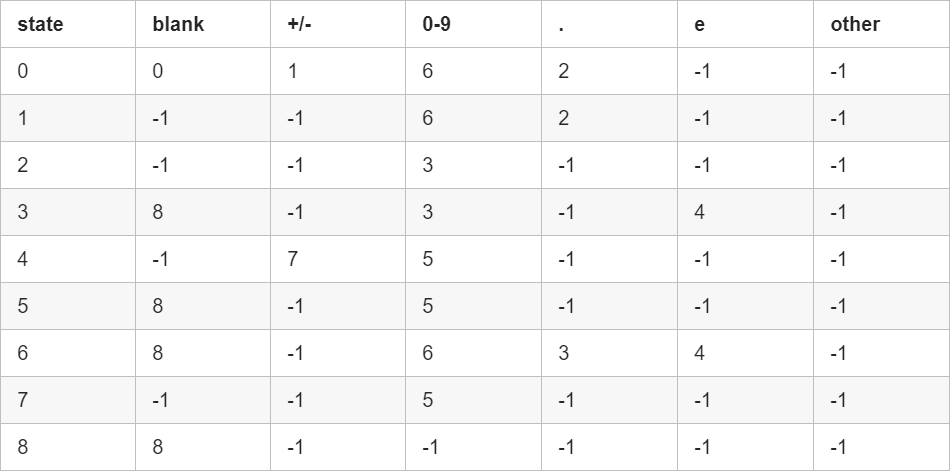


```java
class Solution {
    public int make(char c) {
        switch(c) {
            case ' ': return 0;
            case '+':
            case '-': return 1;
            case '.': return 3;
            case 'e': return 4;
            default:
                if(c >= 48 && c <= 57) return 2;
        }
        return -1;
    }
    
    public boolean isNumber(String s) {
        int state = 0;
        int finals = 0b101101000;
        int[][] transfer = new int[][]{{ 0, 1, 6, 2,-1},
                                       {-1,-1, 6, 2,-1},
                                       {-1,-1, 3,-1,-1},
                                       { 8,-1, 3,-1, 4},
                                       {-1, 7, 5,-1,-1},
                                       { 8,-1, 5,-1,-1},
                                       { 8,-1, 6, 3, 4},
                                       {-1,-1, 5,-1,-1},
                                       { 8,-1,-1,-1,-1}};
        char[] ss = s.toCharArray();
        for(int i=0; i < ss.length; ++i) {
            int id = make(ss[i]);
            if (id < 0) return false;
            state = transfer[state][id];
            if (state < 0) return false;
        }
        return (finals & (1 << state)) > 0;
    }
}

作者：user8973
链接：https://leetcode-cn.com/problems/valid-number/solution/biao-qu-dong-fa-by-user8973/
来源：力扣（LeetCode）
著作权归作者所有。商业转载请联系作者获得授权，非商业转载请注明出处。
```

## 2.4 模仿数学计算


### [168. Excel表列名称](https://leetcode-cn.com/problems/excel-sheet-column-title/)

难度简单317

给定一个正整数，返回它在 Excel 表中相对应的列名称。

例如，

```
    1 -> A
    2 -> B
    3 -> C
    ...
    26 -> Z
    27 -> AA
    28 -> AB 
    ...
```

**示例 1:**

```
输入: 1
输出: "A"
```

**示例 2:**

```
输入: 28
输出: "AB"
```

**示例 3:**

```
输入: 701
输出: "ZY"
```

通过次数44,610

提交次数114,620

```java
class Solution {
    public String convertToTitle(int n) {
        StringBuilder sb = new StringBuilder();
        while(n > 0) {
            n--;//👈注意减一
            int res = n % 26;
            char t = (char)(res + 'A');
            sb.append(t);
            n = n / 26;
        }
        sb.reverse();
        return sb.toString();
    }
}
```


### [➕415. 字符串相加](https://leetcode-cn.com/problems/add-strings/)

难度简单302

给定两个字符串形式的非负整数 `num1` 和`num2` ，计算它们的和。

 

**提示：**

1. `num1` 和`num2` 的长度都小于 5100
2. `num1` 和`num2` 都只包含数字 `0-9`
3. `num1` 和`num2` 都不包含任何前导零
4. **你不能使用任何內建 BigInteger 库， 也不能直接将输入的字符串转换为整数形式**


```java
class Solution {
    public String addStrings(String num1, String num2) {
        int i = num1.length() - 1;
        int j = num2.length() - 1;
        StringBuilder sb = new StringBuilder();
        int c = 0;
        while(i >= 0 || j >= 0 || c > 0) {
            int a = i >= 0 ? num1.charAt(i) - '0' : 0;
            int b = j >= 0 ? num2.charAt(j) - '0' : 0;
            int add = a + b + c;
            sb.append(add % 10);
            c = add / 10;
            i--;
            j--;
        }
        sb.reverse();
        return sb.toString();
    }
}
```


### [✖43. 字符串相乘](https://leetcode-cn.com/problems/multiply-strings/)

难度中等560

给定两个以字符串形式表示的非负整数 `num1` 和 `num2`，返回 `num1` 和 `num2` 的乘积，它们的乘积也表示为字符串形式。

**示例 1:**

```
输入: num1 = "2", num2 = "3"
输出: "6"
```

**示例 2:**

```
输入: num1 = "123", num2 = "456"
输出: "56088"
```

**说明：**

1. `num1` 和 `num2` 的长度小于110。
2. `num1` 和 `num2` 只包含数字 `0-9`。
3. `num1` 和 `num2` 均不以零开头，除非是数字 0 本身。
4. **不能使用任何标准库的大数类型（比如 BigInteger）**或**直接将输入转换为整数来处理**。

```java
public class Solution {
    /**
     * 代码中的类名、方法名、参数名已经指定，请勿修改，直接返回方法规定的值即可
     * 
     * @param s string字符串 第一个整数
     * @param t string字符串 第二个整数
     * @return string字符串
     */
    public String solve (String s, String t) {
        // write code here
        return multi(s, t);
    }
    
    public String multi(String s, String t) {
        String lastMulti = "0";
        for(int i = t.length() - 1; i >= 0; i--) {
            String tempMulti = multi(s, t.charAt(i));
            StringBuilder sb = new StringBuilder(tempMulti);
            
            for(int j = 0; j < t.length() - 1 - i; j++) {
                sb.append('0');
            }
            lastMulti = add(lastMulti, sb.toString());
        }
        return lastMulti;
    }
    
    public String multi(String s, char num) {
        int carray = 0;
        int intNum = num - '0';
        StringBuilder sb = new StringBuilder();
        for(int i = s.length() - 1; i >= 0; i--) {
            int currNum = s.charAt(i) - '0';
            int res = currNum * intNum + carray;
            sb.append(res % 10);
            carray = res / 10;
        }
        if(carray > 0) {
            sb.append(carray);
        }
        sb.reverse();
        return sb.toString();
    }
    
    public String add(String s, String t) {
        int carray = 0;
        StringBuilder sb = new StringBuilder();
        for(int i = s.length() - 1, j = t.length() - 1; i >= 0 || j >= 0; i--,j--) {
            int numS = i >= 0 ? s.charAt(i) - '0' : 0;
            int numT = j >= 0 ? t.charAt(j) - '0' : 0;
            int res = numS + numT + carray;
            sb.append(res % 10);
            carray = res / 10;
        }
        if(carray > 0) {
            sb.append(carray);
        }
        sb.reverse();
        return sb.toString();
    }
    
}
```


```java
class Solution {
    public String multiply(String num1, String num2) {
        if(num1.equals("0") || num2.equals("0")) {
            return "0";
        }
        String resStr = "0";
        for(int i = num2.length() - 1; i >= 0; i--) {
            StringBuilder sb = new StringBuilder();
            for(int j = 0; j < num2.length() - 1 - i; j++) {
                sb.append('0');
            }
            char c = num2.charAt(i);
            int cNum = c - '0';
            int carry = 0;
            for(int k = num1.length() - 1; k >= 0; k--) {
                int num = num1.charAt(k) - '0';
                int res = num * cNum + carry;
                sb.append(res % 10);
                carry = res / 10;
            }
            👉if(carry > 0) {//很重要
                sb.append(carry);
            }
            sb.reverse();
            resStr = addTwoStr(resStr, sb.toString());
        }
        return resStr;
    }
    public String addTwoStr(String num1, String num2) {
        int i = num1.length() - 1;
        int j = num2.length() - 1;
        int carry = 0;
        StringBuilder sb = new StringBuilder();
        while(i >= 0 || j >= 0 || carry > 0) {
            int a = i >= 0 ? num1.charAt(i) - '0' : 0;
            int b = j >= 0 ? num2.charAt(j) - '0' : 0;
            int res = a + b + carry;
            sb.append(res % 10);
            carry = res / 10;
            i--;
            j--;
        }
        sb.reverse();
        return sb.toString();
    }
}
```

```java
class Solution {
    public String multiply(String num1, String num2) {
        int len1 = num1.length();
        int len2 = num2.length();
        int[] res = new int[len1 + len2];
        for(int i = len1 - 1; i >= 0; i--) {
            for(int j = len2 - 1; j >= 0; j--) {
                int tempRes = res[i + j + 1] + (num1.charAt(i) - '0') * (num2.charAt(j) - '0');

                res[i + j + 1] = tempRes % 10;
                res[i + j] += tempRes / 10;//关键点！！！！
            }
        }
        StringBuilder sb = new StringBuilder();
        int i = 0;
        while(i < res.length - 1 && res[i] == 0) {
            i++;
        }
        for(; i < res.length; i++) {
            sb.append(res[i]);
        }
        return sb.toString();
    }
}
```


### [50. Pow(x, n)](https://leetcode-cn.com/problems/powx-n/)

难度中等579

实现 [pow(*x*, *n*)](https://www.cplusplus.com/reference/valarray/pow/) ，即计算 x 的 n 次幂函数（即，xn）。

 

**示例 1：**

```
输入：x = 2.00000, n = 10
输出：1024.00000
```

**示例 2：**

```
输入：x = 2.10000, n = 3
输出：9.26100
```

**示例 3：**

```
输入：x = 2.00000, n = -2
输出：0.25000
解释：2-2 = 1/22 = 1/4 = 0.25
```

 

**提示：**

- `-100.0 < x < 100.0`
- `-231 <= n <= 231-1`
- `-104 <= xn <= 104`

```java
//快速幂
class Solution {
    public double myPow(double x, int n) {
        long b = n;
        double res = 1.0;
        if(b < 0) {
            b = -b;
            x = 1.0/x;
        }
        while(b > 0) {
            if((b & 1) == 1) {
                res *= x;
            }
            x *= x;
            b >>= 1;
        }
        return res;
    }
}
```


### [69. x 的平方根](https://leetcode-cn.com/problems/sqrtx/)

难度简单590收藏分享切换为英文接收动态反馈

实现 `int sqrt(int x)` 函数。

计算并返回 *x* 的平方根，其中 *x* 是非负整数。

由于返回类型是整数，结果只保留整数的部分，小数部分将被舍去。

**示例 1:**

```
输入: 4
输出: 2
```

**示例 2:**

```
输入: 8
输出: 2
说明: 8 的平方根是 2.82842..., 
     由于返回类型是整数，小数部分将被舍去。
```

通过次数256,912

提交次数655,354

```java
//二分
class Solution {
    public int mySqrt(int x) {
        long x_l = x;
        long l = 0, r = x_l;
        while(l <= r) {
            long mid = (l + r) / 2;
            if (mid * mid == x || (mid * mid < x && (mid + 1) * (mid + 1) > x) ) {
                return (int)mid;
            } else if(mid * mid < x) {
                l = mid + 1;
            } else {
                r = mid - 1;
            }
        }
        return -1;
    }
}
```

### [❓166. 分数到小数](https://leetcode-cn.com/problems/fraction-to-recurring-decimal/)

难度中等206收藏分享切换为英文接收动态反馈

给定两个整数，分别表示分数的分子 `numerator` 和分母 `denominator`，以 **字符串形式返回小数** 。

如果小数部分为循环小数，则将循环的部分括在括号内。

如果存在多个答案，只需返回 **任意一个** 。

对于所有给定的输入，**保证** 答案字符串的长度小于 `104` 。

 

**示例 1：**

```
输入：numerator = 1, denominator = 2
输出："0.5"
```

**示例 2：**

```
输入：numerator = 2, denominator = 1
输出："2"
```

**示例 3：**

```
输入：numerator = 2, denominator = 3
输出："0.(6)"
```

**示例 4：**

```
输入：numerator = 4, denominator = 333
输出："0.(012)"
```

**示例 5：**

```
输入：numerator = 1, denominator = 5
输出："0.2"
```

 

**提示：**

- `-231 <= numerator, denominator <= 231 - 1`
- `denominator != 0`

### [172. 阶乘后的零](https://leetcode-cn.com/problems/factorial-trailing-zeroes/)

难度简单417收藏分享切换为英文接收动态反馈

给定一个整数 *n*，返回 *n*! 结果尾数中零的数量。

**示例 1:**

```
输入: 3
输出: 0
解释: 3! = 6, 尾数中没有零。
```

**示例 2:**

```
输入: 5
输出: 1
解释: 5! = 120, 尾数中有 1 个零.
```

**说明:** 你算法的时间复杂度应为 *O*(log *n*) 。

```java
class Solution {
    public int trailingZeroes(int n) {
        int res = 0;
        while(n > 0) {
            res += n / 5;
            n /= 5;
        }
        return res;
    }
}
```


## 2.5 位运算专题

### [191. 位1的个数](https://leetcode-cn.com/problems/number-of-1-bits/)

难度简单251

编写一个函数，输入是一个无符号整数（以二进制串的形式），返回其二进制表达式中数字位数为 '1' 的个数（也被称为[汉明重量](https://baike.baidu.com/item/汉明重量)）。

 

**提示：**

- 请注意，在某些语言（如 Java）中，没有无符号整数类型。在这种情况下，输入和输出都将被指定为有符号整数类型，并且不应影响您的实现，因为无论整数是有符号的还是无符号的，其内部的二进制表示形式都是相同的。
- 在 Java 中，编译器使用[二进制补码](https://baike.baidu.com/item/二进制补码/5295284)记法来表示有符号整数。因此，在上面的 **示例 3** 中，输入表示有符号整数 `-3`。

 

**进阶**：

- 如果多次调用这个函数，你将如何优化你的算法？

 

**示例 1：**

```
输入：00000000000000000000000000001011
输出：3
解释：输入的二进制串 00000000000000000000000000001011 中，共有三位为 '1'。
```

**示例 2：**

```
输入：00000000000000000000000010000000
输出：1
解释：输入的二进制串 00000000000000000000000010000000 中，共有一位为 '1'。
```

**示例 3：**

```
输入：11111111111111111111111111111101
输出：31
解释：输入的二进制串 11111111111111111111111111111101 中，共有 31 位为 '1'。
```

 

**提示：**

- 输入必须是长度为 `32` 的 **二进制串** 。

### [136. 只出现一次的数字](https://leetcode-cn.com/problems/single-number/)

难度简单1689

给定一个**非空**整数数组，除了某个元素只出现一次以外，其余每个元素均出现两次。找出那个只出现了一次的元素。

**说明：**

你的算法应该具有线性时间复杂度。 你可以不使用额外空间来实现吗？

**示例 1:**

```
输入: [2,2,1]
输出: 1
```

**示例 2:**

```
输入: [4,1,2,1,2]
输出: 4
```

### [190. 颠倒二进制位](https://leetcode-cn.com/problems/reverse-bits/)

难度简单260

颠倒给定的 32 位无符号整数的二进制位。

 

**示例 1：**

```
输入: 00000010100101000001111010011100
输出: 00111001011110000010100101000000
解释: 输入的二进制串 00000010100101000001111010011100 表示无符号整数 43261596，
     因此返回 964176192，其二进制表示形式为 00111001011110000010100101000000。
```

**示例 2：**

```
输入：11111111111111111111111111111101
输出：10111111111111111111111111111111
解释：输入的二进制串 11111111111111111111111111111101 表示无符号整数 4294967293，
     因此返回 3221225471 其二进制表示形式为 10111111111111111111111111111111 。
```

 

**提示：**

- 请注意，在某些语言（如 Java）中，没有无符号整数类型。在这种情况下，输入和输出都将被指定为有符号整数类型，并且不应影响您的实现，因为无论整数是有符号的还是无符号的，其内部的二进制表示形式都是相同的。
- 在 Java 中，编译器使用[二进制补码](https://baike.baidu.com/item/二进制补码/5295284)记法来表示有符号整数。因此，在上面的 **示例 2** 中，输入表示有符号整数 `-3`，输出表示有符号整数 `-1073741825`。

 

**进阶**:
如果多次调用这个函数，你将如何优化你的算法？


```java
public class Solution {
    // you need treat n as an unsigned value
    public int reverseBits(int n) {
        int reverseN = 0;
        int count = 32;
        while(count > 0){
            reverseN = ((revyerseN << 1) + (n & 1));
            n >>= 1;
            count--;
        }
        return reverseN;
    }
}
```

### [371. 两整数之和](https://leetcode-cn.com/problems/sum-of-two-integers/)

难度简单369

**不使用**运算符 `+` 和 `-` ，计算两整数 `a` 、`b` 之和。

**示例 1:**

```
输入: a = 1, b = 2
输出: 3
```

**示例 2:**

```
输入: a = -2, b = 3
输出: 1
```

```java
class Solution {
    public int getSum(int a, int b) {
        while(b != 0) {
            int tempA = a;
            a = a ^ b;
            b = (tempA & b) << 1;
        }
        return a;
    }
}
```


## 2.6 旋转数组

### [💃48. 旋转图像](https://leetcode-cn.com/problems/rotate-image/)

难度中等772

给定一个 *n* × *n* 的二维矩阵 `matrix` 表示一个图像。请你将图像顺时针旋转 90 度。

你必须在**[ 原地](https://baike.baidu.com/item/原地算法)** 旋转图像，这意味着你需要直接修改输入的二维矩阵。**请不要** 使用另一个矩阵来旋转图像。

 

**示例 1：**


```
输入：matrix = [[1,2,3],[4,5,6],[7,8,9]]
输出：[[7,4,1],[8,5,2],[9,6,3]]
```

**示例 2：**


```
输入：matrix = [[5,1,9,11],[2,4,8,10],[13,3,6,7],[15,14,12,16]]
输出：[[15,13,2,5],[14,3,4,1],[12,6,8,9],[16,7,10,11]]
```

**示例 3：**

```
输入：matrix = [[1]]
输出：[[1]]
```

**示例 4：**

```
输入：matrix = [[1,2],[3,4]]
输出：[[3,1],[4,2]]
```

 

**提示：**

- `matrix.length == n`
- `matrix[i].length == n`
- `1 <= n <= 20`
- `-1000 <= matrix[i][j] <= 1000`

               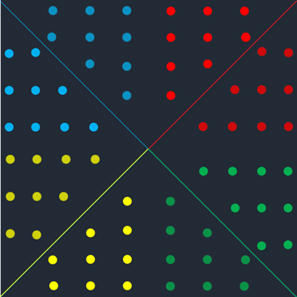  

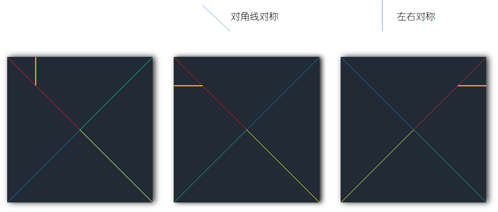


```java
class Solution {
    public void rotate(int[][] matrix) {
        int row = matrix.length;
        int col = matrix[0].length;
        for(int i = 0; i < row - 1; i++) {//先沿对角线对称
            for(int j = i + 1; j < col; j++) {
                int temp = matrix[i][j];
                matrix[i][j] = matrix[j][i];
                matrix[j][i] = temp;
            }
        }
         for(int i = 0; i < row; i++) {//沿着中线对称轴对称
                for(int j = 0; j < col / 2; j++) {
                    int temp = matrix[i][j];
                    matrix[i][j] = matrix[i][col - 1 - j];
                    matrix[i][col - 1 - j] = temp;
                }
        }
    }
}
```

**注意第一个点：**

```java
 for(int i = 0; i < row - 1; i++) {👈，注意是小于row - 1，最后一行没有元素需要遍历了
      for(int j = i + 1; j < col; j++) {👈，j = i + 1！
          ...
      }
}
```

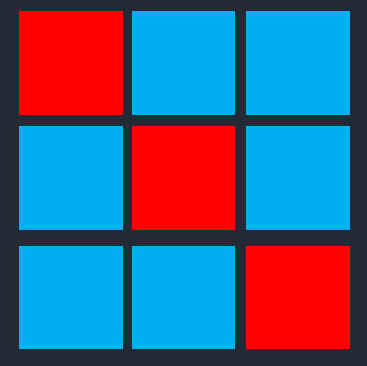


## 2.7 ❓背包问题


维基百科，自由的百科全书

[跳到导航](https://zh.wikipedia.org/wiki/背包问题#mw-head)[跳到搜索](https://zh.wikipedia.org/wiki/背包问题#searchInput)

[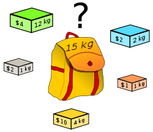](https://zh.wikipedia.org/wiki/File:Knapsack.svg)

背包问题的一个例子：应该选择哪些盒子，才能使价格尽可能地大，而保持重量小于或等于15 kg？

**背包问题**（Knapsack problem）是一种[组合优化](https://zh.wikipedia.org/wiki/组合优化)的[NP完全](https://zh.wikipedia.org/wiki/NP完全)问题。问题可以描述为：给定一组物品，每种物品都有自己的重量和价格，在限定的总重量内，我们如何选择，才能使得物品的总价格最高。问题的名称来源于如何选择最合适的物品放置于给定背包中。

相似问题经常出现在商业、[组合数学](https://zh.wikipedia.org/wiki/组合数学)，[计算复杂性理论](https://zh.wikipedia.org/wiki/计算复杂性理论)、[密码学](https://zh.wikipedia.org/wiki/密码学)和[应用数学](https://zh.wikipedia.org/wiki/应用数学)等领域中。

也可以将背包问题描述为[决定性问题](https://zh.wikipedia.org/wiki/決定性問題)，即在总重量不超过*W*的前提下，总价值是否能达到*V*。

### 目录


- [1定义](https://zh.wikipedia.org/wiki/背包问题#定义)
- [2计算复杂度](https://zh.wikipedia.org/wiki/背包问题#计算复杂度)
- 3动态规划解法
  - [3.1无界背包问题](https://zh.wikipedia.org/wiki/背包问题#无界背包问题)
  - [3.20-1背包问题](https://zh.wikipedia.org/wiki/背包问题#0-1背包问题)
- [4二次背包问题](https://zh.wikipedia.org/wiki/背包问题#二次背包问题)
- [5外部链接](https://zh.wikipedia.org/wiki/背包问题#外部链接)

### 定义[[编辑](https://zh.wikipedia.org/w/index.php?title=背包问题&action=edit&section=1)]

我们有*n*种物品，物品*j*的重量为*wj*，价格为*pj*。
我们假定所有物品的重量和价格都是非负的。背包所能承受的最大重量为*W*。
如果限定每种物品只能选择0个或1个，则问题称为**0-1背包问题**。

可以用公式表示为：


如果限定物品*j*最多只能选择*bj*个，则问题称为**有界背包问题**。
可以用公式表示为：


如果不限定每种物品的数量，则问题称为**无界背包问题**。
各类复杂的背包问题总可以变换为简单的0-1背包问题进行求解。

### 计算复杂度[[编辑](https://zh.wikipedia.org/w/index.php?title=背包问题&action=edit&section=2)]

在计算机科学领域，人们对背包问题感兴趣的原因在于：

- 利用[动态规划](https://zh.wikipedia.org/wiki/动态规划)，背包问题存在一个[伪多项式时间](https://zh.wikipedia.org/wiki/伪多项式时间)算法
- 把上面算法作为子程序，背包问题存在[完全逼近多项式时间方案](https://zh.wikipedia.org/w/index.php?title=完全逼近多项式时间方案&action=edit&redlink=1)
- 作为[NP完全](https://zh.wikipedia.org/wiki/NP完全)问题，背包问题没有一种既准确又快速（多项式时间）的算法

### 动态规划解法[[编辑](https://zh.wikipedia.org/w/index.php?title=背包问题&action=edit&section=3)]

无界背包问题[[编辑](https://zh.wikipedia.org/w/index.php?title=背包问题&action=edit&section=4)]

如果重量*w1*, ..., *wn*和*W*都是非负数，那么用[动态规划](https://zh.wikipedia.org/wiki/动态规划)，可以用[伪多项式时间](https://zh.wikipedia.org/wiki/伪多项式时间)解决背包问题。下面描述了无界背包问题的解法。

简便起见，我们假定重量都是正数（wj > 0）。在总重量不超过*W*的前提下，我们希望总价格最高。对于*Y* ≤ *W*，我们将在总重量不超过*Y*的前提下，总价格所能达到的最高值定义为*A*(*Y*)。*A*(*W*)即为问题的答案。

显然，*A*(*Y*)满足：

- *A*(0) = 0
- *A*(*Y*) = max { *A*(*Y - 1*), { *pj* + *A*(*Y* - *wj*) | *wj* ≤ *Y* } }

其中，*pj*为第*j*种物品的价格。

关于第二个公式的一个解释：总重量为*Y*时背包的最高价值可能有两种情况，第一种是该重量无法被完全填满，这对应于表达式*A*(*Y - 1*)。第二种是刚好填满，这对应于一个包含一系列刚好填满的可能性的集合，其中的可能性是指当最后放进包中的物品恰好是重量为*wj*的物品时背包填满并达到最高价值。而这时的背包价值等于重量为*wj*物品的价值*pj*和当没有放入该物品时背包的最高价值之和。故归纳为表达式*pj* + *A*(*Y* - *wj*)。最后把所有上述情况中背包价值的最大值求出就得到了*A*(*Y*)的值。

如果总重量为0，总价值也为0。然后依次计算*A*(0), *A*(1), ..., *A*(*W*)，并把每一步骤的结果存入表中供后续步骤使用，完成这些步骤后*A*(*W*)即为最终结果。由于每次计算*A*(*Y*)都需要检查*n*种物品，并且需要计算*W*个*A*(*Y*)值，因此动态规划解法的时间复杂度为O(*nW*)。如果把*w1*, ..., *wn*, *W*都除以它们的[最大公因数](https://zh.wikipedia.org/wiki/最大公因數)，算法的时间将得到很大的提升。

尽管背包问题的时间复杂度为O(*nW*)，但它仍然是一个NP完全问题。这是因为*W*同问题的*输入大小*并不成线性关系。原因在于问题的输入大小仅仅取决于表达输入所需的比特数。事实上，{\displaystyle \left\lfloor log_{2}W\right\rfloor +1}，即表达*W*所需的比特数，同问题的输入长度成线性关系。

### 0-1背包问题[[编辑](https://zh.wikipedia.org/w/index.php?title=背包问题&action=edit&section=5)]

类似的方法可以解决0-1背包问题，算法同样需要[伪多项式时间](https://zh.wikipedia.org/wiki/伪多项式时间)。我们同样假定*w1*, ..., *wn*和*W*都是正整数。我们将在总重量不超过*Y*的前提下，前*j*种物品的总价格所能达到的最高值定义为*A*(*j*, *Y*)。

*A*(*j*, *Y*)的递推关系为：

- *A*(0, *Y*) = 0
- 如果*wj* > *Y*, *A*(*j*, *Y*) = *A*(*j* - 1, *Y*)
- 如果*wj* ≤ *Y*, *A*(*j*, *Y*) = max { *A*(*j* - 1, *Y*), *pj* + *A*(*j* - 1, *Y* - *wj*)}

通过计算*A*(*n*, *W*)即得到最终结果。为提高算法性能，我们把先前计算的结果存入表中。因此算法需要的时间和空间都为O(*nW*)，通过对算法的改进，空间的消耗可以降至O(*W*)。

### 二次背包问题[[编辑](https://zh.wikipedia.org/w/index.php?title=背包问题&action=edit&section=6)]

推广的背包问题有二次背包问题、[多维背包问题](https://zh.wikipedia.org/w/index.php?title=多维背包问题&action=edit&redlink=1)、[多目标背包问题](https://zh.wikipedia.org/w/index.php?title=多目标背包问题&action=edit&redlink=1)等。

**二次背包问题**是背包问题的一种推广形式：

| 最大化{\displaystyle \sum _{j=1}^{n}p_{j}x_{j}+\sum _{i=1}^{n-1}\sum _{j=i+1}^{n}p_{ij}x_{i}x_{j}} |                                                              |                                                              |      |
| ------------------------------------------------------------ | ------------------------------------------------------------ | ------------------------------------------------------------ | ---- |
| 受限于                                                       | {\displaystyle \sum _{j=1}^{n}w_{j}x_{j}\leq W,} |                                                              |      |
|                                                              | {\displaystyle x_{j}\in \{0,1\}} | for all {\displaystyle 1\leq j\leq n} |      |

### 外部链接[[编辑](https://zh.wikipedia.org/w/index.php?title=背包问题&action=edit&section=7)]

- [二次背包问题源代码链接](http://www.adaptivebox.net/CILib/code/qkpcodes_link.html)

[分类](https://zh.wikipedia.org/wiki/Special:页面分类)：

- [最优化](https://zh.wikipedia.org/wiki/Category:最优化)
- [运筹学](https://zh.wikipedia.org/wiki/Category:運籌學)
- [NP完全问题](https://zh.wikipedia.org/wiki/Category:NP完全问题)
- [计算复杂性理论](https://zh.wikipedia.org/wiki/Category:計算複雜性理論)
- [组合数学](https://zh.wikipedia.org/wiki/Category:组合数学)


### [❓2.7-1 139. 单词拆分](https://leetcode-cn.com/problems/word-break/)

难度中等823

给定一个**非空**字符串 *s* 和一个包含**非空**单词的列表 *wordDict*，判定 *s* 是否可以被空格拆分为一个或多个在字典中出现的单词。

**说明：**

- 拆分时可以重复使用字典中的单词。
- 你可以假设字典中没有重复的单词。

**示例 1：**

```
输入: s = "leetcode", wordDict = ["leet", "code"]
输出: true
解释: 返回 true 因为 "leetcode" 可以被拆分成 "leet code"。
```

**示例 2：**

```
输入: s = "applepenapple", wordDict = ["apple", "pen"]
输出: true
解释: 返回 true 因为 "applepenapple" 可以被拆分成 "apple pen apple"。
     注意你可以重复使用字典中的单词。
```

**示例 3：**

```
输入: s = "catsandog", wordDict = ["cats", "dog", "sand", "and", "cat"]
输出: false
```

### [2.7-2 322. 零钱兑换](https://leetcode-cn.com/problems/coin-change/)

难度中等1055

给定不同面额的硬币 `coins` 和一个总金额 `amount`。编写一个函数来计算可以凑成总金额所需的最少的硬币个数。如果没有任何一种硬币组合能组成总金额，返回 `-1`。

你可以认为每种硬币的数量是无限的。

 

**示例 1：**

```
输入：coins = [1, 2, 5], amount = 11
输出：3 
解释：11 = 5 + 5 + 1
```

**示例 2：**

```
输入：coins = [2], amount = 3
输出：-1
```

**示例 3：**

```
输入：coins = [1], amount = 0
输出：0
```

**示例 4：**

```
输入：coins = [1], amount = 1
输出：1
```

**示例 5：**

```
输入：coins = [1], amount = 2
输出：2
```

 

**提示：**

- `1 <= coins.length <= 12`
- `1 <= coins[i] <= 231 - 1`
- `0 <= amount <= 104`


```java
class Solution {
    public int coinChange(int[] coins, int amount) {
        int[] res = new int[amount + 1];
        Arrays.fill(res, Integer.MAX_VALUE);
        res[0] = 0;
        for(int i = 0; i < coins.length; i++) {
            for(int j = coins[i]; j <= amount; j++) {
                if(res[j - coins[i]] != Integer.MAX_VALUE) {
                    res[j] = Math.min(res[j - coins[i]] + 1, res[j]);
                }
            }
        } 
        return res[amount] == Integer.MAX_VALUE ? -1 : res[amount];
    }
}
```


### [2.7-3 416. 分割等和子集](https://leetcode-cn.com/problems/partition-equal-subset-sum/)

难度中等668收藏分享切换为英文接收动态反馈

给定一个**只包含正整数**的**非空**数组。是否可以将这个数组分割成两个子集，使得两个子集的元素和相等。

**注意:**

1. 每个数组中的元素不会超过 100
2. 数组的大小不会超过 200

**示例 1:**

```
输入: [1, 5, 11, 5]

输出: true

解释: 数组可以分割成 [1, 5, 5] 和 [11].
```

 

**示例 2:**

```
输入: [1, 2, 3, 5]

输出: false

解释: 数组不能分割成两个元素和相等的子集.
```

 

```java
class Solution {
     public boolean canPartition(int[] nums) {
        int sum = 0;
        for (int i :
                nums) {
            sum += i;
        }

        if (sum  % 2 != 0) {
            return false;
        }
        sum /= 2;
        int[] res = new int[sum + 1];
        for (int i = 0; i < nums.length; i++) {
            for (int w = sum; w >= nums[i]; w--) {
                res[w] = Math.max(res[w], res[w - nums[i]] + nums[i]);
            }
        }
        return res[sum] == sum;
    }
}
```


### [❓2.7-4 494. 目标和](https://leetcode-cn.com/problems/target-sum/)

难度中等549

给定一个非负整数数组，a1, a2, ..., an, 和一个目标数，S。现在你有两个符号 `+` 和 `-`。对于数组中的任意一个整数，你都可以从 `+` 或 `-`中选择一个符号添加在前面。

返回可以使最终数组和为目标数 S 的所有添加符号的方法数。

 

**示例：**

```
输入：nums: [1, 1, 1, 1, 1], S: 3
输出：5
解释：

-1+1+1+1+1 = 3
+1-1+1+1+1 = 3
+1+1-1+1+1 = 3
+1+1+1-1+1 = 3
+1+1+1+1-1 = 3

一共有5种方法让最终目标和为3。
```

 

**提示：**

- 数组非空，且长度不会超过 20 。
- 初始的数组的和不会超过 1000 。
- 保证返回的最终结果能被 32 位整数存下。

```java
//超越5%，显然是不行的
class Solution {
    public int findTargetSumWays(int[] nums, int S) {
        for(int i = 0; i < nums.length; i++) {
            
        }
    }
    public int numberAdd(int[] nums, int index, int sum, int target) {
        if(index == nums.length) {
            return sum == target ? 1 : 0;
        }
        return numberAdd(nums, index + 1, sum + nums[index], target) + numberAdd(nums, index + 1, sum - nums[index], target);
    }
}
```

### [474. 一和零](https://leetcode-cn.com/problems/ones-and-zeroes/)

难度中等325

给你一个二进制字符串数组 `strs` 和两个整数 `m` 和 `n` 。

请你找出并返回 `strs` 的最大子集的大小，该子集中 **最多** 有 `m` 个 `0` 和 `n` 个 `1` 。

如果 `x` 的所有元素也是 `y` 的元素，集合 `x` 是集合 `y` 的 **子集** 。

 

**示例 1：**

```
输入：strs = ["10", "0001", "111001", "1", "0"], m = 5, n = 3
输出：4
解释：最多有 5 个 0 和 3 个 1 的最大子集是 {"10","0001","1","0"} ，因此答案是 4 。
其他满足题意但较小的子集包括 {"0001","1"} 和 {"10","1","0"} 。{"111001"} 不满足题意，因为它含 4 个 1 ，大于 n 的值 3 。
```

**示例 2：**

```
输入：strs = ["10", "0", "1"], m = 1, n = 1
输出：2
解释：最大的子集是 {"0", "1"} ，所以答案是 2 。
```

 

**提示：**

- `1 <= strs.length <= 600`
- `1 <= strs[i].length <= 100`
- `strs[i]` 仅由 `'0'` 和 `'1'` 组成
- `1 <= m, n <= 100`

```java
class Solution {
    public int findMaxForm(String[] strs, int m, int n) {
        int[][] record = new int[strs.length][2];
        for(int i = 0; i < strs.length; i++) {
            for(int j = 0; j < strs[i].length(); j++) {
                char t = strs[i].charAt(j);
                if(t - '0' == 0) {
                    record[i][0]++;
                } else {
                    record[i][1]++;
                }
            }
        }
        int[][] res = new int[m + 1][n + 1];
        for(int i = 0; i < strs.length; i++) {
            for(int j = m; j >= record[i][0]; j--) {
                for(int k = n; k >= record[i][1]; k--) {
                    res[j][k] = Math.max(res[j - record[i][0]][k - record[i][1]] + 1, res[j][k]);
                }
            }
        }
        return res[m][n];
    }
}
```


## 2.8 搜索

### dfs

#### [200. 岛屿数量](https://leetcode-cn.com/problems/number-of-islands/)

难度中等966

给你一个由 `'1'`（陆地）和 `'0'`（水）组成的的二维网格，请你计算网格中岛屿的数量。

岛屿总是被水包围，并且每座岛屿只能由水平方向和/或竖直方向上相邻的陆地连接形成。

此外，你可以假设该网格的四条边均被水包围。

 

**示例 1：**

```
输入：grid = [
  ["1","1","1","1","0"],
  ["1","1","0","1","0"],
  ["1","1","0","0","0"],
  ["0","0","0","0","0"]
]
输出：1
```

**示例 2：**

```
输入：grid = [
  ["1","1","0","0","0"],
  ["1","1","0","0","0"],
  ["0","0","1","0","0"],
  ["0","0","0","1","1"]
]
输出：3
```

 

**提示：**

- `m == grid.length`
- `n == grid[i].length`
- `1 <= m, n <= 300`
- `grid[i][j]` 的值为 `'0'` 或 `'1'`

```java
class Solution {
    private boolean[][] flags;
    public int numIslands(char[][] grid) {
        int rows = grid.length;
        int cols = grid[0].length;
        int res = 0;
        flags = new boolean[rows][cols];
        for(int i = 0; i < rows; i++) {
            for(int j = 0; j < cols; j++) {
                if(flags[i][j]) {
                    continue;
                }
                if(grid[i][j] == '1') {
                    res++;
                    dfs(i, j, grid);
                }
            }
        }
        return res;
    }

    public void dfs(int i, int j, char[][] grid) {
        if(i < 0 || i >= grid.length || j < 0 || j >= grid[0].length || flags[i][j] || grid[i][j] == '0') {
            return;
        }
        flags[i][j] = true;
        dfs(i + 1, j, grid);
        dfs(i, j + 1, grid);
        dfs(i - 1, j, grid);
        dfs(i, j - 1, grid);
    }
}
```


##  2.9 回文


### [647. 回文子串](https://leetcode-cn.com/problems/palindromic-substrings/)

难度中等480

给定一个字符串，你的任务是计算这个字符串中有多少个回文子串。

具有不同开始位置或结束位置的子串，即使是由相同的字符组成，也会被视作不同的子串。

 

**示例 1：**

```
输入："abc"
输出：3
解释：三个回文子串: "a", "b", "c"
```

**示例 2：**

```
输入："aaa"
输出：6
解释：6个回文子串: "a", "a", "a", "aa", "aa", "aaa"
```

 

**提示：**

- 输入的字符串长度不会超过 1000 。

#### 方法一 

**【中心拓展】****【迭代】**

```java
class Solution {
    int res = 0;
    public int countSubstrings(String s) {
        for(int i = 0; i < s.length(); i++) {
            centerExpend(i, i, s);
            centerExpend(i, i + 1, s);
        }
        return res;
    }

    public void centerExpend(int start, int end, String s) {
        while(start >= 0 && end < s.length() && s.charAt(start) == s.charAt(end)) {
            res++;
            start--;
            end++;
        }
    }

}
```

#### 方法二

**【中心拓展】****【迭代】**

```java
class Solution {
    public int countSubstrings(String s) {
        int n = s.length(), ans = 0;
        for (int i = 0; i < 2 * n - 1; ++i) {
            int l = i / 2, r = i / 2 + i % 2;
            while (l >= 0 && r < n && s.charAt(l) == s.charAt(r)) {
                --l;
                ++r;
                ++ans;
            }
        }
        return ans;
    }
}

作者：LeetCode-Solution
链接：https://leetcode-cn.com/problems/palindromic-substrings/solution/hui-wen-zi-chuan-by-leetcode-solution/
来源：力扣（LeetCode）
著作权归作者所有。商业转载请联系作者获得授权，非商业转载请注明出处。
```

#### 方法三

**【马拉车算法】**

```java
class Solution {
    public int countSubstrings(String s) {
        int n = s.length();
        StringBuffer t = new StringBuffer("$#");
        for (int i = 0; i < n; ++i) {
            t.append(s.charAt(i));
            t.append('#');
        }
        n = t.length();
        t.append('!');

        int[] f = new int[n];
        int iMax = 0, rMax = 0, ans = 0;
        for (int i = 1; i < n; ++i) {
            // 初始化 f[i]
            f[i] = i <= rMax ? Math.min(rMax - i + 1, f[2 * iMax - i]) : 1;
            // 中心拓展
            while (t.charAt(i + f[i]) == t.charAt(i - f[i])) {
                ++f[i];
            }
            // 动态维护 iMax 和 rMax
            if (i + f[i] - 1 > rMax) {
                iMax = i;
                rMax = i + f[i] - 1;
            }
            // 统计答案, 当前贡献为 (f[i] - 1) / 2 上取整
            ans += f[i] / 2;
        }

        return ans;
    }
}

作者：LeetCode-Solution
链接：https://leetcode-cn.com/problems/palindromic-substrings/solution/hui-wen-zi-chuan-by-leetcode-solution/
来源：力扣（LeetCode）
著作权归作者所有。商业转载请联系作者获得授权，非商业转载请注明出处。
```

### [5. 最长回文子串](https://leetcode-cn.com/problems/longest-palindromic-substring/)

难度中等3205收藏分享切换为英文接收动态反馈

给你一个字符串 `s`，找到 `s` 中最长的回文子串。

 

**示例 1：**

```
输入：s = "babad"
输出："bab"
解释："aba" 同样是符合题意的答案。
```

**示例 2：**

```
输入：s = "cbbd"
输出："bb"
```

**示例 3：**

```
输入：s = "a"
输出："a"
```

**示例 4：**

```
输入：s = "ac"
输出："a"
```

 

**提示：**

- `1 <= s.length <= 1000`
- `s` 仅由数字和英文字母（大写和/或小写）组成


## 2.10 环


### 约瑟夫环


### [134. 加油站](https://leetcode-cn.com/problems/gas-station/)

难度中等580

在一条环路上有 *N* 个加油站，其中第 *i* 个加油站有汽油 `gas[i]` 升。

你有一辆油箱容量无限的的汽车，从第 *i* 个加油站开往第 *i+1* 个加油站需要消耗汽油 `cost[i]` 升。你从其中的一个加油站出发，开始时油箱为空。

如果你可以绕环路行驶一周，则返回出发时加油站的编号，否则返回 -1。

**说明:** 

- 如果题目有解，该答案即为唯一答案。
- 输入数组均为非空数组，且长度相同。
- 输入数组中的元素均为非负数。

**示例 1:**

```
输入: 
gas  = [1,2,3,4,5]
cost = [3,4,5,1,2]

输出: 3

解释:
从 3 号加油站(索引为 3 处)出发，可获得 4 升汽油。此时油箱有 = 0 + 4 = 4 升汽油
开往 4 号加油站，此时油箱有 4 - 1 + 5 = 8 升汽油
开往 0 号加油站，此时油箱有 8 - 2 + 1 = 7 升汽油
开往 1 号加油站，此时油箱有 7 - 3 + 2 = 6 升汽油
开往 2 号加油站，此时油箱有 6 - 4 + 3 = 5 升汽油
开往 3 号加油站，你需要消耗 5 升汽油，正好足够你返回到 3 号加油站。
因此，3 可为起始索引。
```

**示例 2:**

```
输入: 
gas  = [2,3,4]
cost = [3,4,3]

输出: -1

解释:
你不能从 0 号或 1 号加油站出发，因为没有足够的汽油可以让你行驶到下一个加油站。
我们从 2 号加油站出发，可以获得 4 升汽油。 此时油箱有 = 0 + 4 = 4 升汽油
开往 0 号加油站，此时油箱有 4 - 3 + 2 = 3 升汽油
开往 1 号加油站，此时油箱有 3 - 3 + 3 = 3 升汽油
你无法返回 2 号加油站，因为返程需要消耗 4 升汽油，但是你的油箱只有 3 升汽油。
因此，无论怎样，你都不可能绕环路行驶一周。
```


`暴力解法`

```java
class Solution {
    public int canCompleteCircuit(int[] gas, int[] cost) {
        int gasSum = 0;
        for(int i = 0; i < gas.length; i++) {
            gasSum = 0;
            for(int j = i;;j++) {
                gasSum += gas[j % gas.length];
                gasSum -= cost[j % cost.length];
                if(gasSum < 0) {
                    break;
                }
                if(j > gas.length && j % gas.length == i) {
                    return i;
                }
            }
        }
        return -1;
    }
}
```

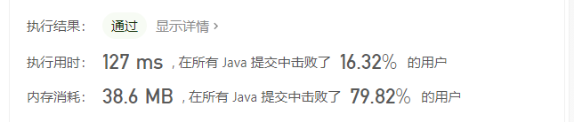

### 快慢指针

#### [202. 快乐数](https://leetcode-cn.com/problems/happy-number/)

难度简单536

编写一个算法来判断一个数 `n` 是不是快乐数。

「快乐数」定义为：

- 对于一个正整数，每一次将该数替换为它每个位置上的数字的平方和。
- 然后重复这个过程直到这个数变为 1，也可能是 **无限循环** 但始终变不到 1。
- 如果 **可以变为** 1，那么这个数就是快乐数。

如果 `n` 是快乐数就返回 `true` ；不是，则返回 `false` 。

 

**示例 1：**

```
输入：19
输出：true
解释：
12 + 92 = 82
82 + 22 = 68
62 + 82 = 100
12 + 02 + 02 = 1
```

**示例 2：**

```
输入：n = 2
输出：false
```

 

**提示：**

- `1 <= n <= 231 - 1`

```java
class Solution {

    public int squareNumber(int n) {
        int res = 0;
        while(n > 0) {
            res += (n % 10) * (n % 10);
            n = n / 10;
        }
        return res;
    }
    public boolean isHappy(int n) {
        int slow = n, fast = squareNumber(n);
        while(slow != fast) {
            slow = squareNumber(slow);
            fast = squareNumber(squareNumber(fast));
        }
        return slow == 1;
    }
}
```


#### [141. 环形链表](https://leetcode-cn.com/problems/linked-list-cycle/)

难度简单934

给定一个链表，判断链表中是否有环。

如果链表中有某个节点，可以通过连续跟踪 `next` 指针再次到达，则链表中存在环。 为了表示给定链表中的环，我们使用整数 `pos` 来表示链表尾连接到链表中的位置（索引从 0 开始）。 如果 `pos` 是 `-1`，则在该链表中没有环。**注意：`pos` 不作为参数进行传递**，仅仅是为了标识链表的实际情况。

如果链表中存在环，则返回 `true` 。 否则，返回 `false` 。

 

**进阶：**

你能用 *O(1)*（即，常量）内存解决此问题吗？

 

**示例 1：**


```
输入：head = [3,2,0,-4], pos = 1
输出：true
解释：链表中有一个环，其尾部连接到第二个节点。
```

**示例 2：**


```
输入：head = [1,2], pos = 0
输出：true
解释：链表中有一个环，其尾部连接到第一个节点。
```

**示例 3：**


```
输入：head = [1], pos = -1
输出：false
解释：链表中没有环。
```

 

**提示：**

- 链表中节点的数目范围是 `[0, 104]`
- `-105 <= Node.val <= 105`
- `pos` 为 `-1` 或者链表中的一个 **有效索引** 。


```java
public class Solution {
    public boolean hasCycle(ListNode head) {
        ListNode fast = head, slow = head;
        while(fast != null) {
            slow = slow.next;
            if(fast.next == null) {
                return false;
            } else {
                fast = fast.next.next;
            }

            if(fast == slow) {
                return true;
            }
        }
        return false;
    }
}
```


#### [142. 环形链表 II](https://leetcode-cn.com/problems/linked-list-cycle-ii/)

难度中等858

给定一个链表，返回链表开始入环的第一个节点。 如果链表无环，则返回 `null`。

为了表示给定链表中的环，我们使用整数 `pos` 来表示链表尾连接到链表中的位置（索引从 0 开始）。 如果 `pos` 是 `-1`，则在该链表中没有环。**注意，`pos` 仅仅是用于标识环的情况，并不会作为参数传递到函数中。**

**说明：**不允许修改给定的链表。

**进阶：**

- 你是否可以使用 `O(1)` 空间解决此题？

 

**示例 1：**


```
输入：head = [3,2,0,-4], pos = 1
输出：返回索引为 1 的链表节点
解释：链表中有一个环，其尾部连接到第二个节点。
```

**示例 2：**


```
输入：head = [1,2], pos = 0
输出：返回索引为 0 的链表节点
解释：链表中有一个环，其尾部连接到第一个节点。
```

**示例 3：**


```
输入：head = [1], pos = -1
输出：返回 null
解释：链表中没有环。
```

 

**提示：**

- 链表中节点的数目范围在范围 `[0, 104]` 内
- `-105 <= Node.val <= 105`
- `pos` 的值为 `-1` 或者链表中的一个有效索引


```java
public class Solution {
    public ListNode detectCycle(ListNode head) {
        ListNode fast = head, slow = head;
        while(fast != null) {
            slow = slow.next;
            if(fast.next == null) {
                return null;
            } else {
                fast = fast.next.next;
            }

            if(fast == slow) {
                ListNode node = head;
                while(node != slow) {
                    node = node.next;
                    slow = slow.next;
                }
                return slow;
            }
        }
        return null;
    }
}
```


# 三、程序猿的灵魂——设计结构


## [👉❓（未解决）146. LRU 缓存机制](https://leetcode-cn.com/problems/lru-cache/)

难度中等1133

运用你所掌握的数据结构，设计和实现一个 [LRU (最近最少使用) 缓存机制](https://baike.baidu.com/item/LRU) 。

实现 `LRUCache` 类：

- `LRUCache(int capacity)` 以正整数作为容量 `capacity` 初始化 LRU 缓存
- `int get(int key)` 如果关键字 `key` 存在于缓存中，则返回关键字的值，否则返回 `-1` 。
- `void put(int key, int value)` 如果关键字已经存在，则变更其数据值；如果关键字不存在，则插入该组「关键字-值」。当缓存容量达到上限时，它应该在写入新数据之前删除最久未使用的数据值，从而为新的数据值留出空间。

 

**进阶**：你是否可以在 `O(1)` 时间复杂度内完成这两种操作？

 

**示例：**

```
输入
["LRUCache", "put", "put", "get", "put", "get", "put", "get", "get", "get"]
[[2], [1, 1], [2, 2], [1], [3, 3], [2], [4, 4], [1], [3], [4]]
输出
[null, null, null, 1, null, -1, null, -1, 3, 4]

解释
LRUCache lRUCache = new LRUCache(2);
lRUCache.put(1, 1); // 缓存是 {1=1}
lRUCache.put(2, 2); // 缓存是 {1=1, 2=2}
lRUCache.get(1);    // 返回 1
lRUCache.put(3, 3); // 该操作会使得关键字 2 作废，缓存是 {1=1, 3=3}
lRUCache.get(2);    // 返回 -1 (未找到)
lRUCache.put(4, 4); // 该操作会使得关键字 1 作废，缓存是 {4=4, 3=3}
lRUCache.get(1);    // 返回 -1 (未找到)
lRUCache.get(3);    // 返回 3
lRUCache.get(4);    // 返回 4
```

 

**提示：**

- `1 <= capacity <= 3000`
- `0 <= key <= 3000`
- `0 <= value <= 104`
- 最多调用 `3 * 104` 次 `get` 和 `put`


## [30. 包含min函数的栈](https://leetcode-cn.com/problems/bao-han-minhan-shu-de-zhan-lcof/)

定义栈的数据结构，请在该类型中实现一个能够得到栈的最小元素的 min 函数在该栈中，调用 min、push 及 pop 的时间复杂度都是 O(1)。

 

**示例:**

```
MinStack minStack = new MinStack();
minStack.push(-2);
minStack.push(0);
minStack.push(-3);
minStack.min();   --> 返回 -3.
minStack.pop();
minStack.top();      --> 返回 0.
minStack.min();   --> 返回 -2.
```

 

**提示：**

1. 各函数的调用总次数不超过 20000 次

```java
class MinStack {

     Stack<Integer> stackA;
     Stack<Integer> stackB;

     public MinStack() {
         stackA = new Stack<>();
         stackB = new Stack<>();
     }

     public void push(int n) {
         stackA.push(n);
         if(stackB.isEmpty() || stackB.peek() >= n) {
             stackB.push(n);
         }
     }

     public int pop() {
         int temp = stackA.pop();
         if(temp == stackB.peek()) {
             temp = stackB.pop();
         } 
         return temp;
     }

     public int top() {
         return stackA.peek();
     }

     public int min() {
         return stackB.peek();
     }
      
}
```


## [❓208. 实现 Trie (前缀树)](https://leetcode-cn.com/problems/implement-trie-prefix-tree/)

难度中等518

实现一个 Trie (前缀树)，包含 `insert`, `search`, 和 `startsWith` 这三个操作。

**示例:**

```
Trie trie = new Trie();

trie.insert("apple");
trie.search("apple");   // 返回 true
trie.search("app");     // 返回 false
trie.startsWith("app"); // 返回 true
trie.insert("app");   
trie.search("app");     // 返回 true
```

**说明:**

- 你可以假设所有的输入都是由小写字母 `a-z` 构成的。
- 保证所有输入均为非空字符串。


## [❓341. 扁平化嵌套列表迭代器](https://leetcode-cn.com/problems/flatten-nested-list-iterator/)

难度中等195

给你一个嵌套的整型列表。请你设计一个迭代器，使其能够遍历这个整型列表中的所有整数。

列表中的每一项或者为一个整数，或者是另一个列表。其中列表的元素也可能是整数或是其他列表。

 

**示例 1:**

```
输入: [[1,1],2,[1,1]]
输出: [1,1,2,1,1]
解释: 通过重复调用 next 直到 hasNext 返回 false，next 返回的元素的顺序应该是: [1,1,2,1,1]。
```

**示例 2:**

```
输入: [1,[4,[6]]]
输出: [1,4,6]
解释: 通过重复调用 next 直到 hasNext 返回 false，next 返回的元素的顺序应该是: [1,4,6]。
```

# 🧞‍补录I——那些奇形怪状的鬼

## [49. 字母异位词分组](https://leetcode-cn.com/problems/group-anagrams/)

难度中等646

给定一个字符串数组，将字母异位词组合在一起。字母异位词指字母相同，但排列不同的字符串。

**示例:**

```
输入: ["eat", "tea", "tan", "ate", "nat", "bat"]
输出:
[
  ["ate","eat","tea"],
  ["nat","tan"],
  ["bat"]
]
```

**说明：**

- 所有输入均为小写字母。
- 不考虑答案输出的顺序。

```java
class Solution {
    public List<List<String>> groupAnagrams(String[] strs) {
        Map<String, List<String>> map = new HashMap<>();
        List<List<String>> resList = new ArrayList<>();
        for(String s : strs) {
            char[] array = s.toCharArray();
            Arrays.sort(array);
            String key = String.valueOf(array);
            if(map.containsKey(key)) {
                (map.get(key)).add(s);
            } else {
                List<String> tempList = new ArrayList<>();
                tempList.add(s);
                map.put(key, tempList);
            }
        }
        for(List<String> node : map.values()) {
            resList.add(node);

        }
        return resList;
    }
}
```


构造伪哈希码

```java
class Solution {
    public List<List<String>> groupAnagrams(String[] strs) {
        Map<String, List<String>> map = new HashMap<>();
        List<List<String>> resList = new ArrayList<>();
        int[][] letters = new int[strs.length][26];
        for(int i = 0; i < strs.length; i++) {
            String s = strs[i];
            for(int j = 0; j < s.length(); j++) {
                char t = s.charAt(j);
                letters[i][t - 'a']++;
            }
        }
        for(int i = 0; i < letters.length; i++) {
            StringBuilder sb = new StringBuilder();
            for(int j = 0; j < 26; j++) {
                char t = (char)('a' + j);
                sb.append(t);
                sb.append(letters[i][j]);
            }
            String key = sb.toString();
            if(map.containsKey(key)) {
                (map.get(key)).add(strs[i]);
            } else {
                List<String> temp = new ArrayList<>();
                temp.add(strs[i]);
                map.put(key, temp);
            }
        }
        for(List<String> node : map.values()) {
            resList.add(node);
        }
        return resList;
    }
}
```


## [❓（自己做的只有5%通过）438. 找到字符串中所有字母异位词](https://leetcode-cn.com/problems/find-all-anagrams-in-a-string/)

难度中等461

给定一个字符串 **s** 和一个非空字符串 **p**，找到 **s** 中所有是 **p** 的字母异位词的子串，返回这些子串的起始索引。

字符串只包含小写英文字母，并且字符串 **s** 和 **p** 的长度都不超过 20100。

**说明：**

- 字母异位词指字母相同，但排列不同的字符串。
- 不考虑答案输出的顺序。

**示例 1:**

```
输入:
s: "cbaebabacd" p: "abc"

输出:
[0, 6]

解释:
起始索引等于 0 的子串是 "cba", 它是 "abc" 的字母异位词。
起始索引等于 6 的子串是 "bac", 它是 "abc" 的字母异位词。
```

 **示例 2:**

```
输入:
s: "abab" p: "ab"

输出:
[0, 1, 2]

解释:
起始索引等于 0 的子串是 "ab", 它是 "ab" 的字母异位词。
起始索引等于 1 的子串是 "ba", 它是 "ab" 的字母异位词。
起始索引等于 2 的子串是 "ab", 它是 "ab" 的字母异位词。
```

## [56. 合并区间](https://leetcode-cn.com/problems/merge-intervals/)

难度中等792

以数组 `intervals` 表示若干个区间的集合，其中单个区间为 `intervals[i] = [starti, endi]` 。请你合并所有重叠的区间，并返回一个不重叠的区间数组，该数组需恰好覆盖输入中的所有区间。

 

**示例 1：**

```
输入：intervals = [[1,3],[2,6],[8,10],[15,18]]
输出：[[1,6],[8,10],[15,18]]
解释：区间 [1,3] 和 [2,6] 重叠, 将它们合并为 [1,6].
```

**示例 2：**

```
输入：intervals = [[1,4],[4,5]]
输出：[[1,5]]
解释：区间 [1,4] 和 [4,5] 可被视为重叠区间。
```

 

**提示：**

- `1 <= intervals.length <= 104`
- `intervals[i].length == 2`
- `0 <= starti <= endi <= 104`

```java
public class _56_MergeIntervals {

    public static void main(String[] args) {
        _56_MergeIntervals mergeIntervals = new _56_MergeIntervals();
        //int[][] merge = mergeIntervals.merge(new int[][]{{2, 3}, {4, 5}, {6, 7}, {8, 9}, {1, 10}});
        //int[][] merge = mergeIntervals.merge(new int[][]{{1, 3}, {2, 6}, {8, 10}, {15, 18}});
        int[][] merge = mergeIntervals.merge(new int[][]{{1, 4}, {4, 5}});
        System.out.println(Arrays.deepToString(merge));
    }

    /**
     * 执行用时：
     * 6 ms
     * , 在所有 Java 提交中击败了
     * 95.58%
     * 的用户
     * 内存消耗：
     * 41.1 MB
     * , 在所有 Java 提交中击败了
     * 70.20%
     * 的用户
     * @param intervals
     * @return
     */
    public int[][] merge(int[][] intervals) {
        Arrays.sort(intervals, (o1, o2) -> o1[0] - o2[0]);
        List<int[]> resList = new ArrayList<>();

        int[] temp = new int[]{intervals[0][0], intervals[0][1]};
        for(int i = 1; i < intervals.length; i++) {
            if (intervals[i][0] <= temp[1]) {
                temp[1] = Math.max(intervals[i][1], temp[1]);
            } else {
                resList.add(temp);
                temp = new int[]{intervals[i][0], intervals[i][1]};
            }
        }
        resList.add(temp);
        return resList.toArray(new int[resList.size()][]);
    }

}

```

## [❓621. 任务调度器](https://leetcode-cn.com/problems/task-scheduler/)

难度中等576

给你一个用字符数组 `tasks` 表示的 CPU 需要执行的任务列表。其中每个字母表示一种不同种类的任务。任务可以以任意顺序执行，并且每个任务都可以在 1 个单位时间内执行完。在任何一个单位时间，CPU 可以完成一个任务，或者处于待命状态。

然而，两个 **相同种类** 的任务之间必须有长度为整数 `n` 的冷却时间，因此至少有连续 `n` 个单位时间内 CPU 在执行不同的任务，或者在待命状态。

你需要计算完成所有任务所需要的 **最短时间** 。

 

**示例 1：**

```
输入：tasks = ["A","A","A","B","B","B"], n = 2
输出：8
解释：A -> B -> (待命) -> A -> B -> (待命) -> A -> B
     在本示例中，两个相同类型任务之间必须间隔长度为 n = 2 的冷却时间，而执行一个任务只需要一个单位时间，所以中间出现了（待命）状态。 
```

**示例 2：**

```
输入：tasks = ["A","A","A","B","B","B"], n = 0
输出：6
解释：在这种情况下，任何大小为 6 的排列都可以满足要求，因为 n = 0
["A","A","A","B","B","B"]
["A","B","A","B","A","B"]
["B","B","B","A","A","A"]
...
诸如此类
```

**示例 3：**

```
输入：tasks = ["A","A","A","A","A","A","B","C","D","E","F","G"], n = 2
输出：16
解释：一种可能的解决方案是：
     A -> B -> C -> A -> D -> E -> A -> F -> G -> A -> (待命) -> (待命) -> A -> (待命) -> (待命) -> A
```

 

**提示：**

- `1 <= task.length <= 104`
- `tasks[i]` 是大写英文字母
- `n` 的取值范围为 `[0, 100]`

通过次数57,056

提交次数102,609


## [80. 删除排序数组中的重复项 II](https://leetcode-cn.com/problems/remove-duplicates-from-sorted-array-ii/)

难度中等375收藏分享切换为英文接收动态反馈

给定一个增序排列数组 `nums` ，你需要在 **[原地 ](http://baike.baidu.com/item/原地算法)**删除重复出现的元素，使得每个元素最多出现两次，返回移除后数组的新长度。

不要使用额外的数组空间，你必须在 **[原地](https://baike.baidu.com/item/原地算法) 修改输入数组** 并在使用 O(1) 额外空间的条件下完成。

 

**说明：**

为什么返回数值是整数，但输出的答案是数组呢？

请注意，输入数组是以**“引用”**方式传递的，这意味着在函数里修改输入数组对于调用者是可见的。

你可以想象内部操作如下：

```
// nums 是以“引用”方式传递的。也就是说，不对实参做任何拷贝
int len = removeDuplicates(nums);

// 在函数里修改输入数组对于调用者是可见的。
// 根据你的函数返回的长度, 它会打印出数组中该长度范围内的所有元素。
for (int i = 0; i < len; i++) {
    print(nums[i]);
}
```

 

**示例 1：**

```
输入：nums = [1,1,1,2,2,3]
输出：5, nums = [1,1,2,2,3]
解释：函数应返回新长度 length = 5, 并且原数组的前五个元素被修改为 1, 1, 2, 2, 3 。 你不需要考虑数组中超出新长度后面的元素。
```

**示例 2：**

```
输入：nums = [0,0,1,1,1,1,2,3,3]
输出：7, nums = [0,0,1,1,2,3,3]
解释：函数应返回新长度 length = 7, 并且原数组的前五个元素被修改为 0, 0, 1, 1, 2, 3, 3 。 你不需要考虑数组中超出新长度后面的元素。
```

 

**提示：**

- `0 <= nums.length <= 3 * 104`
- `-104 <= nums[i] <= 104`
- `nums` 按递增顺序排列

代码来源：

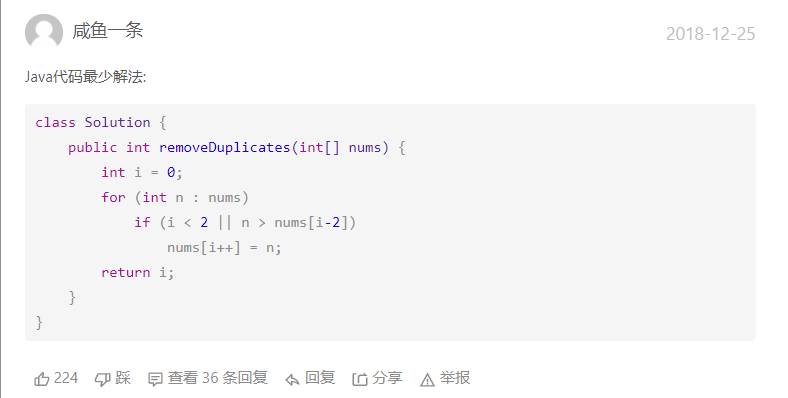

```java
class Solution {
    public int removeDuplicates(int[] nums) {
        int i = 0;
        for(int n : nums) {
            if(i < 2 || n > nums[i - 2]) {
                nums[i++] = n;
            }
        }
        return i;
    }
}
```

`解析`:

`i`指针指向每一个合适的位置。比如`1,1,1,2,3,4,4,5`这样一个数组，刚开始的时候`i`是正常的递增，然后在第三个`1`处停下，等待`n`的遍历，当我们发现当前的`n`是一个正常的值（`n`比往前数第二个数要大），所以我们把正常的值赋给`i`指针，`i`指针永远跟不上`n`的脚步了，就相当于是把整个数组从下标为3的地方开始往前挪了一位。如果再出现超过三个相同的，`i`又会停滞，整体继续前挪。

# 补录II——排序算法

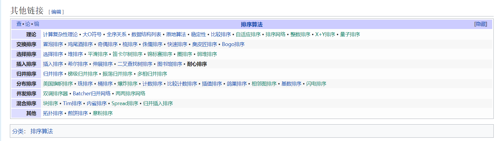


[[隐藏](https://zh.wikipedia.org/wiki/耐心排序#)][查](https://zh.wikipedia.org/wiki/Template:排序算法)[论](https://zh.wikipedia.org/wiki/Template_talk:排序算法)[编](https://zh.wikipedia.org/w/index.php?title=Template:排序算法&action=edit)[排序算法](https://zh.wikipedia.org/wiki/排序算法)理论[计算复杂性理论](https://zh.wikipedia.org/wiki/计算复杂性理论)[大O符号](https://zh.wikipedia.org/wiki/大O符号)[全序关系](https://zh.wikipedia.org/wiki/全序关系)[数据结构列表](https://zh.wikipedia.org/wiki/数据结构列表)[原地算法](https://zh.wikipedia.org/wiki/原地算法)[稳定性](https://zh.wikipedia.org/wiki/排序算法#稳定性)[比较排序](https://zh.wikipedia.org/wiki/比较排序)[自适应排序](https://zh.wikipedia.org/w/index.php?title=自适应排序&action=edit&redlink=1)[排序网络](https://zh.wikipedia.org/w/index.php?title=排序网络&action=edit&redlink=1)[整数排序](https://zh.wikipedia.org/w/index.php?title=整数排序&action=edit&redlink=1)[X+Y排序](https://zh.wikipedia.org/w/index.php?title=X%2BY排序&action=edit&redlink=1)[量子排序](https://zh.wikipedia.org/w/index.php?title=量子排序&action=edit&redlink=1)交换排序[冒泡排序](https://zh.wikipedia.org/wiki/冒泡排序)[鸡尾酒排序](https://zh.wikipedia.org/wiki/鸡尾酒排序)[奇偶排序](https://zh.wikipedia.org/wiki/奇偶排序)[梳排序](https://zh.wikipedia.org/wiki/梳排序)[侏儒排序](https://zh.wikipedia.org/wiki/侏儒排序)[快速排序](https://zh.wikipedia.org/wiki/快速排序)[臭皮匠排序](https://zh.wikipedia.org/wiki/臭皮匠排序)[Bogo排序](https://zh.wikipedia.org/wiki/Bogo排序)选择排序[选择排序](https://zh.wikipedia.org/wiki/选择排序)[堆排序](https://zh.wikipedia.org/wiki/堆排序)[平滑排序](https://zh.wikipedia.org/w/index.php?title=平滑排序&action=edit&redlink=1)[笛卡尔树排序](https://zh.wikipedia.org/w/index.php?title=笛卡尔树排序&action=edit&redlink=1)[锦标赛排序](https://zh.wikipedia.org/w/index.php?title=锦标赛排序&action=edit&redlink=1)[圈排序](https://zh.wikipedia.org/w/index.php?title=圈排序&action=edit&redlink=1)[弱堆排序](https://zh.wikipedia.org/w/index.php?title=弱堆排序&action=edit&redlink=1)插入排序[插入排序](https://zh.wikipedia.org/wiki/插入排序)[希尔排序](https://zh.wikipedia.org/wiki/希尔排序)[伸展排序](https://zh.wikipedia.org/wiki/伸展樹)[二叉查找树排序](https://zh.wikipedia.org/wiki/二元搜尋樹)[图书馆排序](https://zh.wikipedia.org/wiki/图书馆排序)耐心排序归并排序[归并排序](https://zh.wikipedia.org/wiki/归并排序)[梯级归并排序](https://zh.wikipedia.org/w/index.php?title=梯级归并排序&action=edit&redlink=1)[振荡归并排序](https://zh.wikipedia.org/w/index.php?title=振荡归并排序&action=edit&redlink=1)[多相归并排序](https://zh.wikipedia.org/w/index.php?title=多相归并排序&action=edit&redlink=1)分布排序[美国旗帜排序](https://zh.wikipedia.org/w/index.php?title=美国旗帜排序&action=edit&redlink=1)[珠排序](https://zh.wikipedia.org/wiki/珠排序)[桶排序](https://zh.wikipedia.org/wiki/桶排序)[爆炸排序](https://zh.wikipedia.org/w/index.php?title=爆炸排序&action=edit&redlink=1)[计数排序](https://zh.wikipedia.org/wiki/计数排序)[比较计数排序](https://zh.wikipedia.org/wiki/比較計數排序)[插值排序](https://zh.wikipedia.org/wiki/插值排序)[鸽巢排序](https://zh.wikipedia.org/wiki/鸽巢排序)[相邻图排序](https://zh.wikipedia.org/w/index.php?title=相邻图排序&action=edit&redlink=1)[基数排序](https://zh.wikipedia.org/wiki/基数排序)[闪电排序](https://zh.wikipedia.org/w/index.php?title=闪电排序&action=edit&redlink=1)并发排序[双调排序器](https://zh.wikipedia.org/w/index.php?title=双调排序器&action=edit&redlink=1)[Batcher归并网络](https://zh.wikipedia.org/wiki/Batcher归并网络)[两两排序网络](https://zh.wikipedia.org/w/index.php?title=两两排序网络&action=edit&redlink=1)混合排序[块排序](https://zh.wikipedia.org/w/index.php?title=塊排序&action=edit&redlink=1)[Tim排序](https://zh.wikipedia.org/wiki/Timsort)[内省排序](https://zh.wikipedia.org/wiki/Introsort)[Spread排序](https://zh.wikipedia.org/w/index.php?title=Spread排序&action=edit&redlink=1)[归并插入排序](https://zh.wikipedia.org/w/index.php?title=归并插入排序&action=edit&redlink=1)其他[拓扑排序](https://zh.wikipedia.org/wiki/拓扑排序)[煎饼排序](https://zh.wikipedia.org/wiki/煎餅排序)[意粉排序](https://zh.wikipedia.org/w/index.php?title=意粉排序&action=edit&redlink=1)

[分类](https://zh.wikipedia.org/wiki/Special:页面分类)：

- [排序算法](https://zh.wikipedia.org/wiki/Category:排序算法)

## 1.快排

### [（快速排序）179. 最大数](https://leetcode-cn.com/problems/largest-number/)

难度中等462

给定一组非负整数 `nums`，重新排列它们每个数字的顺序（每个数字不可拆分）使之组成一个最大的整数。

**注意：**输出结果可能非常大，所以你需要返回一个字符串而不是整数。

 

**示例 1：**

```
输入：nums = [10,2]
输出："210"
```

**示例 2：**

```
输入：nums = [3,30,34,5,9]
输出："9534330"
```

**示例 3：**

```
输入：nums = [1]
输出："1"
```

**示例 4：**

```
输入：nums = [10]
输出："10"
```

 

**提示：**

- `1 <= nums.length <= 100`
- `0 <= nums[i] <= 109`

```java
class Solution {
    public String largestNumber(int[] nums) {
        String[] strNums = new String[nums.length];
        for(int i = 0; i < nums.length; i++) {
            strNums[i] = String.valueOf(nums[i]);
        }
        quickSort(strNums, 0, strNums.length - 1);
        StringBuilder sb = new StringBuilder();
        for(String s : strNums) {
            sb.append(s);
        }
        String res = sb.toString();
        return res.charAt(0) == '0' ? "0" : res;
    }

    public void quickSort(String[] array, int left, int right) {
        if(left < right) {
            int pivot = partition(array, left, right);
            quickSort(array, left, pivot - 1);
            quickSort(array, pivot + 1, right);
        }
    }

    public int partition(String[] array, int left, int right) {
        int pivot = left;
        int index = left + 1;
        for(int i = index; i <= right; i++) {
            if((array[i] + array[pivot]).compareTo(array[pivot] + array[i]) >= 0) {
                swap(array, i, index);
                index++;
            }
        }
        swap(array, pivot, index - 1);
        return index - 1;
    }

    public void swap(String[] array, int a, int b) {
        String temp = array[a];
        array[a] = array[b];
        array[b] = temp;
    }
}
```


### [（快速排序）剑指 Offer 45. 把数组排成最小的数](https://leetcode-cn.com/problems/ba-shu-zu-pai-cheng-zui-xiao-de-shu-lcof/)

难度中等158

输入一个非负整数数组，把数组里所有数字拼接起来排成一个数，打印能拼接出的所有数字中最小的一个。

 

**示例 1:**

```
输入: [10,2]
输出: "102"
```

**示例 2:**

```
输入: [3,30,34,5,9]
输出: "3033459"
```

 

**提示:**

- `0 < nums.length <= 100`

**说明:**

- 输出结果可能非常大，所以你需要返回一个字符串而不是整数
- 拼接起来的数字可能会有前导 0，最后结果不需要去掉前导 0

```java
class Solution {
    public String minNumber(int[] nums) {
        String[] strArray = new String[nums.length];
        for (int i = 0; i < nums.length; i++) {
            strArray[i] = String.valueOf(nums[i]);
        }
        quickSort(strArray, 0, strArray.length - 1);
        StringBuilder sb = new StringBuilder();
        for(String s : strArray) {
            sb.append(s);
        }
        return sb.toString();
    }

    public void quickSort(String[] array, int left, int right) {
        if(left < right) {
            int pivot = partition(array, left, right);
            quickSort(array, left, pivot - 1);
            quickSort(array, pivot + 1, right);
        }
        
    }

    public int partition(String[] array, int left, int right) {

        int pivot = left;
        int index = pivot + 1;
        for(int i = index; i <= right; i++) {
            if((array[i] + array[pivot]).compareTo(array[pivot] + array[i]) <= 0) {
                swap(index, i, array);
                index++;
            }
        }
        swap(pivot, index - 1, array);
        return index - 1;
    }

    public void swap(int a, int b, String[] arr) {
        String temp = arr[a];
        arr[a] = arr[b];
        arr[b] = temp;
    }
}
```

## 2.归并

### [21. 合并两个有序链表](https://leetcode-cn.com/problems/merge-two-sorted-lists/)

难度简单1509收藏分享切换为英文接收动态反馈

将两个升序链表合并为一个新的 **升序** 链表并返回。新链表是通过拼接给定的两个链表的所有节点组成的。 

 

**示例 1：**


```
输入：l1 = [1,2,4], l2 = [1,3,4]
输出：[1,1,2,3,4,4]
```

**示例 2：**

```
输入：l1 = [], l2 = []
输出：[]
```

**示例 3：**

```
输入：l1 = [], l2 = [0]
输出：[0]
```

 

**提示：**

- 两个链表的节点数目范围是 `[0, 50]`
- `-100 <= Node.val <= 100`
- `l1` 和 `l2` 均按 **非递减顺序** 排列


```java
class Solution {
    public ListNode mergeTwoLists(ListNode l1, ListNode l2) {
        ListNode dum = new ListNode(0);
        ListNode node = dum;
        while(l1 != null && l2 != null) {
            if(l1.val <= l2.val) {
                node.next = l1;
                l1 = l1.next;
            } else {
                node.next = l2;
                l2 = l2.next;
            }
            node = node.next;
        }
        if(l1 != null) {
            node.next = l1;
        } else {
            node.next = l2;
        }
        return dum.next;
    }
}
```


### [23. 合并K个升序链表](https://leetcode-cn.com/problems/merge-k-sorted-lists/)

难度困难1115收藏分享切换为英文接收动态反馈

给你一个链表数组，每个链表都已经按升序排列。

请你将所有链表合并到一个升序链表中，返回合并后的链表。

 

**示例 1：**

```
输入：lists = [[1,4,5],[1,3,4],[2,6]]
输出：[1,1,2,3,4,4,5,6]
解释：链表数组如下：
[
  1->4->5,
  1->3->4,
  2->6
]
将它们合并到一个有序链表中得到。
1->1->2->3->4->4->5->6
```

**示例 2：**

```
输入：lists = []
输出：[]
```

**示例 3：**

```
输入：lists = [[]]
输出：[]
```

 

**提示：**

- `k == lists.length`
- `0 <= k <= 10^4`
- `0 <= lists[i].length <= 500`
- `-10^4 <= lists[i][j] <= 10^4`
- `lists[i]` 按 **升序** 排列
- `lists[i].length` 的总和不超过 `10^4`


```java
/**
 * Definition for singly-linked list.
 * public class ListNode {
 *     int val;
 *     ListNode next;
 *     ListNode() {}
 *     ListNode(int val) { this.val = val; }
 *     ListNode(int val, ListNode next) { this.val = val; this.next = next; }
 * }
 */
//动态规划
class Solution {
    public ListNode mergeKLists(ListNode[] lists) {
        return merge(0, lists.length - 1, lists);
    }
    public ListNode merge(int left, int right, ListNode[] lists) {
        if (left == right) {
            return lists[left];
        }
        if(left > right) {
            return null;
        }
        int mid = (left + right) >> 1;
        return mergeTwoLists(merge(left, mid, lists), merge(mid + 1, right, lists));
    }
    
    public ListNode mergeTwoLists(ListNode a, ListNode b) {
        ListNode dum = new ListNode(0);
        ListNode node = dum;
        while(a != null && b != null) {
            if(a.val <= b.val) {
                node.next = a;
                a = a.next;
            } else {
                node.next = b;
                b = b.next;
            }
            node = node.next;
        }
        node.next = (a == null ? b : a);
        return dum.next;
    }
}
```


```java
//优先队列
/**
 * Definition for singly-linked list.
 * public class ListNode {
 *     int val;
 *     ListNode next;
 *     ListNode() {}
 *     ListNode(int val) { this.val = val; }
 *     ListNode(int val, ListNode next) { this.val = val; this.next = next; }
 * }
 */
class Solution {
    public ListNode mergeKLists(ListNode[] lists) {
        if(lists.length == 0) {
            return null;
        }
        PriorityQueue<ListNode> queue = new PriorityQueue<>((x,y) -> x.val - y.val);
        for(ListNode node : lists) {
            if(node != null) {
                queue.offer(node);
            }
        }
        ListNode dum = new ListNode(0);
        ListNode node = dum;
        while(!queue.isEmpty()) {
            node.next = queue.poll();
            node = node.next;
            if(node.next != null) {
                queue.offer(node.next);
            }
        }
        return dum.next;
    }

}
```

### [378. 有序矩阵中第 K 小的元素](https://leetcode-cn.com/problems/kth-smallest-element-in-a-sorted-matrix/)

难度中等535

给你一个 `n x n` 矩阵 `matrix` ，其中每行和每列元素均按升序排序，找到矩阵中第 `k` 小的元素。
请注意，它是 **排序后** 的第 `k` 小元素，而不是第 `k` 个 **不同** 的元素。

 

**示例 1：**

```
输入：matrix = [[1,5,9],[10,11,13],[12,13,15]], k = 8
输出：13
解释：矩阵中的元素为 [1,5,9,10,11,12,13,13,15]，第 8 小元素是 13
```

**示例 2：**

```
输入：matrix = [[-5]], k = 1
输出：-5
```

 

**提示：**

- `n == matrix.length`
- `n == matrix[i].length`
- `1 <= n <= 300`
- `-109 <= matrix[i][j] <= -109`
- 题目数据 **保证** `matrix` 中的所有行和列都按 **非递减顺序** 排列
- `1 <= k <= n2`

```java
class Solution {
    public int kthSmallest(int[][] matrix, int k) {
        PriorityQueue<int[]> queue = new PriorityQueue<>((o1, o2) -> o1[0] - o2[0]);
        int row = matrix.length;
        int col = matrix[0].length;
        for(int i = 0; i < row; i++) {
            queue.add(new int[]{matrix[i][0], i, 0});
        }
        for(int i = 0; i < k - 1; i++) {
            int[] tempList = queue.poll();
            if(tempList[2] < col - 1) {
                queue.add(new int[]{matrix[tempList[1]][tempList[2] + 1], tempList[1], tempList[2] + 1});
            }
        }
        return queue.poll()[0];
    }
}
```


# 补录III——查找算法

## 二分查找

### [33. 搜索旋转排序数组](https://leetcode-cn.com/problems/search-in-rotated-sorted-array/)

难度中等1197

整数数组 `nums` 按升序排列，数组中的值 **互不相同** 。

在传递给函数之前，`nums` 在预先未知的某个下标 `k`（`0 <= k < nums.length`）上进行了 **旋转**，使数组变为 `[nums[k], nums[k+1], ..., nums[n-1], nums[0], nums[1], ..., nums[k-1]]`（下标 **从 0 开始** 计数）。例如， `[0,1,2,4,5,6,7]` 在下标 `3` 处经旋转后可能变为 `[4,5,6,7,0,1,2]` 。

给你 **旋转后** 的数组 `nums` 和一个整数 `target` ，如果 `nums` 中存在这个目标值 `target` ，则返回它的索引，否则返回 `-1` 。

 

**示例 1：**

```
输入：nums = [4,5,6,7,0,1,2], target = 0
输出：4
```

**示例 2：**

```
输入：nums = [4,5,6,7,0,1,2], target = 3
输出：-1
```

**示例 3：**

```
输入：nums = [1], target = 0
输出：-1
```

 

**提示：**

- `1 <= nums.length <= 5000`
- `-10^4 <= nums[i] <= 10^4`
- `nums` 中的每个值都 **独一无二**
- `nums` 肯定会在某个点上旋转
- `-10^4 <= target <= 10^4`

 

**进阶：**你可以设计一个时间复杂度为 `O(log n)` 的解决方案吗？

# 补录III——一些术语名词


## ❓并查集

### 例一

#### [200. 岛屿数量](https://leetcode-cn.com/problems/number-of-islands/)

难度中等966

给你一个由 `'1'`（陆地）和 `'0'`（水）组成的的二维网格，请你计算网格中岛屿的数量。

岛屿总是被水包围，并且每座岛屿只能由水平方向和/或竖直方向上相邻的陆地连接形成。

此外，你可以假设该网格的四条边均被水包围。

 

**示例 1：**

```
输入：grid = [
  ["1","1","1","1","0"],
  ["1","1","0","1","0"],
  ["1","1","0","0","0"],
  ["0","0","0","0","0"]
]
输出：1
```

**示例 2：**

```
输入：grid = [
  ["1","1","0","0","0"],
  ["1","1","0","0","0"],
  ["0","0","1","0","0"],
  ["0","0","0","1","1"]
]
输出：3
```

 

**提示：**

- `m == grid.length`
- `n == grid[i].length`
- `1 <= m, n <= 300`
- `grid[i][j]` 的值为 `'0'` 或 `'1'`


```java
class Solution {
    class UnionFind {
        int count;
        int[] parent;
        int[] rank;

        public UnionFind(char[][] grid) {
            count = 0;
            int m = grid.length;
            int n = grid[0].length;
            parent = new int[m * n];
            rank = new int[m * n];
            for (int i = 0; i < m; ++i) {
                for (int j = 0; j < n; ++j) {
                    if (grid[i][j] == '1') {
                        parent[i * n + j] = i * n + j;
                        ++count;
                    }
                    rank[i * n + j] = 0;
                }
            }
        }

        public int find(int i) {
            if (parent[i] != i) parent[i] = find(parent[i]);
            return parent[i];
        }

        public void union(int x, int y) {
            int rootx = find(x);
            int rooty = find(y);
            if (rootx != rooty) {
                if (rank[rootx] > rank[rooty]) {
                    parent[rooty] = rootx;
                } else if (rank[rootx] < rank[rooty]) {
                    parent[rootx] = rooty;
                } else {
                    parent[rooty] = rootx;
                    rank[rootx] += 1;
                }
                --count;
            }
        }

        public int getCount() {
            return count;
        }
    }

    public int numIslands(char[][] grid) {
        if (grid == null || grid.length == 0) {
            return 0;
        }

        int nr = grid.length;
        int nc = grid[0].length;
        int num_islands = 0;
        UnionFind uf = new UnionFind(grid);
        for (int r = 0; r < nr; ++r) {
            for (int c = 0; c < nc; ++c) {
                if (grid[r][c] == '1') {
                    grid[r][c] = '0';
                    if (r - 1 >= 0 && grid[r-1][c] == '1') {
                        uf.union(r * nc + c, (r-1) * nc + c);
                    }
                    if (r + 1 < nr && grid[r+1][c] == '1') {
                        uf.union(r * nc + c, (r+1) * nc + c);
                    }
                    if (c - 1 >= 0 && grid[r][c-1] == '1') {
                        uf.union(r * nc + c, r * nc + c - 1);
                    }
                    if (c + 1 < nc && grid[r][c+1] == '1') {
                        uf.union(r * nc + c, r * nc + c + 1);
                    }
                }
            }
        }

        return uf.getCount();
    }
}

作者：LeetCode
链接：https://leetcode-cn.com/problems/number-of-islands/solution/dao-yu-shu-liang-by-leetcode/
来源：力扣（LeetCode）
著作权归作者所有。商业转载请联系作者获得授权，非商业转载请注明出处。
```

## KMP算法


## Manacher算法


## 埃氏筛

### [204. 计数质数](https://leetcode-cn.com/problems/count-primes/)

难度简单631

统计所有小于非负整数 *`n`* 的质数的数量。

 

**示例 1：**

```
输入：n = 10
输出：4
解释：小于 10 的质数一共有 4 个, 它们是 2, 3, 5, 7 。
```

**示例 2：**

```
输入：n = 0
输出：0
```

**示例 3：**

```
输入：n = 1
输出：0
```

 

**提示：**

- `0 <= n <= 5 * 106`


```java
class Solution {
    public int countPrimes(int n) {
        int res = 0;
        boolean[] isPrime = new boolean[n];
        Arrays.fill(isPrime, true);
        for(int i = 2; i < n; i++) {
            if(isPrime[i]) {
                res++;
                if((long)i*i < n) {
                    for(int j = i * i; j < n; j += i) {
                        isPrime[j] = false;
                    }
                }
                
            }
        }
        return res;
    }   
}
```


## Floyd 判圈算法


## 快速选择、三分法


## [最长公共子序列](https://en.wikipedia.org/wiki/Longest_common_subsequence_problem)


## [编辑距离](https://en.wikipedia.org/wiki/Edit_distance)


