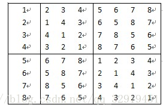
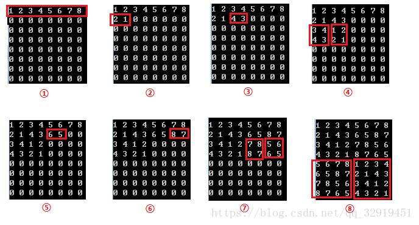
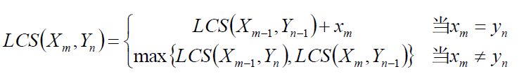
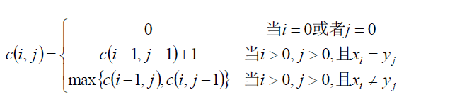
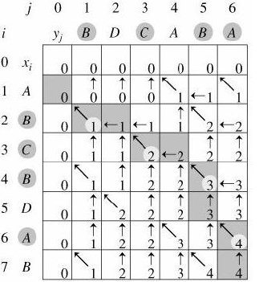
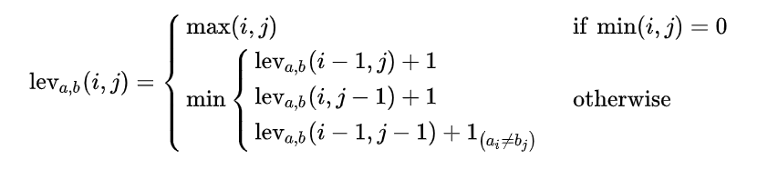
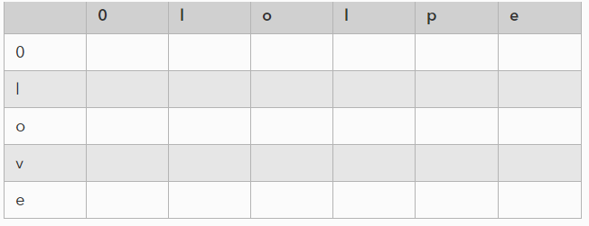
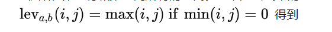
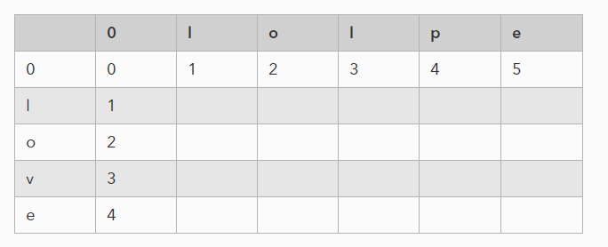
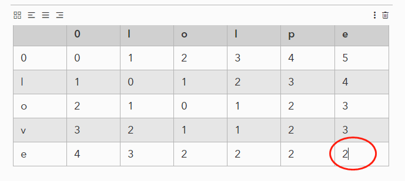

## 1. 循环赛日程表

一、 问题：

  设有n=2^k个运动员，要进行网球循环赛。现在要设计一个满足以下要求的比赛日程表

  （1）每个选手必须与其他n-1个选手各赛一场

  （2）每个选手一天只能赛一次

  （3）循环赛一共进行n-1天

将比赛日程表设计成n行n列，表中除了第一列，其他n-1列才是我们要的，数组下标行列都从0开始，第i行j列代表第（i+1）位选手在第j天的对手：



以8个选手为例子，下面是填表的步骤：



①我们先初始化第一行各个数为1~8；

②因为是递归，那么要填8x8的左下角和右下角，分别需要知道它的右上角和左上角

③而8x8的盒子它的左上角是一个4x4的盒子，要填4x4的左下角和右下角，也分别需要知道它的右上角和左上角

④现在递归到4x4的盒子的左上角，是一个2x2的盒子，它不需要递归了，直接沿对角线填左下角和右下角的数字，也就是上面的图②

⑤可以看到，经过上面的②③步，我们左上角4x4的盒子，它的·右上角和左上角已经知道了，那就可以沿对角线填它的左下角和右下角了，所以出现了图④

⑥其他的依次类推


通俗易懂地讲，就是如果你想填一个大的，你得先得出它左上角和右上角两个盒子，再沿对角线分别抄到右下角和左下角。而为了得出它左上角和右上角，就需要递归了。


## [2. 算法练习——最长公共子序列的问题(LCS)](https://www.cnblogs.com/xiaxj/p/7245840.html)

问题描述：

对于两个序列X和Y的公共子序列中，长度最长的那个，定义为X和Y的最长公共子序列。X  Y  各自字符串有顺序，但是不一定需要相邻。

最长公共子串(Longest Common Substring )：顺序相同，并且各个字符的位置也必须相邻。

最长公共子序列(Longest Common Subsequence，LCS )：顺序形同，各个字符的位置不一定相邻。

比如：

字符串 13455 与 245576 的最长公共子序列为455
字符串 acdfg 与 adfc 的最长公共子序列为adf    adf在acdfg中的顺序相同，但是不相邻。

 

### 2.1：暴力求解

即对X的每一个子序列，检查它是否也是Y的子序列，从而确定它是否为X和Y的公共子序列，并且在检查过程中选出最长的公共子序列。X和Y的所有子序列都检查过后即可求出X和Y的最长公共子序列。X的一个子序列相应于下标序列{1, 2, …, m}的一个子序列，因此，X共有2m个不同子序列（Y亦如此，如为2^n，每个元素都有取或者不取的情况），从而穷举搜索法需要指数时间（2^m * 2^n）。

### 2.2：动态规划 

先定义一些内容：定义两个字符串X,Y

Xi=<x1,x2.....xi> 表示字符串的 i 前缀

Yj = <y1,y2....yj> 表示字符串y的j前缀

用LCS(Xi,Yj) 表示字符串X，Y的最长公共子序列

**如果**：

- **Xm = Yn**（如果字符串X的第m位置上的字符等于字符串Y的第n个位置上的字符(下面类似，不再表述)）

则LCS(Xm,Yn) = LCS(Xm-1,Yn-1)+Xm

- **Xm != Yn**

则LCS(Xm,Yn) = LCS(Xm-1,Yn)  或者LCS(Xm,Yn)=LCS(Xm,Yn-1)

但是为了追求最大的公共子串则可以这么定义：LCS(Xm,Yn) = max { LCS ( Xm-1 , Yn ) , LCS( Xm , Yn-1 ) }

所以综上两种情况，我们可以得出如下的推导公式：



最后的**最长公共子序列 ，**为了将问题变成数学问题，可以这么定义上面的过程。

- 利用一个二维数组表示每一部分LCS的长度 c[m][n]
- 用c[i][j] 记录字符串Xi和Yj的最长公共子序列长度。

因此可以得到下面的推论：



为了方便表示，我们可以将字符的从1开始。

下面是一个实例图

对于 X = ABCBDAB

​    Y = BDCABA 

 

 

 

 ## 3. 0-1背包问题

类似的方法可以解决0-1背包问题，算法同样需要[伪多项式时间](https://zh.wikipedia.org/wiki/伪多项式时间)。我们同样假定*w1*, ..., *wn*和*W*都是正整数。我们将在总重量不超过*Y*的前提下，前*j*种物品的总价格所能达到的最高值定义为*A*(*j*, *Y*)。

*A*(*j*, *Y*)的递推关系为：

- *A*(0, *Y*) = 0
- 如果*wj* > *Y*, *A*(*j*, *Y*) = *A*(*j* - 1, *Y*)
- 如果*wj* ≤ *Y*, *A*(*j*, *Y*) = max { *A*(*j* - 1, *Y*), *pj* + *A*(*j* - 1, *Y* - *wj*)}

通过计算*A*(*n*, *W*)即得到最终结果。为提高算法性能，我们把先前计算的结果存入表中。因此算法需要的时间和空间都为O(*nW*)，通过对算法的改进，空间的消耗可以降至O(*W*)。

 

## 4.分支限界法简介

### 4.1 分支限界法的本质——通过限界阻塞子树

- 分支限界法通常仅关心使给定函数最大化或最小化。
- （**分支限界法的本质**）因此，如果算法找到了一个耗费为c的解，并且有一个部分解，它的耗费至少是c，那么就不会有该部分解的扩展生成。
- 在分支限界法中，每一个活结点只有一次机会成为扩展结点。活结点一旦成为扩展结点，就一次性产生其所有儿子结点。在这些儿子结点中，导致不可行解或导致非最优解的儿子结点被舍弃，其余儿子结点被加入活结点表中。
  然后，从活结点表中取下一节点（优先队列中最大或最小值）成为当前扩展结点，并重复上述扩展过程。这个过程一直持续到找到所需的解或活结点表为空时为止。
- （**分支限界法实现的本质**）对某个节点进行搜索时，先估算出目标的解，再确定是否向下搜索（选择最小损耗的结点进行搜索）
  在分支结点上，预先分别估算沿着它的各个儿子结点向下搜索的路径中，目标函数可能取得的界，然后把它的这些儿子结点和它们可能取得的界保存在一张结点表中，再从表中选择界最小或最大的结点向下搜索。一般采用优先队列维护这张表。

### 4.2 分支限界法与回溯法的区别

- 回溯法
  1）（求解目标）回溯法的求解目标是找出解空间中满足约束条件的一个解或所有解。
  2）（搜索方式深度优先）回溯法会搜索整个解空间，当不满条件时，丢弃，继续搜索下一个儿子结点，如果所有儿子结点都不满足，向上回溯到它的父节点。
- 分支限界法
  1）（求解目标）分支限界法的目标一般是在满足约束条件的解中找出在某种意义下的最优解，也有找出满足约束条件的一个解。
  2）（搜索方式）分支限界法以广度优先或以最小损耗优先的方式搜索解空间。
  3）常见的两种分支界限法
  a.队列式（FIFO）分支界限法（广度优先）：按照队列先进先出原则选取下一个结点为扩展结点
  b.优先队列式分支限界法（最小损耗优先）：按照优先队列规定的优先级选取优先级最高的结点成为当前扩展结点

### 4.3 下界或者上界估算——贪心

- 分支限界法对下界和上界的估算，总是采用贪心算法，选择当前最优作为界加入到优先队列

## 5. 编辑距离详解


### 定义

编辑距离,也叫莱文斯坦距离(Levenshtein),是针对二个[字符串](https://link.zhihu.com/?target=https%3A//baike.baidu.com/item/%E5%AD%97%E7%AC%A6%E4%B8%B2)（例如英文字）的差异程度的量化量测，量测方式是看至少需要多少次的处理才能将一个字符串变成另一个字符串。

### 例子

有一个字符串 a='love',b='lolpe'.那么计算a和b的编辑距离，就是要算出从a变化到 b需要经过多少个步骤。

1.love->lolve(插入l)

2.lolve->lolpe(用v替换成p)

那么我们就说他们的编辑距离为2

### 公式定义：



i和j分别表示字符串a和字符串b的下标。下标从1开始

## 具体运算过程

1.建立一个矩阵，用来存储上一步计算好的距离。



2.初始化第一行和第一列所有的距离。也就是公式中的 





3.然后开始循环计算所有的距离,直到最后一个字符、



所以，我们得到字符串a和b的编辑距离为2.

## 代码

```text
def lev(str_a,str_b):
    """
    ED距离，用来衡量单词之间的相似度
    :param str_a:
    :param str_b:
    :return:
    """
    str_a=str_a.lower()
    str_b=str_b.lower()
    matrix_ed=np.zeros((len(str_a)+1,len(str_b)+1),dtype=np.int)
    matrix_ed[0]=np.arange(len(str_b)+1)
    matrix_ed[:,0] = np.arange(len(str_a) + 1)
    for i in range(1,len(str_a)+1):
        for j in range(1,len(str_b)+1):
            # 表示删除a_i
            dist_1 = matrix_ed[i - 1, j] + 1
            # 表示插入b_i
            dist_2 = matrix_ed[i, j - 1] + 1
            # 表示替换b_i
            dist_3 = matrix_ed[i - 1, j - 1] + (1 if str_a[i - 1] != str_b[j - 1] else 0)
            #取最小距离
            matrix_ed[i,j]=np.min([dist_1, dist_2, dist_3])
    print(matrix_ed)
    return matrix_ed[-1,-1]
```

## 思考

1.假设字符串a='love',b='sffg',c='lovefghaa' 那么如果我们用上面计算出a和b,c的距离：

lev(a,b)=4,lev(a,c)=5

看到a和b的距离比a和c的距离要小，这种是不合理的。那么我们可以讲字符串替换的距离变大一点，改成2.

```text
dist_3 = matrix_ed[i - 1, j - 1] + (2 if str_a[i - 1] != str_b[j - 1] else 0)
```

这样子。就可以比较有效区分这种情况