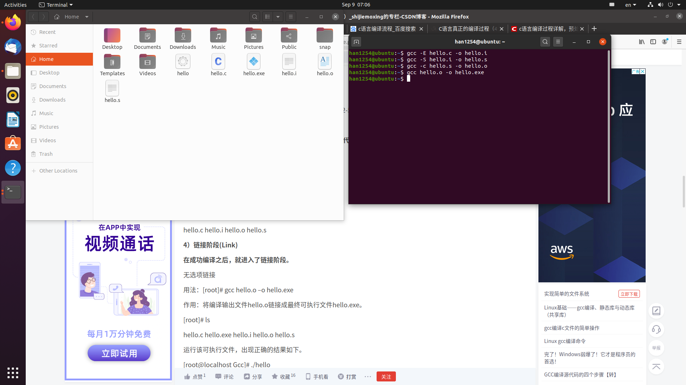
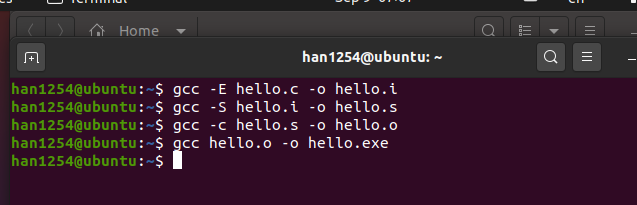
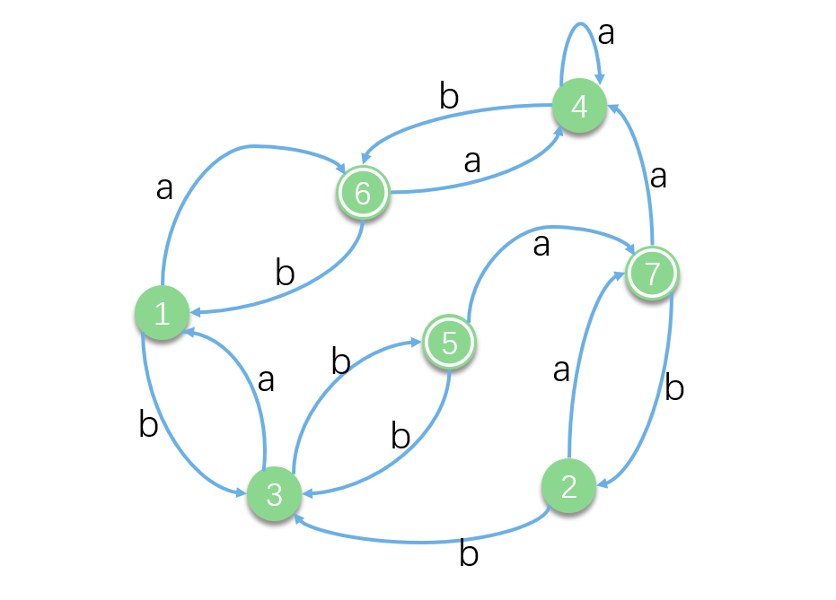
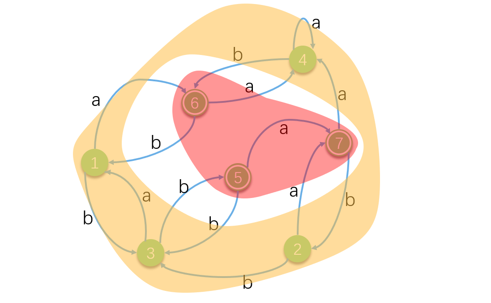
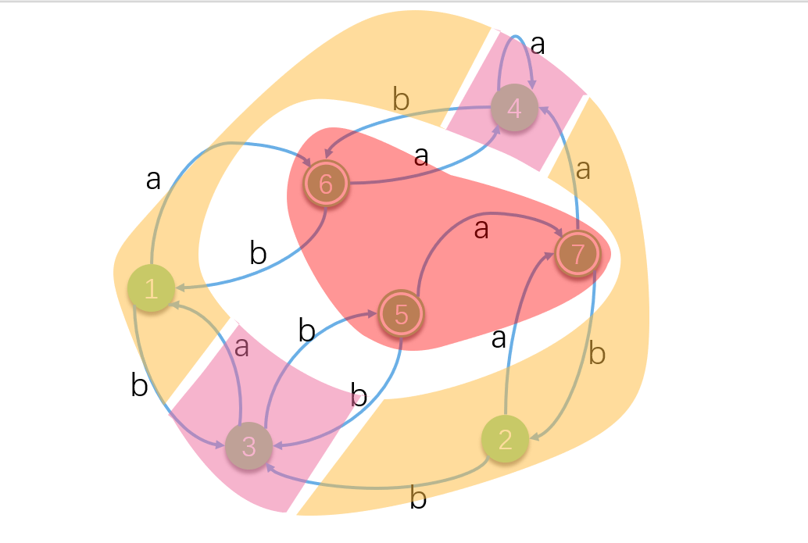
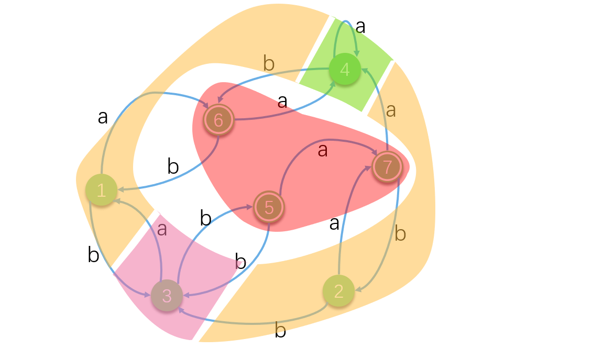
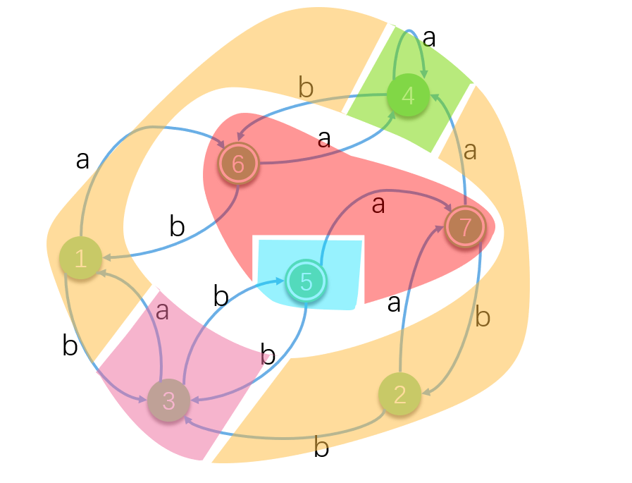
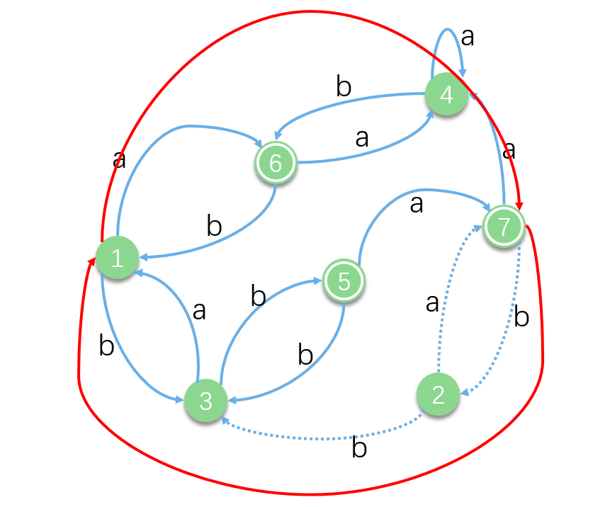
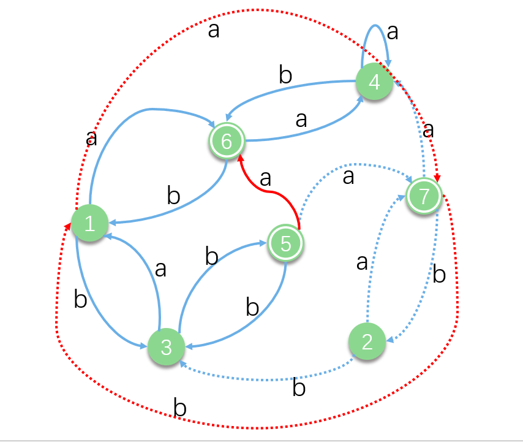
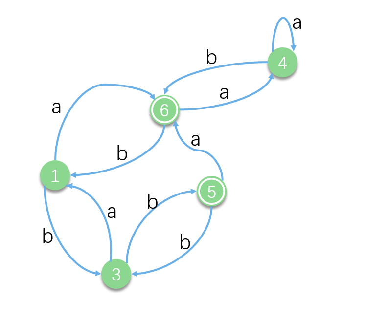

# 编译原理

## 1. gcc编译c文件






### 1.1 c语言源码

```c
#include<stdio.h>
int main(void)
{
	printf("Hello, world!\n");
	return 0;
}
```

### 1.2 预编译

```
# 1 "hello.c"
# 1 "<built-in>"
# 1 "<command-line>"
# 31 "<command-line>"
# 1 "/usr/include/stdc-predef.h" 1 3 4
# 32 "<command-line>" 2
# 1 "hello.c"
# 1 "/usr/include/stdio.h" 1 3 4
# 27 "/usr/include/stdio.h" 3 4
# 1 "/usr/include/x86_64-linux-gnu/bits/libc-header-start.h" 1 3 4
# 33 "/usr/include/x86_64-linux-gnu/bits/libc-header-start.h" 3 4
# 1 "/usr/include/features.h" 1 3 4
# 461 "/usr/include/features.h" 3 4
# 1 "/usr/include/x86_64-linux-gnu/sys/cdefs.h" 1 3 4
# 452 "/usr/include/x86_64-linux-gnu/sys/cdefs.h" 3 4
# 1 "/usr/include/x86_64-linux-gnu/bits/wordsize.h" 1 3 4
# 453 "/usr/include/x86_64-linux-gnu/sys/cdefs.h" 2 3 4
# 1 "/usr/include/x86_64-linux-gnu/bits/long-double.h" 1 3 4
# 454 "/usr/include/x86_64-linux-gnu/sys/cdefs.h" 2 3 4
# 462 "/usr/include/features.h" 2 3 4
# 485 "/usr/include/features.h" 3 4
# 1 "/usr/include/x86_64-linux-gnu/gnu/stubs.h" 1 3 4
# 10 "/usr/include/x86_64-linux-gnu/gnu/stubs.h" 3 4
# 1 "/usr/include/x86_64-linux-gnu/gnu/stubs-64.h" 1 3 4
# 11 "/usr/include/x86_64-linux-gnu/gnu/stubs.h" 2 3 4
# 486 "/usr/include/features.h" 2 3 4
# 34 "/usr/include/x86_64-linux-gnu/bits/libc-header-start.h" 2 3 4
# 28 "/usr/include/stdio.h" 2 3 4


# 1 "/usr/lib/gcc/x86_64-linux-gnu/9/include/stddef.h" 1 3 4
# 209 "/usr/lib/gcc/x86_64-linux-gnu/9/include/stddef.h" 3 4

# 209 "/usr/lib/gcc/x86_64-linux-gnu/9/include/stddef.h" 3 4
typedef long unsigned int size_t;
# 34 "/usr/include/stdio.h" 2 3 4


# 1 "/usr/lib/gcc/x86_64-linux-gnu/9/include/stdarg.h" 1 3 4
# 40 "/usr/lib/gcc/x86_64-linux-gnu/9/include/stdarg.h" 3 4
typedef __builtin_va_list __gnuc_va_list;
# 37 "/usr/include/stdio.h" 2 3 4

# 1 "/usr/include/x86_64-linux-gnu/bits/types.h" 1 3 4
# 27 "/usr/include/x86_64-linux-gnu/bits/types.h" 3 4
# 1 "/usr/include/x86_64-linux-gnu/bits/wordsize.h" 1 3 4
# 28 "/usr/include/x86_64-linux-gnu/bits/types.h" 2 3 4
# 1 "/usr/include/x86_64-linux-gnu/bits/timesize.h" 1 3 4
# 29 "/usr/include/x86_64-linux-gnu/bits/types.h" 2 3 4


typedef unsigned char __u_char;
typedef unsigned short int __u_short;
typedef unsigned int __u_int;
typedef unsigned long int __u_long;


typedef signed char __int8_t;
typedef unsigned char __uint8_t;
typedef signed short int __int16_t;
typedef unsigned short int __uint16_t;
typedef signed int __int32_t;
typedef unsigned int __uint32_t;

typedef signed long int __int64_t;
typedef unsigned long int __uint64_t;


typedef __int8_t __int_least8_t;
typedef __uint8_t __uint_least8_t;
typedef __int16_t __int_least16_t;
typedef __uint16_t __uint_least16_t;
typedef __int32_t __int_least32_t;
typedef __uint32_t __uint_least32_t;
typedef __int64_t __int_least64_t;
typedef __uint64_t __uint_least64_t;


typedef long int __quad_t;
typedef unsigned long int __u_quad_t;


typedef long int __intmax_t;
typedef unsigned long int __uintmax_t;
# 141 "/usr/include/x86_64-linux-gnu/bits/types.h" 3 4
# 1 "/usr/include/x86_64-linux-gnu/bits/typesizes.h" 1 3 4
# 142 "/usr/include/x86_64-linux-gnu/bits/types.h" 2 3 4
# 1 "/usr/include/x86_64-linux-gnu/bits/time64.h" 1 3 4
# 143 "/usr/include/x86_64-linux-gnu/bits/types.h" 2 3 4


typedef unsigned long int __dev_t;
typedef unsigned int __uid_t;
typedef unsigned int __gid_t;
typedef unsigned long int __ino_t;
typedef unsigned long int __ino64_t;
typedef unsigned int __mode_t;
typedef unsigned long int __nlink_t;
typedef long int __off_t;
typedef long int __off64_t;
typedef int __pid_t;
typedef struct { int __val[2]; } __fsid_t;
typedef long int __clock_t;
typedef unsigned long int __rlim_t;
typedef unsigned long int __rlim64_t;
typedef unsigned int __id_t;
typedef long int __time_t;
typedef unsigned int __useconds_t;
typedef long int __suseconds_t;

typedef int __daddr_t;
typedef int __key_t;


typedef int __clockid_t;


typedef void * __timer_t;


typedef long int __blksize_t;


typedef long int __blkcnt_t;
typedef long int __blkcnt64_t;


typedef unsigned long int __fsblkcnt_t;
typedef unsigned long int __fsblkcnt64_t;


typedef unsigned long int __fsfilcnt_t;
typedef unsigned long int __fsfilcnt64_t;


typedef long int __fsword_t;

typedef long int __ssize_t;


typedef long int __syscall_slong_t;

typedef unsigned long int __syscall_ulong_t;


typedef __off64_t __loff_t;
typedef char *__caddr_t;


typedef long int __intptr_t;


typedef unsigned int __socklen_t;


typedef int __sig_atomic_t;
# 39 "/usr/include/stdio.h" 2 3 4
# 1 "/usr/include/x86_64-linux-gnu/bits/types/__fpos_t.h" 1 3 4


# 1 "/usr/include/x86_64-linux-gnu/bits/types/__mbstate_t.h" 1 3 4
# 13 "/usr/include/x86_64-linux-gnu/bits/types/__mbstate_t.h" 3 4
typedef struct
{
  int __count;
  union
  {
    unsigned int __wch;
    char __wchb[4];
  } __value;
} __mbstate_t;
# 6 "/usr/include/x86_64-linux-gnu/bits/types/__fpos_t.h" 2 3 4


typedef struct _G_fpos_t
{
  __off_t __pos;
  __mbstate_t __state;
} __fpos_t;
# 40 "/usr/include/stdio.h" 2 3 4
# 1 "/usr/include/x86_64-linux-gnu/bits/types/__fpos64_t.h" 1 3 4
# 10 "/usr/include/x86_64-linux-gnu/bits/types/__fpos64_t.h" 3 4
typedef struct _G_fpos64_t
{
  __off64_t __pos;
  __mbstate_t __state;
} __fpos64_t;
# 41 "/usr/include/stdio.h" 2 3 4
# 1 "/usr/include/x86_64-linux-gnu/bits/types/__FILE.h" 1 3 4


struct _IO_FILE;
typedef struct _IO_FILE __FILE;
# 42 "/usr/include/stdio.h" 2 3 4
# 1 "/usr/include/x86_64-linux-gnu/bits/types/FILE.h" 1 3 4


struct _IO_FILE;


typedef struct _IO_FILE FILE;
# 43 "/usr/include/stdio.h" 2 3 4
# 1 "/usr/include/x86_64-linux-gnu/bits/types/struct_FILE.h" 1 3 4
# 35 "/usr/include/x86_64-linux-gnu/bits/types/struct_FILE.h" 3 4
struct _IO_FILE;
struct _IO_marker;
struct _IO_codecvt;
struct _IO_wide_data;


typedef void _IO_lock_t;


struct _IO_FILE
{
  int _flags;


  char *_IO_read_ptr;
  char *_IO_read_end;
  char *_IO_read_base;
  char *_IO_write_base;
  char *_IO_write_ptr;
  char *_IO_write_end;
  char *_IO_buf_base;
  char *_IO_buf_end;


  char *_IO_save_base;
  char *_IO_backup_base;
  char *_IO_save_end;

  struct _IO_marker *_markers;

  struct _IO_FILE *_chain;

  int _fileno;
  int _flags2;
  __off_t _old_offset;


  unsigned short _cur_column;
  signed char _vtable_offset;
  char _shortbuf[1];

  _IO_lock_t *_lock;


  __off64_t _offset;

  struct _IO_codecvt *_codecvt;
  struct _IO_wide_data *_wide_data;
  struct _IO_FILE *_freeres_list;
  void *_freeres_buf;
  size_t __pad5;
  int _mode;

  char _unused2[15 * sizeof (int) - 4 * sizeof (void *) - sizeof (size_t)];
};
# 44 "/usr/include/stdio.h" 2 3 4
# 52 "/usr/include/stdio.h" 3 4
typedef __gnuc_va_list va_list;
# 63 "/usr/include/stdio.h" 3 4
typedef __off_t off_t;
# 77 "/usr/include/stdio.h" 3 4
typedef __ssize_t ssize_t;


typedef __fpos_t fpos_t;
# 133 "/usr/include/stdio.h" 3 4
# 1 "/usr/include/x86_64-linux-gnu/bits/stdio_lim.h" 1 3 4
# 134 "/usr/include/stdio.h" 2 3 4


extern FILE *stdin;
extern FILE *stdout;
extern FILE *stderr;


extern int remove (const char *__filename) __attribute__ ((__nothrow__ , __leaf__));

extern int rename (const char *__old, const char *__new) __attribute__ ((__nothrow__ , __leaf__));


extern int renameat (int __oldfd, const char *__old, int __newfd,
       const char *__new) __attribute__ ((__nothrow__ , __leaf__));
# 173 "/usr/include/stdio.h" 3 4
extern FILE *tmpfile (void) ;
# 187 "/usr/include/stdio.h" 3 4
extern char *tmpnam (char *__s) __attribute__ ((__nothrow__ , __leaf__)) ;


extern char *tmpnam_r (char *__s) __attribute__ ((__nothrow__ , __leaf__)) ;
# 204 "/usr/include/stdio.h" 3 4
extern char *tempnam (const char *__dir, const char *__pfx)
     __attribute__ ((__nothrow__ , __leaf__)) __attribute__ ((__malloc__)) ;


extern int fclose (FILE *__stream);


extern int fflush (FILE *__stream);
# 227 "/usr/include/stdio.h" 3 4
extern int fflush_unlocked (FILE *__stream);
# 246 "/usr/include/stdio.h" 3 4
extern FILE *fopen (const char *__restrict __filename,
      const char *__restrict __modes) ;


extern FILE *freopen (const char *__restrict __filename,
        const char *__restrict __modes,
        FILE *__restrict __stream) ;
# 279 "/usr/include/stdio.h" 3 4
extern FILE *fdopen (int __fd, const char *__modes) __attribute__ ((__nothrow__ , __leaf__)) ;
# 292 "/usr/include/stdio.h" 3 4
extern FILE *fmemopen (void *__s, size_t __len, const char *__modes)
  __attribute__ ((__nothrow__ , __leaf__)) ;


extern FILE *open_memstream (char **__bufloc, size_t *__sizeloc) __attribute__ ((__nothrow__ , __leaf__)) ;


extern void setbuf (FILE *__restrict __stream, char *__restrict __buf) __attribute__ ((__nothrow__ , __leaf__));


extern int setvbuf (FILE *__restrict __stream, char *__restrict __buf,
      int __modes, size_t __n) __attribute__ ((__nothrow__ , __leaf__));


extern void setbuffer (FILE *__restrict __stream, char *__restrict __buf,
         size_t __size) __attribute__ ((__nothrow__ , __leaf__));


extern void setlinebuf (FILE *__stream) __attribute__ ((__nothrow__ , __leaf__));


extern int fprintf (FILE *__restrict __stream,
      const char *__restrict __format, ...);


extern int printf (const char *__restrict __format, ...);

extern int sprintf (char *__restrict __s,
      const char *__restrict __format, ...) __attribute__ ((__nothrow__));


extern int vfprintf (FILE *__restrict __s, const char *__restrict __format,
       __gnuc_va_list __arg);


extern int vprintf (const char *__restrict __format, __gnuc_va_list __arg);

extern int vsprintf (char *__restrict __s, const char *__restrict __format,
       __gnuc_va_list __arg) __attribute__ ((__nothrow__));


extern int snprintf (char *__restrict __s, size_t __maxlen,
       const char *__restrict __format, ...)
     __attribute__ ((__nothrow__)) __attribute__ ((__format__ (__printf__, 3, 4)));

extern int vsnprintf (char *__restrict __s, size_t __maxlen,
        const char *__restrict __format, __gnuc_va_list __arg)
     __attribute__ ((__nothrow__)) __attribute__ ((__format__ (__printf__, 3, 0)));
# 379 "/usr/include/stdio.h" 3 4
extern int vdprintf (int __fd, const char *__restrict __fmt,
       __gnuc_va_list __arg)
     __attribute__ ((__format__ (__printf__, 2, 0)));
extern int dprintf (int __fd, const char *__restrict __fmt, ...)
     __attribute__ ((__format__ (__printf__, 2, 3)));


extern int fscanf (FILE *__restrict __stream,
     const char *__restrict __format, ...) ;


extern int scanf (const char *__restrict __format, ...) ;

extern int sscanf (const char *__restrict __s,
     const char *__restrict __format, ...) __attribute__ ((__nothrow__ , __leaf__));


extern int fscanf (FILE *__restrict __stream, const char *__restrict __format, ...) __asm__ ("" "__isoc99_fscanf")

                               ;
extern int scanf (const char *__restrict __format, ...) __asm__ ("" "__isoc99_scanf")
                              ;
extern int sscanf (const char *__restrict __s, const char *__restrict __format, ...) __asm__ ("" "__isoc99_sscanf") __attribute__ ((__nothrow__ , __leaf__))

                      ;
# 432 "/usr/include/stdio.h" 3 4
extern int vfscanf (FILE *__restrict __s, const char *__restrict __format,
      __gnuc_va_list __arg)
     __attribute__ ((__format__ (__scanf__, 2, 0))) ;


extern int vscanf (const char *__restrict __format, __gnuc_va_list __arg)
     __attribute__ ((__format__ (__scanf__, 1, 0))) ;


extern int vsscanf (const char *__restrict __s,
      const char *__restrict __format, __gnuc_va_list __arg)
     __attribute__ ((__nothrow__ , __leaf__)) __attribute__ ((__format__ (__scanf__, 2, 0)));


extern int vfscanf (FILE *__restrict __s, const char *__restrict __format, __gnuc_va_list __arg) __asm__ ("" "__isoc99_vfscanf")


     __attribute__ ((__format__ (__scanf__, 2, 0))) ;
extern int vscanf (const char *__restrict __format, __gnuc_va_list __arg) __asm__ ("" "__isoc99_vscanf")

     __attribute__ ((__format__ (__scanf__, 1, 0))) ;
extern int vsscanf (const char *__restrict __s, const char *__restrict __format, __gnuc_va_list __arg) __asm__ ("" "__isoc99_vsscanf") __attribute__ ((__nothrow__ , __leaf__))


     __attribute__ ((__format__ (__scanf__, 2, 0)));
# 485 "/usr/include/stdio.h" 3 4
extern int fgetc (FILE *__stream);
extern int getc (FILE *__stream);


extern int getchar (void);


extern int getc_unlocked (FILE *__stream);
extern int getchar_unlocked (void);
# 510 "/usr/include/stdio.h" 3 4
extern int fgetc_unlocked (FILE *__stream);
# 521 "/usr/include/stdio.h" 3 4
extern int fputc (int __c, FILE *__stream);
extern int putc (int __c, FILE *__stream);


extern int putchar (int __c);
# 537 "/usr/include/stdio.h" 3 4
extern int fputc_unlocked (int __c, FILE *__stream);


extern int putc_unlocked (int __c, FILE *__stream);
extern int putchar_unlocked (int __c);


extern int getw (FILE *__stream);


extern int putw (int __w, FILE *__stream);


extern char *fgets (char *__restrict __s, int __n, FILE *__restrict __stream)
     ;
# 603 "/usr/include/stdio.h" 3 4
extern __ssize_t __getdelim (char **__restrict __lineptr,
                             size_t *__restrict __n, int __delimiter,
                             FILE *__restrict __stream) ;
extern __ssize_t getdelim (char **__restrict __lineptr,
                           size_t *__restrict __n, int __delimiter,
                           FILE *__restrict __stream) ;


extern __ssize_t getline (char **__restrict __lineptr,
                          size_t *__restrict __n,
                          FILE *__restrict __stream) ;


extern int fputs (const char *__restrict __s, FILE *__restrict __stream);


extern int puts (const char *__s);


extern int ungetc (int __c, FILE *__stream);


extern size_t fread (void *__restrict __ptr, size_t __size,
       size_t __n, FILE *__restrict __stream) ;


extern size_t fwrite (const void *__restrict __ptr, size_t __size,
        size_t __n, FILE *__restrict __s);
# 673 "/usr/include/stdio.h" 3 4
extern size_t fread_unlocked (void *__restrict __ptr, size_t __size,
         size_t __n, FILE *__restrict __stream) ;
extern size_t fwrite_unlocked (const void *__restrict __ptr, size_t __size,
          size_t __n, FILE *__restrict __stream);


extern int fseek (FILE *__stream, long int __off, int __whence);


extern long int ftell (FILE *__stream) ;


extern void rewind (FILE *__stream);
# 707 "/usr/include/stdio.h" 3 4
extern int fseeko (FILE *__stream, __off_t __off, int __whence);


extern __off_t ftello (FILE *__stream) ;
# 731 "/usr/include/stdio.h" 3 4
extern int fgetpos (FILE *__restrict __stream, fpos_t *__restrict __pos);


extern int fsetpos (FILE *__stream, const fpos_t *__pos);
# 757 "/usr/include/stdio.h" 3 4
extern void clearerr (FILE *__stream) __attribute__ ((__nothrow__ , __leaf__));

extern int feof (FILE *__stream) __attribute__ ((__nothrow__ , __leaf__)) ;

extern int ferror (FILE *__stream) __attribute__ ((__nothrow__ , __leaf__)) ;


extern void clearerr_unlocked (FILE *__stream) __attribute__ ((__nothrow__ , __leaf__));
extern int feof_unlocked (FILE *__stream) __attribute__ ((__nothrow__ , __leaf__)) ;
extern int ferror_unlocked (FILE *__stream) __attribute__ ((__nothrow__ , __leaf__)) ;


extern void perror (const char *__s);


# 1 "/usr/include/x86_64-linux-gnu/bits/sys_errlist.h" 1 3 4
# 26 "/usr/include/x86_64-linux-gnu/bits/sys_errlist.h" 3 4
extern int sys_nerr;
extern const char *const sys_errlist[];
# 782 "/usr/include/stdio.h" 2 3 4


extern int fileno (FILE *__stream) __attribute__ ((__nothrow__ , __leaf__)) ;


extern int fileno_unlocked (FILE *__stream) __attribute__ ((__nothrow__ , __leaf__)) ;
# 800 "/usr/include/stdio.h" 3 4
extern FILE *popen (const char *__command, const char *__modes) ;


extern int pclose (FILE *__stream);


extern char *ctermid (char *__s) __attribute__ ((__nothrow__ , __leaf__));
# 840 "/usr/include/stdio.h" 3 4
extern void flockfile (FILE *__stream) __attribute__ ((__nothrow__ , __leaf__));


extern int ftrylockfile (FILE *__stream) __attribute__ ((__nothrow__ , __leaf__)) ;


extern void funlockfile (FILE *__stream) __attribute__ ((__nothrow__ , __leaf__));
# 858 "/usr/include/stdio.h" 3 4
extern int __uflow (FILE *);
extern int __overflow (FILE *, int);
# 873 "/usr/include/stdio.h" 3 4

# 2 "hello.c" 2

# 2 "hello.c"
int main(void)
{
 printf("Hello, world!\n");
 return 0;
}
```

### 1.3 编译

```
	.file	"hello.c"
	.text
	.section	.rodata
.LC0:
	.string	"Hello, world!"
	.text
	.globl	main
	.type	main, @function
main:
.LFB0:
	.cfi_startproc
	endbr64
	pushq	%rbp
	.cfi_def_cfa_offset 16
	.cfi_offset 6, -16
	movq	%rsp, %rbp
	.cfi_def_cfa_register 6
	leaq	.LC0(%rip), %rdi
	call	puts@PLT
	movl	$0, %eax
	popq	%rbp
	.cfi_def_cfa 7, 8
	ret
	.cfi_endproc
.LFE0:
	.size	main, .-main
	.ident	"GCC: (Ubuntu 9.3.0-10ubuntu2) 9.3.0"
	.section	.note.GNU-stack,"",@progbits
	.section	.note.gnu.property,"a"
	.align 8
	.long	 1f - 0f
	.long	 4f - 1f
	.long	 5
0:
	.string	 "GNU"
1:
	.align 8
	.long	 0xc0000002
	.long	 3f - 2f
2:
	.long	 0x3
3:
	.align 8
4:
```

### 1.4 汇编

### 1.5 链接

[**参考文章**](https://blog.csdn.net/shijiemoxing/article/details/6863133?utm_medium=distribute.pc_relevant_t0.none-task-blog-BlogCommendFromMachineLearnPai2-1.add_param_isCf&depth_1-utm_source=distribute.pc_relevant_t0.none-task-blog-BlogCommendFromMachineLearnPai2-1.add_param_isCf)

## 第3章 词法分析


### 3.4 有穷自动机

#### 3.4.2 不确定的有穷自动机

##### 1.定义

不确定的有穷自动机是一个五元组，
$$
M = (K, \sum, f, S,Z)
$$


（1） K是一个有穷集，它的每一个元素称为一个状态

（2）$\sum$ 是一个有穷字母表，它的每一个元素称为一个输入符号

（3）$f$ 是一个从$K \times \sum_{}^{*}$ 到 $K$ 的全体子集的映像，即$K\times \sum_{}^{*} -> 2_{}^{K}$，其中 $2_{}^{K}$ 代表 $K$ 的幂集， $\sum_{}^{*}$ 表示所有输入符号的闭包。

（4） $S \subseteq K$是一个<font color = red>**非空**</font>初态集

（5） $Z \subseteq K$是一个终态集


#### 3.4.4 确定有穷自动机的化简

##### 1.化简的有穷自动机的定义

一个**没有多余状态**并且**没有两个状态是等价**的有穷自动机。

<font color = red>**多余状态（无用状态）：**</font>从该自动机的开始状态出发，任何输入串也不能到达的那个状态

<font color = red>**等价状态：**</font>

1. 两个状态必须**同时**为可**接受状态（终态）**或者**不可接受状态（非终态）**——<font color = red>**一致性条件**</font>
2. 对于所有的输入符号，两个状态**接受相同的符号**必须转换到等价的状态——<font color = red>**蔓延性条件**</font>

##### 2.分割法



我们首先将其分为终态和非终态



**$P_0$ = ({1, 2, 3, 4}, {5, 6, 7})**

接下来我们尝试先对{1, 2, 3, 4}这个子集进行划分

$1\stackrel{a}{\longrightarrow}6$；$1\stackrel{b}{\longrightarrow}3$

$2\stackrel{a}{\longrightarrow}7$；$2\stackrel{b}{\longrightarrow}3$

$3\stackrel{a}{\longrightarrow}1$；$3\stackrel{b}{\longrightarrow}5$

$4\stackrel{a}{\longrightarrow}4$；$4\stackrel{b}{\longrightarrow}6$

首先我们看如果输入a的话，1和2的输出为{5，6，7}这个集合中的元素，而3和4则仍是本集合的元素，所以根据等价状态的第二性质，我们可以将1、2 与3、4分割开。



**$P_1$ = ({1, 2}, {3, 4}, {5, 6, 7})**

对于目前这个新的集合来说，我们继续划分每个子集。首先从{1,2}开始

$1\stackrel{a}{\longrightarrow}6$；$1\stackrel{b}{\longrightarrow}3$

$2\stackrel{a}{\longrightarrow}7$；$2\stackrel{b}{\longrightarrow}3$

我们无论是对1，2输入a还是输入b，它们的输出都属于同一个集合——6、7属于{5,6,7}这个终态集合，3属于{3,4}这个集合，所以{1,2}这个集合很完美，无法划分（即状态无法区分），它俩好得跟一个人似的。


那么我们继续看{3,4}

$3\stackrel{a}{\longrightarrow}1$；$3\stackrel{b}{\longrightarrow}5$

$4\stackrel{a}{\longrightarrow}4$；$4\stackrel{b}{\longrightarrow}6$

哦，我们看到，当输入a的时候，3输出的是1，属于{1,2}集合；4则输出的是4，属于{3,4}集合，所以3和4的状态可区分。


那么更新我们的状态图



更新P

$P_2$ **= ({1,2}, {3}, {4}, {5, 6, 7})**

很明显我们的故事还没结束，还有{5,6,7}这个集合

$5\stackrel{a}{\longrightarrow}7$；$5\stackrel{b}{\longrightarrow}3$

$6\stackrel{a}{\longrightarrow}4$；$6\stackrel{b}{\longrightarrow}1$

$7\stackrel{a}{\longrightarrow}4$；$7\stackrel{b}{\longrightarrow}2$

很明显，在输入a的时候，5的输出为7即{5,6,7} 本集合内的，而6、7则是输出的同一个集合。二话不说，分家！



$P_3$ **= ({1,2}, {3}, {4}, {5}, {6, 7})**

这时候，还剩{6,7}，如果你上面看明白了，那么到这里你也就懂了，6、7是不可区分的状态。

分割法到此结束……


……不还有最后一步，把所有的不可区分状态统统用其中一个状态来表示就行。

比如1、2，我们直接用1来代替就行，把2所有的输入和输出的压力都放到1身上



（$1\stackrel{b}{\longrightarrow}3$，$2\stackrel{b}{\longrightarrow}3$ 所以这两个线用一个就行）

然后我们发现6、7可以直接用6代替



把虚线收拾干净再看看



