# 1.2 计算机的基本组成

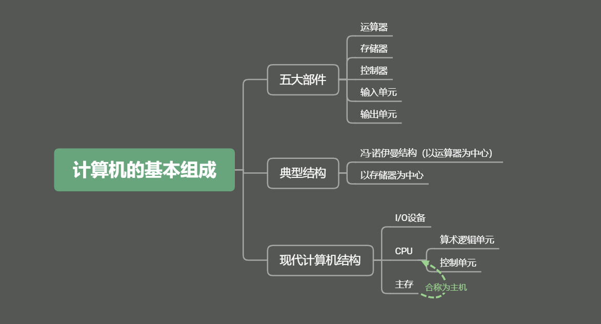

## <u>1 冯·诺伊曼计算机的特点</u>

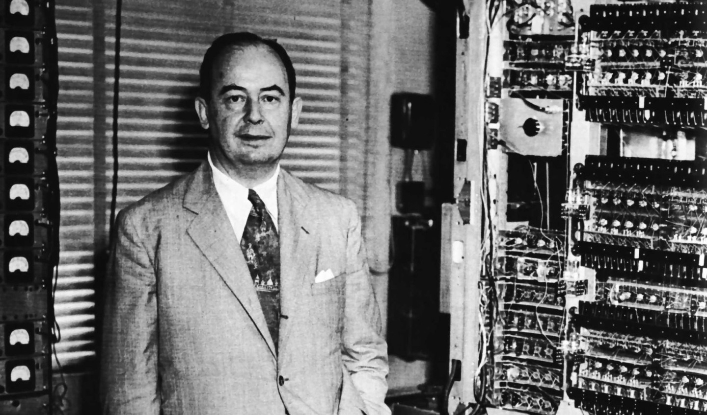

1. 计算机由运算器、存储器、输入设备、输出设备、控制器五大部件组成
2. 指令和数据以同等地位存放于存储器内，并可按照地址寻访
3. 指令和数据均以二进制数表示
4. 指令由操作码和地址码组成，操作码用来表示操作的性质，地址码用来表示操作数在存储器中的位置。
5. 指令在存储器内按顺序存放。通常指令是按顺序执行的，在特定条件下可根据运算结果或者根据设定的条件改变执行顺序。
6. 机器以运算器为中心，输入输出设备与存储器间的数据传送通过运算器完成。

## <u>2 计算机硬件结构框图</u>

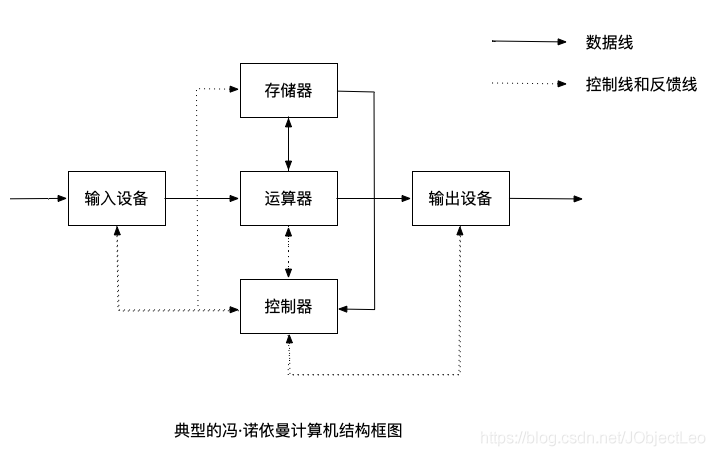

图1

图2

运算器和控制器在逻辑关系和电路结构上联系紧密，所以通常被集成在一个芯片上，因此将他们合称为CPU（Center Processing Unit）；输入和输出设备统称为IO设备。

所以现代计算机可以认为是三大部分组成：**CPU、I/O设备、主存储器**

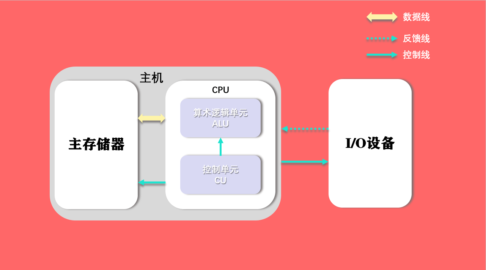

图3

主存储器（Main Memory）：存储子系统的一类，用来存放**程序和数据**，可以直接与CPU交换信息。另一类称为辅助存储器，简称辅存，又称外存。

算术逻辑单元（Arithmetic Logic Unit）：简称算逻部件，用来完成算术逻辑运算。

控制单元（Control Unit）：用来解释存储器中的指令，并发出各种操作命令来执行指令。

## <u>3 计算机的工作流程</u>

<u>***我的书写顺序可能跟书上不太一样，编制解题程序的机器指令放到了本节最后***</u>

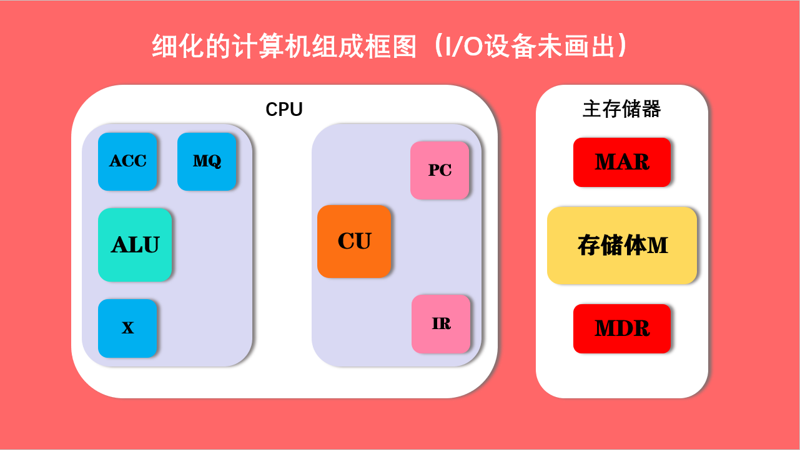

图4

ACC（Accumulator）：累加器

MQ（Multiplier-Quotient Register）：乘商寄存器

X：操作数寄存器

---

PC（Program Counter）：程序计数器

IR（Instruction Register）：指令寄存器

---

MAR（Memory Adress Register）：存储器地址寄存器

MDR（Memory Data Register）：存储器数据寄存器

### 3.1 主存储器

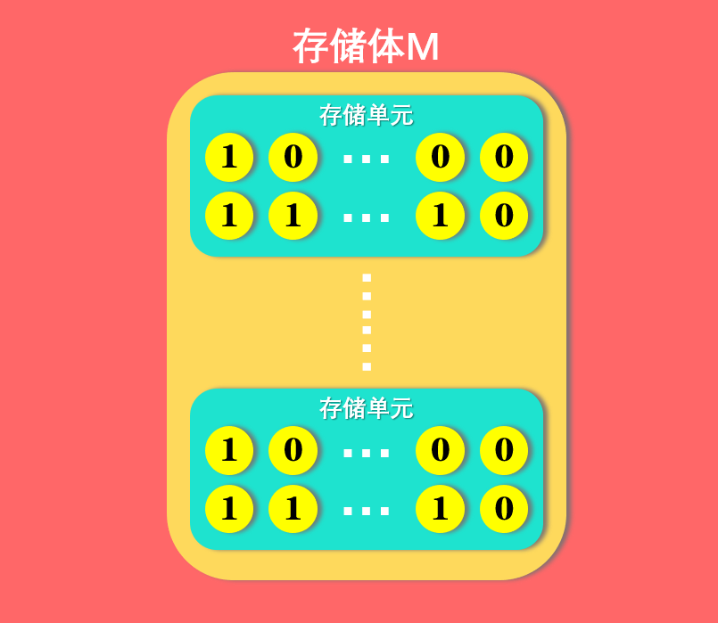

图5

存储体由很多存储单元组成，每个存储单元里面又包含很多存储元件，每个存储元件能够寄存一位二进制代码0或者1，所以，**一个存储单元能够存储一串二进制代码**，那么这串二进制代码被称为一个**存储字**，这串二进制代码的长度被称为**存储字长**

一个存储字可以表示**一个数字**、**一串字符**或者**一条指令**。

主存的工作方式是按**存储单元的地址号**来实现对存储字各位的存取，这种方式被称为**按地址存取方式**

我们看图4中的MAR和MDR，MAR是存储器地址寄存器，我们使用MAR是要寄存存储单元的地址，那么有多少存储单元，MAR就要能构成多少个地址。比如我有64个存储单元，那么MAR必定有6位，因为2^6=64，只有六位才能产生64个不同的地址。

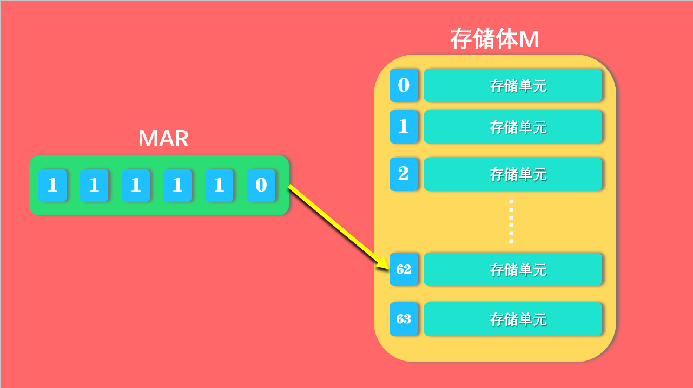

而下面几个小节我们会提到，MDR是存储器数据寄存器，从存储体中获得的数据（存储字）需要寄存到MDR中，那么MDR的位数应该和存储字的长度相同（即存储字长）

所以假设MAR的位数位n，MDR的位数为m，那么我们会有2^n个存储单元，每个单元又会有m个存储元件，那么总容量应该为 (2^n)*m。

### 3.2 CPU：运算器

 

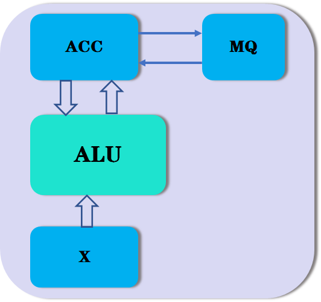

运算器中至少包含三个寄存器

+ ACC(Accumulator)：累加器
+ MQ(Multiplier-Quotient Register)：乘商寄存器
+ X：操作数寄存器

下图为三种寄存器存储的不同数据，先别看乘法，剩余的加、减、除都是`ACC`存储被..数，`X`存储..数，最后的结果，加和减法的结果寄存到`ACC`中，除法的余数寄存到`ACC`中，商寄存到`MQ`中。

那么乘法来说，被乘数原本是寄存在ACC中的，不过计算开始，就从`ACC`中移入到`X`中，乘数放在`MQ`中，乘积结果的高位在`MQ`中，低位在`ACC`中。

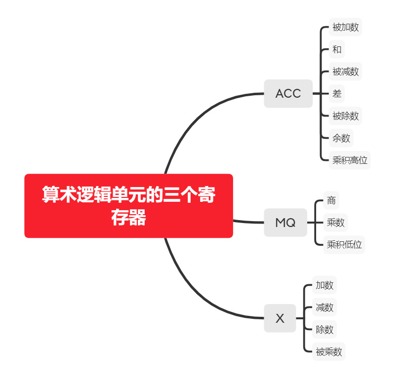

在[唐朔飞](https://baike.baidu.com/item/%E5%94%90%E6%9C%94%E9%A3%9E/5718942)教授的《计算机组成原理》一书中，采用了如下的运算器结构进行举例：

> 运算器可将结果从ACC中送至存储器的MDR；而存储器中的操作数也可以从MDR送至运算器的ACC、MQ或X

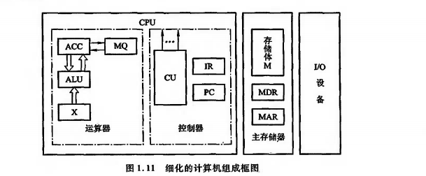

我们以如上这种结构的运算器结构，对不同操作进行分析

设`M`为存储器的任意一个地址号，`[M]`表示对应地址号单元的内容，`[X]`表示X寄存器中的内容，同理，`[ACC]`表示ACC寄存器的内容，`[MQ]`表示MQ寄存器的内容。

👉**加法**

> [M]->X

> [ACC] + [X] -> ACC

👉**减法**

> [M]->X

> [ACC] - [X] -> ACC

👉**乘法**

> [M]->MQ

> [ACC] - > X

> 0 -> ACC

> [X] × [MQ] -> ACC//MQ

👉**除法**

> [M] -> X

> [ACC] ÷ [X] -> MQ...ACC（商在MQ中，余数在ACC中）

### 3.3 CPU：控制器 

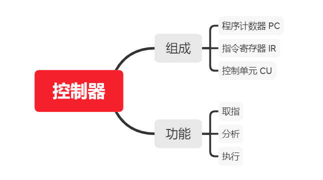

👉取指：命令存储器读出一条指令

👉分析：对指令进行分析，指出指令应该完成什么操作，指明操作数的地址

👉执行：根据**操作数所在的地址**以及**指令的操作码**完成某种操作

这里我们要明确一个关于指令的概念：

一条计算机指令由**操作码**和**地址码**组成，

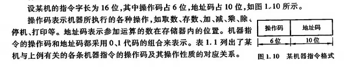

**操作码指明了我想要干什么，地址码说明了我要用哪个地址的数据来完成这个操作。**

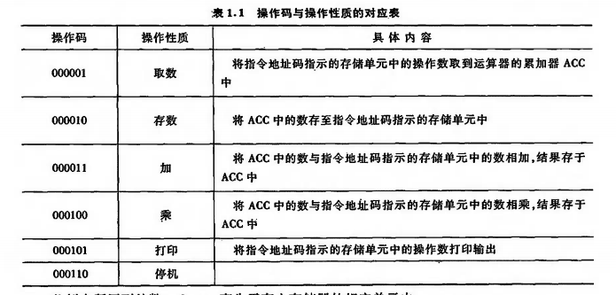

比如这些操作码，说明了我想要做什么。以000001为例，某条机器指令的操作码部分是000001，那么对于控制器来说，它知道了这条指令是想要取一个数，放到ACC中。具体取什么数，那就看后10位地址码指向的是什么位置。

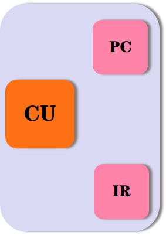

💻PC(Program Counter)：程序计数器，存放当前欲执行的指令的地址，**与MDR之间由一条直接通路。**

还能记起来MDR是什么东西吗？`MAR（Memory Adress Register）：存储器地址寄存器`，我们知道主存的工作方式是按照`地址存取方式`，我们无论想获得数据，还是指令，都要将其地址送入MAR，然后CU会对主存下达命令，根据地址寻找数据（有可能是一些数，也有可能是一条指令）并且将数据放入MDR中，然后MDR将数据送入需要的地方。这是冯·诺伊曼老前辈的思想：

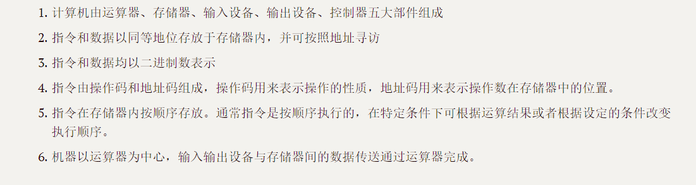

程序计数器还有一个功能，就是**自动加1的功能**，可自动形成下一条指令。

💻IR(Instruction Register)：指令寄存器，存放当前的指令，这些指令来自主存的MDR。

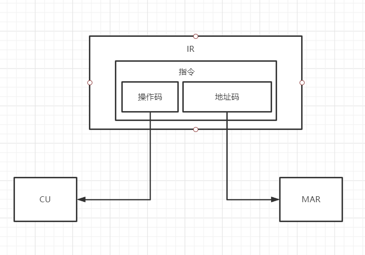

IR中存放着当前指令，每一条指令又包含操作码和地址码，操作码会送至CU（控制单元）中进行分析，并且发出各种微操作命令序列，控制所有 被控对象；而地址码则送入MAR中进行进一步的取数操作。

### 3.4 I/O

I/O子系统包括各种I/O设备及其相应的接口。每一种I/O设备都由I/O接口与主机相连，它们接收CU发出的各种控制命令，并完成相应的操作。

### 3.5 ✊总结，全流程

我们以一个式子的计算流程为例$ax^2 + bx + c$

我们可以将这个式子改写成$x(ax + b) + c$

那么在计算机中，这个式子的计算过程

1. 将x放置在运算器
2. x乘以a得到$ax$，结果还是放在运算器中
3. $ax + b$，结果放到运算器
4. $(ax + b)\times x$，结果放到运算器
5. $(ax + b) \times x + c$ 还是放到运算器中

这个过程中，我们其实是把每个结果放在寄存器中，我们可以考虑一下，这些数每次都放在什么寄存器中？

由3.2节我们已经知道，本质上所有的被加数、被减数、被乘数和被除数，从存储器中拿出来的时候都是首先放到ACC了，所以第一步，x的值放到ACC；

接下来，运行乘法，想想3.2节我们怎么做的？忘了没事，再来看一遍

👉**乘法**

> [M]->MQ

> [ACC] - > X

> 0 -> ACC

> [X] × [MQ] -> ACC//MQ

我们把存储器中拿来的数据a放入MQ，把ACC中的被乘数放到X寄存器中，将ACC置零，ALU计算乘法结果，高位写入ACC中，低位写入MQ中（但是注意为了简单，这个例子中把ACC中的结果认为就是乘法结果）；

第三步，加法；

第四步、第五步

操作都是一样的，但是我们的重点不在这里，而是整个系统的工作过程。这里我们先把上面的例子对应的运算程序放出来：

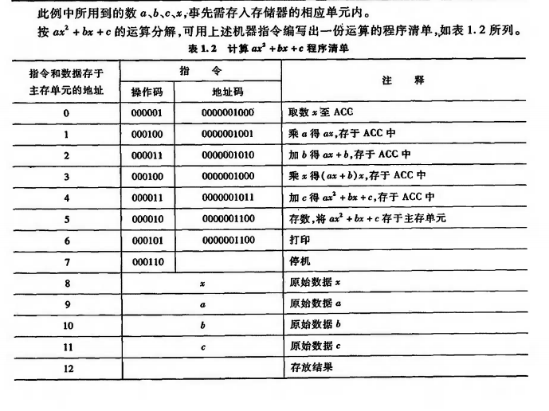

3.3节有各个操作码的含义，这里不再放出。

我们看到，指令（比如`0000010000001000`）和数据是以同等地位放在存储器中的。

现在来看一看第一条指令的执行流程：

1. 控制器：程序启动，PC值为0，PC的值送入MAR（MAR在存储器中），`控制器`命令`存储器`——根据MAR的地址从主存中找到对应地址的内容（我们可以看到，0位置上是一条指令）送到MDR

2. MDR把内容（000001 0000001000）又送回控制器，不过这次是送回IR，也就是指令寄存器，寄存寄存，就是暂时存着。

3. 读完一条指令或者一个数据，PC加1变成1了，地址指向了主存的下一个存储单元。

4. CU对IR的内容分析，现在读出的指令为`000001 0000001000`，000001这个操作码是`取数放到ACC`，CU就明白了，我一会得下指令让主存取数放进ACC；0000001000这个地址码，说明了我取数要取哪个地址里面的（目前这个地址码指向的是8，也就是x这个值）。所以地址码会被送到哪里？应该是送到存储器地址寄存器MAR。而且控制器对主存说**：“主存，我给你个地址，你照着这个地址把内容给我找出来送给ACC！找不出来削你！”**

5. 主存乖乖听话，照着地址找数据（或者指令），前面我们说过，这个例子的背景架构是支持MDR与ACC、MQ、X直接传递数据的，所以主存找到对应地址的数据（或者指令）x，送入MDR寄存器，有机会就写入ACC，完成这个操作。
6. 接下来，我们继续将PC的值（此时为1）送入MAR，并对主存发出一条控制信号，读出1位置的指令（000100 0000001001），送到MDR
7. MDR把指令送入IR，同时PC+1=2
8. CU分析IR中寄存的指令：操作码000100，说明要做乘法；地址码0000001001，要取9号位置的数据给运算器，与运算器上一步存的值（x）做乘法。所以地址码送入MAR，同时下达读指令，读出的数据送入运算器（送到哪里？还记得不？MQ）
9. CU继续下达指令，命令运算器进行乘法运算，得出结果，存入ACC（书上应该就暂时认为乘法结果放入ACC了，没考虑高低位，应该是为了简化流程），操作结束
10. ......

到这里，本节的基本内容就结束了。

