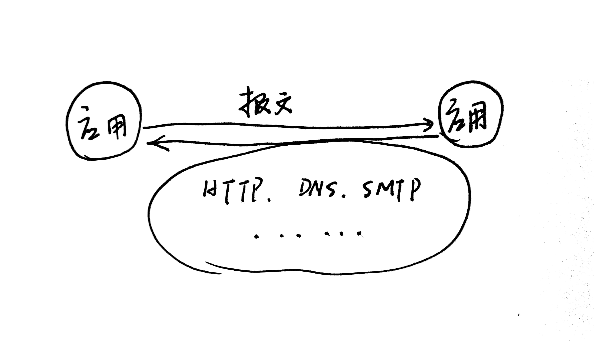
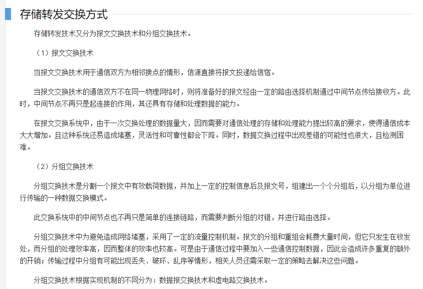
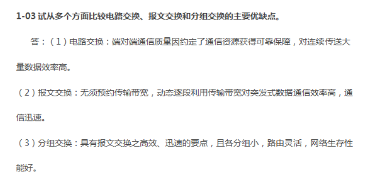
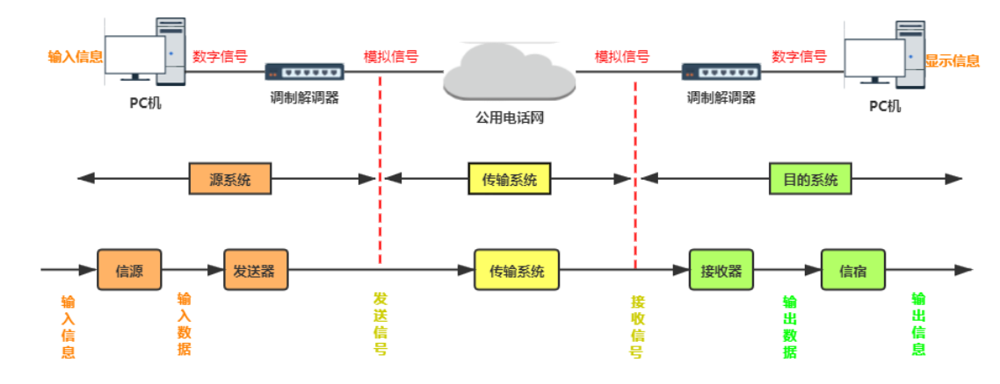
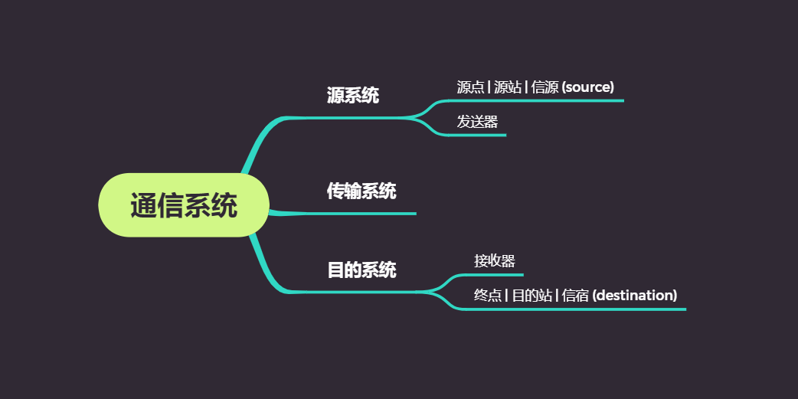
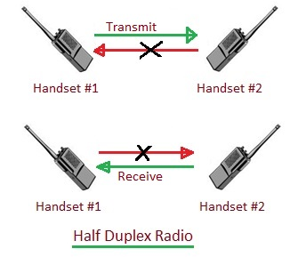
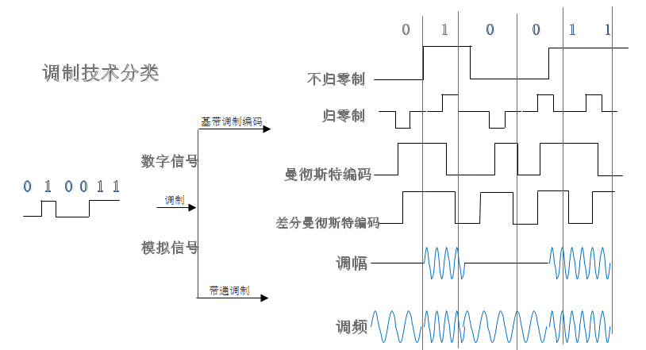
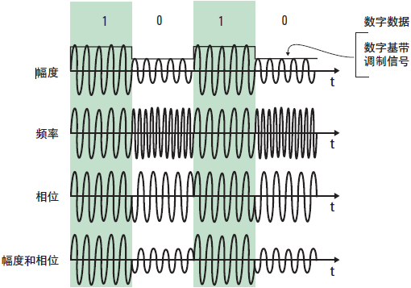

# 计算机网络（谢仁希）

## 第一章 概述

### 1.7.3 具有五层协议的体系结构

#### 1. 应用层

功能：**通过进程间的交互来完成特定的网络应用**

应用层交互的数据单元：**报文**

#### 2. 运输层

功能：负责向两台主机进程间的通信提供**通用**的**数据传输服务**。具有**复用**和**分用**的功能。

+ TCP协议（Transmission Control Protocol）

  数据传输单位为：**报文段**

+ UDP协议（User Datagram Protocol）

  数据传输单位为：**用户数据报**

#### 3. 网络层

功能：

+ **负责为分组交换网上的不同主机提供通信服务。**

  网络层负责将运输层产生的报文或者用户数据报封装成**分组（IP数据报）**或者**包**进行传送。

+ **选择合适的路由**

  使得源主机运输层所传下来的分组，能够通过网络中的路由器找到主机。

note: *互联网是由大量的**异构网络**通过路由器相互连接起来的。互联网使用的网络层协议是**无连接的网际协议IP**和许多种**路由选择协议。***

#### 4. 数据链路层

功能：将网络层下发的IP数据报**组装成帧**，每一帧包括数据和必要的控制信息。

#### 5. 物理层

功能：

+ 考虑多大的电压表示`1`或者`0`，以及接收方如何识别发送方发出的比特。
+ 确定连接电缆的插头应该有多少根引脚以及各引脚应该如何连接。

note: **传递信息所用的一些物理媒介并不属于物理层。**

## 第一章要点

+ **internet**是通用名词，泛指多个计算机网络互连而成的网络。在这些网络之间的通信协议是可以任意的
+ **Internet**是专用名词，特指当前全球最大的、开放的、由众多网络相互连接而成的特定互联网，并且采用**TCP/IP协议族**作为通信规则。

+ 互联网采用[**存储转发**](https://en.wikipedia.org/wiki/Store_and_forward)的**分组交换技术**（出现在网络层），以及三层ISP结构。

  存储转发(store and forward)：

  > **Store and forward** is a [telecommunications](https://en.wikipedia.org/wiki/Telecommunications) technique in which [information](https://en.wikipedia.org/wiki/Information) is sent to an intermediate station where it is kept and sent at a later time to the final destination or to another intermediate station. The intermediate station, or [node](https://en.wikipedia.org/wiki/Node_(networking)) in a [networking](https://en.wikipedia.org/wiki/Computer_network) context, verifies the [integrity](https://en.wikipedia.org/wiki/Data_integrity) of the message before forwarding it. In general, this technique is used in networks with intermittent connectivity, especially in the wilderness or environments requiring high mobility. It may also be preferable in situations when there are long delays in transmission and variable and high error rates, or if a direct, end-to-end connection is not available.
  >
  > 存储和转发是一种电信技术，其中信息被发送到一个中间站，在那里它被保存和发送到最终目的地或另一个中间站。 中间站或网络上下文中的节点在转发消息之前验证消息的完整性。 一般来说，这种技术用于具有间歇性连接的网络，特别是在需要高移动性的荒野或环境中。 在传输延迟时间长、错误率可变和高的情况下，或者在没有直接端到端连接的情况下，也可能更可取。
  >
  > ——维基百科
  >
  > ---
  >
  > 存储转发（Store and Forward）是计算机网络领域使用得最为广泛的技术之一，以太网交换机的控制器先将输入端口到来的数据包缓存起来，先检查数据包是否正确，并过滤掉冲突包错误。确定包正确后，取出目的地址，通过查找表找到想要发送的输出端口地址，然后将该包发送出去。正因如此，存储转发方式在数据处理时延时大，这是它的不足，但是它可以对进入交换机的数据包进行错误检测，并且能支持不同速度的输入/输出端口间的交换，可有效地改善网络性能。它的另一优点就是这种交换方式支持不同速度端口间的转换，保持高速端口和低速端口间协同工作。实现的办法是将10Mbps低速包存储起来，再通过100Mbps速率转发到端口上。
  >
  > ——百度百科

+ 互联网按照工作方式可以划分为边缘部分和核心部分。**主机**在网络的边缘部分，其作用是进行信息处理；

  **路由器**在网络的核心部分，其作用是按照**存储转发**的方式进行**分组交换**

+ 计算机通信是计算机进程（运行着的程序）间的通信，采用的通信方式是**客户—服务器方式**和**对等连接方式(p2p)**
+ 客户和服务器都是指通信中所涉及的应用进程。客户是服务请求方，服务器是服务提供方。
+ 按照范围来分，计算机网络分为广域网WAN，城域网MAN，局域网LAN，个人区域网PAN。
+ 计算机网络中最常用的性能指标是：**速率**、**带宽**、**吞吐量**、**时延**、**时延带宽积**、**往返时间**和**信道利用率**。
+ 网络协议：即协议，是为进行网络中的数据交换而建立的规则。计算机网络中**各层及其协议的集合**，称为**网络的体系结构**
+ 五层协议的体系结构中，运输层最重要的是TCP和UDP协议，网络层最重要的是IP协议。

## 第一章习题

### 1-01 

Q：**计算机网络可以向用户提供哪些服务？**

A：（1）连通服务；（2）资源共享

### 1-02

Q：**试简述分组交换的要点**

A：1. 报文分组，添加首部；2.经由路由器存储转发；3.在目的地合并；

分组交换采用的是**存储转发的过程工作方式**，数据以**短的分组**形式传送，如果一源点有一个长的报文要发送，该报文就会被分割成一系列的分组，每个分组包含一部分用户数据和一些控制信息。控制信息至少要包括**网络为了把分组送到目的地做路由选择所需要的信息**。在路径上的每个结点，分组被接收，短时间存储，然后传递给下一节点。

### 1-03

Q：试从多个方面比较电路交换、报文交换和分组交换的主要优缺点。

A：

**电路交换：**计算机终端之间通信时，一方发起呼叫，独占一条物理线路。当交换机完成接续，对方收到发起端的信号，双方即可通信。在整个通信过程中双方一直占用该电路。它的特点是实时性强，时延小，交换设备成本较低。但是同时也带来线路利用率低，电路接续时间长，通信效率低，不同类型终端用户之间不能通信等缺点。电路交换比较适用于信息量大，长报文，经常使用的固定用户之间的通信。

**报文交换：**将用户的报文存储在交换机的存储器中。当所需要的输出电路空闲时，再将该报文发相接收交换机或者终端，它以存储转发的方式再网内进行传输数据。报文交换的优点是中继电路利用率高。可以多个用户同时再一条线上传送，可以实现不同速率、不同规程的终端之间的通信。但是它的缺点也是明显的，以报文为单位进行存储转发，网络传输时延大，且占用大量的交换机内存和外存，不能满足对实时性要求高的用户。报文交换适用于传输的报文较短，实时性要求较低的网络用户之间的通信，比如公网电报。

**分组交换：**实质上是存储转发基础上发展起来的，它兼有电路交换和报文交换的优点。分组交换在线路上采用**动态复用技术**传送按一定长度分割为许多小段的数据——分组。每个分组标识后，在一条物理线路上采用动态复用的技术，同时传送多个数据分组。把来自用户发端的数据暂存在交换机的存储器中，接着在网内转发。到达接收端，再去掉分组头将数据字段按顺序重新装配成完整的报文。比电路交换的利用率高，比报文交换的传输时延小，交互性好。

缺点也是存在的，它仍然存在存储转发的时延，每个分组都要加上控制信息，增加了处理时间，控制更加复杂，内存开销更大。

## 第二章 物理层

### 2.1 物理层的基本概念

物理层功能：确保原始数据可在各种物理媒介上传输，为传输数据所需要的物理链路创建、维持、拆除而提供具有机械的、电子的、功能的和规范的特性。

特性：机械特性、电气特性、功能特性、过程特性

+ 机械特性：指明接口所用的接线器的形状和尺寸、引脚数目和排列、固定和锁定等装置。
+ 电气特性：指明在接口电缆的各条线上出现的电压的范围
+ 功能特性：指明某条线上出现的某一电压的意义
+ 过程特性：指明对于不同功能的各种可能事件的出现顺序

数据在计算机内部多是**并行传输**，但在通信线路上一般是**串行传输**，因此物理层的功能还有**完成传输方式的转换**。

### 2.2 数据通信的基础知识

#### 2.2.1 数据通信系统的模型

名词解释

+ **源点**：源点设备产生的要传输的数据（比特流）
+ **发送器**：比特流要通过发送器编码后才能够在传输系统中进行传输，典型的发送器就是**调制器**。
+ **接收器**：典型的就是**解调器**
+ **终点**：不解释了

#### 2.2.2 关于信道（channel）

**基本的信息交互方式**

1. **单向通信**，又称为单工通信，举例：无线广播或者有线广播以及电视广播

2. **双向交替通信**，又称为半双工通信

   

3. **双向同时通信**，又称为全双工通信

**基带信号**：来自信源的信号。

**基带信号的调制**：

图片来源：[明王不动心——信道和调制](https://www.cnblogs.com/yangmingxianshen/p/7819336.html)

+ 基带调制：变换后的信号仍然是基带信号，又称为**编码**，**数字信号——>数字信号**

  常用编码方式：**不归零制、归零制、曼彻斯特编码、差分曼彻斯特编码**

+ 带通调制：利用载波进行调制，把基带信号的频率范围搬移到较高的频段 。**数字信号——>模拟信号**

  图片来源[技术牛人详解：矢量调制分析基础（经典收藏版）](https://www.sohu.com/a/151135285_472928)

  

  常用调制方式：

  **调幅（AM）**

  载波的振幅随基带数字信号而变化。例如，0或1分别对应于无载波和有载波输出。

  **调频（FM）**

  载波的频率随基带数字信号而变化。例如，0或1分别对应于频率f1或f2.

  **调相（PM）**

  载波的初始相位随基带数字信号而变化。例如，0或1分别对应相位0度或180度。

### 2.4 信道复用技术

#### 2.4.1 频分复用（Frequency Division Multiplexing）

用户在分配到一定的频带后，通信过程中始终占用这频带，**频分复用的所有用户在同样的时间占据不同的带宽。**

#### 2.4.2 时分复用（Time Division Multiplexing）

将时间划分为一段段等长的时分复用帧（TDM帧），每一个时分复用的用户在每一个TDM帧中占据一个固定序号的时隙。**时分复用的所有用户是在不同的时间占用同样的频带宽度。**

#### 2.4.3 统计时分复用

