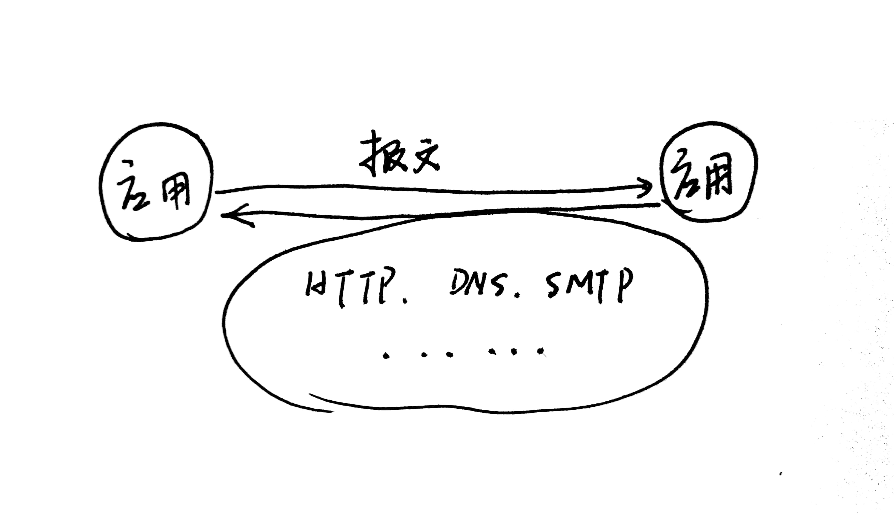

# 计算机网络（谢仁希）

## 第一章 概述

### 1.7.3 具有五层协议的体系结构

#### 1. 应用层

功能：**通过进程间的交互来完成特定的网络应用**

应用层交互的数据单元：**报文**

#### 2. 运输层

功能：负责向两台主机进程间的通信提供**通用**的**数据传输服务**。具有**复用**和**分用**的功能。

+ TCP协议（Transmission Control Protocol）

  数据传输单位为：**报文段**

+ UDP协议（User Datagram Protocol）

  数据传输单位为：**用户数据报**

#### 3. 网络层

功能：

+ **负责为分组交换网上的不同主机提供通信服务。**

  网络层负责将运输层产生的报文或者用户数据报封装成**分组（IP数据报）**或者**包**进行传送。

+ **选择合适的路由**

  使得源主机运输层所传下来的分组，能够通过网络中的路由器找到主机。

note: *互联网是由大量的**异构网络**通过路由器相互连接起来的。互联网使用的网络层协议是**无连接的网际协议IP**和许多种**路由选择协议。***