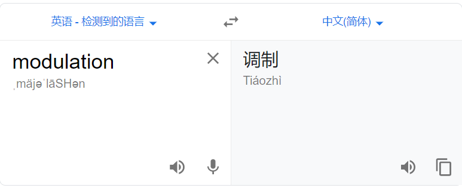

# 计算机网络（谢仁希）

## 第一章 概述

### 1.7.3 具有五层协议的体系结构

#### 1. 应用层


功能：**<font color = red>通过进程间的交互来完成特定的网络应用</font>**

应用层交互的数据单元：**<font color = red>报文</font>**


#### 2. 运输层

功能：负责向两台主机进程间的通信提供**通用**的**数据传输服务**。具有**复用**和**分用**的功能。

+ TCP协议（Transmission Control Protocol）

  数据传输单位为：**<font color = red>报文段</font>**

+ UDP协议（User Datagram Protocol）

  数据传输单位为：**<font color = red>用户数据报</font>**

#### 3. 网络层

功能：

+ **负责为分组交换网上的不同主机提供通信服务。**

  网络层负责将运输层产生的报文或者用户数据报封装成**分组（IP数据报）**或者**包**进行传送。

+ **选择合适的路由**

  使得源主机运输层所传下来的分组，能够通过网络中的路由器找到主机。

note: *互联网是由大量的**异构网络**通过路由器相互连接起来的。互联网使用的网络层协议是**无连接的网际协议IP**和许多种**路由选择协议。***

#### 4. 数据链路层

功能：将网络层下发的IP数据报**组装成帧**，每一帧包括数据和必要的控制信息。

#### 5. 物理层

功能：

+ 考虑多大的电压表示`1`或者`0`，以及接收方如何识别发送方发出的比特。
+ 确定连接电缆的插头应该有多少根引脚以及各引脚应该如何连接。

note: **传递信息所用的一些物理媒介并不属于物理层。**

### 第一章要点

+ **internet**是通用名词，泛指多个计算机网络互连而成的网络。在这些网络之间的通信协议是可以任意的
+ **Internet**是专用名词，特指当前全球最大的、开放的、由众多网络相互连接而成的特定互联网，并且采用**TCP/IP协议族**作为通信规则。

+ 互联网采用[**存储转发**](https://en.wikipedia.org/wiki/Store_and_forward)的**分组交换技术**（出现在网络层），以及三层ISP结构。

  存储转发(store and forward)：

  > **Store and forward** is a [telecommunications](https://en.wikipedia.org/wiki/Telecommunications) technique in which [information](https://en.wikipedia.org/wiki/Information) is sent to an intermediate station where it is kept and sent at a later time to the final destination or to another intermediate station. The intermediate station, or [node](https://en.wikipedia.org/wiki/Node_(networking)) in a [networking](https://en.wikipedia.org/wiki/Computer_network) context, verifies the [integrity](https://en.wikipedia.org/wiki/Data_integrity) of the message before forwarding it. In general, this technique is used in networks with intermittent connectivity, especially in the wilderness or environments requiring high mobility. It may also be preferable in situations when there are long delays in transmission and variable and high error rates, or if a direct, end-to-end connection is not available.
  >
  > 存储和转发是一种电信技术，其中信息被发送到一个中间站，在那里它被保存和发送到最终目的地或另一个中间站。 中间站或网络上下文中的节点在转发消息之前验证消息的完整性。 一般来说，这种技术用于具有间歇性连接的网络，特别是在需要高移动性的荒野或环境中。 在传输延迟时间长、错误率可变和高的情况下，或者在没有直接端到端连接的情况下，也可能更可取。
  >
  > ——维基百科
  >
  > ---
  >
  > 存储转发（Store and Forward）是计算机网络领域使用得最为广泛的技术之一，以太网交换机的控制器先将输入端口到来的数据包缓存起来，先检查数据包是否正确，并过滤掉冲突包错误。确定包正确后，取出目的地址，通过查找表找到想要发送的输出端口地址，然后将该包发送出去。正因如此，存储转发方式在数据处理时延时大，这是它的不足，但是它可以对进入交换机的数据包进行错误检测，并且能支持不同速度的输入/输出端口间的交换，可有效地改善网络性能。它的另一优点就是这种交换方式支持不同速度端口间的转换，保持高速端口和低速端口间协同工作。实现的办法是将10Mbps低速包存储起来，再通过100Mbps速率转发到端口上。
  >
  > ——百度百科


+ 互联网按照工作方式可以划分为边缘部分和核心部分。**主机**在网络的边缘部分，其作用是进行信息处理；

  **路由器**在网络的核心部分，其作用是按照**存储转发**的方式进行**分组交换**

+ 计算机通信是计算机进程（运行着的程序）间的通信，采用的通信方式是**客户—服务器方式**和**对等连接方式(p2p)**
+ 客户和服务器都是指通信中所涉及的应用进程。客户是服务请求方，服务器是服务提供方。
+ 按照范围来分，计算机网络分为广域网WAN，城域网MAN，局域网LAN，个人区域网PAN。
+ 计算机网络中最常用的性能指标是：**速率**、**带宽**、**吞吐量**、**时延**、**时延带宽积**、**往返时间**和**信道利用率**。
+ 网络协议：即协议，是为进行网络中的数据交换而建立的规则。计算机网络中**各层及其协议的集合**，称为**网络的体系结构**
+ 五层协议的体系结构中，运输层最重要的是TCP和UDP协议，网络层最重要的是IP协议。

### 第一章习题

#### 1-01 

Q：**计算机网络可以向用户提供哪些服务？**

A：（1）连通服务；（2）资源共享

#### 1-02

Q：**试简述分组交换的要点**

A：1. 报文分组，添加首部；2.经由路由器存储转发；3.在目的地合并；

分组交换采用的是**存储转发的过程工作方式**，数据以**短的分组**形式传送，如果一源点有一个长的报文要发送，该报文就会被分割成一系列的分组，每个分组包含一部分用户数据和一些控制信息。控制信息至少要包括**网络为了把分组送到目的地做路由选择所需要的信息**。在路径上的每个结点，分组被接收，短时间存储，然后传递给下一节点。

#### 1-03


Q：试从多个方面比较电路交换、报文交换和分组交换的主要优缺点。

A：

**电路交换：**计算机终端之间通信时，一方发起呼叫，独占一条物理线路。当交换机完成接续，对方收到发起端的信号，双方即可通信。在整个通信过程中双方一直占用该电路。它的特点是实时性强，时延小，交换设备成本较低。但是同时也带来线路利用率低，电路接续时间长，通信效率低，不同类型终端用户之间不能通信等缺点。电路交换比较适用于信息量大，长报文，经常使用的固定用户之间的通信。

**报文交换：**将用户的报文存储在交换机的存储器中。当所需要的输出电路空闲时，再将该报文发相接收交换机或者终端，它以存储转发的方式再网内进行传输数据。报文交换的优点是中继电路利用率高。可以多个用户同时再一条线上传送，可以实现不同速率、不同规程的终端之间的通信。但是它的缺点也是明显的，以报文为单位进行存储转发，网络传输时延大，且占用大量的交换机内存和外存，不能满足对实时性要求高的用户。报文交换适用于传输的报文较短，实时性要求较低的网络用户之间的通信，比如公网电报。

**分组交换：**实质上是存储转发基础上发展起来的，它兼有电路交换和报文交换的优点。分组交换在线路上采用**动态复用技术**传送按一定长度分割为许多小段的数据——分组。每个分组标识后，在一条物理线路上采用动态复用的技术，同时传送多个数据分组。把来自用户发端的数据暂存在交换机的存储器中，接着在网内转发。到达接收端，再去掉分组头将数据字段按顺序重新装配成完整的报文。比电路交换的利用率高，比报文交换的传输时延小，交互性好。

缺点也是存在的，它仍然存在存储转发的时延，每个分组都要加上控制信息，增加了处理时间，控制更加复杂，内存开销更大。

## 第二章 物理层

### 2.1 物理层的基本概念

物理层功能：确保原始数据可在各种物理媒介上传输，为传输数据所需要的物理链路创建、维持、拆除而提供具有机械的、电子的、功能的和规范的特性。

特性：机械特性、电气特性、功能特性、过程特性

+ 机械特性：指明接口所用的接线器的形状和尺寸、引脚数目和排列、固定和锁定等装置。
+ 电气特性：指明在接口电缆的各条线上出现的电压的范围
+ 功能特性：指明某条线上出现的某一电压的意义
+ 过程特性：指明对于不同功能的各种可能事件的出现顺序

数据在计算机内部多是**并行传输**，但在通信线路上一般是**串行传输**，因此物理层的功能还有**完成传输方式的转换**。

### 2.2 数据通信的基础知识

#### 2.2.1 数据通信系统的模型


名词解释

+ **源点**：源点设备产生的要传输的数据（比特流）
+ **发送器**：比特流要通过发送器编码后才能够在传输系统中进行传输，典型的发送器就是**调制器**。
+ **接收器**：典型的就是**解调器**
+ **终点**：不解释了

#### 2.2.2 关于信道（channel）

##### **基本的信息交互方式**

1. **单向通信**，又称为单工通信，举例：无线广播或者有线广播以及电视广播

2. **双向交替通信**，又称为半双工通信

   

3. **双向同时通信**，又称为全双工通信

##### **基带信号**：来自信源的信号。

##### **基带信号的调制**：

图片来源：[明王不动心——信道和调制](https://www.cnblogs.com/yangmingxianshen/p/7819336.html)


+ 基带调制：变换后的信号仍然是基带信号，又称为**编码**，**数字信号——>数字信号**

  常用编码方式：**不归零制、归零制、曼彻斯特编码、差分曼彻斯特编码**

+ 带通调制：利用载波进行调制，把基带信号的频率范围搬移到较高的频段 。**数字信号——>模拟信号**

  图片来源[技术牛人详解：矢量调制分析基础（经典收藏版）](https://www.sohu.com/a/151135285_472928)

  

  常用调制方式：

  **调幅（AM）**

  载波的振幅随基带数字信号而变化。例如，0或1分别对应于无载波和有载波输出。

  **调频（FM）**

  载波的频率随基带数字信号而变化。例如，0或1分别对应于频率f1或f2.

  **调相（PM）**

  载波的初始相位随基带数字信号而变化。例如，0或1分别对应相位0度或180度。

### 2.4 信道复用技术

#### 2.4.1 频分复用（Frequency Division Multiplexing）

用户在分配到一定的频带后，通信过程中始终占用这频带，**频分复用的所有用户在同样的时间占据不同的带宽。**

#### 2.4.2 时分复用（Time Division Multiplexing）

将时间划分为一段段等长的时分复用帧（TDM帧），每一个时分复用的用户在每一个TDM帧中占据一个固定序号的时隙。**时分复用的所有用户是在不同的时间占用同样的频带宽度。**


我们看到，在第一个时分复用帧，用户C和用户D占用的时隙宽度内并没有数据发出，导致这段时间被浪费掉，那么这样就引出了下面的统计时分复用技术。

#### 2.4.3 统计时分复用（Statistic TMD）

图片来源: [CSDN——【计算机网络】信道复用技术](https://blog.csdn.net/qq_28602957/article/details/53467950)


各个用户有了数据就往随时发往集中器的输入缓存，然后集中器按顺序依次扫描输入缓存，把缓存中的输入数据放入STDM帧中。STMD不是固定分配时隙，而是按需动态分配时隙，因此STDM可以提高线路的利用率。

在输出线路上，某一个用户所占用的时隙不是周期性地出现，因此STDM又被称为**异步时分复用**。

集中器能够正常工作的前提是假定**各用户都是间歇地工作。**

TDM帧和STDM帧都是在**物理层传输的比特流中所划分的帧。**

#### 2.4.4 波分复用（WDM Wavelength Division Multiplexing）

波分复用就是光的频分复用。目前使用的是密集波分复用（Dense Wavelength Division Multiplexing），一根光纤上复用几十路甚至更多路的光载波信号。

图片来源: [CSDN——【计算机网络】信道复用技术](https://blog.csdn.net/qq_28602957/article/details/53467950)


#### 2.4.5 码分复用（CDM Code Division Multiplexing）

CDM中，每一个比特时间被分为m个短的间隔，称为**码片(chip)**。通常的m的值是64或者128，

[tutorialspoint-Code Division Multiplexing](https://www.tutorialspoint.com/code-division-multiplexing)

> Code division multiplexing (CDM) is a multiplexing technique that uses spread spectrum communication. In spread spectrum communications, a narrowband signal is spread over a larger band of frequency or across multiple channels via division. It does not constrict bandwidth’s digital signals or frequencies. It is less susceptible to interference, thus providing better data communication capability and a more secure private line.

码分复用技术是一种使用扩频通信技术的的信道复用方式。在扩频通信中，窄带通过分割原信号（把原来的1bit信号分割成64或者128个比特序列）来在更大的频带上或者多信道上传。它并不会限制带宽的数字信号或者频率，抗干扰能力更强，因此可以提供更好的数据传输功能或者更安全的专用线路。

##### Code Division Multiple Access

When CDM is used to allow multiple signals from multiple users to share a common communication channel, the technology is called Code Division Multiple Access (CDMA). Each group of users is given a shared code and individual conversations are encoded in a digital sequence. Data is available on the shared channel, but only those users associated with a particular code can access the data.

当码分复用技术投入使用，允许多多用户的多信号共享公共通信信道时，这项技术被称为**码分多址**技术，每一个用户组都被提供给了一个共享码，并且所有的个人对话都被按照数字序列被编码。在共享信道中数据都是可获得的，但是只有与特定代码关联的用户才能真正得到数据。

##### Concept

Each communicating station is assigned a unique code. The codes stations have the following properties −

- If code of one station is multiplied by code of another station, it yields 0.
- If code of one station is multiplied by itself, it yields a positive number equal to the number of stations.

The communication technique can be explained by the following example −

Consider that there are four stations w, x, y and z that have been assigned the codes cw , cx, cy and cz and need to transmit data dw , dx, dy and dz respectively. Each station multiplies its code with its data and the sum of all the terms is transmitted in the communication channel.

Thus, the data in the communication channel is dw . cw+ dx . cx+ dy . cy+ dz . cz

Suppose that at the receiving end, station z wants to receive data sent by station y. In order to retrieve the data, it will multiply the received data by the code of station y which is dy.

```
data = (dw . cw+ dx . cx+ dy  . cy+ dz . cz  ) . cy
	  =	dw . cw . cy + dx . cx . cy+ dy . cy . cy+ dz . cz . cy
	  =0 + 0 + dy . 4  + 0 = 4dy
```

Thus, it can be seen that station z has received data from only station y while neglecting the other codes.

##### Orthogonal Sequences

The codes assigned to the stations are carefully generated codes called chip sequences or more popularly orthogonal sequences. The sequences are comprised of +1 or –1. They hold certain properties so as to enable communication.

The properties are −

- A sequence has *m* elements, where *m* is the number of stations.
- If a sequence is multiplied by a number, all elements are multiplied by that number.
- For multiplying two sequences, the corresponding positional elements are multiplied and summed to give the result.
- If a sequence is multiplied by itself, the result is *m*, i.e. the number of stations.
- If a sequence is multiplied by another sequence, the result is 0.
- For adding two sequences, we add the corresponding positional elements.

Let us ascertain the above properties through an example.

Consider the following chip sequences for the four stations w, x, y and z −

[+1 -1 -1 +1], [+1 +1 -1 -1], [+1 -1 +1 -1] and [+1 +1 +1 +1]

- Each sequence has four elements.
- If [+1 -1 -1 +1] is multiplied by 6, we get [+6 -6 -6 +6].
- If [+1 -1 -1 +1] is multiplied by itself, i.e. [+1 -1 -1 +1]. [+1 -1 -1 +1], we get +1+1+1+1 = 4, which is equal to the number of stations.
- If [+1 -1 -1 +1] is multiplied by [+1 +1 -1 -1], we get +1-1+1-1 = 0
- If [+1 -1 -1 +1] is added to [+1 +1 -1 -1], we get [+2 0 -2 0].

The commonly used orthogonal codes are **Walsh codes**.

### 2.6 宽带接入技术

#### 2.6.1 ADSL技术

Asymmetric Digital Subscriber Line，非对称数字用户线。

名称来源：ADSL的下行宽带大于上行宽带

ADSL不能保证固定的数据率

##### 2.6.1.1 ADSL的接入网

+ 数字用户线接入复用器（DSL Access Multiplexer）
+ 用户线
+ 用户家里的一些设施


### 第二章习题

#### 2-01 

物理层要解决哪些问题？物理层的主要特点？

解决的问题：

（1）尽可能地屏蔽掉物理设备和传输媒体、传输手段的不同，使得数据链路层感受不到这些差异

（2）给其服务用户（数据链路层）在一条物理的传输媒体上传送和接收比特流（串行按顺序传输比特流）的能力，因此物理层应该解决物理连接的建立、维持和释放问题

（3）在两个相邻系统之间唯一地标识数据电路。

主要特点：

（1）用来确定与传输媒体的接口有关的一些特性：机械特性、电气特性、功能特性、过程特性。

（2）由于物理连接的方式以及传输媒体的种类很多，因此物理协议相当复杂。


#### 2-02

规程与协议的区别

#### 2-07

> 假定某信道受奈氏准则限制的最高码元速率为20000码元/秒。如果采用振幅调制，把码元振幅划分为16个不同的等级来传送，那么可以获得多高的数据率（bit/s）？


#### 2-12

> 试计算工作在1200nm到1400nm之间以及工作在1400nm到1600nm之间的光波的频带宽度。假定光在光纤中的传播速率为2×10^8 m/s。

`频率` = `速度` ÷ `波长`

$V_{1200} = v \div (1200 \times 10^{-9}) = 2 \times 10^{8} \div (1200 \times 10^{-9})$ 


$ 1T = 10^{12}$

最后结果为$0.00166667 \times 10^{17} = 0.00166667 \times 10^{5} = 166.67Hz$

同理，1400nm为142.86Hz

1600nm为125Hz

所以1200nm到1400nm带宽为23.81Hz

1400nm到1600nm之间为17.86Hz

#### 2-13 

> 为什么要使用信道复用技术？常用的信道复用技术有哪些？

通过共享信道，最大限度地提高信道利用率；

常见的技术有：时分复用、频分复用、波分复用、码分复用

#### 2-14

FDM:Frequency Division Multiplexing  波分复用

TDM:Time Division Multiplexing 时分复用

STDM:Statistic Division Multiplexing 统计时分复用

WDM:Wave Division Multiplexing 波分复用

DWDM:Dense Wave Division Multiplexing 密集波分复用

CDMA:Code Division Multiple Access 码分多址复用

SONET: Sychronous Optical Network 同步光纤网络

SDH: Sychronous Digital Hierarcy 同步数字系列

#### 2-15 

> 码分多址CDMA为什么可以使所有的用户在同样的时间使用同样的频带进行通信而不会相互干扰？这种方式有何优缺点？

各个用户使用经过特殊挑选的相互正交的码型，不会相互干扰；

优点是具有很强的抗干扰能力，比较安全。

缺点是占用较大带宽。


#### 2-16

```
A:-1 -1 -1 +1 +1 -1 +1 +1
  -1 +1 -3 +1 -1 -3 +1 +1
  +1 -1 +3 +1 -1 +3 +1 +1 = 8
  8÷8=1

B:-1
```

#### 2-17

> 试比较ADSL、HFC以及FTTx接入技术的优缺点

链接：https://www.nowcoder.com/questionTerminal/83aed649465c4cea9e5e10fde79789dc
来源：牛客网

ADSL 技术就是用数字技术对现有的模拟电话用户线进行改造，使它能够承载宽带业务。成本低，易实现，但带宽和质量差异性大。 

 HFC网的最大的优点具有很宽的频带，并且能够利用已经有相当大的覆盖面的有线电视网。要将现有的450 MHz 单向传输的有线电视网络改造为 750 MHz 双向传输的 HFC 网需要相当的资金和时间。

FTTx（光纤到……）这里字母 x 可代表不同意思。可提供最好的带宽和质量、但现阶段线路和工程成本太大。

#### 2-18

> 为什么ADSL技术中，在不到1MHz的宽带中却可以使传送效率高达每秒几兆？

依靠先进的编码技术，使得每秒传送一个码元相当于传送多个比特


#### 2-19

**EPON**: Ethernet Passive Optical Network 以太无源光网络 p66

**GPON**: Gigabit Passive Optical Network 吉比特无源光网络 p66

## 第三章 数据链路层

本章重要的内容：

1. 数据链路层的**点对点信道**和**广播信道**的特点，以及这两种信道所使用的协议（PPP协议以及CSMA/CD）的特点
2. 数据链路层的三个基本问题：封装成帧、透明传输、差错检测
3. 以太网MAC层的硬件地址
4. 适配器、转发器、集线器、网桥、以太交换机的作用以及使用场合

### 3.1 使用点对点信道的数据链路层

#### 3.1.1 数据链路和帧

**链路：**从一个结点到相邻结点的一段物理线路

**数据链路：**链路+实现控制数据传输的协议的硬件和软件

**规程：**在数据链路层，规程和协议是同义语

**帧：**数据链路层的协议数据单元

**点对点信道的数据链路层在通信时的步骤：**

1. 结点A的数据链路层把网络层交下来的IP数据报添加首部和尾部封装成帧
2. 结点A把封装好的帧发送给结点B的数据链路层
3. 若结点B收到的帧无差错，则从收到的帧中提取IP数据报交给上面的网络层，否则丢弃这个帧

#### 3.1.2 封装、透明传输、差错检测

开头我们说过，数据链路层有三个基本问题：**封装成帧、透明传输、差错检测**

##### 3.1.2.1 封装成帧


每一种数据链路层协议都规定了所能**传送的帧的数据部分长度上限——最大传送单元（Maximum Transfer Unit）**。

帧首部和尾部的一个重要功能就是**帧定界**

当数据是由可打印的ASCII码组成的文本文件时，帧定界可以使用特殊的**帧定界符**

SOH(start of header)：01H

EOT(end of transmission)：04H


##### 3.1.2.2 透明传输

由于帧的开始和结束的标记使用专门指明的控制字符，因此，所传输的数据中的任何8比特的组合一定不允许和用作帧定界的控制字符的比特编码一样，否则就会出现帧定界的错误。

**透明传输的定义：**不管你从键盘上输入什么字符（包括01H和04H）都能放在帧中传递出去，其中对特殊字符的操作，用户是不知道的，相当于是透明的，这些操作过程都是被隐藏起来的。

.gif)

（疯狂敲打键盘，对数据怎么处理是你底层的事情，我不管，我只是一个啥都不懂的小猫咪）

那么如果我的输入中出现了SOH或者EOT，应该怎么办？数据链路层应该主动在这些特殊字符前面添加一个转义字符ESC（16进制中的1B），而接收端的数据链路层在报数据送往网络层之前删除这个插入的转义字符。

那如果我输入一个ESC呢？那就在他前面继续添加一个ESC，当接收端接受到连续的两个ESC的时候，只需要删除前面一个就行了。

以上这种做法被称为**字节填充（byte stuffing）**或者**字符填充（character stuffing）**


##### 3.1.2.3 差错检测

**误码率（Bit Error Rate）：**一段时间内传输错误的比特占所传输比特总数的比率。

数据链路层广泛使用的差错检测方式为**循环冗余检验CRC（Cyclic Redundancy Check）**

**发送端：**

1. 数据分组，每组k个比特
2. 利用CRC运算提供n位冗余码，n位冗余码又被称为**帧检测序列（Frame Check Sequence）FCS**
3. 给每组数据后添加n位冗余码，即`2^n * M  + FCS`

**接收端：**

1. 以帧为单位进行CRC检验
2. 检查余数R，如果是0，接受；如果不等于0，丢弃。

[CRC循环冗余校验---模2除法解析](https://blog.csdn.net/LKJgdut/article/details/106561266?utm_medium=distribute.pc_relevant.none-task-blog-BlogCommendFromMachineLearnPai2-3.channel_param&depth_1-utm_source=distribute.pc_relevant.none-task-blog-BlogCommendFromMachineLearnPai2-3.channel_param)


### 3.3 使用广播信道的数据链路层

#### 3.3.1 局域网的数据链路层

<u>**局域网的特点：**</u>网络为一个单位所拥有，且地理范围和站点数目均有限。

<u>**局域网优点：**</u>

1. **具有广播功能**，从一个站点可以很方便地访问全网。局域网上的主机可以共享连接在局域网上的各种硬件和软件资源。
2. 便于系统的扩展和逐渐演变，各设备的位置可灵活调整和改变。
3. 提高了可靠性、可用性和生存性。

<u>**局域网的分类（按照网络拓扑）**</u>


1. 星形图
2. 环形图
3. 总线图

<u>**局域网的工作层次**</u>

跨越了数据链路层和物理层（P83）

<u>**共享信道**</u>

共享信道的两种方式

1. 静态划分信道，频分复用、时分复用、波分复用、码分复用
2. 动态媒体接入控制，又被称为多点接入（multiple access），特点：信道并非再用户通信时固定分配给用户。
   1. 随机接入：所有的用户可以随机发送消息。但是如果恰巧有两个用户或则更多的用户在同一时间发送消息，那么在共享媒体上就要产生碰撞，必须有解决碰撞的协议。
   2. 受控接入：用户不能随机地发送消息而是要付聪一定的控制。代表：**分散控制的令牌环局域网**、**集中控制的多点线路探询（polling）**或者称为**轮询**


<u>**适配器**</u>

适配器内部装有处理器和存储器，存储器包括RAM和ROM

适配器和局域网之间的通信是通过电缆或者双绞线以**串行**传输方式进行的。

适配器和计算机之间的通信通过计算机主板上的**I/O总线**以**并行**传输方式进行。

适配器功能：

+ 进行数据串行传输和并行传输的转换
+ 数据缓存
+ 实现以太网协议

适配器在接受和发送各种帧时，不使用计算机的CPU。

计算机的硬件地址存储在适配器的ROM中，而IP地址存在计算机的存储器中。

#### 3.3.2 CSMA/CD协议

为通信的方便，以太网采用了以下两种方式：

+ **无连接**的工作方式。适配器对发送的帧**不进行编号，也不要求对方发回确认。**尽最大努力交付，即**不可靠交付**。**出错的帧是否重传由高层决定。**以太网使用的共享信道的方式是**随机接入**，使用的协议是CSMA/CD，载波监听多点接入/碰撞检测（Carrier Sense Multiple Access with Collision Detection）
+ 以太网发送的数据都使用**曼彻斯特编码**的信号。

参考课本P44

> 曼彻斯特编码：位周期中心的向上跳代表0，位周期中心向下跳代表1，但是也可以反过来


曼彻斯特编码占用的频带宽度比原始的基带信号增加了**一倍**。

<u>**CSMA/CD协议的要点**</u>

+ **多点接入**，说明这是总线型网络。
+ **载波监听**，不管是发送前还是在发送中，每个站都不停地检测信道。
+ **碰撞检测**，边发边监听。

### 第三章习题

#### 3-01

数据链路与链路有何区别？“电路接通了”与“数据链路接通了”区别何在？

#### 3-02

数据链路层中的链路控制包括哪些功能？试讨论数据链路层做成可靠的链路层有哪些优点和缺点。

功能：封装成帧、透明传输、差错检测

CRC（Cyclic Redundancy Check）实现的是无比特传输差错，..不确定

#### 3-03

网络适配器的功能是什么？网络适配器工作在哪一层？

功能：

1. 进行数据串行传输和并行传输的转换
2. 能够实现以太网协议

网络适配器工作在数据链路层和物理层。


#### 3-06

PPP协议的特点：

1. 点对点协议，支持异步链路，也支持同步链路
2. PPP是面向字节的

PP


#### 3-12

状态：链路静止、链路建立、鉴别、网络层协议、链路打开、链路终止


#### 3-20


## 第四章 网络层

### 4.2 网际协议IP

#### 4.2.1 虚拟互联网

物理层的中间设备叫做**转发器**，数据链路层的中间设备叫做**网桥**或者**桥接器**，网络层使用的中间设备叫做**路由器**，网络层以上使用的中间设备叫做**网关**。

#### 4.2.5 IP数据报的格式

**1_IP数据报的首部**


首部检验和值检验数据报的首部，但不包括数据部分。

>When a datagram is fragmented, required parts of the header must be copied by all
>fragments. The option field may or may not be copied as we will see in the next section.
>The host or router that fragments a datagram must change the values of three fields:
><font color = red>**flags, fragmentation offset, and total length.**</font> The rest of the fields must be copied. Of
>course, the value of the checksum must be recalculated regardless of fragmentation.  


在分片时，只有数据部分被分片。

### 4.5 路由选择协议

#### 4.5.2 内部网关协议 RIP

RIP Routing Information Protocol

每个RIP报文的最大长度为4+20*25 = 504字节，一个RIP报文最多包含25个路由

利用UDP发送

好消息传播得快，坏消息传输得慢

## <u>第五章 传输层</u>


### <u>5.3  关于TCP协议</u>

#### 5.3.1 特点：

+ 面向连接🔗
+ 点对点，只能有两个端点👫
+ 可靠交付，无差错、不丢失、不重复，并且按顺序到达👏🏻
+ 全双工通信📱📱
+ 面向字节流⌨️

#### 5.3.2 连接

每一条TCP连接唯一地被通信两段的两个端点（即套接字）所确定。

> TCP连接 ::={socket1, socket2} = {(IP1:port1), (IP2:port2)}

### <u>5.4 可靠传输的原理</u>

留到5.6节一起看。

### <u>5.5  TCP报文首部格式</u>


1. tcp是面向字节流的
2. 字节流中每一个字节都按照顺序编号

### 📌5.6  TCP的可靠传输


#### 5.6.1 以字节为单位的滑动窗口

#### 5.6.2 超时重传时间的选择

RTT：报文往返时间，记录报文段发出的时间，以及收到相应确认的时间。


### 📌5.7  TCP的流量控制

#### 5.7.1 通过滑动窗口实现流量控制

## 第六章 应用层

应用层协议存在的原因：

每个应用层协议都是为了解决某一类应用问题，而问题的解决又必须通过位于不同主机中的多个应用进程之间的通信和协同工作来完成。应用进程之间这种通信必须遵循严格的规则。应用层的具体内容就是精确定义这些通信规则。应用层协议应该定义：

+ 应用进程交换的报文类型
+ 各种报文类型的语法
+ 字段的语义
+ 进程何时、如何发送报文，以及对报文进行响应的规则

本章节的重点：

+ 域名系统DNS——从域名中解析出IP地址
+ 万维网和HTTP协议，以及万维网的两种不同的信息搜索引擎
+ 电子邮件的传送过程，SMTP协议和POP3协议、IMAP协议使用的场合
+ 动态主机配置DHCP的特点
+ 网络管理的三个组成部分（SNMP本身、管理信息结构SMI和管理信息库MIB）的作用
+ 系统调用和应用编程接口的基本概念
+ P2P文件系统

### 6.1 域名DNS系统

首先举个例子吧

打开随便一个浏览器，地址栏输入`192.30.255.112`

如果警报危险，你可以忽略


最后我们还是来到了github

---

#### 6.1.1 域名系统概述

DNS（Domain Nam System）：层次树状命名方法，分布式域名系统

DNS是一个联机分布式数据库系统


DNS使大部分名字都在本地解析

域名到IP地址的解析是由分布在互联网上的许多域名服务器程序共同完成的。运行域名服务器程序的机器成为域名服务器。

**域名到IP的解析过程：**

1. 应用程序要解析一个主机名，调用解析程序（resovler），成为DNS的一个客户
2. 待解析的域名放入DNS请求报文，以UDP用户数据报的方式（使用UDP是为了减少开销）发送给**本地域名服务器**
3. 本地域名服务器查找域名，将对应的IP放在 回答报文中返回。
4. 应用程序获得IP，即可进行通信
5. 若第3步中本地域名服务器不能回答，则此域名服务器暂时成为DNS中的另一个客户，并向其他域名服务器发送请求

#### 6.1.2 互联网的域名结构


#### 6.1.3 域名服务器

👉根域名服务器（root name server）

👉顶级域名服务器

👉权限域域名服务器

👉本地域名服务器（local name server）

当一台主机发送DNS查询请求的时候，这个查询请求报文首先发送给本地域名服务器。每一个ISP，或者每一个大学甚至一个系都可以拥有一个本地域名服务器。


## 第七章 网络安全

### 7.1 概述

#### 7.1.1 计算机网络面临的安全威胁

1. 被动攻击
2. 主动攻击
   1. 篡改
   2. 恶意程序
      1. 计算机病毒（computer virus）
      2. 计算机蠕虫（computer worm）
      3. 特洛伊木马（Trojan horse）
      4. 逻辑炸弹（logic bomb）
      5. 后门入侵（backdoor knocking）
      6. 流氓软件
   3. 拒绝服务DoS(Denial of Service)
3. 拒绝服务（DoS Denial of Service）

#### 7.1.2 安全的计算机网络

1. 保密性
2. 端点鉴别
3. 信息的完整性
4. 运行的安全性

access control：访问控制

multilevel security：多级安全

#### 7.1.3 数据加密模型

DES：Data Encryption Standard 数据加密标准

public key crypto-system：公钥密码体制

### 7.2 两类密码体制

#### 7.2.1 对称密钥密码体制

DES属于对称密钥密码体制

解释：即加密密钥与解密密钥是使用的相同的密码体制

#### 7.2.2 公钥密码体制

使用不同的加密密钥和解密密钥

## 附录A 分章节名词解释

### 第一章

**ISP** ：Internet Service Provider  互联网服务提供商 p6

**IXP**：Internet eXchange Point 互联网交换点 IXP p6

**ISOC**：Internet Socitety 互联网协会 p9

**IAB**：Internet Architechture Board 互联网体系结构委员会 p9

**IETF**：Internet Engineering Task Force  互联网工程部 p9

**IRTF**：Internet Research Task Force 互联网研究部 p9

**IRSG**：Internet Research Steering Group 互联网指导研究小组 p9


**RFC**：Request For Comments 请求评论 p9

**互联网草案**：Internet Draft p9

**建议标准**：Proposed Standard p9

**互联网标准**：Internet Standard p9

**分组交换**：packet switching p9

**WAN**：Wide Area Network 广域网 p20

**MAN**：Metropolitan Area Network 城域网 p20


**LAN**：Local Area Network 局域网 p20

**PAN**：Personal Area Network 个人区域网 p20

**AN**：Access Network 接入网 p20

**RTT**：Round-Trip Time 往返时间 p25

**SNA**：System Network Architecture 系统网络体系结构 p27

**OSI/RM**：Open Systems Interconnection Reference Model 开放系统互连基本参考模型，简称OSI。p27

**TCP**：Transimission Control Protocol 传输控制协议 p31

**UDP** ：User Datagram Protocol 用户数据报协议 p31

**SDU**：Service Data Unit 服务数据单元 p34

**SAP**：Service Access Point 服务访问点 p34


### 第二章

**QAM** : Quadrature Amplitude Modulation 正交振幅调制 p44




**FDM**: Frequency Division Multiplexing 频分复用 p53

**TDM**： Time Division Multiplexing 时分复用 p53

**STDM**: Statistic Time Division Multiplexing 统计时分复用 p55

**WDM**: Wave Division Multiplexing 波分复用 p56

**DWDM**: Dense Wave Division Multiplexing 密集波分复用 p56

**EDFA**: Erbium Doped Fiber Amplifier 掺铒光纤放大器 p56


**CDM**: Code Division Multiplexing 码分复用 p57

**CDMA**: Code Division Multiple Access 码分多址 p57

**DSSS**: Direct Sequence Spread Spectrum 直接序列扩频 p57

 注释：

spectrum：光谱

**SONET**: Synchronous Optical Network 同步光纤网络 p59


**SDH**: Synchronous Digital Hierarchy 同步数字系列 p59


**STS**: Synchronous Transport Signal  同步传送信号 p59

**STS-1**: 第1级同步传送信号 p59

**OC**: Optical Carrier 光载波 p59

**OC-1**: 1级光载波 p59

**ADSL**: Asymmetric Digital Subscriber Line 非对称数字用户线 p60


**DMT**: Discrete Multi-Tone 离散多音调 p61

**DSLAM**: Digital Subscriber Line Access Multiplexer 数字用户线接入复用器 p61

**ATU**: Access Termination Unit 接入单元 p61


**SRA**: Seamless Rate Adaptation 无缝速率自适应技术 p62

**SDSL**: Symmetric Digital Subscriber Line 对称数字用户线  p63

**HFC**: Hybrid Fiber Coax 光纤同轴混合网 p63

**FTTH**: Fiber To The Home 光纤到户 p65

**ODN**: Optical Distribution Network 光配网 p65

**PON**: Passive Optical Network 无源光网络 p65

**ONU**: Optical Network Unit 光网络单元 p66

**EPON**: Ethernet Passive Optical Network 以太无源光网络 p66

**GPON**: Gigabit Passive Optical Network 吉比特无源光网络 p66


### 第三章

**MTU**: Maximum Transfer Unit 最大传送单元 p72

**SOH**: Start of Header

**EOT**: End of Transmission

**BER**: Bit Error Rate 误码率 p74

**CRC**: Cyclic Redundancy Check p74

**HDLC**: High-level Data Link Control 高级数据链路控制 p76

**PPP**: Point-to-Point Protocol 点对点协议 p76

**LCP**: Link Control Protocol 链路控制协议 p78

**NCP**: Network Control Protocol 网络控制协议 p78

**NIC**: Network Interface Card 网络接口卡 p84

### 第四章

**VC**: Virtual Circuit 虚拟电路 p113

**ARP**: Address Resolution Protocol 地址解析协议 p115

**ICMP**: Internet Control Message Protocol 网际控制报文协议 p115

**IGMP**: Internet Group Management Protocol 网际组管理协议 p115